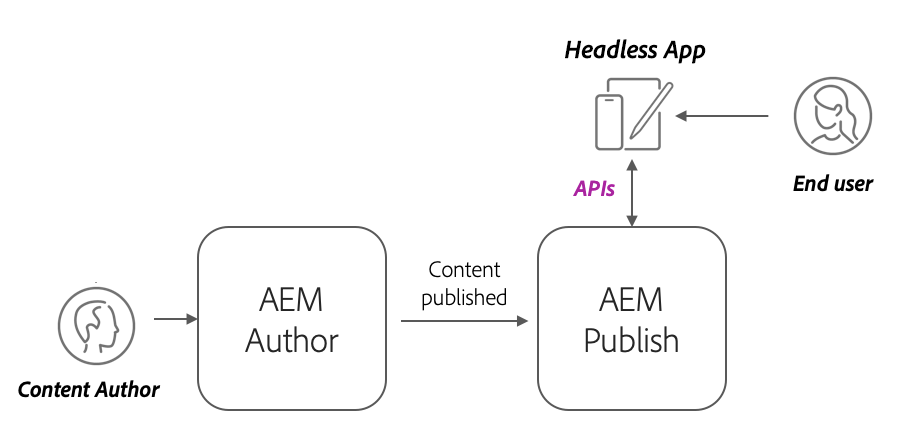

# AEM driftsättningar utan headless

AEM Headless-klientinstallationer har många olika former: AEM-SPA, externa SPA, webbplatser, mobilappar och till och med server-till-server-processer.

Beroende på klienten och hur den distribueras har AEM Headless-distributioner olika överväganden.

## AEM

Innan du utforskar olika aspekter av driftsättningen är det viktigt att du förstår AEM logiska arkitekturen och hur de olika tjänstenivåerna i AEM as a Cloud Service är uppdelade och har olika roller. AEM as a Cloud Service består av två logiska tjänster:

+ __AEM Författare__ är den tjänst där team skapar, samarbetar och publicerar innehållsfragment (och andra resurser).
+ __AEM Publish__ är den tjänst som publicerades som innehållsfragment (och andra resurser) replikeras för allmän användning.
+ __AEM Preview__ är den tjänst som påminner AEM Publish i beteendet, men har innehåll publicerat till den för förhandsgranskning eller granskning. AEM Preview är avsett för interna målgrupper och inte för allmän leverans av innehåll. Det är valfritt att använda AEM förhandsgranskning, baserat på önskat arbetsflöde.

Typiskt AEM as a Cloud Service headless-driftsättningsarkitektur_

AEM Huvudlösa kunder som arbetar i produktionskapacitet interagerar vanligtvis med AEM Publish, som innehåller det godkända publicerade innehållet. Klienter som interagerar med AEM författare måste vara särskilt försiktiga, eftersom AEM författare är säker som standard, kräver behörighet för alla förfrågningar och kan även innehålla pågående arbete eller icke godkänt innehåll.

## Huvudlösa klientdistributioner

    <!-- Single-page App (SPA) -->
    

       

           

               <figure class="image is-16by9">
                   
               </figure>
           

           

               

                   
<a href="./spa.md" title="Single-page App (SPA)">Single-page app (SPA)</a>

                   
Lär dig mer om distributionsaspekter för single-page-appar (SPA).

                   <a href="./spa.md" class="spectrum-Button spectrum-Button--outline spectrum-Button--primary spectrum-Button--sizeM">
                       Lär dig
                   </a>
               

           

       

    

<!-- Web component/JS -->

   

       

           <figure class="image is-16by9">
               
           </figure>
       

       

           

               
<a href="./web-component.md" title="Webbkomponent/JS">Webbkomponent/JS</a>

               
Läs om driftsättningsaspekter för webbkomponenter och webbläsarbaserade hemlösa JavaScript-kunder.

               <a href="./web-component.md" class="spectrum-Button spectrum-Button--outline spectrum-Button--primary spectrum-Button--sizeM">
                   Lär dig
               </a>
           

       

   

<!-- Mobile apps -->

   

       

           <figure class="image is-16by9">
               
           </figure>
       

       

           

               
<a href="./mobile.md" title="Mobilappar">Mobilapp</a>

               
Läs mer om distributionsaspekter för mobilappar.

               <a href="./mobile.md" class="spectrum-Button spectrum-Button--outline spectrum-Button--primary spectrum-Button--sizeM">
                   Lär dig
               </a>
           

       

   

<!-- Server-to-server apps -->

   

       

           <figure class="image is-16by9">
               
           </figure>
       

       

           

               
<a href="./server-to-server.md" title="Server-till-server-appar">Server-till-server-app</a>

               
Läs mer om distributionsaspekter för server-till-server-appar

               <a href="./server-to-server.md" class="spectrum-Button spectrum-Button--outline spectrum-Button--primary spectrum-Button--sizeM">
                   Lär dig
               </a>
           

       

   

