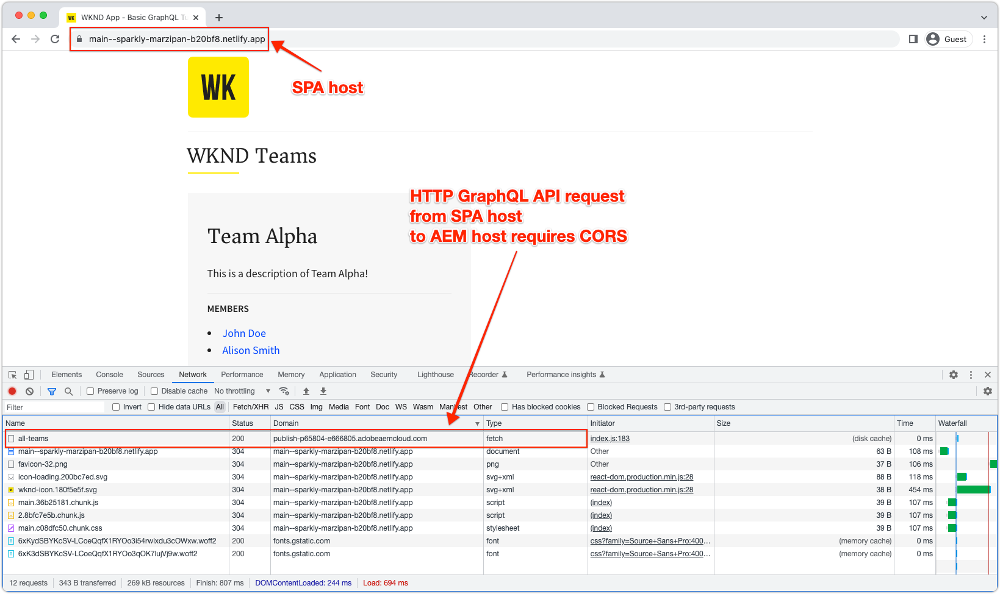

# AEM Headless SPA-driftsättningar

AEM Headless Single-page app (SPA) innehåller JavaScript-baserade applikationer som byggts med ramverk som React eller Vue och som konsumerar och interagerar med material i AEM på ett headless sätt.

Driftsättning av en SPA som interagerar med AEM utan att ha något gränssnitt innebär att man måste vara värd för SPA och göra det tillgängligt via en webbläsare.

## Värd för SPA

En SPA består av en samling med inbyggda webbresurser: **HTML, CSS och JavaScript**. De här resurserna genereras under _build_-processen (till exempel `npm run build`) och distribueras till en värd som ska användas av slutanvändare.

Det finns olika **värdalternativ** beroende på organisationens krav:

1. **Molnleverantörer**, till exempel **Azure** eller **AWS**.

2. **Lokal** som är värd i ett företags **datacenter**

3. **Värdplattformar på klientsidan** som **AWS Amplify**, **Azure App Service**, **Netlify**, **Heroku**, **Vercel** osv.

## Distributionskonfigurationer

Det viktigaste att tänka på när du är värd för ett SPA som samverkar med AEM utan huvud är om SPA nås via AEM domän (eller värd), eller på en annan domän.  Orsaken är att SPA-program är webbprogram som körs i webbläsare och därför omfattas av webbläsarens säkerhetsprofiler.

### Delad domän

En SPA och AEM delar domäner när båda är åtkomliga för slutanvändare från samma domän. Till exempel:

+ AEM nås via: `https://wknd.site/`
+ SPA nås via `https://wknd.site/spa`

Eftersom både AEM och SPA är åtkomliga från samma domän kan SPA i webbläsare göra XHR till AEM Headless-slutpunkter utan CORS och tillåta delning av HTTP-cookies (till exempel AEM `login-token`-cookies).

Hur trafik från SPA och AEM dirigeras till den delade domänen är upp till dig: CDN med flera ursprung, HTTP-server med omvänd proxy, värdtjänst för SPA direkt i AEM osv.

Nedan visas distributionskonfigurationer som krävs för SPA-produktionsdistributioner, när de finns på samma domän som AEM.

| SPA ansluter till → | AEM Author | AEM Publish | AEM Preview |
|---------------------------------------------------:|:----------:|:-----------:|:-----------:|
| [Dispatcher-filter](./configurations/dispatcher-filters.md) | ✘ | ✔ | ✔ |
| Cross-origin resource sharing (CORS) | ✘ | ✘ | ✘ |
| AEM-värdar | ✘ | ✘ | ✘ |

### Olika domäner

En SPA och AEM har olika domäner när slutanvändare från olika domäner får åtkomst till dem. Till exempel:

+ AEM nås via: `https://wknd.site/`
+ SPA nås via `https://wknd-app.site/`

Eftersom AEM och SPA används från olika domäner tillämpar webbläsare säkerhetsprofiler som [korsdomänsresursdelning (CORS)](./configurations/cors.md) och förhindrar delning av HTTP-cookies (till exempel AEM `login-token`-cookies).

Nedan visas distributionskonfigurationer som krävs för SPA-produktionsdistributioner, när dessa lagras på en annan domän än AEM.

| SPA ansluter till → | AEM Author | AEM Publish | AEM Preview |
|---------------------------------------------------:|:----------:|:-----------:|:-----------:|
| [Dispatcher-filter](./configurations/dispatcher-filters.md) | ✘ | ✔ | ✔ |
| [Resursdelning mellan ursprung (CORS)](./configurations/cors.md) | ✔ | ✔ | ✔ |
| [AEM-värdar](./configurations/aem-hosts.md) | ✔ | ✔ | ✔ |

#### Exempel på SPA-distribution på olika domäner

I det här exemplet distribueras SPA till en Netlify-domän (`https://main--sparkly-marzipan-b20bf8.netlify.app/`) och SPA använder AEM GraphQL API:er från AEM Publish-domänen (`https://publish-p65804-e666805.adobeaemcloud.com`). Skärmbilderna nedan visar CORS-kraven.

1. SPA hanteras från en Netlify-domän, men gör ett XHR-anrop till AEM GraphQL API:er på en annan domän. Den här begäran över flera platser kräver att [CORS](./configurations/cors.md) har konfigurerats på AEM för att tillåta begäran från Netlify-domänen att få åtkomst till dess innehåll.

   

2. `Access-Control-Allow-Origin` är närvarande när XHR-begäran inspekteras i AEM GraphQL API, vilket anger för webbläsaren att AEM tillåter begäran från den här Netlify-domänen att komma åt dess innehåll.

   Om AEM [CORS](./configurations/cors.md) saknades eller inte innehöll Netlify-domänen misslyckas XHR-begäran och ett CORS-fel rapporteras.

   

## Exempel på enkelsidig app

Adobe tillhandahåller ett exempel på en app för en sida som är kodad i React.

<!-- CARDS 

* ../example-apps/react-app.md

-->
<!-- START CARDS HTML - DO NOT MODIFY BY HAND -->

    

        

            

                <figure class="image x-is-16by9">
                    
                </figure>
            

            

                

                    

                        <a href="../example-apps/react-app.md" target="_blank" rel="referrer" title="Reaktionsapp - Exempel på AEM Headless">React App - AEM Headless Example</a>
                    

                    
Exempelprogram är ett bra sätt att utforska de headless-funktionerna i Adobe Experience Manager (AEM). I React-programmet visas hur du frågar efter innehåll med hjälp av AEM GraphQL API:er med hjälp av beständiga frågor.

                

                <a href="../example-apps/react-app.md" target="_blank" rel="referrer" class="spectrum-Button spectrum-Button--outline spectrum-Button--primary spectrum-Button--sizeM" style="align-self: flex-start; margin-top: 1rem;">
                    Läs mer
                </a>
            

        

    

<!-- END CARDS HTML - DO NOT MODIFY BY HAND -->

