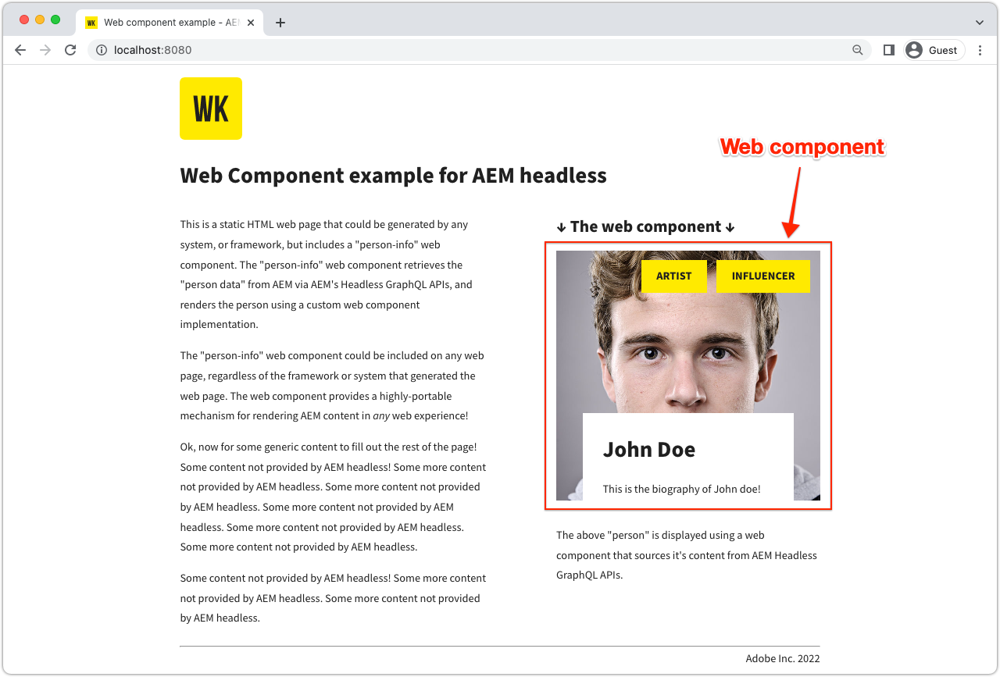

# Webbkomponent

Exempelprogram är ett bra sätt att utforska Adobe Experience Manager headless-funktioner (AEM). Detta Web Component-program visar hur du använder AEM GraphQL API:er med beständiga frågor och återger en del av användargränssnittet, vilket uppnås med ren JavaScript-kod.



Visa [källkoden på GitHub](https://github.com/adobe/aem-guides-wknd-graphql/tree/main/web-component)

## Förutsättningar {#prerequisites}

Följande verktyg bör installeras lokalt:

+ [Node.js v18](https://nodejs.org/en/)
+ [Git](https://git-scm.com/)

## AEM

Webbkomponenten fungerar med följande AEM distributionsalternativ.

+ [AEM as a Cloud Service](https://experienceleague.adobe.com/docs/experience-manager-cloud-service/content/implementing/deploying/overview.html)
+ Lokal konfiguration med [AEM Cloud Service SDK](https://experienceleague.adobe.com/docs/experience-manager-learn/cloud-service/local-development-environment-set-up/overview.html)
   + Kräver [JDK 11](https://experience.adobe.com/#/downloads/content/software-distribution/en/general.html?1_group.propertyvalues.property=.%2Fjcr%3Acontent%2Fmetadata%2FDc%3AsoftwareType&amp;1_group.propertyvalues.operation=equals&amp;1_group.propertyvalues.0_values=software-type%3Atooling&amp;fulltext=Oracle%7E+JDK%7E+11%7E&amp;orderby=%40jcr%3Acontent%2FDK jcr%3AlastModified&amp;orderby.sort=desc&amp;layout=list&amp;p.offset=0&amp;p.limit=14) (vid anslutning till lokal AEM 6.5 eller AEM SDK)

Den här exempelappen förlitar sig på [basic-tutorial-solution.content.zip](../multi-step/assets/explore-graphql-api/basic-tutorial-solution.content.zip) som ska installeras och de nödvändiga [distributionskonfigurationerna](../deployment/web-component.md) finns på plats.


>[!IMPORTANT]
>
>Webbkomponenten är utformad för att ansluta till en __AEM Publish__ -miljö, men den kan hämta innehåll från AEM författare om autentisering anges i webbkomponentens [`person.js`](https://github.com/adobe/aem-guides-wknd-graphql/blob/main/web-component/src/person.js#L11) -fil.

## Så här använder du

1. Klona `adobe/aem-guides-wknd-graphql`-databasen:

   ```shell
   $ git clone git@github.com:adobe/aem-guides-wknd-graphql.git
   ```

1. Navigera till underkatalogen `web-component`.

   ```shell
   $ cd aem-guides-wknd-graphql/web-component
   ```

1. Redigera filen `.../src/person.js` om du vill inkludera AEM anslutningsinformation:

   Uppdatera `aemHost` i objektet `aemHeadlessService` så att den pekar på din AEM Publish-tjänst.

   ```plain
   # AEM Server namespace
   aemHost=https://publish-p123-e456.adobeaemcloud.com
   
   # AEM GraphQL API and Persisted Query Details
   graphqlAPIEndpoint=graphql/execute.json
   projectName=my-project
   persistedQueryName=person-by-name
   queryParamName=name
   ```

   Om du ansluter till en AEM författartjänst anger du lokala AEM användarautentiseringsuppgifter i objektet `aemCredentials`.

   ```plain
   # For Basic auth, use AEM ['user','pass'] pair (for example, when connecting to local AEM Author instance)
   username=admin
   password=admin
   ```

1. Öppna en terminal och kör kommandona från `aem-guides-wknd-graphql/web-component`:

   ```shell
   $ npm install
   $ npm start
   ```

1. Ett nytt webbläsarfönster öppnar den statiska HTML-sidan som bäddar in webbkomponenten på [http://localhost:8080](http://localhost:8080).
1. Webbkomponenten _Personinformation_ visas på webbsidan.

## Koden

Nedan följer en sammanfattning av hur webbkomponenten är uppbyggd, hur den ansluter till AEM Headless för att hämta innehåll med GraphQL beständiga frågor och hur dessa data presenteras. Den fullständiga koden finns på [GitHub](https://github.com/adobe/aem-guides-wknd-graphql/tree/main/web-component).

### HTML-tagg för webbkomponent

En återanvändbar webbkomponent (ett anpassat element) `<person-info>` har lagts till på sidan `../src/assets/aem-headless.html` HTML. Den stöder attributen `host` och `query-param-value` för att driva komponentens beteende. `host`-attributets värde åsidosätter `aemHost`-värdet från `aemHeadlessService`-objektet i `person.js`, och `query-param-value` används för att välja den person som ska återges.

```html
    <person-info 
        host="https://publish-p123-e456.adobeaemcloud.com"
        query-param-value="John Doe">
    </person-info>
```

### Implementering av webbkomponenter

`person.js` definierar webbkomponentens funktioner och nedan är viktiga högdagrar.

#### Implementering av PersonInfo-element

Det anpassade elementets klassobjekt `<person-info>` definierar funktionaliteten med hjälp av livscykelmetoderna `connectedCallback()`, bifogar en skuggrot, hämtar GraphQL beständig fråga och DOM-manipulering för att skapa det anpassade elementets interna skugg-DOM-struktur.

```javascript
// Create a Class for our Custom Element (person-info)
class PersonInfo extends HTMLElement {

    constructor() {
        ...
        // Create a shadow root
        const shadowRoot = this.attachShadow({ mode: "open" });
        ...
    }

    ...

    // lifecycle callback :: When custom element is appended to document
    connectedCallback() {
        ...
        // Fetch GraphQL persisted query
        this.fetchPersonByNamePersistedQuery(headlessAPIURL, queryParamValue).then(
            ({ data, err }) => {
                if (err) {
                    console.log("Error while fetching data");
                } else if (data?.personList?.items.length === 1) {
                    // DOM manipulation
                    this.renderPersonInfoViaTemplate(data.personList.items[0], host);
                } else {
                    console.log(`Cannot find person with name: ${queryParamValue}`);
                }
            }
        );
    }

    ...

    //Fetch API makes HTTP GET to AEM GraphQL persisted query
    async fetchPersonByNamePersistedQuery(headlessAPIURL, queryParamValue) {
        ...
        const response = await fetch(
            `${headlessAPIURL}/${aemHeadlessService.persistedQueryName}${encodedParam}`,
            fetchOptions
        );
        ...
    }

    // DOM manipulation to create the custom element's internal shadow DOM structure
    renderPersonInfoViaTemplate(person, host){
        ...
        const personTemplateElement = document.getElementById('person-template');
        const templateContent = personTemplateElement.content;
        const personImgElement = templateContent.querySelector('.person_image');
        personImgElement.setAttribute('src',
            host + (person.profilePicture._dynamicUrl || person.profilePicture._path));
        personImgElement.setAttribute('alt', person.fullName);
        ...
        this.shadowRoot.appendChild(templateContent.cloneNode(true));
    }
}
```

#### Registrera elementet `<person-info>`

```javascript
    // Define the person-info element
    customElements.define("person-info", PersonInfo);
```

### Cross-origin resource sharing (CORS)

Den här webbkomponenten är beroende av en AEM baserad CORS-konfiguration som körs på AEM och förutsätter att värdsidan körs på `http://localhost:8080` i utvecklingsläge och nedan är ett exempel på CORS OSGi-konfiguration för den lokala AEM författartjänsten.

Granska [distributionskonfigurationerna](../deployment/web-component.md) för respektive AEM.
