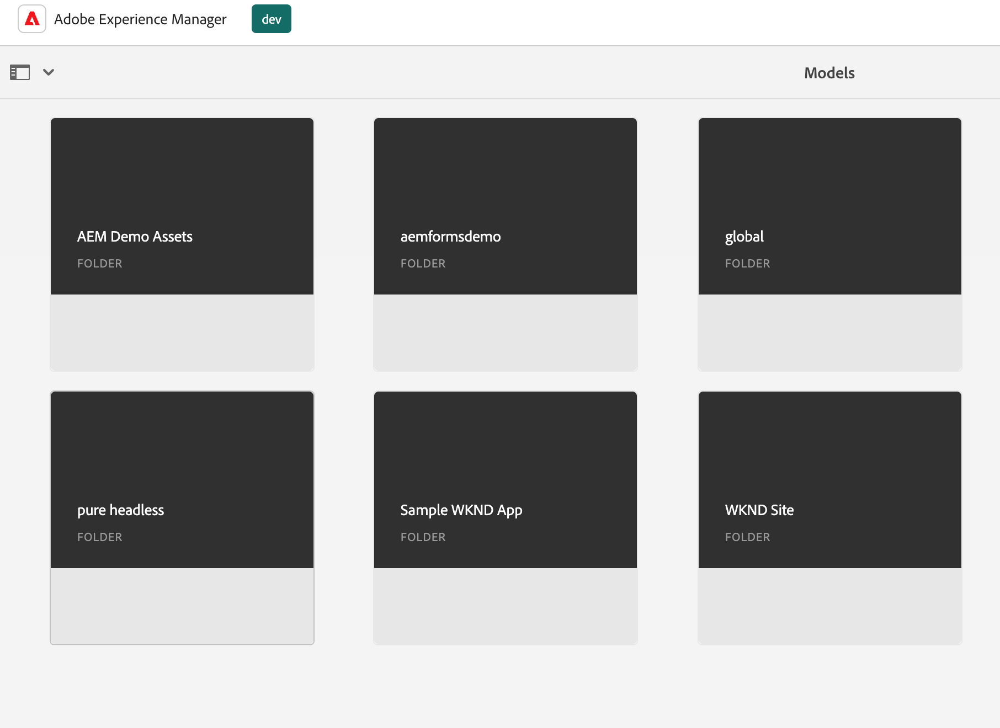

# Innehållsmodellering

Välkommen till självstudiekurskapitlet om innehållsfragment och GraphQL-slutpunkter i Adobe Experience Manager (AEM). Vi ska använda innehållsfragment, skapa fragmentmodeller och använda GraphQL-slutpunkter i AEM.

Content Fragments erbjuder ett strukturerat sätt att hantera innehåll över flera kanaler, vilket ger flexibilitet och återanvändbarhet. Genom att aktivera innehållsfragment i AEM kan du skapa modulärt innehåll, vilket ger enhetlighet och anpassningsbarhet.

För det första vägleder vi dig genom att aktivera innehållsfragment i AEM, som omfattar nödvändiga konfigurationer och inställningar för smidig integrering.

Sedan ska vi ta upp hur du skapar fragmentmodeller, som definierar struktur och attribut. Lär dig hur du utformar modeller som är anpassade efter dina innehållskrav och hanterar dem effektivt.

Sedan visar vi hur man skapar innehållsfragment från modellerna och ger stegvis vägledning om redigering och publicering.

Dessutom ska vi utforska hur vi definierar AEM GraphQL slutpunkter. GraphQL hämtar effektivt data från AEM, och vi skapar och konfigurerar slutpunkter för att exponera önskade data. Beständiga frågor optimerar prestanda och cachning.

Under hela självstudiekursen kommer vi att ge förklaringar, kodexempel och praktiska tips. Slutligen har du de kunskaper du behöver för att aktivera innehållsfragment, skapa fragmentmodeller, generera fragment och definiera AEM GraphQL slutpunkter och beständiga frågor. Kom så börjar vi!

## Kontextmedveten konfiguration

1. Navigera till __Verktyg > Konfigurationsläsaren__ för att skapa en konfiguration för den headless-upplevelsen.

   

   Ange en __title__ och __name__ och kontrollera __GraphQL Beständiga frågor__ och __Modeller för innehållsfragment__.


## Modeller för innehållsfragment

1. Navigera till __Verktyg > Content Fragment Models__ och markera mappen med namnet på konfigurationen som skapades i steg 1.

   

1. I mappen väljer du __Skapa__ och namnge modellen __Teaser__. Lägg till följande datatyper i __Teaser__ modell.

   | Datatyp | Namn | Obligatoriskt | Alternativ |
   |----------|------|----------|---------|
   | Innehållsreferens | Tillgång | ja | Lägg till en standardbild om du vill. Exempel: /content/dam/wknd-headless/assets/AdobeStock_307513975.mp4 |
   | Enkelradig text | Titel | ja |
   | Enkelradig text | Förtitel | no |
   | Flerradstext | Beskrivning | no | Kontrollera att standardtypen är RTF-text |
   | Uppräkning | Stil | ja | Rendera som listruta. Alternativen är Hero -> hero och Featured -> featured |

   

1. Skapa en andra modell i mappen __Erbjudande__. Klicka på Skapa och ge modellen namnet&quot;Erbjudande&quot; och lägg till följande datatyper:

   | Datatyp | Namn | Obligatoriskt | Alternativ |
   |----------|------|----------|---------|
   | Innehållsreferens | Tillgång | ja | Lägg till standardbild. Exempel: `/content/dam/wknd-headless/assets/AdobeStock_238607111.jpeg` |
   | Flerradstext | Beskrivning | no |  |
   | Flerradstext | Artikel | no |  |

   

1. Skapa en tredje modell med namnet i mappen __Bildlista__. Klicka på Skapa och ge modellen namnet &quot;Bildlista&quot; och lägg till följande datatyper:

   | Datatyp | Namn | Obligatoriskt | Alternativ |
   |----------|------|----------|---------|
   | Fragmentreferens | Listobjekt | ja | Återge som flera fält. Tillåten modell för innehållsfragment är Erbjudande. |

   

## Innehållsfragment

1. Navigera nu till Resurser och skapa en mapp för den nya platsen. Klicka på Skapa och ge mappen ett namn.

   

1. När mappen har skapats markerar du mappen och öppnar den __Egenskaper__.
1. I mappens __Molnkonfigurationer__ väljer du konfigurationen [skapades tidigare](#enable-content-fragments-and-graphql).

   

   Klicka i den nya mappen och skapa ett teaser. Klicka __Skapa__ och __Innehållsfragment__ och väljer __Teaser__ modell. Namnge modellen __Hero__ och klicka __Skapa__.

   | Namn | Anteckningar |
   |----------|------|
   | Tillgång | Låt vara standardvärde eller välj en annan resurs (video eller bild) |
   | Titel | `Explore. Discover. Live.` |
   | Förtitel | `Join use for your next adventure.` |
   | Beskrivning | Lämna tomt |
   | Stil | `Hero` |

   

## GraphQL slutpunkter

1. Navigera till __Verktyg > GraphQL__

   

1. Klicka __Skapa__ och ge den nya slutpunkten ett namn och välj den nya konfigurationen.

   

## GraphQL Beständiga frågor

1. Låt oss testa den nya slutpunkten. Navigera till __Verktyg > GraphQL Query Editor__ och väljer slutpunkt för listrutan i fönstrets övre högra hörn.

1. Skapa några olika frågor i frågeredigeraren.


   ```graphql
   {
       teaserList {
           items {
           title
           }
       }
   }
   ```

   Du bör hämta en lista som innehåller det skapade fragmentet [ovan](#create-content).

   För den här övningen skapar du en fullständig fråga som AEM headless-appen använder. Skapa en fråga som returnerar ett enskilt teaser per sökväg. Ange följande fråga i frågeredigeraren:

   ```graphql
   query TeaserByPath($path: String!) {
   component: teaserByPath(_path: $path) {
       item {
       __typename
       _path
       _metadata {
           stringMetadata {
           name
           value
           }
       }
       title
       preTitle
       style
       asset {
           ... on MultimediaRef {
           __typename
           _authorUrl
           _publishUrl
           format
           }
           ... on ImageRef {
           __typename
           _authorUrl
           _publishUrl
           mimeType
           width
           height
           }
       }
       description {
           html
           plaintext
       }
       }
   }
   }
   ```

   I __frågevariabler__ anger du indata längst ned:

   ```json
   {
       "path": "/content/dam/pure-headless/hero"
   }
   ```

   >[!NOTE]
   >
   > Du kan behöva justera frågevariabeln `path` baserat på mapp- och fragmentnamnen.


   Kör frågan för att ta emot resultaten från det innehållsfragment som skapades tidigare.

1. Klicka __Spara__  för att behålla (spara) frågan och namnge frågan __teaser__. Detta gör att vi kan referera till frågan efter namn i programmet.

## Nästa steg

Grattis! Du har konfigurerat AEM as a Cloud Service så att det går att skapa innehållsfragment och GraphQL slutpunkter. Du har också skapat en innehållsfragmentmodell och ett innehållsfragment, och definierat en GraphQL-slutpunkt och en beständig fråga. Du är nu redo att gå vidare till nästa självstudiekurs där du får lära dig hur du skapar ett AEM Headless React-program som använder de innehållsfragment och GraphQL-slutpunkter som du har skapat i det här kapitlet.

[Nästa kapitel: AEM Headless APIs and React](./2-aem-headless-apis-and-react.md)
