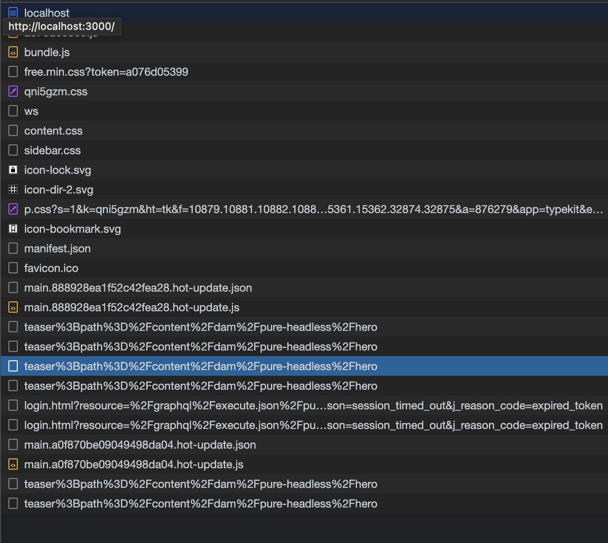

# AEM Headless APIs and React

Välkommen till den här självstudiekursen där vi ska utforska hur du konfigurerar en React-app för att ansluta till Adobe Experience Manager (AEM) Headless API:er med AEM Headless SDK. Vi ska ta upp hur du hämtar data från innehållsfragment AEM GraphQL API:er och visar dem i React-appen.

AEM Headless-API:er tillåter åtkomst AEM innehåll från alla klientprogram. Vi vägleder dig genom att konfigurera React-appen för att ansluta till AEM Headless-API:er med AEM Headless SDK. Med den här inställningen skapas en återanvändbar kommunikationskanal mellan appen React och AEM.

Därefter använder vi AEM Headless SDK för att hämta data för innehållsfragment AEM GraphQL API:er. Innehållsfragment i AEM tillhandahåller strukturerad innehållshantering. Genom att använda AEM Headless SDK kan du enkelt hämta data för innehållsfragment med GraphQL.

När vi har data från Content Fragment integrerar vi dem i React-appen. Du får lära dig att formatera och visa data på ett tilltalande sätt. Vi kommer att beskriva de bästa sätten att hantera och återge Content Fragment-data i React-komponenter, vilket säkerställer en smidig integrering med appens användargränssnitt.

Under hela självstudiekursen kommer vi att ge förklaringar, kodexempel och praktiska tips. När allt kommer omkring kan du konfigurera appen React så att du kan ansluta till AEM Headless API:er, hämta data för innehållsfragment med hjälp av AEM Headless SDK och smidigt visa den i din React-app. Kom så börjar vi!


## Klona React-appen

1. Klona appen från [Github](https://github.com/lamontacrook/headless-first/tree/main) genom att köra följande kommando på kommandoraden.

   ```
   $ git clone git@github.com:lamontacrook/headless-first.git
   ```

1. Byt till `headless-first` och installera beroendena.

   ```
   $ cd headless-first
   $ npm ci
   ```

## Konfigurera React-appen

1. Skapa en fil med namnet `.env` i projektets rot. I `.env` ange följande värden:

   ```
   REACT_APP_AEM=<URL of the AEM instance>
   REACT_APP_ENDPOINT=<the name of the endpoint>
   REACT_APP_PROJECT=<the name of the folder with Content Fragments>
   REACT_APP_TOKEN=<developer token>
   ```

1. Du kan hämta en utvecklartoken i Cloud Manager. Logga in på [Adobe Cloud Manager](https://experience.adobe.com/). Klicka __Experience Manager > Cloud Manager__. Välj lämpligt program och klicka sedan på ellipserna bredvid Miljön.

   

   1. Klicka på __Integreringar__ tab
   1. Klicka __Fliken Lokal token och få lokal utvecklingstoken__ knapp
   1. Kopiera åtkomsttoken med början efter den öppna offerten till före avslutande citattecken.
   1. Klistra in den kopierade token som värde för `REACT_APP_TOKEN` i `.env` -fil.
   1. Nu ska vi bygga appen genom att köra `npm ci` på kommandoraden.
   1. Starta nu React-appen och kör `npm run start` på kommandoraden.
   1. I [./src/utils](https://github.com/lamontacrook/headless-first/tree/main/src/utils) en fil med namnet `context.js`  innehåller koden som anger värdena i `.env` i appens sammanhang.

## Kör React-appen

1. Starta React-appen genom att köra `npm run start` på kommandoraden.

   ```
   $ npm run start
   ```

   Appen React startar och öppnar ett webbläsarfönster för att `http://localhost:3000`. Ändringar i React-appen läses automatiskt in igen i webbläsaren.

## Anslut till AEM Headless API:er

1. Om du vill ansluta React-appen till AEM as a Cloud Service lägger vi till några saker i `App.js`. I `React` importera, lägga till `useContext`.

   ```javascript
   import React, {useContext} from 'react';
   ```

   Importera `AppContext` från `context.js` -fil.

   ```javascript
   import { AppContext } from './utils/context';
   ```

   Definiera en kontextvariabel i programkoden.

   ```javascript
   const context = useContext(AppContext);
   ```

   Och slutligen radbryta returkoden i `<AppContext.Provider> ... </AppContext.Provider>`.

   ```javascript
   ...
   return(<div className='App'>
       <AppContext.Provider value={context}>
           ...
       </AppContext.Provider>
   </div>);
   ```

   Som referens `App.js` borde vara så här.

   ```javascript
   import React, {useContext} from 'react';
   import './App.css';
   import { BrowserRouter, Routes, Route } from 'react-router-dom';
   import Home from './screens/home/home';
   import { AppContext } from './utils/context';
   
   const App = () => {
   const context = useContext(AppContext);
   return (
       <div className='App'>
       <AppContext.Provider value={context}>
           <BrowserRouter>
           <Routes>
               <Route exact={true} path={'/'} element={<Home />} />
           </Routes>
           </BrowserRouter>
       </AppContext.Provider>
       </div>
   );
   };
   
   export default App;
   ```

1. Importera `AEMHeadless` SDK. Detta SDK är ett hjälpbibliotek som används av programmet för att interagera med AEM Headless API:er.

   Lägg till den här importsatsen i `home.js`.

   ```javascript
   import AEMHeadless from '@adobe/aem-headless-client-js';
   ```

   Lägg till följande `{ useContext, useEffect, useState }` till` React` import-sats.

   ```javascript
   import React, { useContext, useEffect, useState } from 'react';
   ```

   Importera `AppContext`.

   ```javascript
   import { AppContext } from '../../utils/context';
   ```

   Innanför `Home` -komponenten, hämta `context` variabel från `AppContext`.

   ```javascript
   const Home = () => {
   const context = useContext(AppContext);
   ...
   }
   ```

1. Initiera AEM Headless SDK i en  `useEffect()`, eftersom AEM Headless SDK måste ändras när  `context` variabeländringar.

   ```javascript
   useEffect(() => {
   const sdk = new AEMHeadless({
       serviceURL: context.url,
       endpoint: context.endpoint,
       auth: context.token
   });
   }, [context]);  
   ```

   >[!NOTE]
   >
   > Det finns en `context.js` fil under `/utils` som läser element från `.env` -fil. Som referens `context.url` är URL:en för den AEM as a Cloud Service miljön. The `context.endpoint` är den fullständiga sökvägen till slutpunkten som skapades i föregående lektion. Till sist `context.token` är utvecklartoken.


1. Skapa React-läge som visar innehållet som kommer från AEM Headless SDK.

   ```javascript
   const Home = () => {
   const [content, setContent] = useState({});
   ...
   }
   ```

1. Anslut appen till AEM. Använd den beständiga fråga som skapades i föregående lektion. Vi lägger till följande kod i `useEffect` efter att AEM Headless SDK har initierats. Gör `useEffect` beroende av  `context` variabel enligt nedan.


   ```javascript
   useEffect(() => {
   ...
   sdk.runPersistedQuery('<name of the endpoint>/<name of the persisted query>', { path: `/content/dam/${context.project}/<name of the teaser fragment>` })
       .then(({ data }) => {
       if (data) {
           setContent(data);
       }
       })
       .catch((error) => {
       console.log(`Error with pure-headless/teaser. ${error.message}`);
       });
   }, [context]);
   ```

1. Öppna nätverksvyn för utvecklingsverktygen för att granska GraphQL begäran.

   `<url to environment>/graphql/execute.json/pure-headless/teaser%3Bpath%3D%2Fcontent%2Fdam%2Fpure-headless%2Fhero`

   

   AEM Headless SDK kodar begäran för GraphQL och lägger till de angivna parametrarna. Du kan öppna begäran i webbläsaren.

   >[!NOTE]
   >
   > Eftersom begäran går till redigeringsmiljön måste du vara inloggad i miljön på en annan flik i samma webbläsare.


## Återge innehåll i innehållsfragment

1. Visa innehållets fragment i appen. Returnera en `<div>` med teaser titel.

   ```javascript
   return (
   <div className='main-body'>
       <div>{content.component && (content.component.item.title)}</div>
   </div>
   );
   ```

   Textfältet för teaser visas på skärmen.

1. Det sista steget är att lägga till suddgummit på sidan. En React Teaser-komponent ingår i paketet. Först tar vi med importen. Överst på `home.js` file, add the line:

   `import Teaser from '../../components/teaser/teaser';`

   Uppdatera programsatsen return:

   ```javascript
   return (
   <div className='main-body'>
       <div>{content.component && <Teaser content={content.component.item} />}</div>
   </div>
   );
   ```

   Nu bör du se suddgummit med innehållet inuti fragmentet.


## Nästa steg

Grattis! Du har uppdaterat React-appen för att integrera med AEM Headless-API:er med AEM Headless SDK!

Sedan skapar vi en mer komplex bildlistekomponent som dynamiskt återger refererade innehållsfragment från AEM.

[Nästa kapitel: Skapa en bildlistkomponent](./3-complex-components.md)
