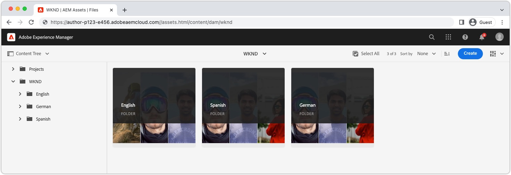

# Lokaliserat innehåll med AEM Headless

AEM tillhandahåller en [Översättningsintegreringsramverk](https://experienceleague.adobe.com/docs/experience-manager-cloud-service/content/sites/administering/reusing-content/translation/integration-framework.html) för headless-innehåll, så att innehållsfragment och tillhörande material enkelt kan översättas för användning i olika språkområden. Detta är samma ramverk som används för att översätta annat AEM innehåll, som Sidor, Upplevelsefragment, Resurser och Forms. En gång [headless content has been translated](https://experienceleague.adobe.com/docs/experience-manager-cloud-service/content/headless/journeys/translation/overview.html), och publiceras, är den klar att användas av headless-program.

## Resursmappens struktur{#assets-folder-structure}

Kontrollera att de lokaliserade innehållsfragmenten i AEM följer [rekommenderad lokaliseringsstruktur](https://experienceleague.adobe.com/docs/experience-manager-cloud-service/content/headless/journeys/translation/getting-started.html#recommended-structure).



Språkmapparna måste vara på samma nivå och mappnamnet, i stället för titeln, måste vara ett giltigt [ISO 639-1-kod](https://en.wikipedia.org/wiki/List_of_ISO_639-1_codes) som representerar språkområdet för innehållet i mappen.

Språkinställningskoden är också det värde som används för att filtrera de innehållsfragment som returneras av GraphQL-frågan.

| Språkkod | AEM | Språkinställning för innehåll |
|--------------------------------|----------|----------|
| de | /content/dam/../**de**/... | Tyskt innehåll |
| en | /content/dam/../**en**/... | Engelskt innehåll |
| es | /content/dam/../**es**/... | Spansk innehåll |

## GraphQL beständig fråga

AEM tillhandahåller en `_locale` GraphQL-filter som automatiskt filtrerar innehåll efter språkkod. Du kan till exempel ställa frågor om alla engelska äventyr i [WKND-webbplatsprojekt](https://github.com/adobe/aem-guides-wknd) kan utföras med en ny beständig fråga `wknd-shared/adventures-by-locale` definieras som:

```graphql
query($locale: String!) {
  adventureList(_locale: $locale) {
    items {      
      _path
      title
    }
  }
}
```

The `$locale` variabel som används i `_locale` filtret kräver språkkoden (till exempel `en`, `en_us`, eller `de`) enligt [AEM lokaliseringskonvention för resursmapp](#assets-folder-structure).

## Reaktionsexempel

Låt oss skapa ett enkelt React-program som styr vilket Adventure-innehåll som ska frågas från AEM baserat på en språkområdesväljare med `_locale` filter.

När __Engelska__ väljs i språkväljaren och sedan i Innehållsfragment för engelska Adventure under `/content/dam/wknd/en` returneras, när __Spanska__ är markerat och sedan spanska innehållsfragment under `/content/dam/wknd/es`och så vidare.


### Skapa en `LocaleContext`{#locale-context}

Skapa först en [Reaktionskontext](https://reactjs.org/docs/context.html) så att språkområdet kan användas i alla React-programmets komponenter.

```javascript
// src/LocaleContext.js

import React from 'react'

const DEFAULT_LOCALE = 'en';

const LocaleContext = React.createContext({
    locale: DEFAULT_LOCALE, 
    setLocale: () => {}
});

export default LocaleContext;
```

### Skapa en `LocaleSwitcher` Reaktionskomponent{#locale-switcher}

Skapa sedan en React-komponent för språkområdesväljaren som är [LocaleContext&#39;s](#locale-context) värdet efter användarens val.

Det här språkvärdet används för att köra GraphQL-frågor och säkerställa att de bara returnerar innehåll som matchar det valda språkområdet.

```javascript
// src/LocaleSwitcher.js

import { useContext } from "react";
import LocaleContext from "./LocaleContext";

export default function LocaleSwitcher() {
  const { locale, setLocale } = useContext(LocaleContext);

  return (
    <select value={locale}
            onChange={e => setLocale(e.target.value)}>
      <option value="de">Deutsch</option>
      <option value="en">English</option>
      <option value="es">Español</option>
    </select>
  );
}
```

### Fråga innehåll med `_locale` filter{#adventures}

Komponenten Adventures frågar AEM efter alla äventyr efter språkområde och visar deras titlar. Detta uppnås genom att skicka språkvärdet som lagras i Reagera-kontexten till frågan med hjälp av `_locale` filter.

Den här metoden kan utökas till andra frågor i programmet, så att alla frågor bara innehåller innehåll som anges av användarens språkområdesval.

Frågan mot AEM utförs i den anpassade React-kroken [getAdventuresByLocale, som beskrivs mer ingående i dokumentationen AEM GraphQL](./aem-headless-sdk.md).

```javascript
// src/Adventures.js

import { useContext } from "react"
import { useAdventuresByLocale } from './api/persistedQueries'
import LocaleContext from './LocaleContext'

export default function Adventures() {
    const { locale } = useContext(LocaleContext);

    // Get data from AEM using GraphQL persisted query as defined above 
    // The details of defining a React useEffect hook are explored in How to > AEM Headless SDK
    let { data, error } = useAdventuresByLocale(locale);

    return (
        <ul>
            {data?.adventureList?.items?.map((adventure, index) => { 
                return <li key={index}>{adventure.title}</li>
            })}
        </ul>
    )
}
```

### Definiera `App.js`{#app-js}

Slutligen knyter man ihop allt genom att slå ihop React-programmet med `LanguageContext.Provider` och ställa in språkvärdet. Detta gör att andra React-komponenter kan användas, [LocaleSwitcher](#locale-switcher)och [Annonser](#adventures) om du vill dela det lokala markeringstillståndet.

```javascript
// src/App.js

import { useState, useContext } from "react";
import LocaleContext from "./LocaleContext";
import LocaleSwitcher from "./LocaleSwitcher";
import Adventures from "./Adventures";

export default function App() {
  const [locale, setLocale] = useState(useContext(LocaleContext).locale);

  return (
    <LocaleContext.Provider value={{locale, setLocale}}>
      <LocaleSwitcher />
      <Adventures />
    </LocaleContext.Provider>
  );
}
```
