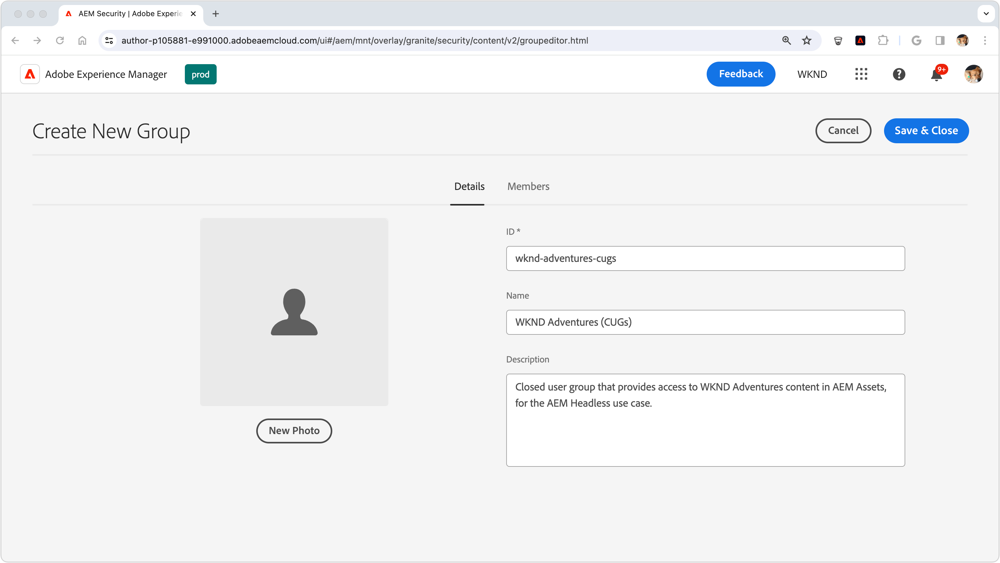

# Skydda innehåll i AEM Headless

Att säkerställa dataintegriteten och datasäkerheten när AEM används Huvudlöst innehåll från AEM Publish är avgörande för att hantera känsligt innehåll. På så sätt kan du gå igenom hur du skyddar innehåll som hanteras AEM Headless GraphQL API-slutpunkter.

Vägledningen i den här självstudiekursen där det finns strikta krav på att innehåll endast ska vara tillgängligt för specifika användare eller användargrupper. Det är av största vikt att skilja mellan personaliserat marknadsföringsinnehåll och privat innehåll, som PII-innehåll eller personuppgifter, för att undvika förvirring och oavsiktliga resultat. Den här självstudiekursen handlar om att skydda privat innehåll.

När vi diskuterar marknadsföringsinnehåll syftar vi på innehåll som är skräddarsytt för enskilda användare eller grupper och som inte är avsett för allmän konsumtion. Men det är viktigt att förstå att även om innehållet kan vara riktat till vissa användare så innebär dess exponering utanför det avsedda sammanhanget (t.ex. genom hantering av HTTP-begäranden) inte någon säkerhetsrisk, juridisk risk eller anseenderisk.

Det betonas att allt innehåll som behandlas i den här artikeln antas vara privat och endast kan ses av utsedda användare eller grupper. Marknadsföringsmaterial kräver ofta inget skydd, utan levereras till specifika användare och kan hanteras av programmet och cachas för att ge resultat.

Detta handledningar täcker inte:

- Skydda slutpunkterna direkt, men i stället fokusera på att skydda innehållet de levererar.
- Autentisering för AEM publicera eller hämta inloggningstoken. Autentiseringsmetoder och överföring av autentiseringsuppgifter beror på individuella användningsfall och implementeringar.

## Användargrupper

Först måste vi definiera en [användargrupp](https://experienceleague.adobe.com/en/docs/experience-manager-learn/cloud-service/accessing/aem-users-groups-and-permissions) som innehåller de användare som ska ha tillgång till det skyddade innehållet.

{align="center"}

Användargrupper tilldelar åtkomst till AEM Headless-innehåll, inklusive Content Fragments eller andra refererade resurser.

1. Logga in på AEM författare som **användaradministratör**.
1. Navigera till **verktyg** > **Säkerhet** > **Grupper**.
1. Välj **Skapa** längst upp till höger.
1. I **Information** -flik, ange **Grupp-ID** och **Gruppnamn**.
   - Grupp-ID och gruppnamn kan vara vad som helst, men i det här exemplet används namnet **AEM Headless API-användare**.
1. Välj **Spara och stäng**.
1. Markera den nya gruppen och välj sedan **Aktivera** i åtgärdsfältet.

Om olika åtkomstnivåer krävs skapar du flera användargrupper som kan kopplas till olika innehåll.

### Lägga till användare i användargrupper

Om du vill ge AEM Headless GraphQL API-begäranden åtkomst till skyddat innehåll kan du koppla den headless-begäran till en användare som tillhör en viss användargrupp. Här är två vanliga metoder:

1. **AEM as a Cloud Service [teknisk redovisning](https://experienceleague.adobe.com/en/docs/experience-manager-learn/getting-started-with-aem-headless/authentication/service-credentials):**
   - Skapa ett tekniskt konto på AEM as a Cloud Service Developer Console.
   - Logga in på AEM författare en gång med det tekniska kontot.
   - Lägg till det tekniska kontot i användargruppen via **Verktyg > Dokumentskydd > Grupper > AEM Headless API-användare > Medlemmar**.
   - **Aktivera** både den tekniska kontoanvändaren och användargruppen AEM publicering.
   - Den här metoden kräver att den headless-klienten inte exponerar tjänstens autentiseringsuppgifter för användaren, eftersom de är autentiseringsuppgifter för en viss användare och inte ska delas.

   {align="center"}

2. **Namngivna användare:**
   - Autentisera namngivna användare och lägg till dem direkt i användargruppen AEM Publicera.
   - Den här metoden kräver att den headless-klienten autentiserar användaruppgifter med AEM Publish, hämtar en AEM inloggnings- eller åtkomsttoken och använder denna token för efterföljande begäranden till AEM. Detaljerna för hur detta ska uppnås beskrivs inte i det här handtaget och är beroende av implementeringen.

## Skydda innehållsfragment

Skydda innehållsfragment är nödvändigt för att skydda ditt AEM Headless-innehåll och uppnås genom att innehållet kopplas till en Closed User Group (CUG). När en användare skickar en begäran till det AEM Headless-API:t för GraphQL filtreras det returnerade innehållet baserat på användarens CUG.

{align="center"}

Följ de här stegen för att uppnå detta genom att [Stängda användargrupper](https://experienceleague.adobe.com/en/docs/experience-manager-learn/assets/advanced/closed-user-groups).

1. Logga in på AEM författare som **DAM-användare**.
2. Navigera till **Assets > Files** och väljer **mapp** som innehåller de innehållsfragment som ska skyddas. CUG-filer används hierarkiskt och påverkar undermappar om de inte åsidosätts av en annan CUG-fil.
   - Se till att användare som tillhör andra kanaler som använder innehållet i mapparna inkluderas i den här användargruppen. Du kan också inkludera användargrupperna som är associerade med dessa kanaler i listan över CUG-grupper. Annars kommer innehållet inte att vara tillgängligt för dessa kanaler.
3. Markera mappen och välj **Egenskaper** i verktygsfältet.
4. Välj **Behörigheter** -fliken.
5. Skriv i **Gruppnamn** och väljer **Lägg till** för att lägga till den nya CUG-filen.
6. **Spara** för att använda CUG.
7. **Välj** resursmappen och välj **Publicera** om du vill skicka mappen med de använda användargränssnitten till AEM Publish, där den utvärderas som en behörighet.

Utför samma steg för alla mappar som innehåller innehållsfragment som behöver skyddas och använd rätt CUG för varje mapp.

När en HTTP-begäran görs till den AEM Headless GraphQL API-slutpunkten inkluderas nu endast de innehållsfragment som är tillgängliga för den begärande användarens angivna CUG i resultatet. Om användaren saknar åtkomst till något innehållsfragment kommer resultatet att vara tomt, men ändå returnera en 200 HTTP-statuskod.

### Skydda refererat innehåll

Innehållsfragment refererar ofta till annat AEM, t.ex. bilder. Om du vill skydda det refererade innehållet använder du CUG:er på resursmapparna där de refererade resurserna lagras. Observera att refererade resurser vanligtvis efterfrågas med andra metoder än de i GraphQL API:er AEM Headless. Följaktligen kan sättet som åtkomsttoken skickas på på för begäranden till dessa refererade resurser variera.

Beroende på innehållsarkitekturen kan det vara nödvändigt att använda användargränssnitten på flera mappar för att säkerställa att allt innehåll som refereras är skyddat.

## Förhindra cachelagring av skyddat innehåll

AEM as a Cloud Service [cachelagrar HTTP-svar som standard](https://experienceleague.adobe.com/en/docs/experience-manager-learn/cloud-service/caching/publish) för prestandaförbättring. Detta kan dock orsaka problem med att skicka skyddat innehåll. För att förhindra att sådant innehåll cachelagras [ta bort cacherubriker för specifika slutpunkter](https://experienceleague.adobe.com/en/docs/experience-manager-learn/cloud-service/caching/publish#how-to-customize-cache-rules-1) i Apache-konfigurationen för AEM Publish-instansen.

Lägg till följande regel i ditt Dispatcher-projekts Apache-konfigurationsfil för att ta bort cacherubriker för specifika slutpunkter:

```xml
# dispatcher/src/conf.d/available_vhosts/example.vhost

<VirtualHost *:80>
    ...
    # Replace `example` with the name of your GraphQL endpoint's configuration name.
    <LocationMatch "^/graphql/execute.json/example/.*$">
        # Remove cache headers for protected endpoints so they are not cached
        Header unset Cache-Control
        Header unset Surrogate-Control
        Header set Age 0
    </LocationMatch>
    ...
</VirtualHost>
```

Observera att detta medför en prestandaförsämring eftersom innehållet inte cachas av avsändaren eller CDN. Detta är en kompromiss mellan prestanda och säkerhet.

## Skydda AEM Headless GraphQL API-slutpunkter

Den här guiden skyddar inte [AEM Headless GraphQL API-slutpunkter](https://experienceleague.adobe.com/en/docs/experience-manager-cloud-service/content/headless/graphql-api/graphql-endpoint) själva, men fokuserar istället på att skydda det innehåll som de levererar. Alla användare, även anonyma användare, har åtkomst till slutpunkterna som innehåller skyddat innehåll. Endast det innehåll som är tillgängligt för användarens stängda användargrupper returneras. Om inget innehåll är tillgängligt kommer det AEM Headless API-svaret fortfarande att ha en 200 HTTP-svarskod, men resultatet kommer att vara tomt. Normalt räcker det att skydda innehållet eftersom själva slutpunkterna inte exponerar känsliga data. Om du behöver skydda slutpunkterna lägger du till åtkomstkontrollistor i dem AEM Publicera via [Repoinit-skript (Sling Repository Initialization)](https://sling.apache.org/documentation/bundles/repository-initialization.html#repoinit-parser-test-scenarios).
