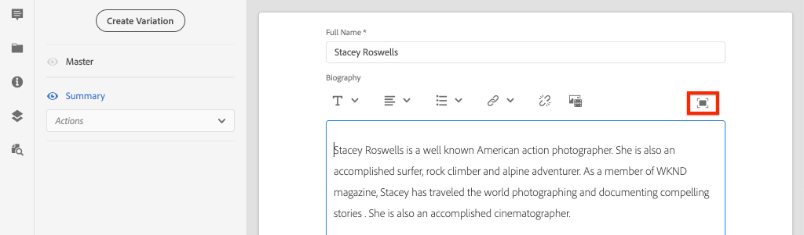
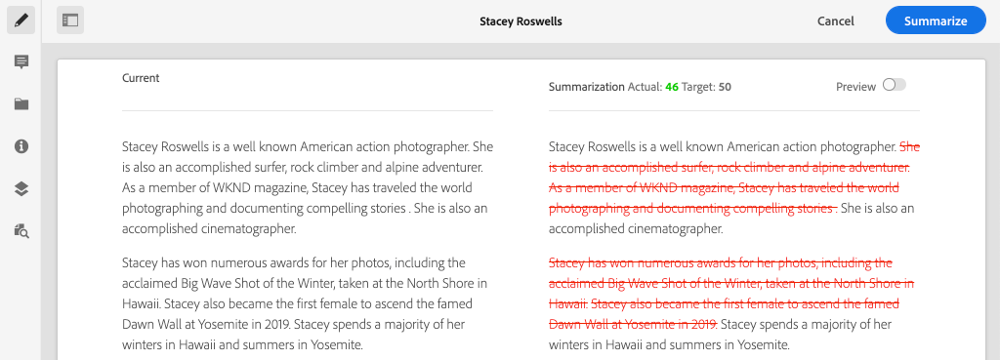

# Skapa innehållsfragment {#authoring-content-fragments}

I det här kapitlet skapar och redigerar du ett nytt innehållsfragment baserat på [den nydefinierade modellen för Contributor-innehållsfragment](./content-fragment-models.md). Du får också lära dig hur du skapar varianter av innehållsfragment.

## Förutsättningar {#prerequisites}

Det här är en självstudiekurs i flera delar och det antas att stegen som beskrivs i [Definiera modeller för innehållsfragment](./content-fragment-models.md) har slutförts.

## Mål {#objectives}

* Skapa ett innehållsfragment baserat på en innehållsfragmentmodell
* Skapa en variant av innehållsfragment

## Redigeringsöversikt för innehållsfragment {#overview}

>[!VIDEO](https://video.tv.adobe.com/v/22451/?quality=12&learn=on)

I videon ovan visas en översikt på hög nivå över hur du skapar innehållsfragment.

## Skapa ett innehållsfragment {#create-content-fragment}

I föregående kapitel, [Defining Content Fragment Models](./content-fragment-models.md), skapades en **Contributor**-modell. Skapa ett nytt innehållsfragment med den här modellen.

1. På **AEM Start**-menyn navigerar du till **Resurser** > **Filer**.
1. Klicka igenom mapparna för att navigera till **WKND-plats** > **Engelska** > **Deltagare**. Den här mappen innehåller en lista med huvudbilder för medverkande av WKND-varumärket.

1. Klicka på **Skapa** i det övre högra hörnet och välj **Innehållsfragment**:

   

1. Markera **Contributor**-modellen och klicka på **Nästa**.

   

   Detta är samma **Contributor**-modell som skapades i föregående kapitel.

1. Ange **Stacey Roswells** som titel och klicka på **Create**.
1. Klicka på **Öppna** i dialogrutan **Klart** för att öppna det nyligen skapade fragmentet.

   

   Observera att fälten som definieras av modellen nu är tillgängliga för att skapa den här instansen av innehållsfragmentet.

1. För **Fullständigt namn** anger du: **Stacey Roswells**.
1. För **Biografi** anger du en kort biografi. Behöver du inspiration? Du kan återanvända den här [textfilen](assets/author-content-fragments/stacey-roswells-bio.txt).
1. För **Bildreferens** klickar du på **mappikonen** och bläddrar till **WKND-plats** > **Engelska** > **Deltagare** > **stacey-roswells.jpg** . Detta utvärderas till sökvägen: `/content/dam/wknd/en/contributors/stacey-roswells.jpg`.
1. För **Yrke** väljer du **Fotograf**.

   

1. Klicka på **Spara** för att spara ändringarna.

## Skapa en variant för innehållsfragment

Alla innehållsfragment börjar med en **Överordnad**-variant. Variationen **Överordnad** kan anses vara *fragmentets*-standardinnehåll och används automatiskt när innehållet visas via GraphQL-API:erna. Du kan också skapa varianter av ett innehållsfragment. Den här funktionen ger ytterligare flexibilitet vid utformningen av en implementering.

Variationer kan användas för att rikta in sig på specifika kanaler. Till exempel kan en **mobil**-variant skapas som innehåller en mindre mängd text eller refererar till en kanalspecifik bild. Hur variationer används beror på implementeringen. Precis som med andra funktioner bör du planera noggrant innan du använder.

Skapa sedan en ny variant för att få en uppfattning om vilka funktioner som är tillgängliga.

1. Öppna **Stacey Roswells** Content Fragment igen.
1. Klicka på **Skapa variation** i den vänstra sidlisten.
1. Ange en titel på **Sammanfattning** i den nya variationen **.**

   

1. Klicka på **Biografi** flerradsfält och klicka på knappen **Expandera** för att ange helskärmsläge för flerradsfältet.

   

1. Klicka på **Sammanfatta text** i den övre högra menyn.

1. Ange ett **mål** på **50** ord och klicka på **Start**.

   

   Då öppnas en förhandsgranskning av en sammanfattning. AEM datorspråkprocessor försöker sammanfatta texten baserat på målordsantalet. Du kan också välja olika meningar att ta bort.

1. Klicka på **Sammanfatta** när du är nöjd med sammanfattningen. Klicka i det flerradiga textfältet och växla **Utöka**-knappen för att återgå till huvudvyn.

1. Klicka på **Spara** för att spara ändringarna.

## Skapa ytterligare ett innehållsfragment

Upprepa stegen som beskrivs i [Skapa ett innehållsfragment](#create-content-fragment) om du vill skapa ytterligare en **Contributor**. Detta används i nästa kapitel som exempel på hur du kan fråga flera fragment.

1. I mappen **Deltagare** klickar du på **Skapa** i det övre högra hörnet och väljer **Innehållsfragment**:
1. Markera **Contributor**-modellen och klicka på **Nästa**.
1. Ange **Jacob Wester** som titel och klicka på **Skapa**.
1. Klicka på **Öppna** i dialogrutan **Klart** för att öppna det nyligen skapade fragmentet.
1. För **Fullständigt namn** anger du: **Jacob Wester**.
1. För **Biografi** anger du en kort biografi. Behöver du inspiration? Du kan återanvända den här [textfilen](assets/author-content-fragments/jacob-wester.txt).
1. För **Bildreferens** klickar du på **mappikonen** och bläddrar till **WKND-plats** > **Engelska** > **Deltagare** > **jacob_wester.jpg**. Detta utvärderas till sökvägen: `/content/dam/wknd/en/contributors/jacob_wester.jpg`.
1. För **Yrke** väljer du **Skrivare**.
1. Klicka på **Spara** för att spara ändringarna. Du behöver inte skapa en variant, såvida du inte vill!

   

   Du bör nu ha två **Contributor**-fragment.

## Grattis! {#congratulations}

Grattis, du har just skapat flera innehållsfragment och skapat en variant.

## Nästa steg {#next-steps}

I nästa kapitel, [Utforska GraphQL API:er](explore-graphql-api.md), kommer du att utforska GraphQL API:er AEM det inbyggda GraphQL-verktyget. Lär dig hur AEM automatiskt genererar ett GraphQL-schema baserat på en Content Fragment-modell. Du kommer att experimentera med att skapa grundläggande frågor med GraphQL-syntaxen.