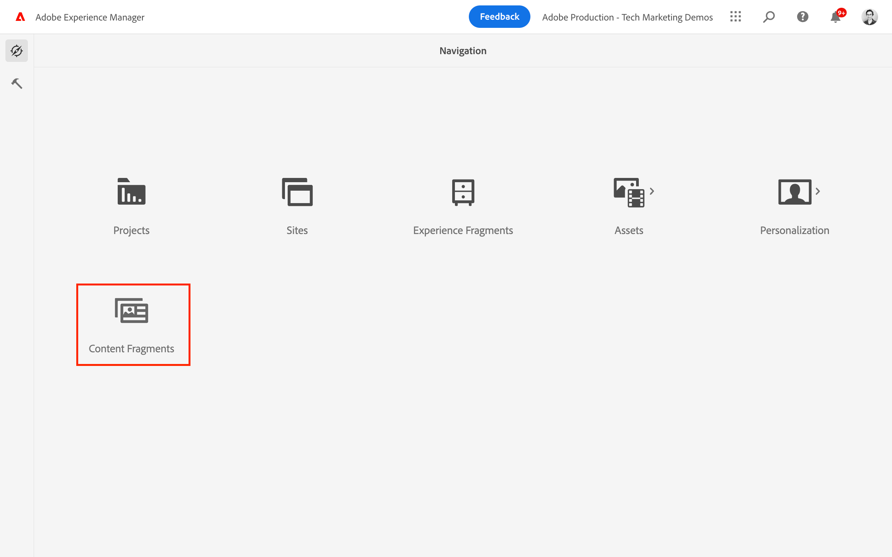

# Skapa innehållsfragment {#authoring-content-fragments}

I det här kapitlet skapar och redigerar du ett nytt innehållsfragment baserat på [nydefinierad modell för innehållsfragment](./content-fragment-models.md). Du får även lära dig hur du skapar varianter av innehållsfragment.

## Förutsättningar {#prerequisites}

Det här är en självstudiekurs i flera delar och det antas att stegen som beskrivs i [Definiera modeller för innehållsfragment](./content-fragment-models.md) har slutförts.

## Mål {#objectives}

* Skapa ett innehållsfragment baserat på en modell för innehållsfragment
* Skapa en variant av innehållsfragment

## Skapa en resursmapp

Innehållsfragment lagras i mappar i AEM Assets. Om du vill skapa innehållsfragment från modeller som skapats i det föregående kapitlet måste du skapa en mapp där de lagras. Mappen måste konfigureras för att du ska kunna skapa fragment från specifika modeller.

1. Navigera AEM startskärmen till **Resurser** > **Filer**.

   

1. Tryck **Skapa** i det övre högra hörnet och tryck på **Mapp**. I dialogrutan som visas anger du:

   * Titel*: **Mitt projekt**
   * Namn: **mitt projekt**

   

1. Välj **Min mapp** mapp och tryck **Egenskaper**.

   

1. Tryck på **Cloud Service** -fliken. Använd sökvägssökaren på fliken Konfiguration i molnet för att välja **Mitt projekt** konfiguration. Värdet ska vara `/conf/my-project`.

   

   Om du anger den här egenskapen kan innehållsfragment skapas med hjälp av de modeller som skapades i föregående kapitel.

1. Tryck på **Profiler** -fliken, under **Tillåtna modeller för innehållsfragment** fältet använder sökaren för att markera **Person** och **Team** modell skapades tidigare.

   

   Dessa profiler ärvs automatiskt av alla undermappar och kan åsidosättas. Du kan också tillåta modeller efter taggar eller aktivera modeller från andra projektkonfigurationer. Den här mekanismen är ett kraftfullt sätt att hantera innehållshierarkin.

1. Tryck **Spara och stäng** om du vill spara ändringarna i mappegenskaperna.

1. Navigera inuti **Mitt projekt** mapp.

1. Skapa en ny mapp med följande värden:

   * Titel*: **Engelska**
   * Namn: **en**

   Ett tips är att skapa projekt för flerspråkigt stöd. Se [följande dokumentsida för mer information](https://experienceleague.adobe.com/docs/experience-manager-cloud-service/content/assets/admin/translate-assets.html).

## Skapa ett innehållsfragment {#create-content-fragment}

>[!TIP]
>
>För lokala AEM SDK-användare: Använd AEM Assets-gränssnittet för att skapa och redigera innehållsfragment i stället för det innehållsfragment-gränssnitt som beskrivs nedan. Detaljerade instruktioner finns i [AEM](https://experienceleague.adobe.com/docs/experience-manager-cloud-service/content/assets/content-fragments/content-fragments-managing.html).

Därefter skapas flera innehållsfragment baserat på **Team** och **Person** modeller.

1. Tryck på AEM startskärmen **Innehållsfragment** för att öppna gränssnittet för innehållsfragment.

   

1. Expandera i den vänstra listen **Mitt projekt** och knacka **Engelska**.
1. Tryck **Skapa** för att ta fram **Nytt innehållsfragment** och ange följande värden:

   * Plats: `/content/dam/my-project/en`
   * Modell för innehållsfragment: **Person**
   * Titel: **John Doe**
   * Namn: `john-doe`

   
1. Tryck **Skapa**.
1. Upprepa stegen ovan för att skapa ett fragment som representerar **Alison Smith**:

   * Plats: `/content/dam/my-project/en`
   * Modell för innehållsfragment: **Person**
   * Titel: **Alison Smith**
   * Namn: `alison-smith`

   Tryck **Skapa** för att skapa personfragmentet.

1. Upprepa sedan stegen för att skapa en **Team** fragment som representerar **Team Alpha**:

   * Plats: `/content/dam/my-project/en`
   * Modell för innehållsfragment: **Team**
   * Titel: **Team Alpha**
   * Namn: `team-alpha`

   Tryck **Skapa** för att skapa teamfragmentet.

1. Det ska finnas tre innehållsfragment under **Mitt projekt** > **Engelska**:

   

## Redigera personinnehållsfragment {#edit-person-content-fragments}

Fyll sedan i de nyligen skapade fragmenten med data.

1. Tryck på kryssrutan bredvid **John Doe** och knacka **Öppna**.

   

1. Innehållsfragmentsredigeraren innehåller ett formulär baserat på modellen för innehållsfragment. Fyll i de olika fälten för att lägga till innehåll i **John Doe** fragment. Ladda upp din egen bild till AEM Assets som profilbild.

   

1. Tryck **Spara och stäng** för att spara ändringarna i John Doe-fragmentet.
1. Återgå till gränssnittet för innehållsfragment och öppna **Alison Smith** fil för redigering.
1. Upprepa stegen ovan för att fylla i **Alison Smith** fragmentera med innehåll.

## Redigera teaminnehållsfragment {#edit-team-content-fragment}

1. Öppna **Team Alpha** Innehållsfragment med hjälp av gränssnittet för innehållsfragment.
1. Fyll i fälten för **Titel**, **Kortnamn** och **Beskrivning**.
1. Välj **John Doe** och **Alison Smith** Innehållsfragment för att fylla i **Teammedlemmar** fält:

   

   >[!NOTE]
   >
   >Du kan också skapa innehållsfragment online med **Nytt innehållsfragment** -knappen.

1. Tryck **Spara och stäng** om du vill spara ändringarna i fragmentet Team Alpha.

## Publicera innehållsfragment

>[!TIP]
>
>För lokala AEM SDK-användare: Använd AEM Assets-gränssnittet för att publicera innehållsfragment i stället för det användargränssnitt för innehållsfragment som beskrivs nedan. Detaljerade instruktioner finns i [AEM](https://experienceleague.adobe.com/docs/experience-manager-cloud-service/content/assets/content-fragments/content-fragments-managing.html#publishing-and-referencing-a-fragment).

Publicera den skapade `Content Fragments`

1. Tryck på AEM startskärmen **Innehållsfragment** för att öppna gränssnittet för innehållsfragment.

1. Expandera i den vänstra listen **Mitt projekt** och knacka **Engelska**.

1. Tryck på kryssrutan bredvid innehållsfragmenten och tryck på **Publicera**.
   

## Grattis! {#congratulations}

Grattis! Du har skapat flera innehållsfragment och skapat en variant.

## Nästa steg {#next-steps}

I nästa kapitel [Utforska GraphQL API:er](explore-graphql-api.md)kommer du att utforska AEM GraphQL API:er med det inbyggda GrapiQL-verktyget. Lär dig hur AEM automatiskt genererar ett GraphQL-schema baserat på en Content Fragment-modell. Du kommer att experimentera med att skapa grundläggande frågor med GraphQL-syntax.

## Relaterad dokumentation

* [Hantera innehållsfragment](https://experienceleague.adobe.com/docs/experience-manager-cloud-service/content/assets/content-fragments/content-fragments-managing.html)
* [Variationer – redigera innehållsfragment](https://experienceleague.adobe.com/docs/experience-manager-cloud-service/content/assets/content-fragments/content-fragments-variations.html)
