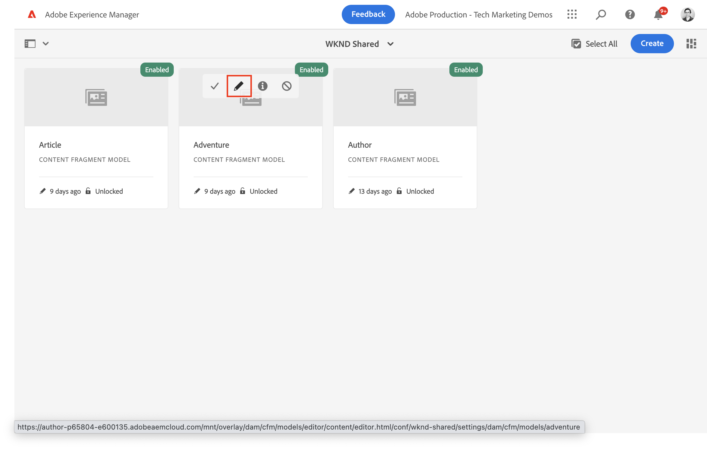

# Definiera modeller för innehållsfragment {#content-fragment-models}

I det här kapitlet får du lära dig att modellera innehåll och skapa ett schema med **Modeller för innehållsfragment**. Du får lära dig mer om de olika datatyper som kan användas för att definiera ett schema som en del av modellen.

I det här kapitlet kommer två enkla modeller att skapas: **Team** och **Person**. The **Team** datamodellen har namn, kort namn och beskrivning och refererar till **Person** datamodell med fullständigt namn, bioinformation, profilbild och yrkeslista.

Du kan också skapa en egen modell som följer de grundläggande stegen och justera respektive steg som GraphQL-frågor och React App-kod eller helt enkelt följa stegen som beskrivs i dessa kapitel.

## Förutsättningar {#prerequisites}

Det här är en självstudiekurs i flera delar och det antas att en [AEM är tillgänglig](./overview.md#prerequisites) och [WKND Delat exempelinnehåll har installerats](./overview.md#install-sample-content).

## Mål {#objectives}

* Skapa en ny modell för innehållsfragment.
* Identifiera tillgängliga datatyper och valideringsalternativ för att bygga modeller.
* Förstå hur Content Fragment Model definierar **båda** dataschemat och redigeringsmallen för ett innehållsfragment.

## Skapa en ny projektkonfiguration

En projektkonfiguration innehåller alla innehållsfragmentsmodeller som är kopplade till ett visst projekt och erbjuder ett sätt att ordna modeller. Minst ett projekt måste skapas **före** skapar ny modell för innehållsfragment.

1. Logga in på AEM **Upphovsman** miljö.
1. Navigera AEM startskärmen till **verktyg** > **Allmänt** > **Konfigurationsläsaren**.

   
1. Klicka **Skapa**.
1. I dialogrutan som visas skriver du:

   * Titel*: **Mitt projekt**
   * Namn*: **mitt projekt** (I stället för att använda enbart små bokstäver används bindestreck för att avgränsa ord. Strängen påverkar den unika GraphQL-slutpunkt som klientprogram ska utföra begäranden mot.)
   * Kontrollera **Modeller för innehållsfragment**
   * Kontrollera **Beständiga GraphQL-frågor**

   

## Skapa modeller för innehållsfragment

Skapa sedan två modeller för en **Team** och **Person**.

### Skapa personmodellen

Skapa en ny modell för en **Person**, som är datamodellen som representerar en person som ingår i ett team.

1. Navigera AEM startskärmen till **verktyg** > **Allmänt** > **Modeller för innehållsfragment**.

   

   Om du har installerat [exempelinnehåll](overview.md#install-sample-content) visas två mappar: **Mitt projekt** och **WKND delad**.
1. Navigera till **Mitt projekt** mapp.
1. Tryck **Skapa** i det övre högra hörnet för att visa **Skapa modell** guide.
1. För **Modelltitel** ange: **Person** och trycka **Skapa**.

   Tryck **Öppna** i den dialogruta som visas när du vill öppna den nya modellen.

1. Dra och släpp en **Enkelradig text** till huvudpanelen. Ange följande egenskaper på **Egenskaper** tab:

   * **Fältetikett**: **Fullständigt namn**
   * **Egenskapsnamn**: `fullName`
   * Kontrollera **Obligatoriskt**

   

   The **Egenskapsnamn** definierar namnet på den egenskap som är beständig för AEM. The **Egenskapsnamn** definierar även **key** den här egenskapens namn som en del av dataschemat. Detta **key** används när Content Fragment-data visas via GraphQL-API:er.

1. Tryck på **Datatyper** och dra och släppa **Flerradstext** fält under **Fullständigt namn** fält. Ange följande egenskaper:

   * **Fältetikett**: **Biografi**
   * **Egenskapsnamn**: `biographyText`
   * **Standardtyp**: **RTF**

1. Klicka på **Datatyper** och dra och släppa **Innehållsreferens** fält. Ange följande egenskaper:

   * **Fältetikett**: **Profilbild**
   * **Egenskapsnamn**: `profilePicture`
   * **Rotsökväg**: `/content/dam`

   När du konfigurerar **Rotsökväg** du kan klicka på **mapp** om du vill visa en modal för att markera banan. Detta begränsar vilka mappar författare kan använda för att fylla i sökvägen. `/content/dam` är roten där alla AEM resurser (bilder, videoklipp, andra innehållsfragment) lagras.

1. Lägg till en validering i **Bildreferens** så att bara innehållstyper i **Bilder** kan användas för att fylla i fältet.

   

1. Klicka på **Datatyper** och dra och släppa **Uppräkning**  datatypen under **Bildreferens** fält. Ange följande egenskaper:

   * **Återge som**: **Kryssrutor**
   * **Fältetikett**: **Yrke**
   * **Egenskapsnamn**: `occupation`

1. Lägg till flera **Alternativ** med **Lägg till ett alternativ** -knappen. Använd samma värde för **Alternativetikett** och **Alternativvärde**:

   **Konstnär**, **Påverkande**, **Fotograf**, **Resa**, **Författare**, **YouTuber**

1. Den slutliga **Person** modellen ska se ut så här:

   

1. Klicka **Spara** för att spara ändringarna.

### Skapa teammodellen

Skapa en ny modell för en **Team**, som är datamodellen för ett team med människor. Teammodellen kommer att hänvisa till personmodellen för att representera teamets medlemmar.

1. I **Mitt projekt** mapp, tryck **Skapa** i det övre högra hörnet för att visa **Skapa modell** guide.
1. För **Modelltitel** ange: **Team** och trycka **Skapa**.

   Tryck **Öppna** i den dialogruta som visas när du vill öppna den nya modellen.

1. Dra och släpp en **Enkelradig text** till huvudpanelen. Ange följande egenskaper på **Egenskaper** tab:

   * **Fältetikett**: **Titel**
   * **Egenskapsnamn**: `title`
   * Kontrollera **Obligatoriskt**

1. Tryck på **Datatyper** och dra och släppa **Enkelradig text** till huvudpanelen. Ange följande egenskaper på **Egenskaper** tab:

   * **Fältetikett**: **Kortnamn**
   * **Egenskapsnamn**: `shortName`
   * Kontrollera **Obligatoriskt**
   * Kontrollera **Unik**
   * Under **Valideringstyp** > välja **Egen**
   * Under **Anpassad valideringsregion** > ange `^[a-z0-9\-_]{5,40}$` - detta säkerställer att endast alfanumeriska gemener och bindestreck mellan 5 och 40 tecken kan anges.

   The `shortName` -egenskapen ger oss ett sätt att fråga ett enskilt team baserat på en kortare sökväg. The **Unik** inställningen ser till att värdet alltid är unikt per innehållsfragment för den här modellen.

1. Tryck på **Datatyper** och dra och släppa **Flerradstext** fält under **Kortnamn** fält. Ange följande egenskaper:

   * **Fältetikett**: **Beskrivning**
   * **Egenskapsnamn**: `description`
   * **Standardtyp**: **RTF**

1. Klicka på **Datatyper** och dra och släppa **Fragmentreferens** fält. Ange följande egenskaper:

   * **Återge som**: **Flera fält**
   * **Fältetikett**: **Teammedlemmar**
   * **Egenskapsnamn**: `teamMembers`
   * **Tillåtna modeller för innehållsfragment**: Använd mappikonen för att välja **Person** modell.

1. Den slutliga **Team** modellen ska se ut så här:

   

1. Klicka **Spara** för att spara ändringarna.

1. Nu bör du ha två modeller att arbeta från:

   

## Inspect WKND Content Fragment Models (tillval)

Om du [installerade WKND Shared-exempelinnehåll](./overview.md#install-sample-content) kan ni inspektera Adventure-, Article- och Author-modellerna för att få fler idéer om datamodelleringstekniker.

1. Från **AEM** gå till **verktyg** > **Allmänt** > **Modeller för innehållsfragment**.

1. Navigera till **WKND delad** och du bör se tre modeller: Article, Adventure, and Author.

1. Inspect modellerna genom att hålla pekaren över kortet och trycka på redigeringsikonen (pennan)

   

1. Då öppnas **Modellredigerare för innehållsfragment** för modellen och du kan kontrollera de olika datatyper som används.

   >[!CAUTION]
   >
   > Ändra modellen **efter** Innehållsfragment har skapats, har underordnade effekter. Fältvärden i befintliga fragment kommer inte längre att refereras och datarammet som exponeras av GraphQL ändras, vilket påverkar befintliga program.

## Grattis! {#congratulations}

Grattis! Du har precis skapat dina första modeller för innehållsfragment!

## Nästa steg {#next-steps}

I nästa kapitel [Skapa modeller för innehållsfragment](author-content-fragments.md)skapar och redigerar du ett nytt innehållsfragment baserat på en modell för innehållsfragment. Du får också lära dig hur du skapar varianter av innehållsfragment.

## Relaterad dokumentation

* [Modeller för innehållsfragment](https://experienceleague.adobe.com/docs/experience-manager-cloud-service/content/assets/content-fragments/content-fragments-models.html)

