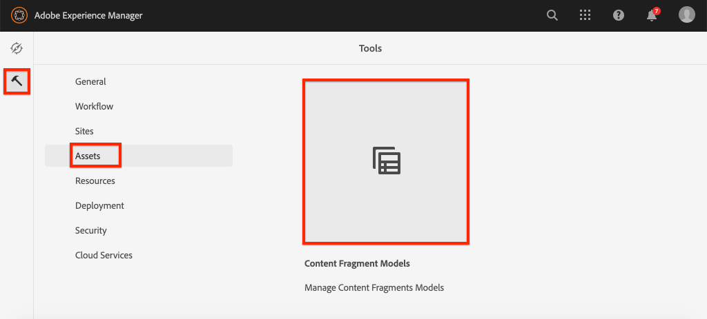

# Definiera modeller för innehållsfragment {#content-fragment-models}

I det här kapitlet får du lära dig att modellera innehåll och skapa ett schema med **modeller för innehållsfragment**. Du kommer att granska befintliga modeller och skapa en ny modell. Du får också lära dig mer om de olika datatyper som kan användas för att definiera ett schema som en del av modellen.

I det här kapitlet ska du skapa en ny modell för en **Contributor**, som är datamodellen för de användare som skriver tidskrift och äventyrsinnehåll som en del av WKND-varumärket.

## Förutsättningar {#prerequisites}

Det här är en självstudiekurs i flera delar och det antas att de steg som beskrivs i [Snabbinställningar](./setup.md) har slutförts.

## Mål {#objectives}

* Skapa en ny modell för innehållsfragment.
* Identifiera tillgängliga datatyper och valideringsalternativ för att bygga modeller.
* Förstå hur Content Fragment Model definierar **både** dataschemat och redigeringsmallen för ett Content Fragment.

## Översikt över modell för innehållsfragment {#overview}

>[!VIDEO](https://video.tv.adobe.com/v/22452/?quality=12&learn=on)

I videon ovan visas en översikt på hög nivå över hur du arbetar med modeller för innehållsfragment.

>[!CAUTION]
>
> I videon ovan visas hur du skapar modellen **Contributor** med namnet `Contributors`. När du utför stegen i din egen miljö ska du se till att titeln använder ett enda formulär: `Contributor` utan **s**. Namngivningen av innehållsfragmentmodellen styr GraphQL API-anropen som kommer att utföras senare i självstudiekursen.

## Inspect - Adventure Content Fragment Model

I det föregående kapitlet redigerades och visades flera tillägg för innehållsfragment i ett externt program. Låt oss inspektera Adventure Content Fragment Model för att förstå det underliggande dataschemat för dessa fragment.

1. I menyn **AEM Start** går du till **Verktyg** > **Resurser** > **Modeller för innehållsfragment**.

   

1. Navigera till mappen **WKND-plats** och hovra över **Adventure** Content Fragment Model och klicka på ikonen **Redigera** (penna) för att öppna modellen.

   

1. Då öppnas **Modellredigeraren för innehållsfragment**. Observera att fälten definierar Adventure-modellen innehåller olika **datatyper** som **Enkelradig text**, **Flera rader text**, **Uppräkning** och **Innehållsreferens**.

1. I den högra kolumnen i redigeraren visas tillgängliga **datatyper** som definierar formulärfälten som används för att skapa innehållsfragment.

1. Markera fältet **Titel** på huvudpanelen. Klicka på fliken **Egenskaper** i den högra kolumnen:

   

   Observera att fältet **Egenskapsnamn** är inställt på `adventureTitle`. Detta definierar namnet på den egenskap som är beständig för AEM. **Egenskapsnamnet** definierar också **nyckeln**-namnet för den här egenskapen som en del av datarammet. Den här **nyckeln** kommer att användas när data för innehållsfragment visas via GraphQL API:er.

   >[!CAUTION]
   >
   > Om du ändrar **egenskapsnamnet** för ett fält **efter att** innehållsfragment har härletts från modellen, har det underordnade effekter. Fältvärden i befintliga fragment kommer inte längre att refereras och datarammet som exponeras av GraphQL ändras, vilket påverkar befintliga program.

1. Bläddra nedåt på fliken **Egenskaper** och visa listrutan **Valideringstyp**.

   

   Formulärvalideringar som är utanför paketet är tillgängliga för **E-post** och **URL**. Det går också att definiera en **anpassad**-validering med hjälp av ett reguljärt uttryck.

1. Klicka på **Avbryt** för att stänga modellredigeraren för innehållsfragment.

## Skapa en Contributor-modell

Skapa sedan en ny modell för **Contributor**, som är datamodellen för de användare som skriver tidskrift och äventyrar innehåll som en del av WKND-varumärket.

1. Klicka på **Skapa** i det övre högra hörnet för att visa guiden **Skapa modell**.
1. Ange **modelltitel**: **Deltagare** och klicka på **Skapa**

   

   Klicka på **Öppna** för att öppna den nyskapade modellen.

1. Dra och släpp ett **enkelradigt textelement** på huvudpanelen. Ange följande egenskaper på fliken **Egenskaper**:

   * **Fältetikett**:  **Fullständigt namn**
   * **Egenskapsnamn**:  `fullName`
   * Kontrollera **Obligatoriskt**

   

1. Klicka på fliken **Datatyper** och dra och släpp ett **textfält med flera rader** under fältet **Fullständigt namn**. Ange följande egenskaper:

   * **Fältetikett**:  **Biografi**
   * **Egenskapsnamn**:  `biographyText`
   * **Standardtyp**:  **RTF**

1. Klicka på fliken **Datatyper** och dra och släpp fältet **Innehållsreferens**. Ange följande egenskaper:

   * **Fältetikett**:  **Bildreferens**
   * **Egenskapsnamn**:  `pictureReference`
   * **Rotsökväg**:  `/content/dam/wknd`

   När du konfigurerar **rotsökvägen** kan du klicka på ikonen **mapp** för att visa en modal sökväg. Detta begränsar vilka mappar författare kan använda för att fylla i sökvägen.

   

1. Lägg till en validering i **bildreferensen** så att endast innehållstyper för **bilder** kan användas för att fylla i fältet.

   

1. Klicka på fliken **Datatyper** och dra och släpp en **Uppräkning** datatyp under fältet **Bildreferens**. Ange följande egenskaper:

   * **Fältetikett**:  **Yrke**
   * **Egenskapsnamn**:  `occupation`

1. Lägg till flera **alternativ** med knappen **Lägg till ett alternativ**. Använd samma värde för **Alternativetikett** och **Alternativvärde**:

   **Artist**,  **Influencer**,  **Photographer**,  **Traveler**,  **Writer**,  **YouTuber**

   

1. Den sista **Contributor**-modellen ska se ut så här:

   

1. Klicka på **Spara** för att spara ändringarna.

## Aktivera Contributor-modellen

Modeller för innehållsfragment måste vara **Enabled** innan innehållsförfattare kan använda dem. Det går att **inaktivera** en innehållsfragmentmodell, vilket förhindrar författare från att använda den. Kom ihåg att om du ändrar **egenskapsnamnet** för ett fält i modellen ändras det underliggande dataschemat och det kan ha betydande effekter nedåt på befintliga fragment och externa program. Vi rekommenderar att du noga planerar namnkonventionen som används för **egenskapsnamnet** för fält innan du aktiverar innehållsfragmentmodellen för användare.

1. Kontrollera att **Contributor**-modellen är i läget **Aktiverad**.

   

   Du kan växla läge för en innehållsfragmentmodell genom att hålla markören över kortet och klicka på ikonen **Inaktivera** / **Aktivera**.

## Grattis! {#congratulations}

Grattis! Du har precis skapat din första Content Fragment Model!

## Nästa steg {#next-steps}

I nästa kapitel, [Skapa innehållsfragmentmodeller](author-content-fragments.md), skapar och redigerar du ett nytt innehållsfragment baserat på en innehållsfragmentmodell. Du får också lära dig hur du skapar varianter av innehållsfragment.