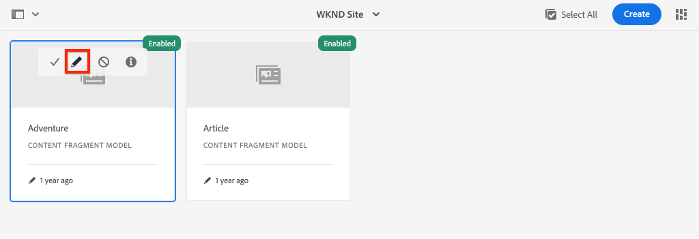

# Definiera modeller för innehållsfragment {#content-fragment-models}

I det här kapitlet får du lära dig att modellera innehåll och skapa ett schema med **Modeller för innehållsfragment**. Du kommer att granska befintliga modeller och skapa en ny modell. Du får också lära dig mer om de olika datatyper som kan användas för att definiera ett schema som en del av modellen.

I det här kapitlet skapar du en ny modell för **Medarbetare**, som är datamodellen för de användare som skriver tidskrift och äventyrsinnehåll som en del av WKND-varumärket.

## Förutsättningar {#prerequisites}

Det här är en självstudiekurs i flera delar och det antas att stegen som beskrivs i [Snabbinställningar](../quick-setup/local-sdk.md) har slutförts.

## Mål {#objectives}

* Skapa en ny modell för innehållsfragment.
* Identifiera tillgängliga datatyper och valideringsalternativ för att bygga modeller.
* Understand how the Content Fragment Model defines **both** the data schema and the authoring template for a Content Fragment.

## Översikt över modell för innehållsfragment {#overview}

>[!VIDEO](https://video.tv.adobe.com/v/22452/?quality=12&learn=on)

The above video gives a high level overview of working with Content Fragment Models.

>[!CAUTION]
>
> I videon ovan visas hur **Medarbetare** modell med namnet `Contributors`. När du utför stegen i din egen miljö ska du se till att titeln använder ett enda formulär: `Contributor` utan **s**. Namngivningen av innehållsfragmentmodellen styr GraphQL API-anropen som kommer att utföras senare i självstudiekursen.

## Inspect - Adventure Content Fragment Model

I det föregående kapitlet redigerades och visades flera tillägg för innehållsfragment i ett externt program. Låt oss inspektera Adventure Content Fragment Model för att förstå det underliggande dataschemat för dessa fragment.

1. Från **AEM** gå till **verktyg** > **Resurser** > **Modeller för innehållsfragment**.

   

1. Navigera till **WKND-plats** och hovra över **Adventure** Content Fragment Model och klicka på **Redigera** -ikon (penna) för att öppna modellen.

   

1. Då öppnas **Modellredigerare för innehållsfragment**. Observera att fälten definierar Adventure-modellen innehåller olika **Datatyper** gilla **Enkelradig text**, **Flerradstext**, **Uppräkning** och **Innehållsreferens**.

1. I den högra kolumnen i redigeraren visas de tillgängliga **Datatyper** som definierar de formulärfält som används för att skapa innehållsfragment.

1. Välj **Titel** i huvudpanelen. Klicka i den högra kolumnen på **Egenskaper** tab:

   

   Observera **Egenskapsnamn** fältet är inställt på `adventureTitle`. Detta definierar namnet på den egenskap som är beständig för AEM. The **Egenskapsnamn** definierar även **key** den här egenskapens namn som en del av dataschemat. Detta **key** används när Content Fragment-data visas via GraphQL-API:er.

   >[!CAUTION]
   >
   > Ändra **Egenskapsnamn** av ett fält **efter** Innehållsfragment härleds från modellen och har efterföljande effekter. Fältvärden i befintliga fragment kommer inte längre att refereras och datarammet som exponeras av GraphQL ändras, vilket påverkar befintliga program.

1. Bläddra nedåt i **Egenskaper** -fliken och visa **Valideringstyp** listruta.

   

   Out of the box form validations are available for **E-mail** and **URL**. It is also possible to define a **Custom** validation using a regular expression.

1. Klicka **Avbryt** när du vill stänga modellredigeraren för innehållsfragment.

## Skapa en Contributor-modell

Skapa sedan en ny modell för en **Medarbetare**, som är datamodellen för de användare som skriver tidskrift och äventyrsinnehåll som en del av WKND-varumärket.

1. Klicka **Skapa** i det övre högra hörnet för att visa **Skapa modell** guide.
1. För **Modelltitel** ange: **Medarbetare** och klicka **Skapa**

   

   Klicka **Öppna** för att öppna den nya modellen.

1. Dra och släpp en **Enkelradig text** till huvudpanelen. Ange följande egenskaper på **Egenskaper** tab:

   * **Fältetikett**: **Fullständigt namn**
   * **Egenskapsnamn**: `fullName`
   * Kontrollera **Obligatoriskt**

   

1. Klicka på **Datatyper** och dra och släppa **Flerradstext** fält under **Fullständigt namn** fält. Ange följande egenskaper:

   * **Fältetikett**: **Biografi**
   * **Property Name**: `biographyText`
   * **Standardtyp**: **RTF**

1. Click the **Data Types** tab and drag and drop a **Content Reference** field. Ange följande egenskaper:

   * **Fältetikett**: **Bildreferens**
   * **Egenskapsnamn**: `pictureReference`
   * **Rotsökväg**: `/content/dam/wknd`

   När du konfigurerar **Rotsökväg** du kan klicka på **mapp** om du vill visa en modal för att markera banan. Detta begränsar vilka mappar författare kan använda för att fylla i sökvägen.

   

1. Lägg till en validering i **Bildreferens** så att bara innehållstyper i **Bilder** kan användas för att fylla i fältet.

   

1. Klicka på **Datatyper** och dra och släppa **Uppräkning**  datatypen under **Bildreferens** fält. Ange följande egenskaper:

   * **Fältetikett**: **Yrke**
   * **Egenskapsnamn**: `occupation`

1. Lägg till flera **Alternativ** med **Lägg till ett alternativ** -knappen. Använd samma värde för **Alternativetikett** och **Alternativvärde**:

   **Konstnär**, **Påverkande**, **Fotograf**, **Resa**, **Författare**, **YouTuber**

   

1. Den slutliga **Medarbetare** modellen ska se ut så här:

   

1. Klicka **Spara** för att spara ändringarna.

## Aktivera Contributor-modellen

Content Fragment Models need to be **Enabled** before content authors can use it. Det går att **Inaktivera** en Content Fragment Model, som förhindrar författare från att använda den. Recall that modifying the **Property Name** of a field in the model changes the underlying data schema and can have significant downstream effects on existing fragments and external applications. It is recommended to carefully plan the naming convention used for the **Property Name** of fields before enabling the Content Fragment Model for users.

1. Se till att **Medarbetare** modellen finns för närvarande i en **Aktiverad** tillstånd.

   

   Du kan växla läge för en innehållsfragmentmodell genom att hålla markören över kortet och klicka på knappen **Inaktivera** / **Aktivera** ikon.

## Grattis! {#congratulations}

Grattis! Du har precis skapat din första Content Fragment Model!

## Nästa steg {#next-steps}

I nästa kapitel [Skapa modeller för innehållsfragment](author-content-fragments.md)skapar och redigerar du ett nytt innehållsfragment baserat på en modell för innehållsfragment. Du får också lära dig hur du skapar varianter av innehållsfragment.
