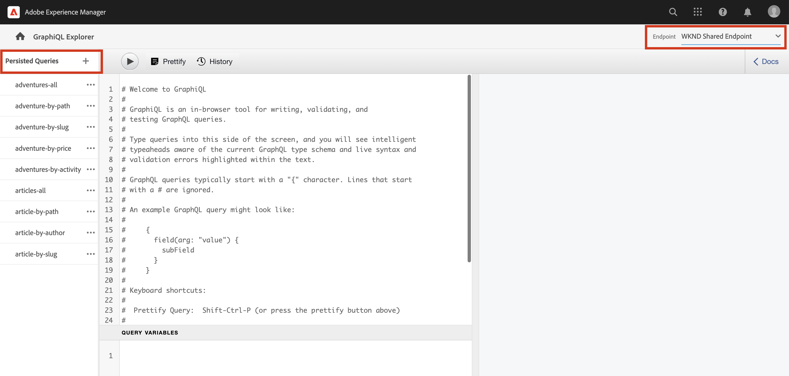

# Utforska GraphQL API:er {#explore-graphql-apis}

GraphQL API i AEM tillhandahåller ett kraftfullt frågespråk för att visa data från innehållsfragment för program längre fram i kedjan. Modeller för innehållsfragment definierar det dataschema som används av innehållsfragment. När en innehållsfragmentmodell skapas eller uppdateras översätts schemat och läggs till i det diagram som utgör GraphQL-API:t.

I det här kapitlet ska vi undersöka några vanliga GraphQL-frågor för att samla in innehåll med en IDE som kallas [GraphiQL](https://github.com/graphql/graphiql). Med GraphiQL IDE kan du snabbt testa och finjustera frågor och data som returneras. GraphiQL ger också enkel åtkomst till dokumentationen vilket gör det enkelt att ta reda på vilka metoder som finns tillgängliga.

## Förutsättningar {#prerequisites}

Det här är en självstudiekurs i flera delar och det antas att stegen som beskrivs i [Skapa innehållsfragment](./author-content-fragments.md) har slutförts.

## Mål {#objectives}

* Lär dig att använda GraphiQL-verktyget för att skapa en fråga med GraphQL-syntax.
* Lär dig hur du hämtar en lista med innehållsfragment och ett enda innehållsfragment.
* Lär dig hur du filtrerar och begär specifika dataattribut.
* Lär dig hur du sammanfogar en fråga med flera innehållsfragmentmodeller
* Lär dig hur du behåller GraphQL-frågan.

## Aktivera GraphQL-slutpunkt {#enable-graphql-endpoint}

En GraphQL-slutpunkt krävs för att kunna konfigureras för att aktivera GraphQL API-frågor för innehållsfragment.

1. Navigera AEM startskärmen till **verktyg** > **Allmänt** > **GraphQL**.

   

1. Tryck **Skapa** i det övre högra hörnet. Ange följande värden i dialogrutan:

   * Namn*: **Min projektslutpunkt**.
   * Använd GraphQL-schema från ... *: **Mitt projekt**

   

   Tryck **Skapa** för att spara slutpunkten.

   GraphQL-slutpunkter som skapats baserat på en projektkonfiguration aktiverar bara frågor mot modeller som tillhör det projektet. I det här fallet är den enda frågan mot **Person** och **Team** kan användas.

   >[!NOTE]
   >
   > En global slutpunkt kan också skapas som aktiverar frågor mot modeller i olika projekt. Om du till exempel vill kombinera en fråga som innehåller modellerna i **WKND delad** projekt och i **Mitt projekt**. Detta bör användas med försiktighet och endast om det är nödvändigt, eftersom det kan medföra att miljön kan drabbas av ytterligare säkerhetsluckor.

1. Nu bör två GraphQL-slutpunkter vara aktiverade i din miljö (förutsatt att du har installerat WKND Shared-innehåll).

   

## Använda GraphiQL IDE

The [GraphiQL Tool](https://experienceleague.adobe.com/docs/experience-manager-cloud-service/content/headless/graphql-api/graphiql-ide.html) gör att utvecklare kan skapa och testa frågor mot innehåll i den aktuella AEM. Med GraphiQL Tool kan man också **permanent** eller spara frågor som ska användas av klientprogram i en produktionsinställning.

Utforska sedan kraften i AEM GraphQL API med den inbyggda GraphiQL IDE.

1. Navigera AEM startskärmen till **verktyg** > **Allmänt** > **GraphQL Query Editor**.

   

   >[!NOTE]
   >
   > För äldre versioner av AEM är GraphiQL IDE eventuellt inte inbyggt. Den kan installeras manuellt efter dessa [instruktioner](#install-graphiql).

1. I det övre högra hörnet anger du **Slutpunkt** till **Min projektslutpunkt**.

   

   Detta kommer att omfatta alla frågor till modeller som skapats i **Mitt projekt** projekt. Observera att det också finns en slutpunkt för **WKND delad**.

### Fråga en lista med innehållsfragment {#query-list-cf}

Ett vanligt krav är att fråga efter flera innehållsfragment.

1. Klistra in följande fråga i huvudpanelen (ersätter kommentarlistan):

   ```graphql
   query allTeams {
     teamList {
       items {
         _path
         title
       }
     }
   } 
   ```

1. Tryck på **Spela upp** på den översta menyn för att köra frågan. Du bör se resultatet av innehållsfragmenten från föregående kapitel:

   

1. Placera markören under `title` text och ange **CTRL+Blanksteg** för att aktivera kodtips. Lägg till `shortname` och `description` till frågan.

   

1. Kör frågan igen genom att trycka på **Spela upp** så ser du resultatet som innehåller ytterligare egenskaper för `shortname` och `description`.

   

   The `shortname` är en enkel egenskap och `description` är ett textfält med flera rader och med GraphQL API kan vi välja en mängd olika format för resultaten, som `html`, `markdown`, `json` eller `plaintext`.

### Fråga efter kapslade fragment

Experimentera med frågor för att hämta kapslade fragment, kom ihåg att **Team** modell refererar till **Person** modell.

1. Uppdatera frågan så att den innehåller `teamMembers` -egenskap. Kom ihåg att det här är en **Fragmentreferens** till personmodellen. Personmodellens egenskaper kan returneras:

   ```graphql
   query allTeams {
       teamList {
           items {
               _path
               title
               shortName
               description {
                   plaintext
               }
               teamMembers {
                   fullName
                   occupation
               }
           }
       }
   }
   ```

   JSON-svar:

   ```json
   {
       "data": {
           "teamList": {
           "items": [
               {
               "_path": "/content/dam/my-project/en/team-alpha",
               "title": "Team Alpha",
               "shortName": "team-alpha",
               "description": {
                   "plaintext": "This is a description of Team Alpha!"
               },
               "teamMembers": [
                   {
                   "fullName": "John Doe",
                   "occupation": [
                       "Artist",
                       "Influencer"
                   ]
                   },
                   {
                   "fullName": "Alison Smith",
                   "occupation": [
                       "Photographer"
                   ]
                   }
                 ]
           }
           ]
           }
       }
   }
   ```

   Möjligheten att fråga mot kapslade fragment är en kraftfull funktion i AEM GraphQL API. I det här enkla exemplet är kapslingen bara två nivåer djupa. Det är dock möjligt att kapsla fragment ännu mer. Exempel: **Adress** modell som är associerad med en **Person** det skulle vara möjligt att returnera data från alla tre modellerna i en enda fråga.

### Filtrera en lista med innehållsfragment {#filter-list-cf}

Sedan ska vi titta på hur det går att filtrera resultatet till en delmängd av Content Fragments baserat på ett egenskapsvärde.

1. Ange följande fråga i användargränssnittet för GraphiQL:

   ```graphql
   query personByName($name:String!){
     personList(
       filter:{
         fullName:{
           _expressions:[{
             value:$name
             _operator:EQUALS
           }]
         }
       }
     ){
       items{
         _path
         fullName
         occupation
       }
     }
   }  
   ```

   Ovanstående fråga utför en sökning mot alla personfragment i systemet. Det tillagda filtret i början av frågan gör en jämförelse på `name` fält och variabelsträngen `$name`.

1. I **Frågevariabler** ange följande:

   ```json
   {"name": "John Doe"}
   ```

1. Kör frågan, det förväntas bara att **Personer** returneras med värdet &quot;John Doe&quot;.

   

   Det finns många andra alternativ för att filtrera och skapa komplexa frågor, se [Att lära sig använda GraphQL med AEM - exempelinnehåll och frågor](https://experienceleague.adobe.com/docs/experience-manager-cloud-service/assets/admin/content-fragments-graphql-samples.html).

1. Förbättra ovanstående fråga för att hämta profilbild

   ```graphql
   query personByName($name:String!){
     personList(
       filter:{
         fullName:{
           _expressions:[{
             value:$name
             _operator:EQUALS
           }]
         }
       }
     ){
       items{  
         _path
         fullName
         occupation
         profilePicture{
           ... on ImageRef{
             _path
             _authorUrl
             _publishUrl
             height
             width
   
           }
         }
       }
     }
   } 
   ```

   The `profilePicture` är en innehållsreferens och förväntas vara en bild, därför inbyggd `ImageRef` -objektet används. Detta gör att vi kan begära ytterligare data om bilden som referens, som `width` och `height`.

### Fråga ett enstaka innehållsfragment {#query-single-cf}

Det går också att ställa frågor direkt till ett enda innehållsfragment. Innehåll i AEM lagras hierarkiskt och den unika identifieraren för ett fragment baseras på fragmentets sökväg.

1. Ange följande fråga i GraphiQL-redigeraren:

   ```graphql
   query personByPath($path: String!) {
       personByPath(_path: $path) {
           item {
           fullName
           occupation
           }
       }
   }
   ```

1. Ange följande för **Frågevariabler**:

   ```json
   {"path": "/content/dam/my-project/en/alison-smith"}
   ```

1. Kör frågan och observera att det enskilda resultatet returneras.

## Beständiga frågor {#persist-queries}

När en utvecklare är nöjd med frågan och de data som returneras är nästa steg att lagra eller behålla frågan som ska AEM. [Beständiga frågor](https://experienceleague.adobe.com/docs/experience-manager-cloud-service/content/headless/graphql-api/persisted-queries.html) är den bästa metoden för att exponera GraphQL-API:t för klientprogram. När en fråga har sparats kan den begäras med hjälp av en GET-begäran och cachas i Dispatcher- och CDN-lagren. Prestandan för beständiga frågor är mycket bättre. Förutom prestandafördelar säkerställer beständiga frågor att extra data inte oavsiktligt exponeras för klientprogram. Mer information om [Här finns beständiga frågor](https://experienceleague.adobe.com/docs/experience-manager-cloud-service/content/headless/graphql-api/persisted-queries.html).

Sedan finns två enkla frågor kvar som kommer att användas i nästa kapitel.

1. I GraphiQL IDE anger du följande fråga:

   ```graphql
   query allTeams {
       teamList {
           items {
               _path
               title
               shortName
               description {
                   plaintext
               }
               teamMembers {
                   fullName
                   occupation
               }
           }
       }
   }
   ```

   Kontrollera att frågan fungerar.

1. Nästa tryckning **Spara som** och ange `all-teams` som **Frågenamn**.

   Frågan ska nu visas under **Beständiga frågor** till vänster.

   
1. Tryck sedan på ellipserna **...** bredvid den beständiga frågan och tryck **Kopiera URL** om du vill kopiera sökvägen till Urklipp.

   

1. Öppna en ny flik och klistra in den kopierade sökvägen i webbläsaren:

   ```plain
   https://$YOUR-AEMasCS-INSTANCEID$.adobeaemcloud.com/graphql/execute.json/my-project/all-teams
   ```

   Det bör se ut ungefär som banan ovan. Du bör se JSON-resultatet av frågan som returnerats.

   Bryter URL-adressen:

   | Namn | Beskrivning |
   | ---------|---------- |
   | `/graphql/execute.json` | Beständig frågeslutpunkt |
   | `/my-project` | Projektkonfiguration för `/conf/my-project` |
   | `/all-teams` | Namnet på den överordnade frågan |

1. Återgå till GraphiQL IDE och använd plusknappen **+** för att behålla den NYA frågan

   ```graphql
   query personByName($name: String!) {
     personList(
       filter: {
         fullName:{
           _expressions: [{
             value: $name
             _operator:EQUALS
           }]
         }
       }){
       items {
         _path
         fullName
         occupation
         biographyText {
           json
         }
         profilePicture {
           ... on ImageRef {
             _path
             _authorUrl
             _publishUrl
             width
             height
           }
         }
       }
     }
   }
   ```

1. Spara frågan som: **person-för-namn**.
1. Du bör spara två beständiga frågor:

   

## Lösningsfiler {#solution-files}

Ladda ned innehåll, modeller och permanenta frågor som skapats i de tre senaste kapitlen: [tutorial-solution-content.zip](assets/explore-graphql-api/tutorial-solution-content.zip)

## Utforska WKND-beständiga frågor (valfritt) {#explore-wknd-content-fragments}

Om du [installerade WKND Shared-exempelinnehåll](./overview.md#install-sample-content) kan du granska och köra permanenta frågor som äventyr - alla, äventyr - för-aktivitet, äventyr - för-bana, osv.




## Ytterligare resurser

Fler exempel på GraphQL-frågor finns i: [Att lära sig använda GraphQL med AEM - exempelinnehåll och frågor](https://experienceleague.adobe.com/docs/experience-manager-cloud-service/assets/admin/content-fragments-graphql-samples.html).

## Grattis! {#congratulations}

Grattis! Du har precis skapat och kört flera GraphQL-frågor!

## Nästa steg {#next-steps}

I nästa kapitel [Bygg React-app](./graphql-and-react-app.md)kommer du att utforska hur ett externt program kan fråga AEM GraphQL-slutpunkter och utnyttja dessa två beständiga frågor. Du kommer också att få en del grundläggande felhantering.

## Installera GraphiQL-verktyget (valfritt) {#install-graphiql}

För vissa versioner av AEM måste GraphiQL IDE-verktyget installeras manuellt. Installera manuellt genom att följa instruktionerna nedan:

1. Navigera till **[Programdistributionsportal](https://experience.adobe.com/#/downloads/content/software-distribution/en/aemcloud.html)** > **AEM as a Cloud Service**.
1. Sök efter &quot;GraphiQL&quot; (se till att inkludera **i** in **GraphiQL**.
1. Ladda ned den senaste **Innehållspaket för GraphiQL v.x.x.x**

   

   Zip-filen är ett AEM som kan installeras direkt.

1. Från **AEM** gå till **verktyg** > **Distribution** > **Paket**.
1. Klicka **Överför paket** och välj det paket som laddats ned i föregående steg. Klicka **Installera** för att installera paketet.

   
