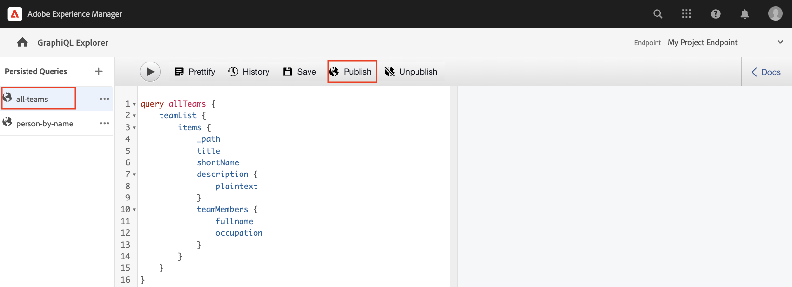

# Utforska GraphQL API:er {#explore-graphql-apis}

GraphQL-API:t för AEM innehåller ett kraftfullt frågespråk för att visa data från innehållsfragment för program längre fram i kedjan. Modeller för innehållsfragment definierar det dataschema som används av innehållsfragment. När en innehållsfragmentmodell skapas eller uppdateras, översätts och läggs schemat till i det diagram som utgör GraphQL-API:t.

I det här kapitlet ska vi titta på några vanliga GraphQL-frågor för att samla in innehåll med hjälp av en IDE som kallas [GraphiQL](https://github.com/graphql/graphiql). Med GraphiQL IDE kan du snabbt testa och finjustera frågor och data som returneras. Den ger också enkel åtkomst till dokumentationen, vilket gör det enkelt att lära sig och förstå vilka metoder som är tillgängliga.

## Förutsättningar {#prerequisites}

Det här är en självstudiekurs i flera delar och det antas att stegen som beskrivs i [Skapa innehållsfragment](./author-content-fragments.md) har slutförts.

## Mål {#objectives}

* Lär dig att använda GraphiQL-verktyget för att skapa en fråga med GraphQL-syntax.
* Lär dig hur du hämtar en lista med innehållsfragment och ett enda innehållsfragment.
* Lär dig hur du filtrerar och begär specifika dataattribut.
* Lär dig hur du sammanfogar en fråga med flera innehållsfragmentmodeller
* Lär dig hur du behåller GraphQL-frågan.

## Aktivera GraphQL Endpoint {#enable-graphql-endpoint}

En GraphQL-slutpunkt måste konfigureras för att aktivera GraphQL API-frågor för innehållsfragment.

1. Navigera AEM startskärmen till **verktyg** > **Allmänt** > **GraphQL**.

   

1. Tryck **Skapa** i det övre högra hörnet av dialogrutan som visas anger du följande värden:

   * Namn*: **Min projektslutpunkt**.
   * Använd GraphQL-schema från ... *: **Mitt projekt**

   

   Tryck **Skapa** för att spara slutpunkten.

   GraphQL-slutpunkter som skapats baserat på en projektkonfiguration aktiverar bara frågor mot modeller som tillhör det projektet. I det här fallet är den enda frågan mot **Person** och **Team** kan användas.

   >[!NOTE]
   >
   > En global slutpunkt kan också skapas för att aktivera frågor mot modeller över flera konfigurationer. Detta bör användas med försiktighet eftersom det kan öppna miljön för ytterligare säkerhetsproblem och göra hanteringen av AEM mer komplex.

1. Nu bör en GraphQL-slutpunkt vara aktiverad i din miljö.

   

## Använda GraphiQL IDE

The [GraphiQL](https://experienceleague.adobe.com/docs/experience-manager-cloud-service/content/headless/graphql-api/graphiql-ide.html) Med kan utvecklare skapa och testa frågor mot innehåll i den aktuella AEM. Med GraphiQL-verktyget kan man också **bevara eller spara** frågor som ska användas av klientprogram i en produktionsinställning.

Utforska sedan kraften i AEM GraphQL API med den inbyggda GraphiQL IDE.

1. Navigera AEM startskärmen till **verktyg** > **Allmänt** > **GraphQL Query Editor**.

   

   >[!NOTE]
   >
   > I kan det hända att de äldre versionerna av GraphiQL IDE inte är inbyggda. Den kan installeras manuellt efter dessa [instruktioner](#install-graphiql).

1. Kontrollera att slutpunkten är inställd på längst upp till höger **Min projektslutpunkt**.

   

Detta kommer att omfatta alla frågor till modeller som skapats i **Mitt projekt** projekt.

### Fråga en lista med innehållsfragment {#query-list-cf}

Ett vanligt krav är att fråga efter flera innehållsfragment.

1. Klistra in följande fråga i huvudpanelen (ersätter kommentarlistan):

   ```graphql
   query allTeams {
     teamList {
       items {
         _path
         title
       }
     }
   } 
   ```

1. Tryck på **Spela upp** på den översta menyn för att köra frågan. Du bör se resultatet av innehållsfragmenten från det föregående kapitlet:

   

1. Placera markören under `title` text och ange **CTRL+Blanksteg** för att aktivera kodtips. Lägg till `shortname` och `description` till frågan.

   

1. Kör frågan igen genom att trycka på **Spela upp** och du bör se att resultatet innehåller ytterligare egenskaper för `shortname` och `description`.

   

   The `shortname` är en enkel egenskap och `description` är ett textfält med flera rader och med GraphQL API kan vi välja olika format för resultaten, som `html`, `markdown`, `json`, eller `plaintext`.

### Fråga efter kapslade fragment

Experimentera med frågor för att hämta kapslade fragment, kom ihåg att **Team** modell refererar till **Person** modell.

1. Uppdatera frågan så att den innehåller `teamMembers` -egenskap. Kom ihåg att det här är en **Fragmentreferens** till personmodellen. Personmodellens egenskaper kan returneras:

   ```graphql
   query allTeams {
       teamList {
           items {
               _path
               title
               shortName
               description {
                   plaintext
               }
               teamMembers {
                   fullName
                   occupation
               }
           }
       }
   }
   ```

   JSON-svar:

   ```json
   {
       "data": {
           "teamList": {
           "items": [
               {
               "_path": "/content/dam/my-project/en/team-alpha",
               "title": "Team Alpha",
               "shortName": "team-alpha",
               "description": {
                   "plaintext": "This is a description of Team Alpha!"
               },
               "teamMembers": [
                   {
                   "fullName": "John Doe",
                   "occupation": [
                       "Artist",
                       "Influencer"
                   ]
                   },
                   {
                   "fullName": "Alison Smith",
                   "occupation": [
                       "Photographer"
                   ]
                   }
                 ]
           }
           ]
           }
       }
   }
   ```

   Möjligheten att fråga mot kapslade fragment är en kraftfull funktion i AEM GraphQL API. I det här enkla exemplet är kapslingen bara två nivåer djup. Det går dock att kapsla fragment ännu mer. Om det till exempel finns en **Adress** modell som är associerad med en **Person** det skulle vara möjligt att returnera data från alla tre modellerna i en enda fråga.

### Filtrera en lista med innehållsfragment {#filter-list-cf}

Sedan ska vi titta på hur det går att filtrera resultatet till en delmängd av Content Fragments baserat på ett egenskapsvärde.

1. Ange följande fråga i användargränssnittet för GraphiQL:

   ```graphql
   query personByName($name:String!){
     personList(
       filter:{
         fullName:{
           _expressions:[{
             value:$name
             _operator:EQUALS
           }]
         }
       }
     ){
       items{
         _path
         fullName
         occupation
       }
     }
   }  
   ```

   Ovanstående fråga utför en sökning mot alla personfragment i systemet. Det tillagda filtret i början av frågan utför en jämförelse på `name` fält och variabelsträngen `$name`.

1. I **Frågevariabler** ange följande:

   ```json
   {"name": "John Doe"}
   ```

1. Kör frågan, det förväntas bara att **Personer** Innehållsfragment returneras med värdet `John Doe`.

   

   Det finns många andra alternativ för att filtrera och skapa komplexa frågor, se [Lära sig använda GraphQL med AEM - exempelinnehåll och frågor](https://experienceleague.adobe.com/docs/experience-manager-cloud-service/content/headless/graphql-api/sample-queries.html).

1. Förbättra ovanstående fråga för att hämta profilbild

   ```graphql
   query personByName($name:String!){
     personList(
       filter:{
         fullName:{
           _expressions:[{
             value:$name
             _operator:EQUALS
           }]
         }
       }
     ){
       items{  
         _path
         fullName
         occupation
         profilePicture{
           ... on ImageRef{
             _path
             _authorUrl
             _publishUrl
             height
             width
   
           }
         }
       }
     }
   } 
   ```

   The `profilePicture` är en innehållsreferens och förväntas vara en bild, därför inbyggd `ImageRef` -objektet används. Detta gör att vi kan begära ytterligare data om bilden som referens, som `width` och `height`.

### Fråga ett enstaka innehållsfragment {#query-single-cf}

Det går också att ställa frågor direkt till ett enda innehållsfragment. Innehåll i AEM lagras hierarkiskt och den unika identifieraren för ett fragment baseras på fragmentets sökväg.

1. Ange följande fråga i GraphiQL-redigeraren:

   ```graphql
   query personByPath($path: String!) {
       personByPath(_path: $path) {
           item {
           fullName
           occupation
           }
       }
   }
   ```

1. Ange följande för **Frågevariabler**:

   ```json
   {"path": "/content/dam/my-project/en/alison-smith"}
   ```

1. Kör frågan och observera att det enskilda resultatet returneras.

## Beständiga frågor {#persist-queries}

När en utvecklare är nöjd med de fråga- och resultatdata som returneras från frågan är nästa steg att lagra eller behålla frågan som ska AEM. The [Beständiga frågor](https://experienceleague.adobe.com/docs/experience-manager-cloud-service/content/headless/graphql-api/persisted-queries.html) är den bästa metoden för att exponera GraphQL API för klientprogram. När en fråga har sparats kan den begäras med hjälp av en GET-begäran och cachas i Dispatcher- och CDN-lagren. Prestandan för de beständiga frågorna är mycket bättre. Förutom prestandafördelar säkerställer beständiga frågor att extra data inte oavsiktligt exponeras för klientprogram. Mer information om [Beständiga frågor finns här](https://experienceleague.adobe.com/docs/experience-manager-cloud-service/content/headless/graphql-api/persisted-queries.html).

Behåll sedan två enkla frågor. De används i nästa kapitel.

1. Ange följande fråga i GraphiQL IDE:

   ```graphql
   query allTeams {
       teamList {
           items {
               _path
               title
               shortName
               description {
                   plaintext
               }
               teamMembers {
                   fullName
                   occupation
               }
           }
       }
   }
   ```

   Kontrollera att frågan fungerar.

1. Nästa tryckning **Spara som** och ange `all-teams` som **Frågenamn**.

   Frågan ska visas under **Beständiga frågor** till vänster.

   
1. Tryck sedan på ellipserna **...** bredvid den beständiga frågan och tryck på **Kopiera URL** om du vill kopiera sökvägen till Urklipp.

   

1. Öppna en ny flik och klistra in den kopierade sökvägen i webbläsaren:

   ```plain
   https://$YOUR-AEMasCS-INSTANCEID$.adobeaemcloud.com/graphql/execute.json/my-project/all-teams
   ```

   Det bör se ut ungefär som banan ovan. Du bör se att JSON-resultatet av frågan returneras.

   Bryter ned URL:en ovan:

   | Namn | Beskrivning |
   | ---------|---------- |
   | `/graphql/execute.json` | Beständig frågeslutpunkt |
   | `/my-project` | Projektkonfiguration för `/conf/my-project` |
   | `/all-teams` | Namnet på den beständiga frågan |

1. Återgå till GraphiQL IDE och använd plusknappen **+** för att behålla den NYA frågan

   ```graphql
   query personByName($name: String!) {
     personList(
       filter: {
         fullName:{
           _expressions: [{
             value: $name
             _operator:EQUALS
           }]
         }
       }){
       items {
         _path
         fullName
         occupation
         biographyText {
           json
         }
         profilePicture {
           ... on ImageRef {
             _path
             _authorUrl
             _publishUrl
             width
             height
           }
         }
       }
     }
   }
   ```

1. Spara frågan som: `person-by-name`.
1. Du bör spara två beständiga frågor:

   


## Publicera GraphQL Endpoint &amp; Persisted Queries

Publicera `GraphQL Endpoint` &amp; `Persisted Queries`

1. Navigera AEM startskärmen till **verktyg** > **Allmänt** > **GraphQL**.

1. Tryck på kryssrutan bredvid **Min projektslutpunkt** och knacka **Publicera**

   

1. Navigera AEM startskärmen till **verktyg** > **Allmänt** > **GraphQL Query Editor**

1. Tryck på **alla team** fråga från panelen Beständiga frågor och tryck på **Publicera**

   

1. Upprepa steget ovan för `person-by-name` fråga

## Lösningsfiler {#solution-files}

Ladda ned innehåll, modeller och beständiga frågor som skapats i de tre senaste kapitlen: [basic-tutorial-solution.content.zip](assets/explore-graphql-api/basic-tutorial-solution.content.zip)

## Ytterligare resurser

Läs mer om GraphQL frågor på [Lära sig använda GraphQL med AEM - exempelinnehåll och frågor](https://experienceleague.adobe.com/docs/experience-manager-cloud-service/content/headless/graphql-api/sample-queries.html).

## Grattis! {#congratulations}

Grattis! Du har skapat och kört flera GraphQL-frågor!

## Nästa steg {#next-steps}

I nästa kapitel [Bygg React-app](./graphql-and-react-app.md)utforskar du hur ett externt program kan fråga AEM GraphQL-slutpunkter och använda dessa två beständiga frågor. En del grundläggande felhantering introduceras också under körningen av GraphQL-frågor.

## Installera GraphiQL-verktyget (valfritt) {#install-graphiql}

I vissa versioner av AEM (6.X.X) måste GraphiQL IDE-verktyget installeras manuellt. Använd [instruktioner härifrån](../how-to/install-graphiql-aem-6-5.md).

