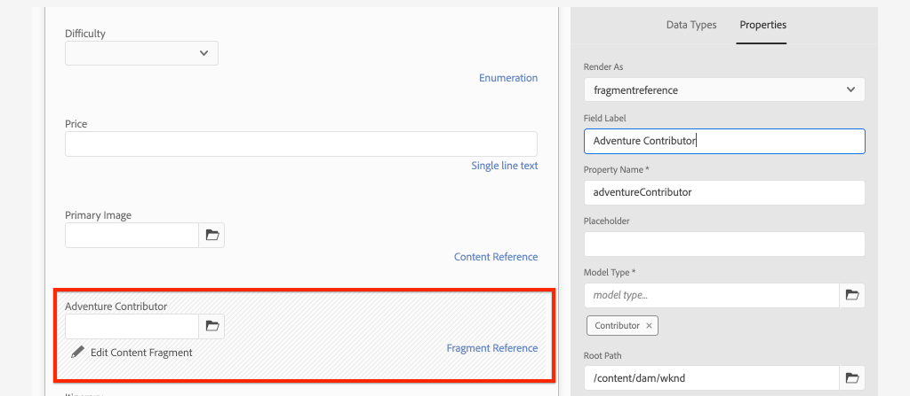
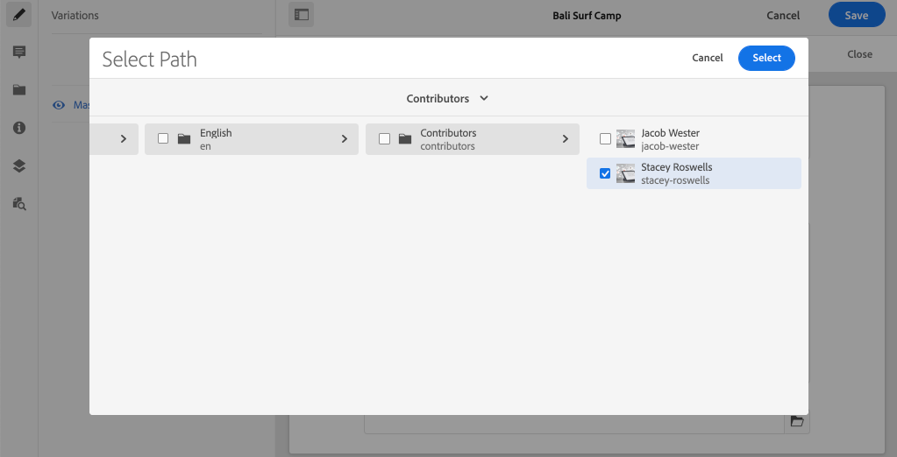
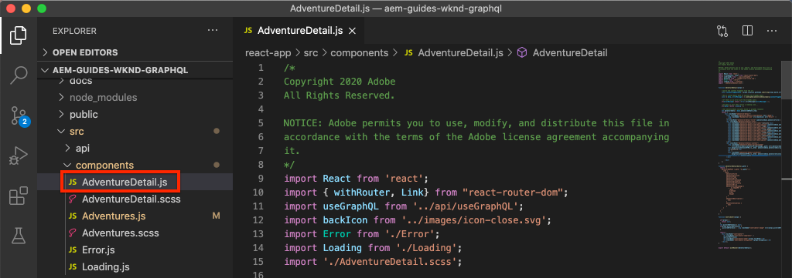

# Avancerad datamodellering med fragmentreferenser

Det går att referera till ett innehållsfragment inifrån andra innehållsfragment. Detta gör att användaren kan skapa komplexa datamodeller med relationer mellan fragment.

I det här kapitlet ska du uppdatera Adventure-modellen så att den innehåller en referens till Contributor-modellen med hjälp av **Fragmentreferens** fält. Du får också lära dig hur du ändrar en GraphQL-fråga så att den innehåller fält från en refererad modell.

## Förutsättningar

Det här är en självstudiekurs i flera delar och det antas att de steg som beskrivs i de föregående delarna har slutförts.

## Mål

I det här kapitlet får vi lära oss att:

* Uppdatera en innehållsfragmentmodell så att den använder fragmentreferensfältet
* Skapa en GraphQL-fråga som returnerar fält från en refererad modell

## Lägg till en fragmentreferens {#add-fragment-reference}

Uppdatera Adventure Content Fragment Model för att lägga till en referens till Contributor-modellen.

1. Öppna en ny webbläsare och navigera till AEM.
1. Från **AEM** gå till **verktyg** > **Resurser** > **Modeller för innehållsfragment** > **WKND-plats**.
1. Öppna **Adventure** Content Fragment Model

   

1. Under **Datatyper**, dra och släppa **Fragmentreferens** till huvudpanelen.

   

1. Uppdatera **Egenskaper** för detta fält med följande:

   * Återge som - `fragmentreference`
   * Fältetikett - **Adventure Contributor**
   * Egenskapsnamn - `adventureContributor`
   * Modelltyp - Välj **Medarbetare** modell
   * Rotsökväg - `/content/dam/wknd`

   

   Egenskapsnamnet `adventureContributor` kan nu användas för att referera till ett Contributor-innehållsfragment.

1. Spara ändringarna i modellen.

## Tilldela en deltagare till ett företag

Nu när Adventure Content Fragment-modellen har uppdaterats kan vi redigera ett befintligt fragment och referera till en Contributor. Observera att när du redigerar modellen för innehållsfragment *påverkar* befintliga innehållsfragment som har skapats från den.

1. Navigera till **Resurser** > **Filer** > **WKND-plats** > **Engelska** > **Annonser** > **[Bali Surf Camp](http://localhost:4502/assets.html/content/dam/wknd/en/adventures/bali-surf-camp)**.

   

1. Klicka på **Bali Surf Camp** innehållsfragment för att öppna Content Fragment Editor.
1. Uppdatera **Adventure Contributor** och välj en medarbetare genom att klicka på mappikonen.

   

   *Markera en bana till ett Contributor-fragment*

   

   Observera att endast fragment som skapats med **Medarbetare** kan väljas.

1. Spara ändringarna i fragmentet.

1. Upprepa stegen ovan om du vill tilldela en medverkande till äventyr som [Yosemite Backpackaging](http://localhost:4502/editor.html/content/dam/wknd/en/adventures/yosemite-backpacking/yosemite-backpacking) och [Colorado Rock klättring](http://localhost:4502/editor.html/content/dam/wknd/en/adventures/colorado-rock-climbing/colorado-rock-climbing)

## Fråga efter kapslat innehållsfragment med GraphiQL

Utför sedan en fråga för en Adventure och lägg till kapslade egenskaper för den Contributor-modell som refereras. Vi använder GraphiQL-verktyget för att snabbt verifiera frågans syntax.

1. Navigera till GraphiQL-verktyget i AEM: [http://localhost:4502/content/graphiql.html](http://localhost:4502/content/graphiql.html)

1. Ange följande fråga:

   ```graphql
   {
     adventureByPath(_path:"/content/dam/wknd/en/adventures/bali-surf-camp/bali-surf-camp") {
        item {
          _path
          adventureTitle
          adventureContributor {
            fullName
            occupation
            pictureReference {
           ...on ImageRef {
             _path
           }
         }
       }
     }
    }
   }
   ```

   Ovanstående fråga avser en enda Adventure genom dess väg. The `adventureContributor` Egenskapen refererar till Contributor-modellen och vi kan sedan begära egenskaper från det kapslade innehållsfragmentet.

1. Kör frågan så får du följande resultat:

   ```json
   {
     "data": {
       "adventureByPath": {
           "item": {
               "_path": "/content/dam/wknd/en/adventures/bali-surf-camp/bali-surf-camp",
               "adventureTitle": "Bali Surf Camp",
               "adventureContributor": {
                   "fullName": "Stacey Roswells",
                   "occupation": "Photographer",
                   "pictureReference": {
                       "_path": "/content/dam/wknd/en/contributors/stacey-roswells.jpg"
                   }
               }
           }
        }
     }
   }
   ```

1. Experimentera med andra frågor som `adventureList` och lägga till egenskaper för det refererade innehållsfragmentet under `adventureContributor`.

## Uppdatera React-appen för att visa Contributor-innehåll

Uppdatera sedan frågorna som används av React Application så att de inkluderar den nya Contributor-komponenten och visa information om Contributor som en del av Adventure-informationsvyn.

1. Öppna appen WKND GraphQL React i din utvecklingsmiljö.

1. Öppna filen `src/components/AdventureDetail.js`.

   

1. Hitta funktionen `adventureDetailQuery(_path)`. The `adventureDetailQuery(..)` funktionen kapslar bara in en filtreringsfråga i GraphQL som använder AEM `<modelName>ByPath` syntax för att fråga efter ett enskilt innehållsfragment som identifieras av dess JCR-sökväg.

1. Uppdatera frågan så att den innehåller information om den refererade Contributor:

   ```javascript
   function adventureDetailQuery(_path) {
       return `{
           adventureByPath (_path: "${_path}") {
           item {
               _path
               adventureTitle
               adventureActivity
               adventureType
               adventurePrice
               adventureTripLength
               adventureGroupSize
               adventureDifficulty
               adventurePrice
               adventurePrimaryImage {
                   ... on ImageRef {
                   _path
                   mimeType
                   width
                   height
                   }
               }
               adventureDescription {
                   html
               }
               adventureItinerary {
                   html
               }
               adventureContributor {
                   fullName
                   occupation
                   pictureReference {
                       ...on ImageRef {
                           _path
                       }
                   }
               }
             }
          }
        }
       `;
   }
   ```

   Med den här uppdateringen finns ytterligare egenskaper om `adventureContributor`, `fullName`, `occupation`och `pictureReference` tas med i frågan.

1. Inspect `Contributor` -komponenten inbäddad i `AdventureDetail.js` fil på `function Contributor(...)`. Den här komponenten återger medverkarens namn, befattning och bild om egenskaperna finns.

   The `Contributor` -komponenten refereras i `AdventureDetail(...)` `return` metod:

   ```javascript
   function AdventureDetail(props) {
       ...
       return (
           ...
            <h2>Itinerary</h2>
           <hr />
           <div className="adventure-detail-itinerary"
                dangerouslySetInnerHTML={{__html: adventureData.adventureItinerary.html}}></div>
           {/* Contributor component is instaniated and 
               is passed the adventureContributor object from the GraphQL Query results */}
           <Contributer {...adventureData.adventureContributor} />
           ...
       )
   }
   ```

1. Spara ändringarna i filen.
1. Starta React App, om den inte redan körs:

   ```shell
   $ cd aem-guides-wknd-graphql/react-app
   $ npm start
   ```

1. Navigera till [http://localhost:3000](http://localhost:3000/) och klicka på en Adventure som har en refererad Contributor. Nu ska du se Contributor-informationen nedan **Itinerary**:

   

## Grattis!{#congratulations}

Grattis! Du har uppdaterat en befintlig modell för innehållsfragment för att referera till ett kapslat innehållsfragment med hjälp av **Fragmentreferens** fält. Du lärde dig också att ändra en GraphQL-fråga så att den inkluderar fält från en refererad modell.

## Nästa steg {#next-steps}

I nästa kapitel [Produktionsdistribution med en AEM-publiceringsmiljö](./production-deployment.md)Läs om AEM Author och Publish och det rekommenderade distributionsmönstret för headless-program. Du uppdaterar ett befintligt program så att det använder miljövariabler för att dynamiskt ändra en GraphQL-slutpunkt baserat på målmiljön. Du får också lära dig hur du konfigurerar AEM för Cross-Origin Resource Sharing (CORS).
