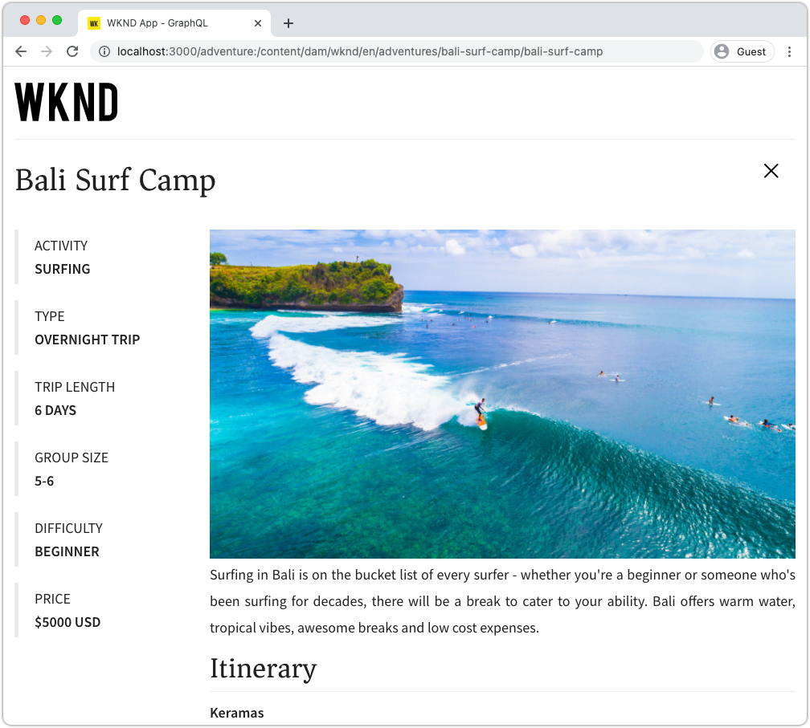

# Fråga AEM med GraphQL från en extern app

I det här kapitlet utforskar vi hur AEM GraphQL API:er kan användas för att skapa en upplevelse i ett externt program.

I den här självstudien används en enkel React-app för att fråga efter och visa Adventure-innehåll som exponeras av AEM GraphQL API:er. Användningen av React är i stort sett oviktig, och den uppladdande externa applikationen kan skrivas i vilket ramverk som helst för vilken plattform som helst.

## Förutsättningar

Det här är en självstudiekurs i flera delar och det antas att de steg som beskrivs i de föregående delarna har slutförts.

_Skärmbilder från IDE i det här kapitlet kommer från [Visual Studio Code](https://code.visualstudio.com/)_

Du kan också installera ett webbläsartillägg som [GraphQL Network Inspector](https://chrome.google.com/webstore/detail/graphql-network-inspector/ndlbedplllcgconngcnfmkadhokfaaln) för att kunna visa mer information om en GraphQL-fråga.

## Mål

I det här kapitlet får vi lära oss att:

* Starta och förstå funktionen hos exempelappen React
* Se hur anrop görs från det externa programmet till AEM GraphQL-slutpunkter
* Definiera en GraphQL-fråga för att filtrera en lista över äventyr Innehållsfragment efter aktivitet
* Uppdatera React-appen för att tillhandahålla kontroller för att filtrera via GraphQL, listan över äventyr per aktivitet

## Starta appen React

I det här kapitlet fokuseras utveckling av en klient som ska använda innehållsfragment över GraphQL, och exemplet [WKND GraphQL React-appens källkod måste hämtas och konfigureras](../quick-setup/local-sdk.md) på din lokala dator.

Vi har mer ingående information om hur du startar React-appen i [Snabbinställningar](../quick-setup/local-sdk.md) -kapitel, men de förkortade instruktionerna kan följas:

1. Klona exempelappen WKND GraphQL React från om du inte redan gjort det [Github.com](https://github.com/adobe/aem-guides-wknd-graphql)

   ```shell
   $ git clone --branch tutorial/react git@github.com:adobe/aem-guides-wknd-graphql.git
   ```

1. Öppna appen WKND GraphQL React i din utvecklingsmiljö

   

1. Navigera från kommandoraden till `react-app` mapp
1. Starta WKND GraphQL React-appen genom att köra följande kommando från projektets rot ( `react-app` mapp)

   ```shell
   $ cd aem-guides-wknd-graphql/react-app
   $ npm start
   ```

1. Granska appen på [http://localhost:3000/](http://localhost:3000/). Exempelappen React består av två huvuddelar:

   * Hemupplevelsen fungerar som ett index för WKND Adventures genom att fråga __Adventure__ Innehållsfragment i AEM med GraphQL. I det här kapitlet ska vi ändra den här vyn så att den har stöd för filtrering av äventyren efter aktivitet.

      

   * Experimentationsdetaljerna använder GraphQL för att fråga efter den specifika __Adventure__ Innehållsfragment och visar fler datapunkter.

      

1. Använd webbläsarens utvecklingsverktyg och ett webbläsartillägg som [GraphQL Network Inspector](https://chrome.google.com/webstore/detail/graphql-network-inspector/ndlbedplllcgconngcnfmkadhokfaaln) om du vill inspektera de GraphQL-frågor som skickas till AEM och deras JSON-svar. Den här metoden kan användas för att övervaka GraphQL-begäranden och svar för att säkerställa att de är korrekt formulerade och att deras svar är som förväntat.

   

   *GraphQL-fråga skickad till AEM från React-appen*

   

   *JSON-svar från AEM till React-appen*

   Frågorna och svaren ska matcha det som visas i GraphiQL IDE.

   >[!NOTE]
   >
   > Under utvecklingen konfigureras React-appen för att proxyvis skicka HTTP-begäranden via webbpaketets utvecklingsserver till AEM. Appen React begär  `http://localhost:3000` som proxyger till AEM Author-tjänsten som körs på `http://localhost:4502`. Granska filen `src/setupProxy.js` och `env.development` för mer information.
   >
   > I icke-utvecklingsscenarier skulle React-appen konfigureras direkt för att begära AEM.

## Utforska programmets GraphQL-kod

1. Öppna filen i din utvecklingsmiljö `src/api/useGraphQL.js`.

   Det här är en [Reaktionseffektkrok](https://reactjs.org/docs/hooks-overview.html#effect-hook) som lyssnar efter ändringar i appens `query`och vid ändring skickas en begäran om HTTP-POST till AEM GraphQL-slutpunkt och JSON-svaret returneras till programmet.

   Varje gång React-appen behöver göra en GraphQL-fråga anropas denna anpassade `useGraphQL(query)` som skickar in GraphQL att skicka till AEM.

   Den här kroken använder det enkla `fetch` för att göra en GraphQL-begäran för HTTP-POSTEN, men även andra moduler som [Apollo GraphQL-klient](https://www.apollographql.com/docs/react/) kan användas på liknande sätt.

1. Öppna `src/components/Adventures.js` i den utvecklingsmiljö som ansvarar för hemvyns äventyrslista och granska hur startsidan anropas `useGraphQL` krok.

   Den här koden anger standardvärdet `query` att vara `allAdventuresQuery` som definieras längre ned i den här filen.

   ```javascript
   const [query, setQuery] = useState(allAdventuresQuery);
   ```

   ... och när som helst `query` variabeländringar, `useGraphQL` -kroken anropas, vilket i sin tur kör GraphQL-frågan mot AEM och returnerar JSON till `data` variabel, som sedan används för att återge listan över äventyr.

   ```javascript
   const { data, errorMessage } = useGraphQL(query);
   ```

   The `allAdventuresQuery` är en konstant GraphQL-fråga som definieras i filen och som frågar alla Adventure-innehållsfragment, utan filtrering, och bara returnerar datapunkterna som behöver återge hemvyn.

   ```javascript
   const allAdventuresQuery = `
   {
       adventureList {
         items {
           _path
           adventureTitle
           adventurePrice
           adventureTripLength
           adventurePrimaryImage {
           ... on ImageRef {
               _path
               mimeType
               width
               height
             }
           }
         }
     }
   }
   `;
   ```

1. Öppna `src/components/AdventureDetail.js`, komponenten React som visar upplevelsen av äventyrsinformation. Den här vyn begär ett visst innehållsfragment, använder JCR-sökvägen som sitt unika ID, och återger den angivna informationen.

   Lika med `Adventures.js`, den anpassade `useGraphQL` React Hook används igen för att utföra GraphQL-frågan mot AEM.

   Innehållsfragmentets sökväg samlas in från komponentens `props` top som används för att ange vilket innehållsfragment som frågan ska göras för.

   ```javascript
   const contentFragmentPath = props.location.pathname.substring(props.match.url.length);
   ```

   ... och den parametriserade GraphQL-frågan konstrueras med `adventureDetailQuery(..)` och skickas till `useGraphQL(query)` som kör GraphQL-frågan mot AEM och returnerar resultaten till `data` variabel.

   ```javascript
   const { data, errorMessage } = useGraphQL(adventureDetailQuery(contentFragmentPath));
   ```

   The `adventureDetailQuery(..)` funktionen kapslar bara in en filtreringsfråga i GraphQL som använder AEM `<modelName>ByPath` syntax för att fråga efter ett enskilt innehållsfragment som identifieras av dess JCR-sökväg och returnerar alla angivna datapunkter som krävs för att återge äventyrets detaljer.

   ```javascript
   function adventureDetailQuery(_path) {
   return `{
       adventureByPath (_path: "${_path}") {
         item {
           _path
           adventureTitle
           adventureActivity
           adventureType
           adventurePrice
           adventureTripLength
           adventureGroupSize
           adventureDifficulty
           adventurePrice
           adventurePrimaryImage {
               ... on ImageRef {
               _path
               mimeType
               width
               height
               }
           }
           adventureDescription {
               html
           }
           adventureItinerary {
               html
           }
         }
       }
   }
   `;
   }
   ```

## Skapa en parametriserad GraphQL-fråga

Låt oss sedan ändra appen React för att utföra parametriserade, filtrerade GraphQL-frågor som begränsar hemvyn genom äventyrets aktivitet.

1. Öppna filen i din utvecklingsmiljö: `src/components/Adventures.js`. Den här filen representerar hemupplevelsens äventyrskomponent, som frågar efter och visar Adventures-kort.
1. Inspect `filterQuery(activity)`som inte används, men har förberetts för att skapa en GraphQL-fråga som filtrerar äventyren med `activity`.

   Lägg märke till den parametern `activity` infogas i GraphQL-frågan som en del av en `filter` på `adventureActivity` -fält, som kräver att fältets värde matchar parameterns värde.

   ```javascript
   function filterQuery(activity) {
       return `
           {
           adventures (filter: {
               adventureActivity: {
               _expressions: [
                   {
                   value: "${activity}"
                   }
                 ]
               }
           }){
               items {
               _path
               adventureTitle
               adventurePrice
               adventureTripLength
               adventurePrimaryImage {
               ... on ImageRef {
                   _path
                   mimeType
                   width
                   height
               }
               }
             }
         }
       }
       `;
   }
   ```

1. Uppdatera komponenterna React Adventures `return` programsats för att lägga till knappar som anropar den nya parametriserade `filterQuery(activity)` för att tillhandahålla de äventyr som ska listas.

   ```javascript
   function Adventures() {
       ...
       return (
           <div className="adventures">
   
           {/* Add these three new buttons that set the GraphQL query accordingly */}
   
           {/* The first button uses the default `allAdventuresQuery` */}
           <button onClick={() => setQuery(allAdventuresQuery)}>All</button>
   
           {/* The 2nd and 3rd button use the `filterQuery(..)` to filter by activity */}
           <button onClick={() => setQuery(filterQuery('Camping'))}>Camping</button>
           <button onClick={() => setQuery(filterQuery('Surfing'))}>Surfing</button>
   
           <ul className="adventure-items">
           ...
       )
   }
   ```

1. Spara ändringarna och läs in React-appen igen i webbläsaren. De tre nya knapparna visas högst upp och när du klickar på dem återställs automatiskt AEM för Adventure Content Fragments med motsvarande aktivitet.

   

1. Försök lägga till fler filterknappar för aktiviteterna: `Rock Climbing`, `Cycling` och `Skiing`

## Hantera GraphQL-fel

GraphQL är starkt typbestämd och kan därför returnera användbara felmeddelanden om frågan är ogiltig. Nu ska vi simulera en felaktig fråga för att se felmeddelandet som returneras.

1. Öppna filen igen `src/api/useGraphQL.js`. Inspect följande utdrag för att se felhanteringen:

   ```javascript
   //useGraphQL.js
   .then(({data, errors}) => {
           //If there are errors in the response set the error message
           if(errors) {
               setErrors(mapErrors(errors));
           }
           //Otherwise if data in the response set the data as the results
           if(data) {
               setData(data);
           }
       })
       .catch((error) => {
           setErrors(error);
       });
   ```

   Svaret kontrolleras för att se om det innehåller en `errors` -objekt. The `errors` -objektet skickas av AEM om det finns problem med GraphQL-frågan, till exempel ett odefinierat fält baserat på schemat. Om det inte finns något `errors` objektet `data` anges och returneras.

   The `window.fetch` innehåller `.catch` programsats till *catch* alla vanliga fel, t.ex. en ogiltig HTTP-begäran eller om det inte går att ansluta till servern.

1. Öppna filen `src/components/Adventures.js`.
1. Ändra `allAdventuresQuery` att inkludera en ogiltig egenskap `adventurePetPolicy`:

   ```javascript
   /**
    * Query for all Adventures
    * adventurePetPolicy has been added beneath items
   */
   const allAdventuresQuery = `
   {
       adventureList {
         items {
           adventurePetPolicy
           _path
           adventureTitle
           adventurePrice
           adventureTripLength
           adventurePrimaryImage {
           ... on ImageRef {
               _path
               mimeType
               width
               height
           }
           }
         }
       }
   }
   `;
   ```

   Vi vet att `adventurePetPolicy` är inte en del av Adventure-modellen, så detta bör utlösa ett fel.

1. Spara ändringarna och gå tillbaka till webbläsaren. Ett felmeddelande bör visas enligt följande:

   

   GraphQL API:t upptäcker att `adventurePetPolicy` är odefinierad i `AdventureModel` och returnerar ett felmeddelande.

1. Inspect svaret från AEM med webbläsarens utvecklarverktyg för att se `errors` JSON-objekt:

   

   The `errors` -objektet är mycket detaljerat och innehåller information om platsen för den felaktiga frågan och klassificeringen av felet.

1. Återgå till `Adventures.js` och återställa frågeändringen så att programmet återställs till rätt läge.

## Grattis!{#congratulations}

Grattis! Du har utforskat koden för exempelappen WKND GraphQL React och uppdaterat den till att använda parametriserade, filtrerade GraphQL-frågor för att lista äventyren efter aktivitet! Du har också en chans att utforska grundläggande felhantering.

## Nästa steg {#next-steps}

I nästa kapitel [Avancerad datamodellering med fragmentreferenser](./fragment-references.md) Du får lära dig hur du använder funktionen Fragmentreferens för att skapa en relation mellan två olika innehållsfragment. Du får också lära dig hur du ändrar en GraphQL-fråga så att den inkluderar fält från en refererad modell.
