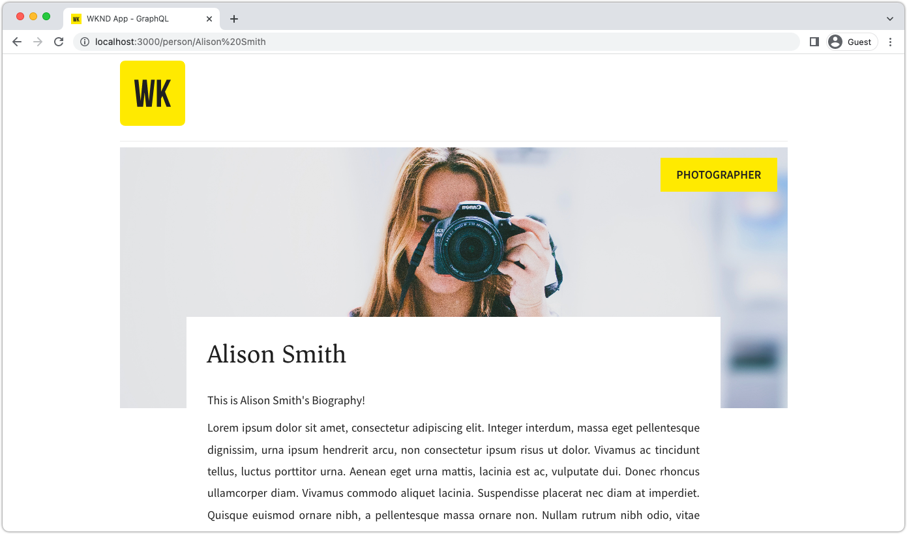

# Bygg en React-app som använder AEM GraphQL API:er

I det här kapitlet tittar du närmare på hur AEM GraphQL API:er kan styra upplevelsen i ett externt program.

En enkel React-app används för att fråga efter och visa **Team** och **Person** innehåll som exponeras av AEM GraphQL API:er. Användningen av React är i stort sett oviktig, och den uppladdande externa applikationen kan skrivas i vilket ramverk som helst för vilken plattform som helst.

## Förutsättningar

Det antas att de steg som beskrivs i de tidigare delarna av den här flerdelssjälvstudiekursen har slutförts, eller [basic-tutorial-solution.content.zip](assets/explore-graphql-api/basic-tutorial-solution.content.zip) är installerat på AEM as a Cloud Service Author and Publish services.

_Skärmbilder från IDE i det här kapitlet kommer från [Visual Studio Code](https://code.visualstudio.com/)_

Följande programvara måste vara installerad:

- [Node.js v18](https://nodejs.org/en)
- [Visual Studio Code](https://code.visualstudio.com/)

## Mål

Lär dig mer om:

- Hämta och starta exempelappen React
- Fråga AEM GraphQL slutpunkter med [AEM Headless JS SDK](https://github.com/adobe/aem-headless-client-js)
- Fråga AEM efter en lista över team och deras refererade medlemmar
- AEM för information om en gruppmedlem

## Hämta exempelappen React

I det här kapitlet implementeras en utbäddad exempelapp, React, med den kod som krävs för att interagera med AEM GraphQL API, och visa team- och persondata som hämtats från dem.

Källkoden för programmet React finns på Github.com <https://github.com/adobe/aem-guides-wknd-graphql/tree/main/basic-tutorial>

Så här skaffar du React-appen:

1. Klona exempelappen WKND GraphQL React från [Github.com](https://github.com/adobe/aem-guides-wknd-graphql).

   ```shell
   $ cd ~/Code
   $ git clone git@github.com:adobe/aem-guides-wknd-graphql.git
   ```

1. Navigera till `basic-tutorial` och öppna den i din utvecklingsmiljö.

   ```shell
   $ cd ~/Code/aem-guides-wknd-graphql/basic-tutorial
   $ code .
   ```

   

1. Uppdatera `.env.development` för att ansluta till AEM as a Cloud Service Publish-tjänst.

   - Ange `REACT_APP_HOST_URI`är AEM as a Cloud Service publicerings-URL (ex. `REACT_APP_HOST_URI=https://publish-p123-e456.adobeaemcloud.com`) och `REACT_APP_AUTH_METHOD`&#39;s value to `none`

   >[!NOTE]
   >
   > Kontrollera att du har publicerat projektkonfigurationen, Content Fragment-modeller, redigerade innehållsfragment, GraphQL slutpunkter och beständiga frågor från tidigare steg.
   >
   > Om du utförde ovanstående steg på AEM Author SDK kan du peka på `http://localhost:4502` och `REACT_APP_AUTH_METHOD`&#39;s value to `basic`.


1. Gå till kommandoraden `aem-guides-wknd-graphql/basic-tutorial` mapp

1. Starta React-appen

   ```shell
   $ cd ~/Code/aem-guides-wknd-graphql/basic-tutorial
   $ npm install
   $ npm start
   ```

1. Appen React startar i utvecklingsläge på [http://localhost:3000/](http://localhost:3000/). Ändringar som görs i React-appen under hela kursen återspeglas direkt.


>[!IMPORTANT]
>
>   Den här React-appen är delvis implementerad. Följ stegen i den här självstudiekursen för att slutföra implementeringen. JavaScript-filer som behöver implementeras har följande kommentar. Se till att du lägger till/uppdaterar koden i de filerna med koden som anges i den här självstudiekursen.
>
>
> //**********************************
>
>  // TODO Implementera detta genom att följa stegen från AEM Headless Tutorial
>
>  //**********************************
>

## Anatomi i React-appen

Exempelappen React består av tre huvuddelar:

1. The `src/api` -mappen innehåller filer som används för att göra GraphQL-frågor till AEM.
   - `src/api/aemHeadlessClient.js` initierar och exporterar AEM Headless Client som används för att kommunicera med AEM
   - `src/api/usePersistedQueries.js` implements [anpassade React-kopplingar](https://react.dev/learn/reusing-logic-with-custom-hooks#custom-hooks-sharing-logic-between-components) returnera data från AEM GraphQL till `Teams.js` och `Person.js` visa komponenter.

1. The `src/components/Teams.js` -filen visar en lista med team och deras medlemmar med hjälp av en listfråga.
1. The `src/components/Person.js` -filen visar information om en person med hjälp av en parametriserad fråga med ett resultat.

## Granska objektet AEMHeadless

Granska `aemHeadlessClient.js` fil för hur du skapar `AEMHeadless` som används för att kommunicera med AEM.

1. Öppna `src/api/aemHeadlessClient.js`.

1. Granska raderna 1-40:

   - Importen `AEMHeadless` deklaration från [AEM Headless Client for JavaScript](https://github.com/adobe/aem-headless-client-js), rad 11.

   - Auktoriseringskonfigurationen baserad på variabler definierade i `.env.development`, rad 14-22 och, uttrycket för pilfunktionen `setAuthorization`, rad 31-40.

   - The `serviceUrl` inställningar för de inkluderade [utvecklingsproxy](https://github.com/adobe/aem-guides-wknd-graphql/tree/main/react-app#proxy-api-requests) konfiguration, rad 27.

1. Raderna 42-49 är viktigast eftersom de instansierar `AEMHeadless` och exportera den för användning i hela React-appen.

```javascript
// Initialize the AEM Headless Client and export it for other files to use
const aemHeadlessClient = new AEMHeadless({
  serviceURL: serviceURL,
  endpoint: REACT_APP_GRAPHQL_ENDPOINT,
  auth: setAuthorization(),
});

export default aemHeadlessClient;
```

## Implementera för att köra AEM GraphQL beständiga frågor

Så här implementerar du det allmänna `fetchPersistedQuery(..)` funktionen för att köra de beständiga AEM GraphQL-frågorna öppnar `usePersistedQueries.js` -fil. The `fetchPersistedQuery(..)` funktionen använder `aemHeadlessClient` objektets `runPersistedQuery()` funktion för att köra frågor asynkront, löftesbaserat beteende.

Senare, anpassad reaktion `useEffect` krok anropar den här funktionen för att hämta specifika data från AEM.

1. I `src/api/usePersistedQueries.js` **uppdatera** `fetchPersistedQuery(..)`, rad 35, med koden nedan.

```javascript
/**
 * Private, shared function that invokes the AEM Headless client.
 *
 * @param {String} persistedQueryName the fully qualified name of the persisted query
 * @param {*} queryParameters an optional JavaScript object containing query parameters
 * @returns the GraphQL data or an error message
 */
async function fetchPersistedQuery(persistedQueryName, queryParameters) {
  let data;
  let err;

  try {
    // AEM GraphQL queries are asynchronous, either await their return or use Promise-based syntax
    const response = await aemHeadlessClient.runPersistedQuery(
      persistedQueryName,
      queryParameters
    );
    // The GraphQL data is stored on the response's data field
    data = response?.data;
  } catch (e) {
    // An error occurred, return the error messages
    err = e
      .toJSON()
      ?.map((error) => error.message)
      ?.join(", ");
    console.error(e.toJSON());
  }

  // Return the GraphQL and any errors
  return { data, err };
}
```

## Implementera Teams-funktioner

Bygg sedan upp funktionaliteten för att visa teamen och deras medlemmar i React-appens huvudvy. Den här funktionen kräver:

- En ny [anpassad React useEffect-krok](https://react.dev/reference/react/useEffect#useeffect) in `src/api/usePersistedQueries.js` som anropar `my-project/all-teams` beständig fråga, returnera en lista över gruppinnehållsfragment i AEM.
- En React-komponent vid `src/components/Teams.js` som anropar den nya anpassade reaktionen `useEffect` och återger teamdata.

När det är klart fylls programmets huvudvy i med teamdata från AEM.


### Steg

1. Öppna `src/api/usePersistedQueries.js`.

1. Leta reda på funktionen `useAllTeams()`

1. Skapa en `useEffect` krok som anropar den beständiga frågan `my-project/all-teams` via `fetchPersistedQuery(..)`lägger du till följande kod. Haken returnerar också endast relevanta data från AEM GraphQL-svar vid `data?.teamList?.items`, vilket gör att komponenterna i vyn React kan vara agnostiska för de överordnade JSON-strukturerna.

   ```javascript
   /**
    * Custom hook that calls the 'my-project/all-teams' persisted query.
    *
    * @returns an array of Team JSON objects, and array of errors
    */
   export function useAllTeams() {
     const [teams, setTeams] = useState(null);
     const [error, setError] = useState(null);
   
     // Use React useEffect to manage state changes
     useEffect(() => {
       async function fetchData() {
         // Call the AEM GraphQL persisted query named "my-project/all-teams"
         const { data, err } = await fetchPersistedQuery(
           "my-project/all-teams"
         );
         // Sets the teams variable to the list of team JSON objects
         setTeams(data?.teamList?.items);
         // Set any errors
         setError(err);
       }
       // Call the internal fetchData() as per React best practices
       fetchData();
     }, []);
   
     // Returns the teams and errors
     return { teams, error };
   }
   ```

1. Öppna `src/components/Teams.js`

1. I `Teams` Reaktionskomponent, hämta listan med team från AEM med `useAllTeams()` krok.

   ```javascript
   import { useAllTeams } from "../api/usePersistedQueries";
   ...
   function Teams() {
     // Get the Teams data from AEM using the useAllTeams
     const { teams, error } = useAllTeams();
     ...
   }
   ```


1. Utför den vybaserade dataverifieringen och visa ett felmeddelande eller en inläsningsindikator baserat på returnerade data.

   ```javascript
   function Teams() {
     const { teams, error } = useAllTeams();
   
     // Handle error and loading conditions
     if (error) {
       // If an error ocurred while executing the GraphQL query, display an error message
       return <Error errorMessage={error} />;
     } else if (!teams) {
       // While the GraphQL request is executing, show the Loading indicator
       return <Loading />;
     }
     ...
   }
   ```

1. Återge slutligen teamdata. Varje team som returneras från GraphQL-frågan återges med `Team` Reaktionskomponent.

   ```javascript
   import React from "react";
   import { Link } from "react-router-dom";
   import { useAllTeams } from "../api/usePersistedQueries";
   import Error from "./Error";
   import Loading from "./Loading";
   import "./Teams.scss";
   
   function Teams() {
     const { teams, error } = useAllTeams();
   
     // Handle error and loading conditions
     if (error) {
       return <Error errorMessage={error} />;
     } else if (!teams) {
       return <Loading />;
     }
   
     // Teams have been populated by AEM GraphQL query. Display the teams.
     return (
       <div className="teams">
         {teams.map((team, index) => {
           return <Team key={index} {...team} />;
         })}
       </div>
     );
   }
   
   // Render single Team
   function Team({ title, shortName, description, teamMembers }) {
     // Must have title, shortName and at least 1 team member
     if (!title || !shortName || !teamMembers) {
       return null;
     }
   
     return (
       <div className="team">
         <h2 className="team__title">{title}</h2>
         <p className="team__description">{description.plaintext}</p>
         <div>
           <h4 className="team__members-title">Members</h4>
           <ul className="team__members">
             {/* Render the referenced Person models associated with the team */}
             {teamMembers.map((teamMember, index) => {
               return (
                 <li key={index} className="team__member">
                   <Link to={`/person/${teamMember.fullName}`}>
                     {teamMember.fullName}
                   </Link>
                 </li>
               );
             })}
           </ul>
         </div>
       </div>
     );
   }
   
   export default Teams;
   ```


## Implementera personfunktion

Med [Teamfunktioner](#implement-teams-functionality) complete, låt oss implementera funktionen för att hantera visningen av en gruppmedlems, eller en persons, information.

Den här funktionen kräver:

- En ny [anpassad React useEffect-krok](https://react.dev/reference/react/useEffect#useeffect) in `src/api/usePersistedQueries.js` som anropar parametern `my-project/person-by-name` beständig fråga och returnerar en enskild personpost.

- En React-komponent vid `src/components/Person.js` som använder en persons fullständiga namn som en frågeparameter, anropar den nya anpassade reaktionen `useEffect` och återger persondata.

När du är klar återges en personvy när du väljer en persons namn i Teams-vyn.



1. Öppna `src/api/usePersistedQueries.js`.

1. Leta reda på funktionen `usePersonByName(fullName)`

1. Skapa en `useEffect` krok som anropar den beständiga frågan `my-project/all-teams` via `fetchPersistedQuery(..)`lägger du till följande kod. Haken returnerar också endast relevanta data från AEM GraphQL-svar vid `data?.teamList?.items`, vilket gör att komponenterna i vyn React kan vara agnostiska för de överordnade JSON-strukturerna.

   ```javascript
   /**
    * Calls the 'my-project/person-by-name' and provided the {fullName} as the persisted query's `name` parameter.
    *
    * @param {String!} fullName the full
    * @returns a JSON object representing the person
    */
   export function usePersonByName(fullName) {
     const [person, setPerson] = useState(null);
     const [errors, setErrors] = useState(null);
   
     useEffect(() => {
       async function fetchData() {
         // The key is the variable name as defined in the persisted query, and may not match the model's field name
         const queryParameters = { name: fullName };
   
         // Invoke the persisted query, and pass in the queryParameters object as the 2nd parameter
         const { data, err } = await fetchPersistedQuery(
           "my-project/person-by-name",
           queryParameters
         );
   
         if (err) {
           // Capture errors from the HTTP request
           setErrors(err);
         } else if (data?.personList?.items?.length === 1) {
           // Set the person data after data validation
           setPerson(data.personList.items[0]);
         } else {
           // Set an error if no person could be found
           setErrors(`Cannot find person with name: ${fullName}`);
         }
       }
       fetchData();
     }, [fullName]);
   
     return { person, errors };
   }
   ```

1. Öppna `src/components/Person.js`
1. I `Person` Reaktionskomponent, analysera `fullName` parametern route och hämta persondata från AEM med `usePersonByName(fullName)` krok.

   ```javascript
   import { useParams } from "react-router-dom";
   import { usePersonByName } from "../api/usePersistedQueries";
   ...
   function Person() {
     // Read the person's `fullName` which is the parameter used to query for the person's details
     const { fullName } = useParams();
   
     // Query AEM for the Person's details, using the `fullName` as the filtering parameter
     const { person, error } = usePersonByName(fullName);
     ...
   }
   ```

1. Utför vybaserad dataverifiering och visa ett felmeddelande eller en inläsningsindikator baserat på returnerade data.

   ```javascript
   function Person() {
     // Read the person's `fullName` which is the parameter used to query for the person's details
     const { fullName } = useParams();
   
     // Query AEM for the Person's details, using the `fullName` as the filtering parameter
     const { person, error } = usePersonByName(fullName);
   
     // Handle error and loading conditions
     if (error) {
       return <Error errorMessage={error} />;
     } else if (!person) {
       return <Loading />;
     }
     ...
   }
   ```

1. Återge sedan persondata.

   ```javascript
   import React from "react";
   import { useParams } from "react-router-dom";
   import { usePersonByName } from "../api/usePersistedQueries";
   import { mapJsonRichText } from "../utils/renderRichText";
   import Error from "./Error";
   import Loading from "./Loading";
   import "./Person.scss";
   
   function Person() {
     // Read the person's `fullName` which is the parameter used to query for the person's details
     const { fullName } = useParams();
   
     // Query AEM for the Person's details, using the `fullName` as the filtering parameter
     const { person, error } = usePersonByName(fullName);
   
     // Handle error and loading conditions
     if (error) {
       return <Error errorMessage={error} />;
     } else if (!person) {
       return <Loading />;
     }
   
     // Render the person data
     return (
       <div className="person">
         
         <div className="person__occupations">
           {person.occupation.map((occupation, index) => {
             return (
               <span key={index} className="person__occupation">
                 {occupation}
               </span>
             );
           })}
         </div>
         <div className="person__content">
           <h1 className="person__full-name">{person.fullName}</h1>
           <div className="person__biography">
             {/* Use this utility to transform multi-line text JSON into HTML */}
             {mapJsonRichText(person.biographyText.json)}
           </div>
         </div>
       </div>
     );
   }
   
   export default Person;
   ```

## Prova appen

Granska appen [http://localhost:3000/](http://localhost:3000/) och klicka _Medlemmar_ länkar. Du kan också lägga till fler team och/eller medlemmar i Team Alpha genom att lägga till innehållsfragment i AEM.

>[!IMPORTANT]
>
>Om du vill verifiera implementeringsändringarna eller om du inte kan få programmet att fungera efter ändringarna ovan, se [självstudiekurs](https://github.com/adobe/aem-guides-wknd-graphql/tree/solution/basic-tutorial) lösningsgren.

## Under hålet

Öppna webbläsarens **Utvecklarverktyg** > **Nätverk** och _Filter_ for `all-teams` begäran. Lägg märke till GraphQL API-begäran `/graphql/execute.json/my-project/all-teams` görs mot `http://localhost:3000` och **NOT** mot värdet av `REACT_APP_HOST_URI`, till exempel `<https://publish-pxxx-exxx.adobeaemcloud.com`. Begärandena görs mot React-appens domän eftersom [proxyinställningar](https://create-react-app.dev/docs/proxying-api-requests-in-development/#configuring-the-proxy-manually) är aktiverad med `http-proxy-middleware` -modul.


Granska huvudsidan `../setupProxy.js` fil och inom `../proxy/setupProxy.auth.**.js` filer meddela hur `/content` och `/graphql` sökvägar är proxierade och anger att det inte är en statisk resurs.

```javascript
module.exports = function(app) {
  app.use(
    ['/content', '/graphql'],
  ...
```

Att använda den lokala proxyn är inte ett lämpligt alternativ för produktionsdistribution och mer information finns på _Produktionsdistribution_ -avsnitt.

## Grattis!{#congratulations}

Grattis! Du har nu skapat React-appen för att använda och visa data från AEM GraphQL API:er som en del av den grundläggande självstudiekursen!
