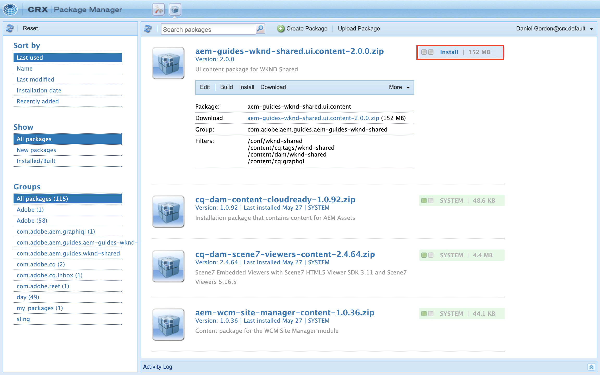

# Komma igång med AEM Headless - GraphQL

En komplett självstudiekurs som visar hur du bygger upp och exponerar innehåll med AEM GraphQL API:er och som används av en extern app i ett headless CMS-scenario.

I den här självstudiekursen utforskas hur AEM GraphQL API:er och headless-funktioner kan användas för att ge kraft åt upplevelser som upplevs i en extern app.

Den här självstudiekursen kommer att omfatta följande ämnen:

* Skapa en ny projektkonfiguration
* Skapa nya modeller för innehållsfragment för att modellera data
* Skapa nya innehållsfragment baserat på de tidigare modellerna.
* Se hur AEM kan efterfrågas med det integrerade utvecklingsverktyget GraphiQL.
* Lagra eller behålla de GraphQL-frågor som ska AEM
* Förbruka beständiga GraphQL-frågor från en provapp för React

## Förutsättningar {#prerequisites}

Du måste följa den här självstudiekursen på följande sätt:

* Baskunskaper i HTML och JavaScript
* Följande verktyg måste installeras lokalt:
   * [Node.js v10+](https://nodejs.org/en/)
   * [npm 6+](https://www.npmjs.com/)
   * [Git](https://git-scm.com/)
   * En IDE (till exempel [Microsoft® Visual Studio Code](https://code.visualstudio.com/))

### AEM

Det krävs en Adobe Experience Manager-miljö för att slutföra den här självstudiekursen. Du kan använda något av följande (skärmbilder spelas in från en AEM as a Cloud Service miljö):

* AEM as a Cloud Service miljö med:
   * [Åtkomst till AEM as a Cloud Service och Cloud Manager](/help/cloud-service/accessing/overview.md)
      * **AEM** åtkomst till AEM as a Cloud Service
      * **Cloud Manager - utvecklare** åtkomst till Cloud Manager

### Installera exempelinnehåll {#install-sample-content}

Det kan vara praktiskt att ha exempelinnehåll som redan finns i AEM som ska användas som referens.

1. Navigera till [AEM WKND-delat projekt](https://github.com/adobe/aem-guides-wknd-shared/releases).
1. Ladda ned den senaste resursen: `aem-guides-wknd-shared.ui.content-x.x.x.zip`.
1. Logga in i AEM författarmiljö som ska användas för självstudiekursen.
1. Navigera AEM startskärmen till **verktyg** > **Distribution** > **Paket**:

   

1. Tryck **Överför paket** och väljer `aem-guides-wknd-shared.ui.content-x.x.x.zip` tidigare hämtad fil. Tryck **OK** att överföra.
1. När paketet har överförts trycker du på **Installera** för att installera innehållet.

   

1. Exempelinnehåll Fragment, Content Fragment Models, images and more will be installed for the ficious [WKND, varumärke](https://wknd.site/). Exempelinnehållet kommer att refereras till senare i självstudiekursen.

## Kom så börjar vi!

1. Starta självstudiekursen med [Definiera modeller för innehållsfragment](content-fragment-models.md).

## GitHub-projekt

Källkoden och innehållspaketen finns på [AEM - WKND GraphQL GitHub-projekt](https://github.com/adobe/aem-guides-wknd-graphql).

Om du har problem med självstudiekursen eller koden kan du lämna en [GitHub-problem](https://github.com/adobe/aem-guides-wknd-graphql/issues).

Exempel på innehållsfragment, modeller och frågor finns i [AEM WKND-delat projekt](https://github.com/adobe/aem-guides-wknd-shared)
