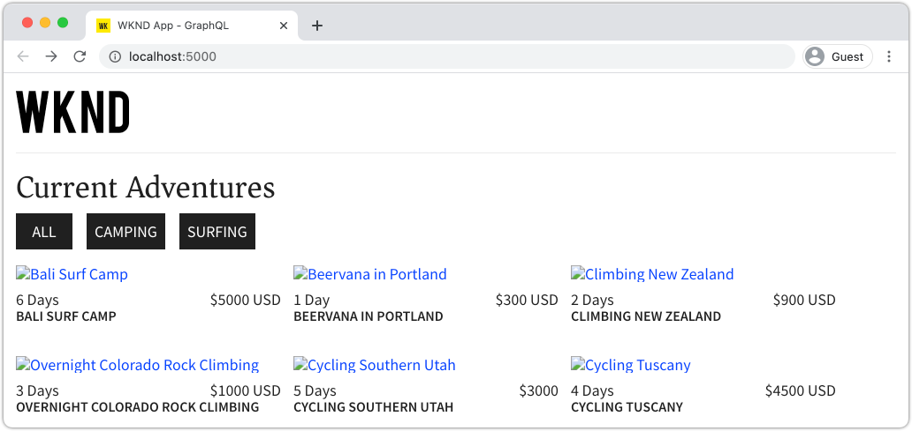

# Produktionsdistribution med en AEM Publiceringstjänst

I den här självstudiekursen skapar du en lokal miljö för att simulera innehåll som distribueras från en Author-instans till en Publish-instans. Du genererar också en produktionsbygge av en React App som är konfigurerad att använda innehåll från AEM publiceringsmiljö med GraphQL API:er. Under tiden kommer du att lära dig hur du effektivt använder miljövariabler och hur du uppdaterar AEM CORS-konfigurationer.

## Förutsättningar

Den här självstudiekursen är en del av en självstudiekurs i flera delar. Det antas att de steg som beskrivs i de föregående delarna har slutförts.

## Mål

Lär dig mer om:

* Förstå arkitekturen AEM Author och Publish.
* Lär dig de bästa sätten att hantera miljövariabler.
* Lär dig hur du konfigurerar AEM för Cross-Origin Resource Sharing (CORS).

## Skapa distributionsmönster för publicering {#deployment-pattern}

En komplett AEM består av en författare, en publiceringsversion och en utskicksare. I författartjänsten kan interna användare skapa, hantera och förhandsgranska innehåll. Publiceringstjänsten betraktas som&quot;Live&quot;-miljö och är vanligtvis den slutanvändare interagerar med. Innehåll som har redigerats och godkänts av författartjänsten distribueras till publiceringstjänsten.

Det vanligaste distributionsmönstret med AEM headless-program är att få produktionsversionen av programmet att ansluta till en AEM Publish-tjänst.


Diagrammet ovan visar detta vanliga distributionsmönster.

1. A **Innehållsförfattare** använder AEM författartjänst för att skapa, redigera och hantera innehåll.
2. The **Innehållsförfattare** och andra interna användare kan förhandsgranska innehållet direkt i författartjänsten. Du kan konfigurera en förhandsgranskningsversion av programmet som ansluter till författartjänsten.
3. När innehållet har godkänts kan det **publicerad** till AEM Publish-tjänsten.
4. **Slutanvändare** interagerar med programmets Production-version. Produktionsprogrammet ansluter till publiceringstjänsten och använder GraphQL API:er för att begära och använda innehåll.

Självstudiekursen simulerar distributionen ovan genom att lägga till en AEM Publish-instans i den aktuella konfigurationen. I tidigare kapitel fungerade React App som en förhandsgranskning genom att ansluta direkt till Author-instansen. En produktionsversion av React App distribueras till en statisk Node.js-server som ansluter till den nya Publish-instansen.

Slutligen körs tre lokala servrar:

* http://localhost:4502 - Författarinstans
* http://localhost:4503 - Publiceringsinstans
* http://localhost:5000 - Reagera app i produktionsläge, ansluta till Publish-instansen.

## Installera AEM SDK - publiceringsläge {#aem-sdk-publish}

För närvarande har vi en instans av SDK som körs i **Upphovsman** läge. SDK kan också startas i **Publicera** läge för att simulera en AEM publiceringsmiljö.

En mer detaljerad guide för hur du konfigurerar en lokal utvecklingsmiljö [finns här](https://experienceleague.adobe.com/docs/experience-manager-learn/cloud-service/local-development-environment-set-up/overview.html?lang=en#local-development-environment-set-up).

1. I det lokala filsystemet skapar du en dedikerad mapp för att installera Publish-instansen, d.v.s. med namnet `~/aem-sdk/publish`.
1. Kopiera filen Quickstart jar som används för Author-instansen i tidigare kapitel och klistra in den i `publish` katalog. Du kan även navigera till [Programdistributionsportal](https://experience.adobe.com/#/downloads/content/software-distribution/en/aemcloud.html) och ladda ned den senaste SDK:n och extrahera Quickstart jar-filen.
1. Byt namn på filen jar till `aem-publish-p4503.jar`.

   The `publish` sträng anger att QuickStart jar startar i publiceringsläge. The `p4503` anger att QuickStart-servern körs på port 4503.

1. Öppna ett nytt terminalfönster och navigera till mappen som innehåller filen jar. Installera och starta AEM:

   ```shell
   $ cd ~/aem-sdk/publish
   $ java -jar aem-publish-p4503.jar
   ```

1. Ange ett administratörslösenord som `admin`. Alla administratörslösenord accepteras, men du bör använda standardvärdet för lokal utveckling för att undvika extra konfigurationer.
1. När AEM har installerat klart öppnas ett nytt webbläsarfönster i [http://localhost:4503/content.html](http://localhost:4503/content.html)

   Den förväntas returnera en sida som inte kunde hittas 404. Detta är en helt ny AEM och inget innehåll har installerats.

## Installera exempelinnehåll och GraphQL-slutpunkter {#wknd-site-content-endpoints}

Precis som i Author-instansen måste Publish-instansen ha GraphQL-slutpunkterna aktiverade och ha exempelinnehåll. Installera sedan WKND-referenswebbplatsen på Publish-instansen.

1. Ladda ned det senaste kompilerade AEM-paketet för WKND-webbplatsen: [aem-guides-wknd.all-x.x.x.zip](https://github.com/adobe/aem-guides-wknd/releases/latest).

   >[!NOTE]
   >
   > Glöm inte att hämta standardversionen som är kompatibel med AEM as a Cloud Service och **not** den `classic` version.

1. Logga in på Publish-instansen genom att navigera direkt till: [http://localhost:4503/libs/granite/core/content/login.html](http://localhost:4503/libs/granite/core/content/login.html) med användarnamnet `admin` och lösenord `admin`.
1. Gå sedan till Package Manager på [http://localhost:4503/crx/packmgr/index.jsp](http://localhost:4503/crx/packmgr/index.jsp).
1. Klicka **Överför paket** och väljer det WKND-paket som hämtades i föregående steg. Klicka **Installera** för att installera paketet.
1. När paketet har installerats är WKND-referensplatsen nu tillgänglig på [http://localhost:4503/content/wknd/us/en.html](http://localhost:4503/content/wknd/us/en.html).
1. Logga ut som `admin` genom att klicka på knappen Logga ut på menyraden.

   

   Till skillnad från AEM Author-instansen är AEM publiceringsinstanser standard anonym skrivskyddad åtkomst. Vi vill simulera upplevelsen för en anonym användare när vi kör React-programmet.

## Uppdatera miljövariabler för att peka på Publish-instansen {#react-app-publish}

Uppdatera sedan de miljövariabler som används av React-programmet så att de pekar på Publish-instansen. Reaktionsappen bör **endast** ansluta till publiceringsinstansen i produktionsläge.

Lägg sedan till en ny fil `.env.production.local` för att simulera produktionsupplevelsen.

1. Öppna appen WKND GraphQL React i din utvecklingsmiljö.

1. Under `aem-guides-wknd-graphql/react-app`, lägga till en fil med namnet `.env.production.local`.
1. Fylla `.env.production.local` med följande:

   ```plain
   REACT_APP_HOST_URI=http://localhost:4503
   REACT_APP_GRAPHQL_ENDPOINT=/content/graphql/global/endpoint.json
   ```

   

   Med hjälp av miljövariabler är det enkelt att växla mellan en författar- eller publiceringsmiljö i GraphQL utan att lägga till extra logik i programkoden. Mer information om [anpassade miljövariabler för React finns här](https://create-react-app.dev/docs/adding-custom-environment-variables).

   >[!NOTE]
   >
   > Observera att ingen autentiseringsinformation ingår eftersom publiceringsmiljöer som standard ger anonym åtkomst till innehåll.

## Distribuera en statisk nodserver {#static-server}

Appen React kan startas med webbpaketservern, men detta är endast till för utveckling. Nu kan du simulera en produktionsdistribution med [server](https://github.com/vercel/serve) som värd för en produktionsversion av React-appen med Node.js.

1. Öppna ett nytt terminalfönster och navigera till `aem-guides-wknd-graphql/react-app` katalog

   ```shell
   $ cd aem-guides-wknd-graphql/react-app
   ```

1. Installera [server](https://github.com/vercel/serve) med följande kommando:

   ```shell
   $ npm install serve --save-dev
   ```

1. Öppna filen `package.json` på `react-app/package.json`. Lägga till ett skript med namnet `serve`:

   ```diff
    "scripts": {
       "start": "react-scripts start",
       "build": "react-scripts build",
       "test": "react-scripts test",
       "eject": "react-scripts eject",
   +   "serve": "npm run build && serve -s build"
   },
   ```

   The `serve` skript utför två åtgärder. Först skapas en produktionsversion av React App. För det andra startar Node.js-servern och använder produktionsbygget.

1. Återgå till terminalen och ange kommandot för att starta den statiska servern:

   ```shell
   $ npm run serve
   
   ┌────────────────────────────────────────────────────┐
   │                                                    │
   │   Serving!                                         │
   │                                                    │
   │   - Local:            http://localhost:5000        │
   │   - On Your Network:  http://192.168.86.111:5000   │
   │                                                    │
   │   Copied local address to clipboard!               │
   │                                                    │
   └────────────────────────────────────────────────────┘
   ```

1. Öppna en ny webbläsare och navigera till [http://localhost:5000/](http://localhost:5000/). Du bör se hur React App används.

   

   Observera att GraphQL-frågan fungerar på hemsidan. Inspect **XHR** begär med hjälp av utvecklarverktygen. Observera att GraphQL-POSTEN är till Publish-instansen på `http://localhost:4503/content/graphql/global/endpoint.json`.

   Alla bilder är emellertid brutna på startsidan!

1. Klicka på någon av Adventure Detail-sidorna.

   

   Observera att ett GraphQL-fel inträffar för `adventureContributor`. I nästa övning, de trasiga bilderna och `adventureContributor` problem har åtgärdats.

## Absoluta bildreferenser {#absolute-image-references}

Bilderna ser brutna ut eftersom `` tagg:

   ```diff
   - 
   + 
   ```

1. Öppna filen `AdventureDetail.js` på `react-app/src/components/AdventureDetail.js`.
1. Upprepa samma steg för att ändra GraphQL-frågan och lägga till `_publishUrl` egendom för Adventure

   ```diff
    adventureByPath (_path: "${_path}") {
       item {
           _path
           adventureTitle
           adventureActivity
           adventureType
           adventurePrice
           adventureTripLength
           adventureGroupSize
           adventureDifficulty
           adventurePrice
           adventurePrimaryImage {
               ... on ImageRef {
               _path
   +           _publishUrl
               mimeType
               width
               height
               }
           }
           adventureDescription {
               html
           }
           adventureItinerary {
               html
           }
           adventureContributor {
               fullName
               occupation
               pictureReference {
                   ...on ImageRef {
                       _path
   +                   _publishUrl
                   }
               }
           }
       }
       }
   } 
   ```

1. Ändra de två `` taggar för Adventure Primary Image och Contributor Picture i `AdventureDetail.js`:

   ```diff
   /* AdventureDetail.js */
   ...
   
   ...
   pictureReference =  
   ```

1. Återgå till terminalen och starta den statiska servern:

   ```shell
   $ npm run serve
   ```

1. Navigera till [http://localhost:5000/](http://localhost:5000/) och observera att bilderna visas och att `` attributpoäng till `http://localhost:4503`.

   

## Simulera innehållspublicering {#content-publish}

Kom ihåg att ett GraphQL-fel inträffar för `adventureContributor` när en Adventure Details-sida begärs. The **Medarbetare** Content Fragment Model finns ännu inte på Publish-instansen. Uppdateringar av **Adventure** Content Fragment Model är inte heller tillgängliga i Publish-instansen. Dessa ändringar gjordes direkt i Author-instansen och måste distribueras till Publish-instansen.

Detta är något att tänka på när du distribuerar nya uppdateringar till ett program som är beroende av uppdateringar av ett innehållsfragment eller en innehållsfragmentmodell.

Sedan kan du simulera innehållspublicering mellan de lokala författarinstanserna och publiceringsinstanserna.

1. Starta Author-instansen (om den inte redan har startats) och navigera till Package Manager på [http://localhost:4502/crx/packmgr/index.jsp](http://localhost:4502/crx/packmgr/index.jsp)
1. Ladda ned paketet [EnableReplicationAgent.zip](./assets/publish-deployment/EnableReplicationAgent.zip) och installera det med Package Manager.

   Det här paketet installerar en konfiguration som gör att författarinstansen kan publicera innehåll till publiceringsinstansen. Manuella steg för [den här konfigurationen finns här](https://experienceleague.adobe.com/docs/experience-manager-learn/cloud-service/local-development-environment-set-up/aem-runtime.html?lang=en#content-distribution).

   >[!NOTE]
   >
   > I en AEM as a Cloud Service miljö ställs redigerarnivån automatiskt in för att distribuera innehåll till publiceringsnivån.

1. Från **AEM** meny, navigera till **verktyg** > **Resurser** > **Modeller för innehållsfragment**.

1. Klicka på **WKND-plats** mapp.

1. Markera alla tre modellerna och klicka på **Publicera**:

   

   En bekräftelsedialogruta visas. Klicka **Publicera**.

1. Navigera till innehållsfragmentet för Bali Surf-videokameran på [http://localhost:4502/editor.html/content/dam/wknd/en/adventures/bali-surf-camp/bali-surf-camp](http://localhost:4502/editor.html/content/dam/wknd/en/adventures/bali-surf-camp/bali-surf-camp).

1. Klicka på **Publicera** i den övre menyraden.

   

1. Publiceringsguiden visar alla beroende resurser som ska publiceras. I det här fallet det refererade fragmentet **stacey-roswells** visas och flera bilder refereras också. De refererade resurserna publiceras tillsammans med fragmentet.

   

   Klicka på **Publicera** om du vill publicera innehållsfragment och beroende resurser.

1. Återgå till React App som körs på [http://localhost:5000/](http://localhost:5000/). Nu kan du klicka i Bali Surf Camp för att se äventyrsinformationen.

1. Växla tillbaka till AEM Author-instansen på [http://localhost:4502/editor.html/content/dam/wknd/en/adventures/bali-surf-camp/bali-surf-camp](http://localhost:4502/editor.html/content/dam/wknd/en/adventures/bali-surf-camp/bali-surf-camp) och uppdatera **Titel** av fragmentet. **Spara och stäng** fragmentet. Sedan **publicera** fragmentet.
1. Återgå till [http://localhost:5000/adventure:/content/dam/wknd/en/adventures/bali-surf-camp/bali-surf-camp](http://localhost:5000/adventure:/content/dam/wknd/en/adventures/bali-surf-camp/bali-surf-camp) och observera de publicerade ändringarna.

   

## Uppdatera COR-konfiguration

AEM är säkert som standard och tillåter inte att icke-AEM webbegenskaper anropar på klientsidan. AEM Cross-Origin Resource Sharing (CORS)-konfiguration kan tillåta att specifika domäner anropar AEM.

Experimentera sedan med CORS-konfigurationen för AEM Publish-instansen.

1. Återgå till terminalfönstret där React App körs med kommandot `npm run serve`:

   ```shell
   ┌────────────────────────────────────────────────────┐
   │                                                    │
   │   Serving!                                         │
   │                                                    │
   │   - Local:            http://localhost:5000        │
   │   - On Your Network:  http://192.168.86.205:5000   │
   │                                                    │
   │   Copied local address to clipboard!               │
   │                                                    │
   └────────────────────────────────────────────────────┘
   ```

   Observera att två URL-adresser anges. En som använder `localhost` och en annan som använder det lokala nätverkets IP-adress.

1. Navigera till adressen som börjar med [http://192.168.86.XXX:5000](http://192.168.86.XXX:5000). Adressen är något annorlunda för varje lokal dator. Observera att det finns ett CORS-fel när data hämtas. Detta beror på att den aktuella CORS-konfigurationen bara tillåter förfrågningar från `localhost`.

   

   Uppdatera sedan AEM Publish CORS-konfiguration så att begäranden från nätverkets IP-adress tillåts.

1. Navigera till [http://localhost:4503/content/wknd/us/en/errors/sign-in.html](http://localhost:4503/content/wknd/us/en/errors/sign-in.html) och logga in med användarnamnet `admin` och lösenord `admin`.

1. Navigera till [http://localhost:4503/system/console/configMgr](http://localhost:4503/system/console/configMgr) och hitta WKND GraphQL-konfigurationen på `com.adobe.granite.cors.impl.CORSPolicyImpl~wknd-graphql`.

1. Uppdatera **Tillåtna ursprungsobjekt** fält som ska innehålla nätverkets IP-adress:

   

   Det går också att inkludera ett reguljärt uttryck för att tillåta alla begäranden från en viss underdomän. Spara ändringarna.

1. Sök efter **Apache Sling Referer-filter** och granska konfigurationen. The **Tillåt tomt** konfiguration krävs också för att aktivera GraphQL-begäranden från en extern domän.

   

   Dessa har konfigurerats som en del av WKND-referensplatsen. Du kan visa alla OSGi-konfigurationer via [GitHub-databasen](https://github.com/adobe/aem-guides-wknd/tree/master/ui.config/src/main/content/jcr_root/apps/wknd/osgiconfig).

   >[!NOTE]
   >
   > OSGi-konfigurationer hanteras i ett AEM projekt som är implementerat för källkontroll. Ett AEM projekt kan distribueras till AEM som Cloud Service med hjälp av Cloud Manager. The [AEM Project Archettype](https://github.com/adobe/aem-project-archetype) kan hjälpa till att generera ett projekt för en viss implementering.

1. Återgå till React App från [http://192.168.86.XXX:5000](http://192.168.86.XXX:5000) och observera att programmet inte längre orsakar ett CORS-fel.

   

## Grattis! {#congratulations}

Grattis! Du har nu simulerat en fullständig produktionsdistribution med en AEM publiceringsmiljö. Du lärde dig också att använda CORS-konfigurationen i AEM.

## Andra resurser

Mer information om innehållsfragment och GraphQL finns i följande resurser:

* [Headless Content Delivery using Content Fragments with GraphQL](https://experienceleague.adobe.com/docs/experience-manager-cloud-service/assets/content-fragments/content-fragments-graphql.html)
* [AEM GraphQL API för användning med innehållsfragment](https://experienceleague.adobe.com/docs/experience-manager-cloud-service/assets/admin/graphql-api-content-fragments.html)
* [Tokenbaserad autentisering](https://experienceleague.adobe.com/docs/experience-manager-learn/getting-started-with-aem-headless/authentication/overview.html?lang=en#authentication)
* [Distribuera kod till AEM as a Cloud Service](https://experienceleague.adobe.com/docs/experience-manager-learn/cloud-service/cloud-manager/devops/deploy-code.html?lang=en#cloud-manager)
