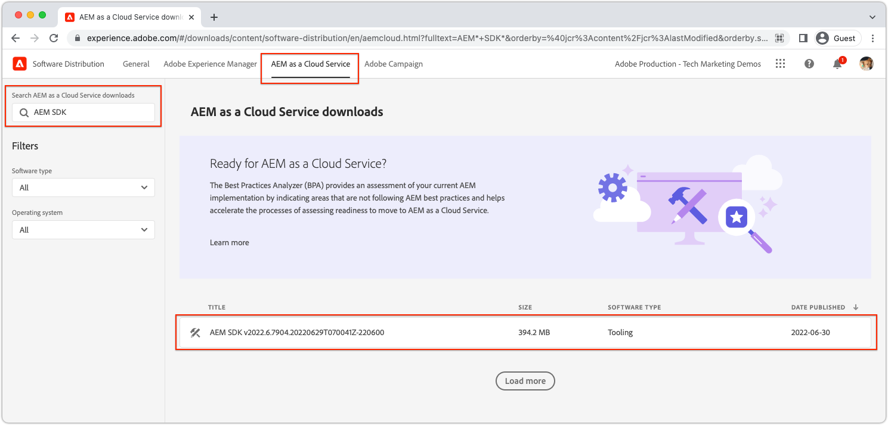

# AEM Headless-konfiguration med det lokala AEM SDK {#setup}

Med snabbinstallationen AEM Headless får du tillgång till AEM Headless med innehåll från exempelprojektet WKND Site, och ett exempel på React App (SPA) som förbrukar innehållet i AEM Headless GraphQL API:er. Den här guiden använder [AEM as a Cloud Service SDK](https://experienceleague.adobe.com/docs/experience-manager-cloud-service/content/implementing/developing/aem-as-a-cloud-service-sdk.html).

## Förutsättningar {#prerequisites}

Följande verktyg bör installeras lokalt:

* [JDK 11](https://experience.adobe.com/#/downloads/content/software-distribution/en/general.html?1_group.propertyvalues.property=.%2Fjcr%3Acontent%2Fmetadata%2FDc%3AsoftwareType&amp;1_group.propertyvalues.operation=equals&amp;1_group.propertyvalues.0_values=software-type%3Atooling&amp;fulltext=Oracle%7E+JDK%7E+11%7E&amp;orderby=%40jcr%3Acontent%2FDK jcr%3AlastModified&amp;orderby.sort=desc&amp;layout=list&amp;p.offset=0&amp;p.limit=14)
* [Node.js v18](https://nodejs.org/en/)
* [Git](https://git-scm.com/)

## 1. Installera AEM SDK {#aem-sdk}

Den här inställningen använder [AEM as a Cloud Service SDK](https://experienceleague.adobe.com/docs/experience-manager-cloud-service/implementing/developing/aem-as-a-cloud-service-sdk.html?#aem-as-a-cloud-service-sdk) för att utforska AEM GraphQL API:er. I det här avsnittet finns en snabbguide till hur du installerar AEM SDK och kör det i redigeringsläge. En mer detaljerad guide för hur du konfigurerar en lokal utvecklingsmiljö [finns här](https://experienceleague.adobe.com/docs/experience-manager-learn/cloud-service/local-development-environment-set-up/overview.html#local-development-environment-set-up).

>[!NOTE]
>
> Du kan också följa självstudiekursen med [AEM as a Cloud Service miljö](./cloud-service.md). Ytterligare information om hur du använder en molnmiljö finns i självstudiekursen.

1. Navigera till **[Programdistributionsportal](https://experience.adobe.com/#/downloads/content/software-distribution/en/aemcloud.html?fulltext=AEM*+SDK*&amp;orderby=%40jcr%3Acontent%2Fjcr%3AlastModified&amp;orderby.sort=desc&amp;layout=list&amp;p.offset=0&amp;p.limit=1)** > **AEM as a Cloud Service** och ladda ned den senaste versionen av **AEM SDK**.

   

1. Zippa upp nedladdningen och kopiera Quickstart jar (`aem-sdk-quickstart-XXX.jar`) till en dedikerad mapp, dvs. `~/aem-sdk/author`.
1. Byt namn på filen jar till `aem-author-p4502.jar`.

   The `author` name anger att QuickStart jar startar i redigeringsläge. The `p4502` Anger att QuickStart körs på port 4502.

1. Om du vill installera och starta AEM öppnar du kommandotolken i mappen som innehåller jar-filen och kör följande kommando:

   ```shell
   $ cd ~/aem-sdk/author
   $ java -jar aem-author-p4502.jar
   ```

1. Ange ett administratörslösenord som `admin`. Alla administratörslösenord godkänns, men du bör använda dem `admin` för lokal utveckling för att minska behovet av att omkonfigurera.
1. När AEM har installerat klart öppnas ett nytt webbläsarfönster i [http://localhost:4502](http://localhost:4502).
1. Logga in med användarnamnet `admin` och lösenordet som valdes under AEM starten (vanligtvis `admin`).

## 2. Installera exempelinnehåll {#install-sample-content}

Exempelinnehåll från **WKND-referensplats** används för att snabba upp självstudiekursen. WKND är ett fiktivt vardagsmärke som ofta används med AEM utbildning.

WKND-webbplatsen innehåller konfigurationer som krävs för att visa en [GraphQL slutpunkt](https://experienceleague.adobe.com/docs/experience-manager-cloud-service/content/headless/graphql-api/content-fragments.html). I en implementering i verkligheten följer du de dokumenterade stegen för att [inkludera GraphQL slutpunkter](https://experienceleague.adobe.com/docs/experience-manager-cloud-service/content/headless/graphql-api/content-fragments.html) i kundprojektet. A [CORS](#cors-config) har också paketerats som en del av WKND-platsen. En CORS-konfiguration krävs för att ge åtkomst till ett externt program, mer information om [CORS](#cors-config) finns nedan.

1. Ladda ned det senaste kompilerade AEM-paketet för WKND-webbplatsen: [aem-guides-wknd.all-x.x.x.zip](https://github.com/adobe/aem-guides-wknd/releases/latest).

   >[!NOTE]
   >
   > Glöm inte att hämta standardversionen som är kompatibel med AEM as a Cloud Service och **not** den `classic` version.

1. Från **AEM** meny, navigera till **verktyg** > **Distribution** > **Paket**.

   

1. Klicka **Överför paket** och väljer det WKND-paket som hämtades i föregående steg. Klicka **Installera** för att installera paketet.

1. Från **AEM** meny, navigera till **Resurser** > **Filer** > **WKND delad** > **Engelska** > **Annonser**.

   

   Det här är en mapp med alla resurser som består av de olika annonser som WKND-varumärket främjar. Detta inkluderar traditionella medietyper som bilder och video och media som är specifika för AEM som **Innehållsfragment**.

1. Klicka på **Nedförsbacke Skiing Wyoming** och klickar på **Nedförsbacke Skiing Wyoming Content Fragment** kort:

   

1. Redigeraren för innehållsfragment öppnas för Hoing Wyoming-äventyret.

   

   Observera att olika fält som **Titel**, **Beskrivning** och **Aktivitet** Definiera fragmentet.

   **Innehållsfragment** är ett av sätten att hantera innehåll i AEM. Innehållsfragment är återanvändbart, presentationsbaserat innehåll som består av strukturerade dataelement som text, formaterad text, datum eller referenser till andra innehållsfragment. Innehållsfragment utforskas i detalj senare i snabbinställningarna.

1. Klicka **Avbryt** för att stänga fragmentet. Du kan navigera i några andra mappar och utforska det andra innehållet i Adventure.

>[!NOTE]
>
> Om du använder en Cloud Service-miljö läser du dokumentationen om hur du [distribuera en kodbas som WKND Reference-webbplatsen till en Cloud Service-miljö](https://experienceleague.adobe.com/docs/experience-manager-cloud-service/implementing/deploying/overview.html#coding-against-the-right-aem-version).

## 3. Ladda ned och kör appen WKND React {#sample-app}

Ett av målen med den här självstudiekursen är att visa hur du använder AEM innehåll från ett externt program med GraphQL API:er. I den här självstudiekursen används ett exempel på React App (Reagera-app). Reaktionsappen är avsiktligt enkel att fokusera på integreringen med AEM GraphQL API:er.

1. Öppna en ny kommandotolk och klona exempelappen React från GitHub:

   ```shell
   $ git clone git@github.com:adobe/aem-guides-wknd-graphql.git
   $ cd aem-guides-wknd-graphql/react-app
   ```

1. Öppna appen React i `aem-guides-wknd-graphql/react-app` i den utvecklingsmiljö du föredrar.
1. Öppna filen i IDE `.env.development` på `/.env.development`. Verifiera `REACT_APP_AUTHORIZATION` raden är okommenterad och filen deklarerar följande variabler:

   ```plain
   REACT_APP_HOST_URI=http://localhost:4502
   REACT_APP_GRAPHQL_ENDPOINT=/content/graphql/global/endpoint.json
   # Use Authorization when connecting to an AEM Author environment
   REACT_APP_AUTHORIZATION=admin:admin
   ```

   Säkerställ `REACT_APP_HOST_URI` pekar på ditt lokala AEM SDK. Den här snabbstarten kopplar appen React till  **AEM**. **Upphovsman** tjänsterna kräver autentisering, så appen använder `admin` användare för att upprätta anslutningen. Att koppla en app till AEM Author är vanligt under utvecklingen eftersom det gör det enklare att snabbt iterera i innehållet utan att behöva publicera ändringar.

   >[!NOTE]
   >
   > I ett produktionsscenario ansluter appen till en AEM **Publicera** miljö. Detta beskrivs mer ingående i _Produktionsdistribution_ -avsnitt.


1. Installera och starta React-appen:

   ```shell
   $ cd aem-guides-wknd-graphql/react-app
   $ npm install
   $ npm start
   ```

1. Ett nytt webbläsarfönster öppnas automatiskt i [http://localhost:3000](http://localhost:3000).

   

   En lista över äventyret från AEM visas.

1. Klicka på en av äventyrsbilderna för att visa äventyrsdetaljer. En begäran görs om att AEM ska returnera detaljerna för ett äventyr.

   

1. Använd webbläsarens utvecklarverktyg för att inspektera **Nätverk** förfrågningar. Visa **XHR** begär och observera flera GETTER `/graphql/execute.json/...`. Det här sökvägsprefixet anropar AEM beständiga frågeslutpunkten och väljer den beständiga frågan som ska köras med namnet och de kodade parametrarna efter prefixet.

   

## 4. Redigera innehåll i AEM

När React-appen är igång uppdaterar du innehållet i AEM och ser att ändringen återspeglas i appen.

1. Navigera till AEM [http://localhost:4502](http://localhost:4502).
1. Navigera till **Resurser** > **Filer** > **WKND delad** > **Engelska** > **Annonser** > **[Bali Surf Camp](http://localhost:4502/assets.html/content/dam/wknd-shared/en/adventures/bali-surf-camp)**.

   

1. Klicka på **Bali Surf Camp** innehållsfragment för att öppna redigeraren för innehållsfragment.
1. Ändra **Titel** och **Beskrivning** av äventyret.

   

1. Klicka **Spara** för att spara ändringarna.
1. Uppdatera React-appen på [http://localhost:3000](http://localhost:3000) för att se ändringarna:

   

## 5. Utforska GraphiQL {#graphiql}

1. Öppna [GraphiQL](http://localhost:4502/aem/graphiql.html) genom att navigera till **verktyg** > **Allmänt** > **GraphQL Query Editor**
1. Välj befintliga beständiga frågor till vänster och kör dem för att se resultatet.

   >[!NOTE]
   >
   > Verktyget GraphiQL och GraphQL API är [utforskad i detalj senare i självstudiekursen](../multi-step/explore-graphql-api.md).

## Grattis!{#congratulations}

Grattis, du har nu ett externt program som AEM innehåll med GraphQL. Du kan granska koden i React-appen och fortsätta experimentera med att ändra befintliga innehållsfragment.

### Nästa steg

* [Starta självstudiekursen AEM Headless](../multi-step/overview.md)
