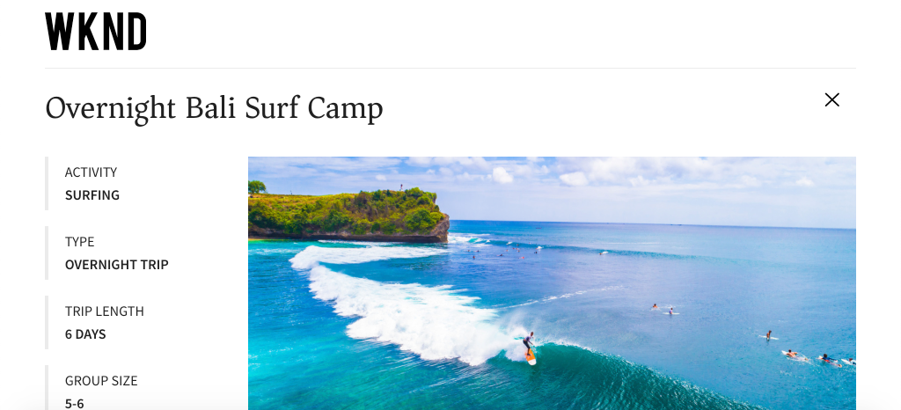

# Snabbinstallation av AEM Headless med AEM SDK {#setup}

Med snabbinstallationen AEM Headless får du tillgång till AEM Headless med hjälp av innehåll från exempelprojektet WKND Site, och ett exempel på en React App (SPA) som förbrukar innehållet i AEM Headless GraphQL API:er. Den här guiden använder [AEM as a Cloud Service SDK](https://experienceleague.adobe.com/docs/experience-manager-cloud-service/content/implementing/developing/aem-as-a-cloud-service-sdk.html?lang=sv-SE).

## Förutsättningar {#prerequisites}

Följande verktyg bör installeras lokalt:

* [JDK 11](https://experience.adobe.com/#/downloads/content/software-distribution/en/general.html?1_group.propertyvalues.property=.%2Fjcr%3Acontent%2Fmetadata%2FDc%3AsoftwareType&amp;1_group.propertyvalues.operation=equals&amp;1_group.propertyvalues.0_values=software-type%3Atooling&amp;fulltext=Oracle%7E+JDK%7E+11%7E&amp;orderby=%40jcr%3Acontent%2Fjcr cr%3AlastModified&amp;orderby.sort=desc&amp;layout=list&amp;p.offset=0&amp;p.limit=14)
* [Node.js v18](https://nodejs.org/en/)
* [Git](https://git-scm.com/)

## 1. Installera AEM SDK {#aem-sdk}

I den här konfigurationen används [AEM as a Cloud Service SDK](https://experienceleague.adobe.com/docs/experience-manager-cloud-service/implementing/developing/aem-as-a-cloud-service-sdk.html?lang=sv-SE&#aem-as-a-cloud-service-sdk) för att utforska AEM GraphQL API:er. I det här avsnittet finns en snabbguide till hur du installerar AEM SDK och kör det i redigeringsläge. En mer detaljerad guide för hur du konfigurerar en lokal utvecklingsmiljö [finns här](https://experienceleague.adobe.com/docs/experience-manager-learn/cloud-service/local-development-environment-set-up/overview.html?lang=sv-SE#local-development-environment-set-up).

>[!NOTE]
>
> Du kan också följa självstudiekursen med en [AEM as a Cloud Service-miljö](./cloud-service.md). Ytterligare information om hur du använder en molnmiljö finns i självstudiekursen.

1. Gå till **[portalen för programvarudistribution](https://experience.adobe.com/#/downloads/content/software-distribution/en/aemcloud.html?fulltext=AEM*+SDK*&amp;orderby=%40jcr%3Acontent%2Fjcr%3AlastModified&amp;orderby.sort=desc&amp;layout=list&amp;p.offset=0&amp;p.limit=1)** > **AEM as a Cloud Service** och hämta den senaste versionen av **AEM SDK**.

   

1. Zippa upp hämtningen och kopiera Quickstart jar (`aem-sdk-quickstart-XXX.jar`) till en dedikerad mapp, dvs. `~/aem-sdk/author`.
1. Byt namn på filen jar till `aem-author-p4502.jar`.

   Namnet `author` anger att QuickStart jar startar i redigeringsläge. `p4502` anger att QuickStart körs på port 4502.

1. Om du vill installera och starta AEM-instansen öppnar du en kommandotolk i den mapp som innehåller jar-filen och kör följande kommando:

   ```shell
   $ cd ~/aem-sdk/author
   $ java -jar aem-author-p4502.jar
   ```

1. Ange ett administratörslösenord som `admin`. Ett administratörslösenord accepteras, men du bör använda `admin` för lokal utveckling för att minska behovet av att konfigurera om.
1. När AEM-tjänsten har installerats klart öppnas ett nytt webbläsarfönster på [http://localhost:4502](http://localhost:4502).
1. Logga in med användarnamnet `admin` och lösenordet som valts under AEM första start (vanligtvis `admin`).

## 2. Installera exempelinnehåll {#install-sample-content}

Exempelinnehåll från **WKND-referenswebbplatsen** används för att snabba upp självstudiekursen. WKND är ett fiktivt vardagsmärke som ofta används med AEM utbildning.

WKND-webbplatsen innehåller konfigurationer som krävs för att visa en [GraphQL-slutpunkt](https://experienceleague.adobe.com/docs/experience-manager-cloud-service/content/headless/graphql-api/content-fragments.html?lang=sv-SE). I en implementering i verkligheten följer du de dokumenterade stegen för att [inkludera GraphQL-slutpunkterna](https://experienceleague.adobe.com/docs/experience-manager-cloud-service/content/headless/graphql-api/content-fragments.html?lang=sv-SE) i ditt kundprojekt. En [CORS](#cors-config) har också paketerats som en del av WKND-platsen. En CORS-konfiguration krävs för att ge åtkomst till ett externt program. Mer information om [CORS](#cors-config) finns nedan.

1. Hämta det senaste kompilerade AEM-paketet för WKND-webbplatsen: [aem-guides-wknd.all-x.x.zip](https://github.com/adobe/aem-guides-wknd/releases/latest).

   >[!NOTE]
   >
   > Se till att hämta standardversionen som är kompatibel med AEM as a Cloud Service och **inte** `classic` -versionen.

1. Gå till **Verktyg** > **Distribution** > **Paket** på Start **AEM** -menyn.

   

1. Klicka på **Överför paket** och välj det WKND-paket som hämtades i det föregående steget. Klicka på **Installera** för att installera paketet.

1. Gå till **Assets** > **Filer** > **WKND delad** > **Engelska** > **Anteckningar** på menyn **AEM Start**.

   

   Det här är en mapp med alla resurser som består av de olika annonser som WKND-varumärket främjar. Detta omfattar traditionella medietyper som bilder och video och media som är specifika för AEM, t.ex. **Innehållsfragment**.

1. Klicka på mappen **Skiing Wyoming** nedåt och klicka på **Skiing Wyoming Content Fragment** -kortet:

   

1. Redigeraren för innehållsfragment öppnas för Hoing Wyoming-äventyret.

   

   Observera att olika fält som **Title**, **Description** och **Activity** definierar fragmentet.

   **Innehållsfragment** är ett sätt att hantera innehåll i AEM. Innehållsfragment är återanvändbart, presentationsbaserat innehåll som består av strukturerade dataelement som text, formaterad text, datum eller referenser till andra innehållsfragment. Innehållsfragment utforskas i detalj senare i snabbinställningarna.

1. Klicka på **Avbryt** för att stänga fragmentet. Du kan navigera i några andra mappar och utforska det andra innehållet i Adventure.

>[!NOTE]
>
> Om du använder en Cloud Service-miljö kan du läsa i dokumentationen om hur du [distribuerar en kodbas som WKND Reference-webbplatsen till en Cloud Service-miljö](https://experienceleague.adobe.com/docs/experience-manager-cloud-service/implementing/deploying/overview.html?lang=sv-SE#coding-against-the-right-aem-version).

## 3. Ladda ned och kör appen WKND React {#sample-app}

Ett av målen med den här självstudiekursen är att visa hur du använder AEM-innehåll från ett externt program med GraphQL API:er. I den här självstudiekursen används ett exempel på React App (Reagera-app). React-appen är avsiktligt enkel att fokusera på integrationen med AEM GraphQL API:er.

1. Öppna en ny kommandotolk och klona exempelappen React från GitHub:

   ```shell
   $ git clone git@github.com:adobe/aem-guides-wknd-graphql.git
   $ cd aem-guides-wknd-graphql/react-app
   ```

1. Öppna appen React i `aem-guides-wknd-graphql/react-app` i den utvecklingsmiljö du vill använda.
1. Öppna filen `.env.development` vid `/.env.development` i IDE. Kontrollera att raden `REACT_APP_AUTHORIZATION` inte är kommenterad och att filen deklarerar följande variabler:

   ```plain
   REACT_APP_HOST_URI=http://localhost:4502
   REACT_APP_GRAPHQL_ENDPOINT=/content/graphql/global/endpoint.json
   # Use Authorization when connecting to an AEM Author environment
   REACT_APP_AUTHORIZATION=admin:admin
   ```

   Se till att `REACT_APP_HOST_URI` pekar på din lokala AEM SDK. Den här snabbstarten ansluter appen React till **AEM Author**. **Författartjänster** kräver autentisering, så appen använder `admin`-användaren för att upprätta anslutningen. Att ansluta en app till AEM Author är vanligt under utvecklingen eftersom det gör det enkelt att snabbt upprepa innehållet utan att behöva publicera ändringar.

   >[!NOTE]
   >
   > I ett produktionsscenario ansluter appen till en AEM **Publish** -miljö. Detta beskrivs mer ingående i avsnittet _Produktionsdistribution_.


1. Installera och starta React-appen:

   ```shell
   $ cd aem-guides-wknd-graphql/react-app
   $ npm install
   $ npm start
   ```

1. Appen öppnas automatiskt i ett nytt webbläsarfönster på [http://localhost:3000](http://localhost:3000).

   

   En lista över äventyret från AEM visas.

1. Klicka på en av äventyrsbilderna för att visa äventyrsdetaljer. AEM uppmanas att returnera detaljerna för ett äventyr.

   

1. Använd webbläsarens utvecklingsverktyg för att inspektera **nätverkets**-begäranden. Visa **XHR**-begäranden och observera flera GET-begäranden till `/graphql/execute.json/...`. Detta sökvägsprefix anropar AEM beständiga frågeslutpunkt och väljer den beständiga fråga som ska köras med namnet och de kodade parametrarna efter prefixet.

   

## 4. Redigera innehåll i AEM

När React-appen är igång uppdaterar du innehållet i AEM och ser att ändringen återspeglas i appen.

1. Gå till AEM [http://localhost:4502](http://localhost:4502).
1. Navigera till **Assets** > **Filer** > **WKND delad** > **Engelska** > **Anteckningar** > **[Bali Surf Camp](http://localhost:4502/assets.html/content/dam/wknd-shared/en/adventures/bali-surf-camp)**.

   

1. Klicka på innehållsfragmentet **Bali Surf Camp** för att öppna innehållsfragmentredigeraren.
1. Ändra **titeln** och **beskrivningen** för äventyret.

   

1. Klicka på **Spara** för att spara ändringarna.
1. Uppdatera React-appen på [http://localhost:3000](http://localhost:3000) för att se dina ändringar:

   

## 5. Utforska GraphiQL {#graphiql}

1. Öppna [GraphiQL](http://localhost:4502/aem/graphiql.html) genom att gå till **Verktyg** > **Allmänt** > **GraphQL Query Editor**
1. Välj befintliga beständiga frågor till vänster och kör dem för att se resultatet.

   >[!NOTE]
   >
   > Verktyget GraphiQL och GraphQL API har [utforskats i detalj senare i självstudiekursen](../multi-step/explore-graphql-api.md).

## Grattis!{#congratulations}

Gratulerar, du har nu ett externt program som använder AEM-innehåll med GraphQL. Du kan granska koden i React-appen och fortsätta experimentera med att ändra befintliga innehållsfragment.

### Nästa steg

* [Starta självstudiekursen AEM Headless](../multi-step/overview.md)
