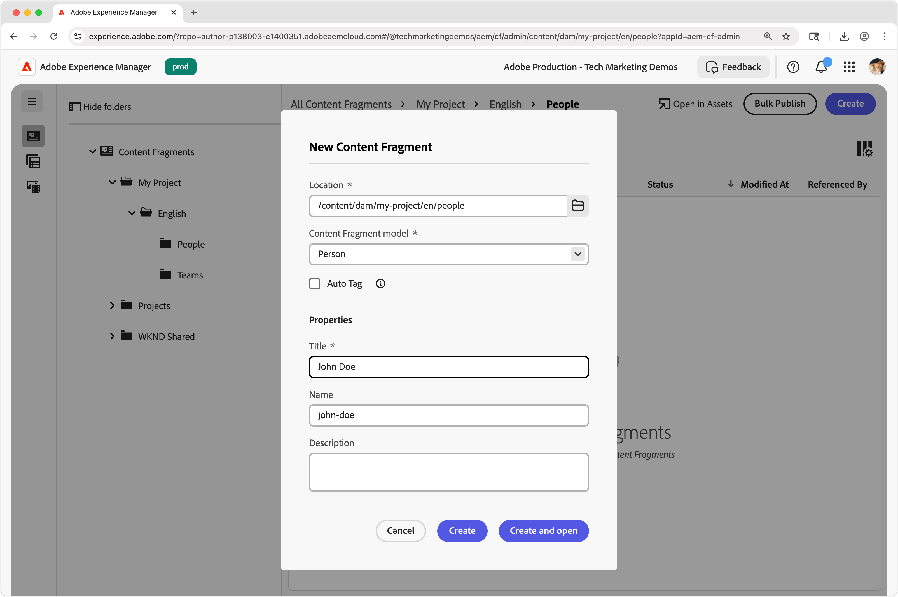
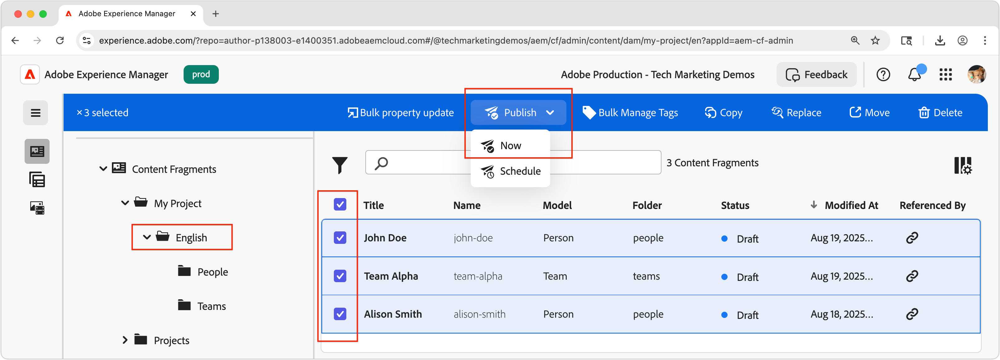

# Skapa innehållsfragment

I det här kapitlet skapar och redigerar du nya innehållsfragment baserat på [Team- och Person Content Fragment-modellerna](./1-content-fragment-models.md). Dessa innehållsfragment är det innehåll som används av React-appen med AEM Content Fragment Delivery med OpenAPI-API:er.

## Förutsättningar

Det här är en självstudiekurs i flera delar och det antas att stegen som beskrivs i [Definiera modeller för innehållsfragment](./1-content-fragment-models.md) har slutförts.

## Mål

* Skapa ett innehållsfragment baserat på en innehållsfragmentmodell.
* Skapa ett innehållsfragment.
* Publicera ett innehållsfragment.

## Skapa resursmappar för innehållsfragment

Innehållsfragment lagras i mappar i AEM Assets. Om du vill skapa innehållsfragment från de modeller för innehållsfragment som skapades i föregående kapitel måste det finnas en mapp där de kan lagras. Mappen måste konfigureras för att det ska gå att skapa innehållsfragment från specifika modeller för innehållsfragment.

AEM har stöd för&quot;platt&quot; mapphantering, vilket innebär att innehållsfragment i olika modeller för innehållsfragment blandas i en enda mapp. I den här självstudiekursen används dock en mappstruktur som är anpassad efter modellen för innehållsfragment delvis för att utforska **List all Content Fragments by folder** API i [next-kapitlet](./3-explore-openapis.md) . När du avgör hur ditt innehållsfragment är organiserat bör du tänka på både hur du vill skapa och hantera dina innehållsfragment samt hur du levererar och använder dem via AEM Content Fragment Delivery med OpenAPI:er.

1. På startskärmen i AEM går du till **Assets** > **Filer**.
1. Välj **Skapa** i det övre högra hörnet och välj **Mapp**. Ange:

   * Titel: **Mitt projekt**
   * Namn: **mitt projekt**

   Välj **Skapa** för att skapa mappen.

1. Öppna den nya mappen **Mitt projekt** och skapa en undermapp i den nya mappen **Mitt projekt** med följande värden:

   * Titel: **Engelska**
   * Namn: **en**

   En rotspråksmapp skapas för att placera projektet så att det stöder AEM inbyggda lokaliseringsfunktioner. Ett tips är att skapa projekt för flerspråkig support, även om du inte behöver lokalisering idag. Se [följande dokumentsida för mer information](https://experienceleague.adobe.com/docs/experience-manager-cloud-service/content/assets/admin/translate-assets.html?lang=sv-SE).

1. Skapa två undermappar under den nya mappen **Mitt projekt > Engelska** med följande värden:

   En `teams`-mapp som innehåller **Team**-innehållsfragment

   * Titel: **Team**
   * Namn: **team**

   ... och en `people`-mapp som innehåller innehållsavsnitten **Person**.

   * Titel: **Personer**
   * Namn: **personer**

1. Gå tillbaka till mappen **Mitt projekt > Engelska** och kontrollera att de två nya mapparna skapas.
1. Markera mappen **Team** och välj **Egenskaper** i det övre åtgärdsfältet.
1. Välj fliken **Profiler** och avmarkera **Ärvd från`/content/dam/my-project`**.
1. På fliken **Profiler** väljer du **Team** Content Fragment Model (Innehållsfragmentmodell) i fältet **Tillåtna innehållsfragmentmodeller per sökväg**.

   

   Dessa profiler ärvs automatiskt av undermappar, men kan åsidosättas. Modeller för innehållsfragment kan tillåtas av taggar eller aktivera modeller för innehållsfragment från andra projektkonfigurationer. Den här mekanismen är ett kraftfullt sätt att hantera innehållshierarkin.

1. Välj **Spara och stäng** om du vill spara ändringarna i mappegenskaperna.
1. Uppdatera **profiler** för mappen **Personer** på samma sätt, men välj i stället **Person** Content Fragment Model.

## Skapa ett personinnehållsfragment

Skapa innehållsfragment baserat på innehållsfragmentmodellen **Person** i mappen **Mitt projekt > Engelska > Personer** .

1. På startskärmen i AEM väljer du **Innehållsfragment** för att öppna konsolen Innehållsfragment.
1. Välj knappen **Visa mapp** för att öppna mappens webbläsare.
1. Välj mappen **Mitt projekt > Engelska > Personer**.
1. Välj **Skapa > Innehållsfragment** och ange följande värden:

   * Plats: `/content/dam/my-project/en/people`
   * Modell för innehållsfragment: **Person**
   * Titel: **John Doe**
   * Namn: `john-doe`

   Tänk på att fälten **Rubrik**, **Namn** och **Beskrivning** i dialogrutan **Nytt innehållsfragment** lagras som metadata om innehållsfragmentet, och inte som en del av informationen i innehållsfragmentet.

   

1. Välj **Skapa och öppna**.
1. Fyll i fälten för fragmentet **John Doe**:

   * Fullständigt namn: **John Doe**
   * Biografi: **John Doe älskar sociala medier och en resemittjatör.**
   * Profilbild: Välj en bild från `/content/dam` eller överför en ny.
   * Yrke: **Påverkar**, **Resande**

   Dessa fält och värden definierar innehållet i innehållsfragmentet som ska användas via AEM Content Fragment Delivery med OpenAPI:er.

   

1. Ändringar av innehållsfragment sparas automatiskt, så det finns ingen **Spara**-knapp.
1. Gå tillbaka till konsolen Innehållsfragment och välj **Mitt projekt > Engelska > Person** för att visa ditt nya innehållsomfång.

### Skapa ytterligare personinnehållsfragment

Upprepa stegen ovan om du vill skapa ytterligare **Person**-fragment.

1. Skapa ett personinnehållsfragment för **Alison Smith** med följande egenskaper:

   * Plats: `/content/dam/my-project/en/people`
   * Modell för innehållsfragment: **Person**
   * Titel: **Alison Smith**
   * Namn: `alison-smith`

   Välj **Skapa och öppna** och författaren till följande värden:

   * Fullständigt namn: **Alison Smith**
   * Biografi: **Alison är fotograf och älskar att skriva om sina resor.**
   * Profilbild: Välj en bild från `/content/dam` eller överför en ny.
   * Yrke: **Fotograf**, **Resa**, **Författare**.

Nu bör du ha två innehållsfragment i mappen **Mitt projekt > Engelska > Personer** :

Om du vill kan du göra några fler personinnehållsfragment för att representera ytterligare personer.

## Skapa ett teaminnehållsfragment

Skapa ett **Team**-fragment baserat på innehållsfragmentmodellen **Team** i mappen **Mitt projekt > Engelska > Team** på samma sätt.

1. Skapa ett **Team**-fragment som representerar **Team Alpha** med följande egenskaper:

   * Plats: `/content/dam/my-project/en`
   * Innehållsfragmentmodell: **Team**
   * Titel: **Team Alpha**
   * Namn: `team-alpha`

   Välj **Skapa och öppna** och författaren till följande värden:

   * Titel: **Team Alpha**
   * Beskrivning: **Team Alpha är ett team för reseinnehåll som specialiserar sig på fotografi och reseskrivande.**
   * **Teammedlemmar**: Markera **John Doe** och **Alison Smith** innehållsfragment för att fylla i fältet **Teammedlemmar**.

   

1. Välj **Skapa och öppna** för att skapa teaminnehållsfragmentet
1. Det ska finnas ett innehållsfragment under **Mitt projekt > Engelska > Team**:

Nu bör du ha ett **Alpha**-innehållsfragment för team i mappen **Mitt projekt > engelska > team** :

Du kan också skapa en **Team Omega** med en annan uppsättning personer.

## Publicera innehållsfragment

Publicera innehållsfragment om du vill göra dem tillgängliga via OpenAPI:er. Med publicering kan du komma åt innehållsfragment via:

* **Publiceringstjänsten** - skickar innehåll till produktionsprogram
* **Förhandsgranskningstjänsten** - visar innehåll för förhandsgranskning av program

Normalt publiceras innehåll först till **förhandsgranskningstjänsten** och granskas i ett förhandsgranskningsprogram innan det publiceras till **publiceringstjänsten**. Publicering till **publiceringstjänsten** publicerar inte heller till **förhandsgranskningstjänsten**. Du måste publicera till **förhandsgranskningstjänsten** separat.

I den här självstudiekursen publicerar vi till tjänsten AEM Publish, men det är lika enkelt att använda tjänsten AEM Preview som att ändra [AEM-tjänstens URL i React-appen](./4-react-app.md)

1. På konsolen Innehållsfragment letar du reda på mappen **Mitt projekt > Engelska**.
1. Markera alla innehållsfragment i mappen **Engelska** - som visar alla innehållsfragment i alla undermappar - och välj **Publicera > Nu** i det övre åtgärdsfältet.

   

1. Välj **Publiceringstjänsten**, under **Inkludera alla referenser**, markera **Opublicerad** och **Ändrad** och välj **Publicera**.

   

Nu publiceras innehållsfragmenten, och alla personinnehållsfragment som refereras av Team Content Fragments, och alla refererade resurser, till **publiceringstjänsten**.

Du kan publicera till **förhandsgranskningstjänsten** på samma sätt.

## Grattis!

Du har skapat innehållsfragment som baseras på modeller för innehållsfragment i AEM. Du skapade en **person**-innehållsfragmentmodell, skapade flera **person**-innehållsfragment och skapade ett **Team**-innehållsfragment som refererar till flera **person**-innehållsfragment.

Med Content Fragments publicerat kan du nu komma åt dem via AEM Content Fragment Delivery med OpenAPI:er.

## Nästa steg

I nästa kapitel, [Utforska OpenAPI:er](3-explore-openapis.md), utforskar du AEM Content Fragment Delivery med OpenAPI-API:er med funktionen **Try** som är inbyggd i API-dokumentationen.

