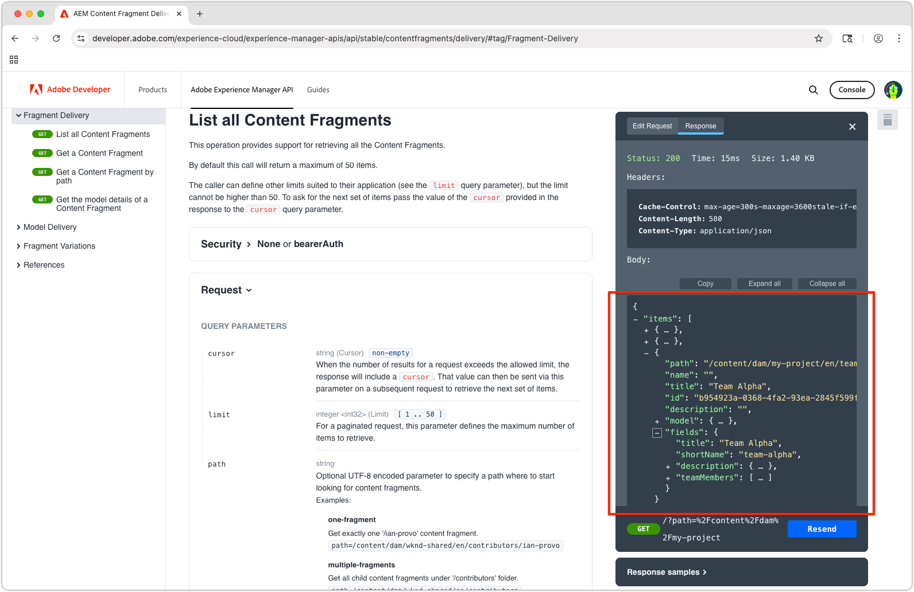

# Utforska AEM OpenAPI-baserade Content Fragment Delivery APIs

[AEM Content Fragment Delivery med OpenAPI-API:er](https://developer.adobe.com/experience-cloud/experience-manager-apis/api/stable/contentfragments/delivery/) i AEM är ett kraftfullt sätt att leverera strukturerat innehåll till alla program och kanaler. I det här kapitlet utforskar vi hur du använder OpenAPI:er för att hämta innehållsfragment via dokumentationens **Try** -funktion.

## Förutsättningar {#prerequisites}

Det här är en självstudiekurs i flera delar där stegen som beskrivs i [Skapa innehållsfragment](./2-author-content-fragments.md) har slutförts.

Se till att du har följande:

* Värdnamnet för AEM Publish-tjänsten (t.ex. `https://publish-<PROGRAM_ID>-e<ENVIRONMENT_ID >.adobeaemcloud.com/`) som [innehållsfragment publiceras till ](./2-author-content-fragments.md#publish-content-fragments). Om du publicerar en AEM Preview-tjänst ska värdnamnet vara tillgängligt (t.ex. `https://preview-<PROGRAM_ID>-e<ENVIRONMENT_ID>.adobeaemcloud.com/`).

## Mål {#objectives}

* Bekanta dig med [AEM Content Fragment Delivery med OpenAPI-API:er](https://developer.adobe.com/experience-cloud/experience-manager-apis/api/stable/contentfragments/delivery/).
* Anropa API:erna med API-dokumentfunktionen **Prova**.

## Leverans-API:er

AEM Content Fragment Delivery med OpenAPI API:er har ett RESTful-gränssnitt för att hämta innehållsfragment. De API:er som beskrivs i den här självstudiekursen är bara tillgängliga för AEM Publish- och Preview-tjänster, och inte för Author-tjänsten. Det finns andra OpenAPI:er för [interaktion med innehållsfragment i AEM Author-tjänsten](https://developer.adobe.com/experience-cloud/experience-manager-apis/api/stable/sites/).

## Utforska API:erna

[AEM Content Fragment Delivery with OpenAPIs documentation](https://developer.adobe.com/experience-cloud/experience-manager-apis/api/stable/contentfragments/delivery/) har en Try it-funktion som gör att du kan utforska API:erna och testa dem direkt från webbläsaren. Detta är ett bra sätt att bekanta sig med API-slutpunkterna och deras funktioner.

Öppna [AEM Sites API-dokumenten](https://developer.adobe.com/experience-cloud/experience-manager-apis/api/stable/contentfragments/delivery/) i webbläsaren.

API:erna listas i den vänstra navigeringen under avsnittet **Fragmentleverans**. Du kan expandera det här avsnittet för att se tillgängliga API:er. Om du väljer ett API visas API-informationen på huvudpanelen och ett **Try it** -avsnitt till höger där du kan testa och utforska API:t direkt från webbläsaren.


## Visa innehållsfragment

1. Öppna [AEM Content Fragment Delivery med OpenAPI-utvecklardokument](https://developer.adobe.com/experience-cloud/experience-manager-apis/api/stable/contentfragments/delivery/) i webbläsaren.
1. I den vänstra navigeringen expanderar du avsnittet **Fragmentleverans** och väljer **Visa alla innehållsfragment** API

Med detta API kan du hämta en sidnumrerad lista över alla innehållsfragment från AEM per mapp. Det enklaste sättet att använda detta API är att ange sökvägen till mappen som innehåller innehållsfragmenten.

1. Välj **Prova** längst upp på den högra listen.
1. Ange identifieraren för den AEM-tjänst som API:t ska ansluta till för att hämta innehållsfragment. Bucket är den första delen av AEM Publish (eller Preview)-tjänstens URL, vanligtvis i formatet: `publish-p<PROGRAM_ID>-e<ENVIRONMENT_ID>` eller `preview-p<PROGRAM_ID>-e<ENVIRONMENT_ID>`.

Eftersom vi använder AEM Publish-tjänsten anger du AEMS ID för publiceringstjänsten. Till exempel:

* **bucket**: `publish-p138003-e1400351`


När bucket är inställt uppdateras fältet **Målserver** automatiskt till AEM Publish-tjänstens fullständiga API-URL, till exempel: `https://publish-p138003-e1400351.adobeaemcloud.com/adobe/contentFragments`

1. Expandera avsnittet **Dokumentskydd** och ange **Säkerhetsschema** till **Inget**. Detta beror på att tjänsten AEM Publish (och förhandsgranskningstjänsten) inte kräver autentisering för AEM Content Fragment Delivery med OpenAPI-API:er.

1. Expandera avsnittet **Parametrar** för att ange information om det innehållsfragment som ska hämtas.

* **markör**: Lämna tomt, det här används för sidnumrering och det här är en inledande begäran.
* **gräns**: Lämna tomt, det här används för att begränsa antalet resultat som returneras per resultatsida.
* **sökväg**: `/content/dam/my-project/en`

  >[!TIP]
  > När du anger en bana ska du kontrollera att dess prefix är `/content/dam/` och **inte** avslutas med ett avslutande snedstreck `/`.

  

1. Välj knappen **Skicka** för att köra API-anropet.
1. På fliken **Svar** på panelen **Prova** bör du se ett JSON-svar som innehåller en lista med innehållsfragment i den angivna mappen. Svaret ser ut ungefär så här:

   

1. Svaret innehåller alla innehållsfragment under `path`-parameterns `/content/dam/my-project`-mapp, inklusive undermappar, inklusive både **Person** och **Team** Content Fragments.
1. Klicka igenom `items`-arrayen och hitta `Team Alpha`-objektets `id`-värde. ID:t används i nästa avsnitt för att hämta information om enskilda innehållsfragment.
1. Välj **Redigera begäran** längst upp på panelen **Prova** och de olika parametrarna i API-anropet för att se hur svaret ändras. Du kan till exempel ändra sökvägen till en annan mapp som innehåller innehållsfragment, eller lägga till frågeparametrar för att filtrera resultatet. Ändra till exempel parametern `path` till `/content/dam/my-project/teams` så att den bara innehåller innehållsfragment i den mappen (och undermappar).

## Hämta information om innehållsfragment

På samma sätt som API:t **Visa alla innehållsfragment** hämtar API:t **Hämta ett innehållsfragment** ett enstaka innehållsfragment med dess ID tillsammans med eventuella valfria referenser. För att utforska detta API begär vi teaminnehållsfragment som refererar till flera personinnehållsfragment.

1. Expandera avsnittet **Fragmentleverans** i den vänstra listen och välj API:t **Hämta ett innehållsfragment**.
1. Välj **Prova** längst upp på den högra listen.
1. Kontrollera att `bucket` pekar på AEM as a Cloud Service Publish eller Preview.
1. Expandera avsnittet **Dokumentskydd** och ange **Säkerhetsschema** till **Inget**. Detta beror på att AEM Publish-tjänsten inte kräver autentisering för AEM Content Fragment Delivery med OpenAPI:er.
1. Expandera avsnittet **Parametrar** för att få information om innehållsfragmentet:

I det här exemplet använder du ID:t för teaminnehållsfragmentet som hämtades i föregående avsnitt. Använd till exempel värdet i fältet **i** för det här innehållsfragmentssvaret i `id`Visa alla innehållsfragment`b954923a-0368-4fa2-93ea-2845f599f512`. (Din `id` skiljer sig från värdet som används i självstudiekursen.)

```json
{
    "path": "/content/dam/my-project/teams/team-alpha",
    "name": "",
    "title": "Team Alpha",
    "id": "50f28a14-fec7-4783-a18f-2ce2dc017f55", // This is the Content Fragment ID
    "description": "",
    "model": {},
    "fields": {} 
}
```

* **fragmentId**: `50f28a14-fec7-4783-a18f-2ce2dc017f55`
* **referenser**: `none`
* **depth**: Lämna tomt, parametern **references** anger djupet för de refererade fragmenten.
* **hydrated**: Lämna tomt, parametern **references** anger hydreringen för de refererade fragmenten.
* **If-None-Match**: lämna tomt

1. Välj knappen **Skicka** för att köra API-anropet.
1. Granska svaret på fliken **Svar** på panelen **Testa**. Du bör se ett JSON-svar som innehåller information om innehållsfragmentet, inklusive dess egenskaper och eventuella referenser som det har.
1. Välj **Redigera begäran** längst upp på panelen **Prova** och justera parametern **till** i avsnitten `references`Parametrar`all-hydrated` så att allt innehåll i det refererade innehållsfragmentet inkluderas i API-anropet.

   * **fragmentId**: `50f28a14-fec7-4783-a18f-2ce2dc017f55`
   * **referenser**: `all-hydrated`
   * **depth**: Lämna tomt, parametern **references** anger djupet för de refererade fragmenten.
   * **hydrated**: Lämna tomt, parametern **references** anger hydreringen för de refererade fragmenten.
   * **If-None-Match**: lämna tomt

1. Välj knappen **Skicka igen** om du vill köra API-anropet igen.
1. Granska svaret på fliken **Svar** på panelen **Testa**. Du bör se ett JSON-svar som innehåller information om innehållsfragmentet, inklusive dess egenskaper och egenskaperna för de refererade personinnehållsfragmenten.

Observera att arrayen `teamMembers` nu innehåller information om de refererade personinnehållsfragmenten. Med hjälp av hydringsreferenser kan du hämta alla nödvändiga data i ett enda API-anrop, vilket är särskilt användbart för att minska antalet begäranden som görs av klientprogram.

## Grattis!

Du har skapat och kört flera AEM Content Fragment Delivery med OpenAPI-API-anrop med AEM-dokumentationens **Try IT**-funktion.

## Nästa steg

I nästa kapitel, [Bygg en React-app](./4-react-app.md), utforskar du hur ett externt program kan interagera med AEM Content Fragment Delivery med OpenAPI:er.

