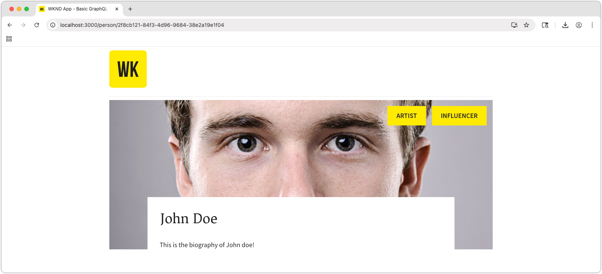

# Bygg en React-app med AEM Content Fragment Delivery OpenAPI:er

I det här kapitlet tittar du närmare på hur AEM Content Fragment Delivery med OpenAPI-API:er kan skapa upplevelser i externa program.

En enkel React-app används för att begära och visa **Team**- och **Person**-innehåll som exponeras av AEM Content Fragment Delivery med OpenAPI:er. Användningen av React är i stort sett oviktig, och den uppladdande externa applikationen kan skrivas i vilket ramverk som helst för vilken plattform som helst, så länge den kan göra HTTP-begäranden till AEM as a Cloud Service.

## Förutsättningar

Stegen som beskrivs i de tidigare delarna av den här flerdelade självstudiekursen antas vara slutförda.

Följande programvara måste vara installerad:

* [Node.js v22+](https://nodejs.org/en)
* [Visual Studio-kod](https://code.visualstudio.com/)

## Mål

Lär dig mer om:

* Hämta och starta exempelappen React.
* Anropa AEM Content Fragment Delivery med OpenAPI-API:er för en lista över team och deras refererade medlemmar.
* Anropa AEM Content Fragment Delivery med OpenAPI:er för att hämta information om en teammedlem.

## Konfigurera CORS på AEM as a Cloud Service

Det här exemplet på React-appen körs lokalt (på `http://localhost:3000`) och ansluter till AEM Content Fragment Delivery för AEM Publish-tjänsten med OpenAPI:er. CORS (Cross-Origin Resource Sharing) måste vara konfigurerat för tjänsten AEM Publish (eller Preview) för att anslutningen ska kunna upprättas.

Följ [instruktionerna om hur du ställer in en SPA som körs på `http://localhost:3000` för att tillåta CORS-begäranden till AEM Publish-tjänsten](https://experienceleague.adobe.com/en/docs/experience-manager-learn/getting-started-with-aem-headless/deployments/spa#different-domains).

### Lokal CORS-proxy

Du kan också köra en [lokal CORS-proxy](https://www.npmjs.com/package/local-cors-proxy) som kan användas för utveckling och som har en CORS-vänlig anslutning till AEM.

```bash
$ npm install --global lcp
$ lcp --proxyUrl https://publish-p<PROGRAM_ID>-e<ENVIRONMENT_ID>.adobeaemcloud.com
```

Uppdatera värdet `--proxyUrl` till din AEM Publish (eller Preview)-URL.

När den lokala CORS-proxyn körs kan du komma åt AEM Content Fragment Delivery API:er på `http://localhost:8010/proxy` för att undvika CORS-problem.

## Klona exempelappen React

Ett utökat exempel på React-program implementeras med den kod som krävs för att interagera med AEM Content Fragment Delivery med OpenAPI-API:er och visa team- och persondata som hämtats från dem.

Källkoden för exempelappen React är [tillgänglig på Github.com](https://github.com/adobe/aem-tutorials/tree/main/headless/open-api/basic).

Så här skaffar du React-appen:

1. Klona exempelappen WKND OpenAPI React från [Github.com](https://github.com/adobe/aem-tutorials) från [`headless_open-api_basic`-taggen ](https://github.com/adobe/aem-tutorials/tree/headless_open-api_basic).

   ```shell
   $ cd ~/Code
   $ git clone git@github.com:adobe/aem-tutorials.git
   $ cd aem-tutorials  
   $ git fetch --tags
   $ git tag
   $ git checkout tags/headless_open-api_basic
   ```

1. Navigera till mappen `headless/open-api/basic` och öppna den i din IDE.

   ```shell
   $ cd ~/Code/aem-tutorials/headless/open-api/basic
   $ code .
   ```

1. Uppdatera `.env` för att ansluta till AEM as a Cloud Service Publish-tjänsten, så här publicerar vi våra innehållsfragment. Detta kan peka på tjänsten AEM Preview om du vill testa programmet med tjänsten AEM Preview (och innehållsfragmenten publiceras där).

   ```
   # AEM Publish (or Preview) service that provides Content Fragments
   REACT_APP_HOST_URI=https://publish-p123-e456.adobeaemcloud.com
   ```

   När du använder [Lokal CORS-proxy](#local-cors-proxy) anger du `REACT_APP_HOST_URI` till `http://localhost:8010/proxy`.

   ```
   # AEM Publish (or Preview) service that provides Content Fragments
   REACT_APP_HOST_URI=http://localhost:8010/proxy
   ```

1. Starta React-appen

   ```shell
   $ cd ~/Code/aem-tutorials/headless/open-api/basic
   $ npm install
   $ npm start
   ```

1. Appen React startar i utvecklingsläge på [http://localhost:3000/](http://localhost:3000/). Ändringar som görs i React-appen under hela kursen visas direkt i webbläsaren.

>[!IMPORTANT]
>
>   Den här React-appen är delvis implementerad. Följ stegen i den här självstudiekursen för att slutföra implementeringen. De JavaScript-filer som behöver implementeras har följande kommentar, se till att du lägger till/uppdaterar koden i de filerna med koden som anges i den här självstudiekursen.
>
>
>  //**&#x200B;**&#x200B;**&#x200B;**&#x200B;**&#x200B;**&#x200B;**&#x200B;**&#x200B;**&#x200B;**&#x200B;**&#x200B;**&#x200B;**&#x200B;**&#x200B;**&#x200B;**&#x200B;**
>  &#x200B;>  // TODO: Implementera detta genom att följa stegen från AEM Headless Tutorial
>  &#x200B;>  //**&#x200B;**&#x200B;**&#x200B;**&#x200B;**&#x200B;**&#x200B;**&#x200B;**&#x200B;**&#x200B;**&#x200B;**&#x200B;**&#x200B;**&#x200B;**&#x200B;**&#x200B;**&#x200B;**
>

## Anatomi i React-appen

Exempelappen React innehåller tre huvuddelar som behöver uppdateras.

1. Filen `.env` innehåller URL:en för tjänsten AEM Publish (eller Preview).
1. `src/components/Teams.js` visar en lista över team och deras medlemmar.
1. `src/components/Person.js` visar information om en enskild teammedlem.

## Implementera teamfunktioner

Bygg upp funktionaliteten för att visa teamen och deras medlemmar i React-appens huvudvy. Den här funktionen kräver:

* En ny [anpassad React useEffect-krok](https://react.dev/reference/react/useEffect#useeffect) som anropar **List all Content Fragments API** via en hämtningsbegäran och sedan hämtar `fullName`-värdet för varje `teamMember` för visning.

När det är klart fylls programmets huvudvy i med teamdata från AEM.


1. Öppna `src/components/Teams.js`.

1. Implementera komponenten **Teams** för att hämta listan med team från [Visa alla innehållsfragment-API](https://developer.adobe.com/experience-cloud/experience-manager-apis/api/stable/contentfragments/delivery/#operation/fragments/getFragments) och återge teaminnehållet. Detta är indelat i följande steg:

1. Skapa en `useEffect`-krok som anropar AEM-API:t **Visa alla innehållsfragment** och lagrar data i React-komponentens tillstånd.
1. För varje **Team** Content Fragment som returneras anropar du API:t **Get a Content Fragment** för att hämta en fullständig information om teamet, inklusive dess medlemmar och deras `fullNames`.
1. Återge teamdata med funktionen `Team`.

   ```javascript
   import { useEffect, useState } from "react";
   import { Link } from "react-router-dom";
   import "./Teams.scss";
   
   function Teams() {
   
     // The teams folder is the only folder-tree that is allowed to contain Team Content Fragments.
     const TEAMS_FOLDER = '/content/dam/my-project/en/teams';
   
     // State to store the teams data
     const [teams, setTeams] = useState(null);
   
     useEffect(() => {
       /**
       * Fetches all teams and their associated member details
       * This is a two-step process:
       * 1. First, get all team content fragments from the specified folder
       * 2. Then, for each team, fetch the full details including hydrated references to get the team member names
       */
       const fetchData = async () => {
         try {
           // Step 1: Fetch all teams from the teams folder
           const response = await fetch(
             `${process.env.REACT_APP_HOST_URI}/adobe/contentFragments?path=${TEAMS_FOLDER}`
           );
           const allTeams = (await response.json()).items || [];
   
           // Step 2: Fetch detailed information for each team with hydrated references
           const hydratedTeams = [];
           for (const team of allTeams) {
             const hydratedTeamResponse = await fetch(
               `${process.env.REACT_APP_HOST_URI}/adobe/contentFragments/${team.id}?references=direct-hydrated`
             );
             hydratedTeams.push(await hydratedTeamResponse.json());
           }
   
           setTeams(hydratedTeams);
         } catch (error) {
           console.error("Error fetching content fragments:", error);
         }
       };
   
       fetchData();
     }, [TEAMS_FOLDER]);
   
     // Show loading state while teams data is being fetched
     if (!teams) {
       return <div>Loading teams...</div>;
     }
   
     // Render the teams
     return (
       <div className="teams">
         {teams.map((team, index) => {
           return (
             <Team 
               key={index} 
               {..team}
             />
           );
         })}
       </div>
     );
   }
   
   /**
   * Team component - renders a single team with its details and members
   * @param {string} fields - The authorable fields
   * @param {Object} references - Hydrated references containing member details such as fullName
   */
   function Team({ fields, references, path }) {
     if (!fields.title || !fields.teamMembers) {
       return null;
     }
   
     return (
       <div className="team">
         <h2 className="team__title">{fields.title}</h2>
         {/* Render description as HTML using dangerouslySetInnerHTML */}
         <p 
           className="team__description" 
           dangerouslySetInnerHTML={{ __html: fields.description.value }}
         />
         <div>
           <h4 className="team__members-title">Members</h4>
           <ul className="team__members">
             {/* Render each team member as a link to their detail page */}
             {fields.teamMembers.map((teamMember, index) => {
               return (
                 <li key={index} className="team__member">
                   <Link to={`/person/${teamMember}`}>
                     {/* Display the full name from the hydrated reference */}
                     {references[teamMember].value.fields.fullName}
                   </Link>
                 </li>
               );
             })}
           </ul>
         </div>
       </div>
     );
   }
   
   export default Teams;
   ```

## Implementera personfunktioner

När [Teams-funktionen](#implement-teams-functionality) är klar kan du implementera funktionen för att hantera visningen av en teammedlems eller persons information.



Så här gör du:

1. Öppna `src/components/Person.js`
1. Tolka vägparametern `Person` i komponenten `id` React. Observera att React-appens vägar tidigare konfigurerats för att acceptera URL-parametern `id` (se `/src/App.js`).
1. Hämta persondata från AEM med [API:t Hämta innehållsfragment](https://developer.adobe.com/experience-cloud/experience-manager-apis/api/stable/contentfragments/delivery/#operation/fragments/getFragment).

   ```javascript
   import "./Person.scss";
   import { useEffect, useState } from "react";
   import { useParams } from "react-router-dom";
   
   /**
   * Person component - displays detailed information about a single person
   * Fetches person data from AEM using the ID from the URL parameters
   */
   function Person() {
     // Get the person ID from the URL parameter
     const { id } = useParams();
   
     // State to store the person data
     const [person, setPerson] = useState(null);
   
     useEffect(() => {
       /**
       * Fetches person data from AEM Content Fragment Delivery API
       * Uses the ID from URL parameters to get the specific person's details
       */
       const fetchData = async () => {
         try {
           /* Hydrate references for access to profilePicture asset path */
           const response = await fetch(
             `${process.env.REACT_APP_HOST_URI}/adobe/contentFragments/${id}?references=direct-hydrated`
           );
           const json = await response.json();
           setPerson(json || null);
         } catch (error) {
           console.error("Error fetching person data:", error);
         }
       };
       fetchData();
     }, [id]); // Re-fetch when ID changes
   
     // Show loading state while person data is being fetched
     if (!person) {
       return <div>Loading person...</div>;
     }
   
     return (
       <div className="person">
         {/* Person profile image - Look up the profilePicture reference in the references object */}
         
         {/* Display person's occupations */}
         <div className="person__occupations">
           {person.fields.occupation.map((occupation, index) => {
             return (
               <span key={index} className="person__occupation">
                 {occupation}
               </span>
             );
           })}
         </div>
   
         {/* Person's main content: name and biography */}
         <div className="person__content">
           <h1 className="person__full-name">{person.fields.fullName}</h1>
           {/* Render biography as HTML content */}
           <div
             className="person__biography"
             dangerouslySetInnerHTML={{ __html: person.fields.biographyText.value }}
           />
         </div>
       </div>
     );  
   }
   
   export default Person;
   ```

### Hämta den färdiga koden

Den fullständiga källkoden för det här kapitlet är [tillgänglig på Github.com](https://github.com/adobe/aem-tutorials/tree/headless_open-api_basic_4-end).

```bash
$ git fetch --tags
$ git tag
$ git checkout tags/headless_open-api_basic_4-end
```

## Prova appen

Granska appen [http://localhost:3000/](http://localhost:3000/) och klicka på länkarna _Teammedlem_ . Du kan också lägga till fler team och/eller medlemmar i Team Alpha genom att lägga till innehållsfragment i AEM Author och publicera dem.

## Under huven

Öppna webbläsarens **utvecklingsverktyg > Network**-konsol och **Filter** för `/adobe/contentFragments` hämtningsbegäranden när du interagerar med React-appen.

## Grattis!

Grattis! Du har skapat en React-app för att använda och visa innehållsfragment från AEM Content Fragment Delivery med OpenAPI-API:er.
