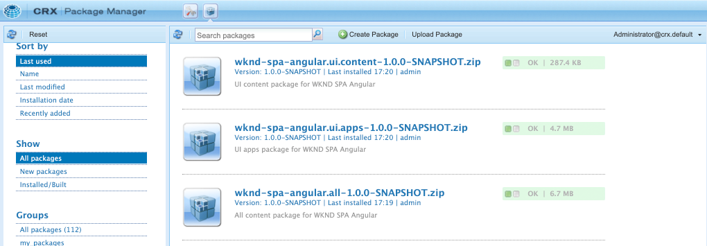

# SPA Editor-projekt {#create-project}

Lär dig hur du använder ett Adobe Experience Manager (AEM) Maven-projekt som utgångspunkt för ett Angular-program som är integrerat med AEM SPA Editor.

## Syfte

1. Förstå strukturen i ett nytt AEM SPA Editor-projekt som bygger på en Maven-arketype.
2. Distribuera startprojektet till en lokal instans av AEM.

## Vad du ska bygga

I det här kapitlet distribueras ett nytt AEM-projekt baserat på [AEM Project Archetype](https://github.com/adobe/aem-project-archetype). AEM-projektet har en mycket enkel startpunkt för Angular SPA. Det projekt som används i detta kapitel kommer att fungera som grund för en implementering av WKND:s SPA och är byggt på i framtida kapitel.


*Ett klassiskt Hello World-meddelande.*

## Förutsättningar

Granska de verktyg och instruktioner som krävs för att konfigurera en [lokal utvecklingsmiljö](overview.md#local-dev-environment). Kontrollera att en ny instans av Adobe Experience Manager, som har startats i läget **författare**, körs lokalt.

## Hämta projektet

Det finns flera alternativ för att skapa ett projekt med flera moduler i Maven för AEM. I den här självstudien användes den senaste [AEM Project Archetype](https://github.com/adobe/aem-project-archetype) som grund för självstudiekursen. Projektkoden har ändrats för att stödja flera versioner av AEM. Granska [anteckningen om bakåtkompatibilitet](overview.md#compatibility).

>[!CAUTION]
>
>Det är en god vana att använda den **senaste** versionen av [arkitypen](https://github.com/adobe/aem-project-archetype) för att generera ett nytt projekt för en implementering i verkligheten. AEM-projekt ska ha en enda version av AEM som mål med egenskapen `aemVersion` för arkitypen.

1. Hämta startpunkten för den här självstudiekursen via Git:

   ```shell
   $ git clone git@github.com:adobe/aem-guides-wknd-spa.git
   $ cd aem-guides-wknd-spa
   $ git checkout Angular/create-project-start
   ```

2. Följande mapp- och filstruktur representerar AEM Project som genererades av Maven-arkivtypen i det lokala filsystemet:

   ```plain
   |--- aem-guides-wknd-spa
       |--- all/
       |--- core/
       |--- dispatcher/
       |--- ui.apps/
       |--- ui.apps.structure/
       |--- ui.content/
       |--- ui.frontend /
       |--- it.tests/
       |--- pom.xml
       |--- README.md
       |--- .gitignore
       |--- archetype.properties
   ```

3. Följande egenskaper användes när AEM-projektet genererades från [AEM Project-projekttypen](https://github.com/Adobe-Marketing-Cloud/aem-project-archetype/releases/tag/aem-project-archetype-14):

   | Egenskap | Värde |
   |-----------------|---------------------------------------|
   | aemVersion | molnet |
   | appTitle | WKND SPA Angular |
   | appId | wknd-spa-angular |
   | groupId | com.adobe.aem.guides |
   | frontModule | vinklad |
   | package | com.adobe.aem.guides.wknd.spa.angular |
   | includeExamples | n |

   >[!NOTE]
   >
   > Observera egenskapen `frontendModule=angular`. Detta anger att AEM Project Archetype ska starta projektet med startkoden [Angular ](https://experienceleague.adobe.com/docs/experience-manager-core-components/using/developing/archetype/uifrontend-angular.html) som ska användas med AEM SPA Editor.

## Bygg projektet

Därefter kompilerar, bygger och distribuerar du projektkoden till en lokal instans av AEM med hjälp av Maven.

1. Kontrollera att en instans av AEM körs lokalt på port **4502**.
2. Kontrollera att Maven är installerad från kommandoradsterminalen:

   ```shell
   $ mvn --version
   Apache Maven 3.6.2
   Maven home: /Library/apache-maven-3.6.2
   Java version: 11.0.4, vendor: Oracle Corporation, runtime: /Library/Java/JavaVirtualMachines/jdk-11.0.4.jdk/Contents/Home
   ```

3. Kör kommandot nedan Maven från katalogen `aem-guides-wknd-spa` för att skapa och distribuera projektet till AEM:

   ```shell
   $ mvn -PautoInstallSinglePackage clean install
   ```

   Om du använder [AEM 6.x](overview.md#compatibility):

   ```shell
   $ mvn clean install -PautoInstallSinglePackage -Pclassic
   ```

   Projektets flera moduler ska kompileras och distribueras till AEM.

   ```plain
   [INFO] ------------------------------------------------------------------------
   [INFO] Reactor Summary for wknd-spa-angular 1.0.0-SNAPSHOT:
   [INFO] 
   [INFO] wknd-spa-angular ................................... SUCCESS [  0.473 s]
   [INFO] WKND SPA Angular - Core ............................ SUCCESS [ 54.866 s]
   [INFO] wknd-spa-angular.ui.frontend - UI Frontend ......... SUCCESS [02:10 min]
   [INFO] WKND SPA Angular - Repository Structure Package .... SUCCESS [  0.694 s]
   [INFO] WKND SPA Angular - UI apps ......................... SUCCESS [  6.351 s]
   [INFO] WKND SPA Angular - UI content ...................... SUCCESS [  2.885 s]
   [INFO] WKND SPA Angular - All ............................. SUCCESS [  1.736 s]
   [INFO] WKND SPA Angular - Integration Tests Bundles ....... SUCCESS [  2.563 s]
   [INFO] WKND SPA Angular - Integration Tests Launcher ...... SUCCESS [  1.846 s]
   [INFO] WKND SPA Angular - Dispatcher ...................... SUCCESS [  0.270 s]
   [INFO] ------------------------------------------------------------------------
   [INFO] BUILD SUCCESS
   [INFO] ------------------------------------------------------------------------
   ```

   Maven-profilen ***autoInstallSinglePackage*** kompilerar de enskilda modulerna i projektet och distribuerar ett paket till AEM-instansen. Som standard distribueras det här paketet till en AEM-instans som körs lokalt på port **4502** och med autentiseringsuppgifterna för **admin:admin**.

4. Navigera till **[!UICONTROL Package Manager]** på din lokala AEM-instans: [http://localhost:4502/crx/packmgr/index.jsp](http://localhost:4502/crx/packmgr/index.jsp).

5. Du bör se tre paket för `wknd-spa-angular.all`, `wknd-spa-angular.ui.apps` och `wknd-spa-angular.ui.content`.

   

   All anpassad kod som krävs för projektet paketeras i dessa paket och installeras på AEM-miljön.

6. Du bör också se flera paket för `spa.project.core` och `core.wcm.components`. Detta är beroenden som automatiskt inkluderas av arketypen. Mer information om [AEM Core Components finns här](https://experienceleague.adobe.com/docs/experience-manager-core-components/using/introduction.html).

## Författarinnehåll

Öppna sedan den första SPA-filen som genererades av typen och uppdatera en del av innehållet.

1. Navigera till **[!UICONTROL Sites]**-konsolen: [http://localhost:4502/sites.html/content](http://localhost:4502/sites.html/content).

   WKND SPA innehåller en grundläggande webbplatsstruktur med land, språk och hemsida. Den här hierarkin baseras på arkivtypens standardvärden för `language_country` och `isSingleCountryWebsite`. Dessa värden kan skrivas över genom att uppdatera de [tillgängliga egenskaperna](https://github.com/adobe/aem-project-archetype#available-properties) när du genererar ett projekt.

2. Öppna sidan **[!DNL us]** > **[!DNL en]** > **[!DNL WKND SPA Angular Home Page]** genom att markera sidan och klicka på knappen **[!UICONTROL Edit]** i menyraden:

   

3. En **[!UICONTROL Text]**-komponent har redan lagts till på sidan. Du kan redigera den här komponenten precis som andra komponenter i AEM.

   

4. Lägg till ytterligare en **[!UICONTROL Text]**-komponent på sidan.

   Observera att redigeringsupplevelsen liknar den på en traditionell AEM Sites-sida. För närvarande finns ett begränsat antal komponenter att använda. Mer läggs till under kursen.

## Inspektera enkelsidigt program

Verifiera sedan att det här är ett Single Page-program med hjälp av webbläsarens utvecklarverktyg.

1. I **[!UICONTROL Page Editor]** klickar du på menyn **[!UICONTROL Page Information]** > **[!UICONTROL View as Published]**:

   

   Då öppnas en ny flik med frågeparametern `?wcmmode=disabled` som inaktiverar AEM-redigeraren: [http://localhost:4502/content/wknd-spa-angular/us/en/home.html?wcmmode=disabled](http://localhost:4502/content/wknd-spa-angular/us/en/home.html?wcmmode=disabled)

2. Visa sidans källa och observera att textinnehållet **[!DNL Hello World]** eller något annat innehåll inte hittas. Du ska i stället se HTML på följande sätt:

   ```html
   ...
   <body>
       <noscript>You need to enable JavaScript to run this app.</noscript>
       <div id="spa-root"></div>
       <script type="text/javascript" src="/etc.clientlibs/wknd-spa-angular/clientlibs/clientlib-angular.min.js"></script>
       ...
   </body>
   ...
   ```

   `clientlib-angular.min.js` är den Angular SPA som läses in på sidan och som ansvarar för återgivningen av innehållet.

   *Varifrån kommer innehållet?*

3. Återgå till fliken: [http://localhost:4502/content/wknd-spa-angular/us/en/home.html?wcmmode=disabled](http://localhost:4502/content/wknd-spa-angular/us/en/home.html?wcmmode=disabled)
4. Öppna utvecklarverktygen i webbläsaren och inspektera nätverkstrafiken på sidan under en uppdatering. Visa **XHR**-begäranden:

   

   Det bör finnas en begäran till [http://localhost:4502/content/wknd-spa-angular/us/en.model.json](http://localhost:4502/content/wknd-spa-angular/us/en.model.json). Detta innehåller allt innehåll, formaterat i JSON, som kommer att driva SPA.

5. Öppna [http://localhost:4502/content/wknd-spa-angular/us/en.model.json](http://localhost:4502/content/wknd-spa-angular/us/en.model.json) på en ny flik

   Begäran `en.model.json` representerar innehållsmodellen som kör programmet. Kontrollera JSON-utdata och du bör kunna hitta fragmentet som representerar **[!UICONTROL Text]**-komponenten.

   ```json
   ...
   ":items": {
       "text": {
           "text": "<p>Hello World! Updated content!</p>\r\n",
           "richText": true,
           ":type": "wknd-spa-angular/components/text"
       },
       "text_98796435": {
           "text": "<p>A new text component.</p>\r\n",
           "richText": true,
           ":type": "wknd-spa-angular/components/text"
   },
   ...
   ```

   I nästa kapitel kommer vi att undersöka hur JSON-innehållet mappas från AEM Components till SPA Components för att utgöra grunden för AEM SPA Editor.

   >[!NOTE]
   >
   > Det kan vara praktiskt att installera ett webbläsartillägg som automatiskt formaterar JSON-utdata.

## Grattis! {#congratulations}

Grattis! Du har skapat ditt första AEM SPA Editor-projekt!

Det är ganska enkelt just nu, men i de kommande kapitlen läggs fler funktioner till.

### Nästa steg {#next-steps}

[Integrera SPA](integrate-spa.md) - Lär dig hur SPA-källkoden integreras med AEM Project och förstå vilka verktyg som finns för att snabbt utveckla SPA.
