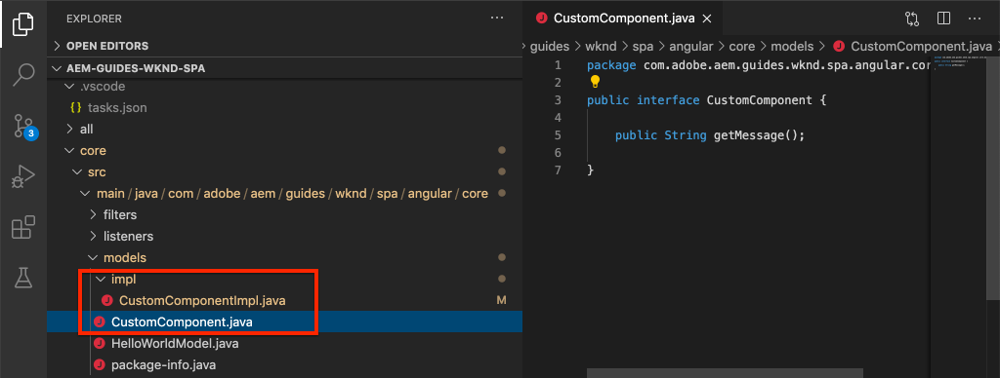
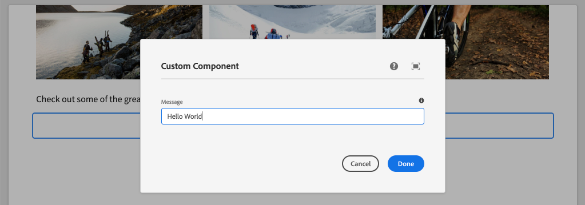

# Skapa en anpassad komponent {#custom-component}

{{spa-editor-deprecation}}

Lär dig hur du skapar en anpassad komponent som ska användas med AEM SPA Editor. Lär dig hur du utvecklar redigeringsdialogrutor och Sling-modeller för att utöka JSON-modellen så att den fyller i en anpassad komponent.

## Syfte

1. Förstå Sling Models roll när det gäller att hantera JSON-modellens API som tillhandahålls av AEM.
2. Lär dig hur du skapar komponentdialogrutor för AEM.
3. Lär dig skapa en **anpassad** AEM-komponent som är kompatibel med SPA-redigeringsramverket.

## Vad du ska bygga

Fokus i tidigare kapitel var att utveckla SPA-komponenter och mappa dem till *befintliga* AEM Core-komponenter. I det här kapitlet fokuseras på hur du skapar och utökar *nya* AEM-komponenter och manipulerar JSON-modellen som hanteras av AEM.

En enkel `Custom Component` illustrerar de steg som krävs för att skapa en ny AEM-komponent.


## Förutsättningar

Granska de verktyg och instruktioner som krävs för att konfigurera en [lokal utvecklingsmiljö](overview.md#local-dev-environment).

### Hämta koden

1. Hämta startpunkten för den här självstudiekursen via Git:

   ```shell
   $ git clone git@github.com:adobe/aem-guides-wknd-spa.git
   $ cd aem-guides-wknd-spa
   $ git checkout Angular/custom-component-start
   ```

2. Distribuera kodbasen till en lokal AEM-instans med Maven:

   ```shell
   $ mvn clean install -PautoInstallSinglePackage
   ```

   Om du använder [AEM 6.x](overview.md#compatibility) lägger du till profilen `classic`:

   ```shell
   $ mvn clean install -PautoInstallSinglePackage -Pclassic
   ```

3. Installera det färdiga paketet för den traditionella [WKND-referensplatsen](https://github.com/adobe/aem-guides-wknd/releases/latest). Bilderna från [WKND-referensplatsen](https://github.com/adobe/aem-guides-wknd/releases/latest) återanvänds i WKND SPA. Paketet kan installeras med [AEM Package Manager](http://localhost:4502/crx/packmgr/index.jsp).

   

Du kan alltid visa den färdiga koden på [GitHub](https://github.com/adobe/aem-guides-wknd-spa/tree/Angular/custom-component-solution) eller checka ut koden lokalt genom att växla till grenen `Angular/custom-component-solution`.

## Definiera AEM-komponenten

En AEM-komponent definieras som en nod och egenskaper. I projektet representeras dessa noder och egenskaper som XML-filer i modulen `ui.apps`. Skapa sedan AEM-komponenten i modulen `ui.apps`.

>[!NOTE]
>
> En snabb uppdatering av [grunderna i AEM-komponenter kan vara användbar](https://experienceleague.adobe.com/docs/experience-manager-learn/getting-started-wknd-tutorial-develop/project-archetype/component-basics.html).

1. Öppna mappen `ui.apps` i den utvecklingsmiljö du vill använda.
2. Navigera till `ui.apps/src/main/content/jcr_root/apps/wknd-spa-angular/components` och skapa en mapp med namnet `custom-component`.
3. Skapa en fil med namnet `.content.xml` under mappen `custom-component`. Fyll i `custom-component/.content.xml` med följande:

   ```xml
   <?xml version="1.0" encoding="UTF-8"?>
   <jcr:root xmlns:sling="http://sling.apache.org/jcr/sling/1.0" xmlns:cq="http://www.day.com/jcr/cq/1.0" xmlns:jcr="http://www.jcp.org/jcr/1.0"
       jcr:primaryType="cq:Component"
       jcr:title="Custom Component"
       componentGroup="WKND SPA Angular - Content"/>
   ```

   

   `jcr:primaryType="cq:Component"` - identifierar att den här noden är en AEM-komponent.

   `jcr:title` är det värde som visas för innehållsförfattare och `componentGroup` bestämmer grupperingen av komponenter i redigeringsgränssnittet.

4. Skapa en annan mapp med namnet `_cq_dialog` under mappen `custom-component`.
5. Under mappen `_cq_dialog` skapar du en fil med namnet `.content.xml` och fyller i den med följande:

   ```xml
   <?xml version="1.0" encoding="UTF-8"?>
   <jcr:root xmlns:sling="http://sling.apache.org/jcr/sling/1.0" xmlns:granite="http://www.adobe.com/jcr/granite/1.0" xmlns:cq="http://www.day.com/jcr/cq/1.0" xmlns:jcr="http://www.jcp.org/jcr/1.0" xmlns:nt="http://www.jcp.org/jcr/nt/1.0"
       jcr:primaryType="nt:unstructured"
       jcr:title="Custom Component"
       sling:resourceType="cq/gui/components/authoring/dialog">
       <content
           jcr:primaryType="nt:unstructured"
           sling:resourceType="granite/ui/components/coral/foundation/container">
           <items jcr:primaryType="nt:unstructured">
               <tabs
                   jcr:primaryType="nt:unstructured"
                   sling:resourceType="granite/ui/components/coral/foundation/tabs"
                   maximized="{Boolean}true">
                   <items jcr:primaryType="nt:unstructured">
                       <properties
                           jcr:primaryType="nt:unstructured"
                           jcr:title="Properties"
                           sling:resourceType="granite/ui/components/coral/foundation/container"
                           margin="{Boolean}true">
                           <items jcr:primaryType="nt:unstructured">
                               <columns
                                   jcr:primaryType="nt:unstructured"
                                   sling:resourceType="granite/ui/components/coral/foundation/fixedcolumns"
                                   margin="{Boolean}true">
                                   <items jcr:primaryType="nt:unstructured">
                                       <column
                                           jcr:primaryType="nt:unstructured"
                                           sling:resourceType="granite/ui/components/coral/foundation/container">
                                           <items jcr:primaryType="nt:unstructured">
                                               <message
                                                   jcr:primaryType="nt:unstructured"
                                                   sling:resourceType="granite/ui/components/coral/foundation/form/textfield"
                                                   fieldDescription="The text to display on the component."
                                                   fieldLabel="Message"
                                                   name="./message"/>
                                           </items>
                                       </column>
                                   </items>
                               </columns>
                           </items>
                       </properties>
                   </items>
               </tabs>
           </items>
       </content>
   </jcr:root>
   ```

   

   XML-filen ovan genererar en enkel dialogruta för `Custom Component`. Den kritiska delen av filen är den inre `<message>`-noden. Den här dialogrutan innehåller en enkel `textfield` med namnet `Message` och behåller textfältets värde till egenskapen `message`.

   En Sling-modell skapas bredvid för att visa värdet för egenskapen `message` via JSON-modellen.

   >[!NOTE]
   >
   > Du kan visa fler [exempel på dialogrutor genom att visa Core Component Definition](https://github.com/adobe/aem-core-wcm-components/tree/master/content/src/content/jcr_root/apps/core/wcm/components). Du kan även visa ytterligare formulärfält, som `select`, `textarea`, `pathfield`, som är tillgängliga under `/libs/granite/ui/components/coral/foundation/form` i [CRXDE-Lite](http://localhost:4502/crx/de/index.jsp#/libs/granite/ui/components/coral/foundation/form).

   I en traditionell AEM-komponent krävs vanligtvis ett [HTML](https://experienceleague.adobe.com/docs/experience-manager-htl/content/overview.html)-skript. Eftersom SPA återger komponenten behövs inget HTML-skript.

## Skapa segmentmodellen

Sling Models är annoteringsdrivna Java™ &quot;POJOs&quot; (Plain Old Java™ Objects) som gör det enklare att mappa data från JCR till Java™-variabler. [Sling Models](https://experienceleague.adobe.com/docs/experience-manager-learn/getting-started-wknd-tutorial-develop/project-archetype/component-basics.html#sling-models) fungerar vanligtvis för att kapsla in komplex affärslogik på serversidan för AEM-komponenter.

I SPA-redigeraren visar Sling Models en komponents innehåll via JSON-modellen via en funktion som använder [Sling Model Exporter](https://experienceleague.adobe.com/docs/experience-manager-learn/foundation/development/develop-sling-model-exporter.html).

1. Öppna modulen `core` i den IDE du väljer. `CustomComponent.java` och `CustomComponentImpl.java` har redan skapats och bäddats ut som en del av kapitelstartkoden.

   >[!NOTE]
   >
   > Om du använder Visual Studio Code IDE kan det vara praktiskt att installera [tillägg för Java™](https://code.visualstudio.com/docs/java/extensions).

2. Öppna Java™-gränssnittet `CustomComponent.java` på `core/src/main/java/com/adobe/aem/guides/wknd/spa/angular/core/models/CustomComponent.java`:

   

   Detta är det Java™-gränssnitt som implementeras av Sling Model.

3. Uppdatera `CustomComponent.java` så att det utökar gränssnittet för `ComponentExporter`:

   ```java
   package com.adobe.aem.guides.wknd.spa.angular.core.models;
   import com.adobe.cq.export.json.ComponentExporter;
   
   public interface CustomComponent extends ComponentExporter {
   
       public String getMessage();
   
   }
   ```

   Implementering av gränssnittet `ComponentExporter` är ett krav för att Sling-modellen ska hämtas automatiskt av JSON-modellens API.

   Gränssnittet `CustomComponent` innehåller en enda get-metod, `getMessage()`. Det här är metoden som visar värdet för författardialogrutan via JSON-modellen. Endast get-metoder med tomma parametrar `()` exporteras i JSON-modellen.

4. Öppna `CustomComponentImpl.java` `core/src/main/java/com/adobe/aem/guides/wknd/spa/angular/core/models/impl/CustomComponentImpl.java`.

   Detta är implementeringen av gränssnittet `CustomComponent`. Anteckningen `@Model` identifierar Java™-klassen som en Sling Model. Anteckningen `@Exporter` gör att Java™-klassen kan serialiseras och exporteras via Sling Model Exporter.

5. Uppdatera den statiska variabeln `RESOURCE_TYPE` så att den pekar på AEM-komponenten `wknd-spa-angular/components/custom-component` som skapades i föregående övning.

   ```java
   static final String RESOURCE_TYPE = "wknd-spa-angular/components/custom-component";
   ```

   Komponentens resurstyp är den som binder Sling-modellen till AEM-komponenten och mappar slutligen till Angular-komponenten.

6. Lägg till metoden `getExportedType()` i klassen `CustomComponentImpl` för att returnera komponentresurstypen:

   ```java
   @Override
   public String getExportedType() {
       return CustomComponentImpl.RESOURCE_TYPE;
   }
   ```

   Den här metoden krävs när gränssnittet `ComponentExporter` implementeras och visar den resurstyp som tillåter mappningen till Angular-komponenten.

7. Uppdatera metoden `getMessage()` för att returnera värdet för egenskapen `message` som bevaras av författardialogrutan. Använd `@ValueMap`-anteckningen för att mappa JCR-värdet `message` till en Java™-variabel:

   ```java
   import org.apache.commons.lang3.StringUtils;
   ...
   
   @ValueMapValue
   private String message;
   
   @Override
   public String getMessage() {
       return StringUtils.isNotBlank(message) ? message.toUpperCase() : null;
   }
   ```

   Ytterligare&quot;affärslogik&quot; läggs till för att returnera värdet för meddelandet som versal. På så sätt kan vi se skillnaden mellan det råvärde som lagras av författardialogrutan och det värde som exponeras av Sling-modellen.

   >[!NOTE]
   >
   > Du kan visa den [färdiga CustomComponentImpl.java här](https://github.com/adobe/aem-guides-wknd-spa/blob/Angular/custom-component-solution/core/src/main/java/com/adobe/aem/guides/wknd/spa/angular/core/models/impl/CustomComponentImpl.java).

## Uppdatera Angular-komponenten

Angular-koden för den anpassade komponenten har redan skapats. Därefter gör du några uppdateringar för att mappa Angular-komponenten till AEM-komponenten.

1. Öppna filen `ui.frontend/src/app/components/custom/custom.component.ts` i modulen `ui.frontend`
2. Observera raden `@Input() message: string;`. Det omformade versalvärdet förväntas mappas till den här variabeln.
3. Importera `MapTo`-objektet från AEM SPA Editor JS SDK och använd det för att mappa till AEM-komponenten:

   ```diff
   + import {MapTo} from '@adobe/cq-angular-editable-components';
   
    ...
    export class CustomComponent implements OnInit {
        ...
    }
   
   + MapTo('wknd-spa-angular/components/custom-component')(CustomComponent, CustomEditConfig);
   ```

4. Öppna `cutom.component.html` och observera att värdet för `{{message}}` visas i en `<h2>` -tagg.
5. Öppna `custom.component.css` och lägg till följande regel:

   ```css
   :host-context {
       display: block;
   }
   ```

   För att AEM Editor-platshållaren ska visas korrekt när komponenten är tom måste `:host-context` eller en annan `<div>` anges till `display: block;`.

6. Distribuera uppdateringarna i en lokal AEM-miljö från projektkatalogens rot med hjälp av dina Maven-kunskaper:

   ```shell
   $ cd aem-guides-wknd-spa
   $ mvn clean install -PautoInstallSinglePackage
   ```

## Uppdatera mallprincipen

Gå sedan till AEM för att verifiera uppdateringarna och tillåta att `Custom Component` läggs till i SPA.

1. Verifiera registreringen av den nya Sling-modellen genom att gå till [http://localhost:4502/system/console/status-slingmodels](http://localhost:4502/system/console/status-slingmodels).

   ```plain
   com.adobe.aem.guides.wknd.spa.angular.core.models.impl.CustomComponentImpl - wknd-spa-angular/components/custom-component
   
   com.adobe.aem.guides.wknd.spa.angular.core.models.impl.CustomComponentImpl exports 'wknd-spa-angular/components/custom-component' with selector 'model' and extension '[Ljava.lang.String;@6fb4a693' with exporter 'jackson'
   ```

   Du bör se de två raderna ovan som anger att `CustomComponentImpl` är associerad med komponenten `wknd-spa-angular/components/custom-component` och att den är registrerad via Sling Model Exporter.

2. Gå till SPA-sidmallen på [http://localhost:4502/editor.html/conf/wknd-spa-angular/settings/wcm/templates/spa-page-template/structure.html](http://localhost:4502/editor.html/conf/wknd-spa-angular/settings/wcm/templates/spa-page-template/structure.html).
3. Uppdatera layoutbehållarens princip så att den nya `Custom Component` läggs till som en tillåten komponent:

   

   Spara ändringarna i principen och observera `Custom Component` som en tillåten komponent:

   

## Skapa den anpassade komponenten

Redigera sedan `Custom Component` med AEM SPA Editor.

1. Gå till [http://localhost:4502/editor.html/content/wknd-spa-angular/us/en/home.html](http://localhost:4502/editor.html/content/wknd-spa-angular/us/en/home.html).
2. I `Edit`-läget lägger du till `Custom Component` i `Layout Container`:

   

3. Öppna komponentens dialogruta och skriv ett meddelande som innehåller gemener.

   

   Det här är den dialogruta som skapades baserat på XML-filen tidigare i kapitlet.

4. Spara ändringarna. Observera att det visade meddelandet är i versaler.

   

5. Visa JSON-modellen genom att gå till [http://localhost:4502/content/wknd-spa-angular/us/en.model.json](http://localhost:4502/content/wknd-spa-angular/us/en.model.json). Sök efter `wknd-spa-angular/components/custom-component`:

   ```json
   "custom_component_208183317": {
       "message": "HELLO WORLD",
       ":type": "wknd-spa-angular/components/custom-component"
   }
   ```

   Observera att JSON-värdet är inställt på alla versala bokstäver baserat på den logik som lagts till i Sling-modellen.

## Grattis! {#congratulations}

Grattis! Du har lärt dig hur du skapar en anpassad AEM-komponent och hur Sling-modeller och dialogrutor fungerar med JSON-modellen.

Du kan alltid visa den färdiga koden på [GitHub](https://github.com/adobe/aem-guides-wknd-spa/tree/Angular/custom-component-solution) eller checka ut koden lokalt genom att växla till grenen `Angular/custom-component-solution`.

### Nästa steg {#next-steps}

[Utöka en kärnkomponent](extend-component.md) - Lär dig hur du utökar en befintlig kärnkomponent som ska användas med AEM SPA-redigeraren. Att förstå hur man lägger till egenskaper och innehåll i en befintlig komponent är en kraftfull teknik som utökar funktionerna i en AEM SPA Editor-implementering.
