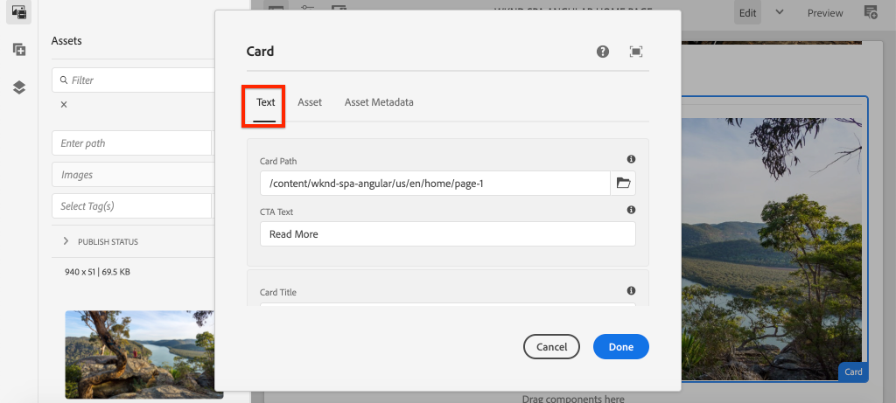

# Utöka en kärnkomponent {#extend-component}

Lär dig hur du utökar en befintlig Core Component som ska användas med AEM SPA Editor. Att förstå hur man utökar en befintlig komponent är en kraftfull teknik för att anpassa och utöka funktionerna i en AEM SPA Editor-implementering.

## Syfte

1. Utöka en befintlig Core Component med ytterligare egenskaper och innehåll.
2. Förstå grunderna för komponentarv med användningen av `sling:resourceSuperType`.
3. Lär dig hur du använder [delegeringsmönstret](https://github.com/adobe/aem-core-wcm-components/wiki/Delegation-Pattern-for-Sling-Models) för delningsmodeller för att återanvända befintlig logik och befintliga funktioner.

## Vad du ska bygga

I det här kapitlet skapas en ny `Card`-komponent. Komponenten `Card` utökar [Image Core Component](https://experienceleague.adobe.com/docs/experience-manager-core-components/using/components/image.html?lang=sv-SE) genom att lägga till ytterligare innehållsfält som en titel och en Call To Action-knapp för att utföra rollen som teaser för annat innehåll i SPA.


>[!NOTE]
>
> I en implementering i verkligheten kan det vara lämpligare att helt enkelt använda [Teaser Component](https://experienceleague.adobe.com/docs/experience-manager-core-components/using/components/teaser.html?lang=sv-SE) än att utöka [Image Core Component](https://experienceleague.adobe.com/docs/experience-manager-core-components/using/components/image.html?lang=sv-SE) för att skapa en `Card` -komponent beroende på projektkraven. Du bör alltid använda [kärnkomponenter](https://experienceleague.adobe.com/docs/experience-manager-core-components/using/introduction.html?lang=sv-SE) direkt när det är möjligt.

## Förutsättningar

Granska de verktyg och instruktioner som krävs för att konfigurera en [lokal utvecklingsmiljö](overview.md#local-dev-environment).

### Hämta koden

1. Hämta startpunkten för den här självstudiekursen via Git:

   ```shell
   $ git clone git@github.com:adobe/aem-guides-wknd-spa.git
   $ cd aem-guides-wknd-spa
   $ git checkout Angular/extend-component-start
   ```

2. Distribuera kodbasen till en lokal AEM-instans med Maven:

   ```shell
   $ mvn clean install -PautoInstallSinglePackage
   ```

   Om du använder [AEM 6.x](overview.md#compatibility) lägger du till profilen `classic`:

   ```shell
   $ mvn clean install -PautoInstallSinglePackage -Pclassic
   ```

3. Installera det färdiga paketet för den traditionella [WKND-referensplatsen](https://github.com/adobe/aem-guides-wknd/releases/tag/aem-guides-wknd-2.1.0). Bilderna som tillhandahålls av [WKND-referensplatsen](https://github.com/adobe/aem-guides-wknd/releases/latest) återanvänds i WKND SPA. Paketet kan installeras med [AEM Package Manager](http://localhost:4502/crx/packmgr/index.jsp).

   

Du kan alltid visa den färdiga koden på [GitHub](https://github.com/adobe/aem-guides-wknd-spa/tree/Angular/extend-component-solution) eller checka ut koden lokalt genom att växla till grenen `Angular/extend-component-solution`.

## Inspektera den inledande kortimplementeringen

En initial kortkomponent har tillhandahållits av kapitelstartkoden. Granska startpunkten för kortimplementeringen.

1. Öppna modulen `ui.apps` i den IDE du väljer.
2. Navigera till `ui.apps/src/main/content/jcr_root/apps/wknd-spa-angular/components/card` och visa filen `.content.xml`.

   

   ```xml
   <?xml version="1.0" encoding="UTF-8"?>
   <jcr:root xmlns:sling="http://sling.apache.org/jcr/sling/1.0" xmlns:cq="http://www.day.com/jcr/cq/1.0" xmlns:jcr="http://www.jcp.org/jcr/1.0"
       jcr:primaryType="cq:Component"
       jcr:title="Card"
       sling:resourceSuperType="wknd-spa-angular/components/image"
       componentGroup="WKND SPA Angular - Content"/>
   ```

   Egenskapen `sling:resourceSuperType` pekar på `wknd-spa-angular/components/image` som anger att komponenten `Card` ärver funktionaliteten från WKND SPA Image-komponenten.

3. Granska filen `ui.apps/src/main/content/jcr_root/apps/wknd-spa-angular/components/image/.content.xml`:

   ```xml
   <?xml version="1.0" encoding="UTF-8"?>
   <jcr:root xmlns:sling="http://sling.apache.org/jcr/sling/1.0" xmlns:cq="http://www.day.com/jcr/cq/1.0" xmlns:jcr="http://www.jcp.org/jcr/1.0"
       jcr:primaryType="cq:Component"
       jcr:title="Image"
       sling:resourceSuperType="core/wcm/components/image/v2/image"
       componentGroup="WKND SPA Angular - Content"/>
   ```

   Observera att `sling:resourceSuperType` pekar på `core/wcm/components/image/v2/image`. Detta anger att WKND SPA Image-komponenten ärver funktionaliteten från Core Component Image.

   Det kallas också [Proxymönstret](https://experienceleague.adobe.com/docs/experience-manager-core-components/using/developing/guidelines.html?lang=sv-SE#proxy-component-pattern) Att dela resursarv är ett kraftfullt designmönster som tillåter att underordnade komponenter ärver funktioner och utökar/åsidosätter beteenden när det behövs. Sling-arv har stöd för flera nivåer av arv, så i slutändan ärver den nya `Card`-komponenten funktionerna i Core Component Image.

   Många utvecklingsteam strävar efter att bli D.R.Y. (upprepa inte dig själv). Sling arv gör detta möjligt med AEM.

4. Öppna filen `_cq_dialog/.content.xml` under mappen `card`.

   Den här filen är definitionen för komponentdialogrutan för komponenten `Card`. Om du använder Samling-arv är det möjligt att använda funktionerna i [Samling av resurser](https://experienceleague.adobe.com/docs/experience-manager-65/developing/platform/sling-resource-merger.html?lang=sv-SE) för att åsidosätta eller utöka delar av dialogrutan. I det här exemplet har en ny flik lagts till i dialogrutan för att hämta ytterligare data från en författare som ska fylla i kortkomponenten.

   Egenskaper som `sling:orderBefore` låter en utvecklare välja var nya flikar eller formulärfält ska infogas. I det här fallet infogas fliken `Text` före fliken `asset`. Om du vill använda Sling Resource Merger fullt ut är det viktigt att du känner till den ursprungliga dialognodstrukturen för dialogrutan [Bildkomponent](https://github.com/adobe/aem-core-wcm-components/blob/master/content/src/content/jcr_root/apps/core/wcm/components/image/v2/image/_cq_dialog/.content.xml).

5. Öppna filen `_cq_editConfig.xml` under mappen `card`. Den här filen styr dra och släpp-funktionen i AEM redigeringsgränssnitt. När du utökar bildkomponenten är det viktigt att resurstypen matchar själva komponenten. Granska noden `<parameters>`:

   ```xml
   <parameters
       jcr:primaryType="nt:unstructured"
       sling:resourceType="wknd-spa-angular/components/card"
       imageCrop=""
       imageMap=""
       imageRotate=""/>
   ```

   De flesta komponenter kräver inte en `cq:editConfig`, bilden och de underordnade för Image-komponenten är undantag.

6. I IDE-växeln till modulen `ui.frontend` navigerar du till `ui.frontend/src/app/components/card`:

   

7. Granska filen `card.component.ts`.

   Komponenten har redan delats ut för att mappa till AEM `Card`-komponenten med standardfunktionen `MapTo`.

   ```js
   MapTo('wknd-spa-angular/components/card')(CardComponent, CardEditConfig);
   ```

   Granska de tre `@Input` parametrarna i klassen för `src`, `alt` och `title`. Dessa är förväntade JSON-värden från AEM-komponenten som mappas till Angular-komponenten.

8. Öppna filen `card.component.html`:

   ```html
   <div class="card"  *ngIf="hasContent">
       <app-image class="card__image" [src]="src" [alt]="alt" [title]="title"></app-image>
   </div>
   ```

   I det här exemplet valde vi att återanvända den befintliga Angular Image-komponenten `app-image` genom att helt enkelt skicka `@Input`-parametrarna från `card.component.ts`. Senare i självstudiekursen läggs ytterligare egenskaper till och visas.

## Uppdatera mallprincipen

I den här initiala `Card`-implementeringen granskas funktionen i AEM SPA Editor. Om du vill visa den inledande `Card`-komponenten krävs en uppdatering av mallprincipen.

1. Distribuera startkoden till en lokal instans av AEM, om du inte redan gjort det:

   ```shell
   $ cd aem-guides-wknd-spa
   $ mvn clean install -PautoInstallSinglePackage
   ```

2. Gå till SPA-sidmallen på [http://localhost:4502/editor.html/conf/wknd-spa-angular/settings/wcm/templates/spa-page-template/structure.html](http://localhost:4502/editor.html/conf/wknd-spa-angular/settings/wcm/templates/spa-page-template/structure.html).
3. Uppdatera layoutbehållarens princip så att den nya `Card`-komponenten läggs till som en tillåten komponent:

   

   Spara ändringarna i principen och observera komponenten `Card` som en tillåten komponent:

   

## Initialkortskomponent för författare

Därefter redigerar du komponenten `Card` med AEM SPA Editor.

1. Gå till [http://localhost:4502/editor.html/content/wknd-spa-angular/us/en/home.html](http://localhost:4502/editor.html/content/wknd-spa-angular/us/en/home.html).
2. I `Edit`-läget lägger du till komponenten `Card` i `Layout Container`:

   

3. Dra och släpp en bild från Resurssökaren till komponenten `Card`:

   

4. Öppna dialogrutan för komponenten `Card` och lägg märke till att en **Text** -flik har lagts till.
5. Ange följande värden på fliken **Text**:

   

   **Kortsökväg** - välj en sida under SPA-startsidan.

   **CTA-text** - &quot;Läs mer&quot;

   **Korttitel** - lämna tomt

   **Hämta rubrik från länkad sida** - markera kryssrutan för att ange true.

6. Uppdatera fliken **Resursmetadata** om du vill lägga till värden för **Alternativ text** och **Bildtext**.

   Inga ytterligare ändringar visas efter att dialogrutan har uppdaterats. Om du vill visa de nya fälten för Angular-komponenten måste du uppdatera Sling-modellen för `Card`-komponenten.

7. Öppna en ny flik och gå till [CRXDE-Lite](http://localhost:4502/crx/de/index.jsp#/content/wknd-spa-angular/us/en/home/jcr%3Acontent/root/responsivegrid/card). Sök efter `Card`-komponentinnehållet genom att granska innehållsnoderna under `/content/wknd-spa-angular/us/en/home/jcr:content/root/responsivegrid`.

   

   Observera att egenskaperna `cardPath`, `ctaText`, `titleFromPage` bevaras av dialogrutan.

## Uppdatera kortförsäljningsmodell

För att slutligen visa värdena från komponentdialogen för Angular-komponenten måste vi uppdatera Sling-modellen som fyller i JSON för `Card`-komponenten. Vi har också möjlighet att implementera två affärslogikfunktioner:

* Om `titleFromPage` till **true** returnerar du sidans rubrik som anges av `cardPath`, annars returneras värdet för textfältet `cardTitle`.
* Returnera det senaste ändringsdatumet för sidan som anges av `cardPath`.

Gå tillbaka till den utvecklingsmiljö du valt och öppna modulen `core`.

1. Öppna filen `Card.java` vid `core/src/main/java/com/adobe/aem/guides/wknd/spa/angular/core/models/Card.java`.

   Observera att gränssnittet `Card` för närvarande utökar `com.adobe.cq.wcm.core.components.models.Image` och därför ärver metoderna för gränssnittet `Image`. Gränssnittet `Image` utökar redan gränssnittet `ComponentExporter` som gör att Sling Model kan exporteras som JSON och mappas av SPA-redigeraren. Därför behöver vi inte utöka gränssnittet `ComponentExporter` explicit, som vi gjorde i kapitlet [Anpassad komponent](custom-component.md).

2. Lägg till följande metoder i gränssnittet:

   ```java
   @ProviderType
   public interface Card extends Image {
   
       /***
       * The URL to populate the CTA button as part of the card.
       * The link should be based on the cardPath property that points to a page.
       * @return String URL
       */
       public String getCtaLinkURL();
   
       /***
       * The text to display on the CTA button of the card.
       * @return String CTA text
       */
       public String getCtaText();
   
   
   
       /***
       * The date to be displayed as part of the card.
       * This is based on the last modified date of the page specified by the cardPath
       * @return
       */
       public Calendar getCardLastModified();
   
   
       /**
       * Return the title of the page specified by cardPath if `titleFromPage` is set to true.
       * Otherwise return the value of `cardTitle`
       * @return
       */
       public String getCardTitle();
   }
   ```

   Dessa metoder visas via JSON-modellens API och skickas till Angular-komponenten.

3. Öppna `CardImpl.java`. Detta är implementeringen av gränssnittet `Card.java`. Implementeringen har delvis stoppats för att snabba upp självstudiekursen.  Observera att anteckningarna `@Model` och `@Exporter` används för att se till att Sling Model kan serialiseras som JSON via Sling Model Exporter.

   `CardImpl.java` använder också [delegeringsmönstret för delningsmodeller](https://github.com/adobe/aem-core-wcm-components/wiki/Delegation-Pattern-for-Sling-Models) för att undvika att logiken från Image Core-komponenten skrivs om.

4. Observera följande rader:

   ```java
   @Self
   @Via(type = ResourceSuperType.class)
   private Image image;
   ```

   Anteckningen ovan instansierar ett bildobjekt med namnet `image` baserat på `sling:resourceSuperType`-arvet för komponenten `Card`.

   ```java
   @Override
   public String getSrc() {
       return null != image ? image.getSrc() : null;
   }
   ```

   Det går sedan att använda objektet `image` för att implementera metoder som definieras av gränssnittet `Image`, utan att behöva skriva logiken själv. Den här tekniken används för `getSrc()`, `getAlt()` och `getTitle()`.

5. Implementera sedan metoden `initModel()` för att initiera en privat variabel `cardPage` baserat på värdet för `cardPath`

   ```java
   @PostConstruct
   public void initModel() {
       if(StringUtils.isNotBlank(cardPath) && pageManager != null) {
           cardPage = pageManager.getPage(this.cardPath);
       }
   }
   ```

   `@PostConstruct initModel()` anropas när delningsmodellen initieras och därför är det en bra möjlighet att initiera objekt som kan användas av andra metoder i modellen. `pageManager` är ett av flera [Java™-bakomliggande globala objekt](https://experienceleague.adobe.com/docs/experience-manager-htl/content/global-objects.html?lang=sv-SE) som är tillgängliga för Sling-modeller via anteckningen `@ScriptVariable`. Metoden [getPage](https://developer.adobe.com/experience-manager/reference-materials/cloud-service/javadoc/com/day/cq/wcm/api/PageManager.html) tar en sökväg och returnerar ett AEM [Page](https://developer.adobe.com/experience-manager/reference-materials/cloud-service/javadoc/com/day/cq/wcm/api/Page.html)-objekt eller null om sökvägen inte pekar på en giltig sida.

   Detta initierar variabeln `cardPage`, som används av andra nya metoder för att returnera data om den underliggande länkade sidan.

6. Granska de globala variabler som redan är mappade till JCR-egenskaperna som sparade författardialogrutan. `@ValueMapValue`-anteckningen används för att utföra mappningen automatiskt.

   ```java
   @ValueMapValue
   private String cardPath;
   
   @ValueMapValue
   private String ctaText;
   
   @ValueMapValue
   private boolean titleFromPage;
   
   @ValueMapValue
   private String cardTitle;
   ```

   Dessa variabler används för att implementera ytterligare metoder för gränssnittet `Card.java`.

7. Implementera ytterligare metoder som definierats i gränssnittet `Card.java`:

   ```java
   @Override
   public String getCtaLinkURL() {
       if(cardPage != null) {
           return cardPage.getPath() + ".html";
       }
       return null;
   }
   
   @Override
   public String getCtaText() {
       return ctaText;
   }
   
   @Override
   public Calendar getCardLastModified() {
      if(cardPage != null) {
          return cardPage.getLastModified();
      }
      return null;
   }
   
   @Override
   public String getCardTitle() {
       if(titleFromPage) {
           return cardPage != null ? cardPage.getTitle() : null;
       }
       return cardTitle;
   }
   ```

   >[!NOTE]
   >
   > Du kan visa den [färdiga CardImpl.java här](https://github.com/adobe/aem-guides-wknd-spa/blob/Angular/extend-component-solution/core/src/main/java/com/adobe/aem/guides/wknd/spa/angular/core/models/impl/CardImpl.java).

8. Öppna ett terminalfönster och distribuera bara uppdateringarna till modulen `core` med profilen Maven `autoInstallBundle` från katalogen `core`.

   ```shell
   $ cd core/
   $ mvn clean install -PautoInstallBundle
   ```

   Om du använder [AEM 6.x](overview.md#compatibility) lägger du till profilen `classic`.

9. Visa JSON-modellsvaret på: [http://localhost:4502/content/wknd-spa-angular/us/en.model.json](http://localhost:4502/content/wknd-spa-angular/us/en.model.json) och sök efter `wknd-spa-angular/components/card`:

   ```json
   "card": {
       "ctaText": "Read More",
       "cardTitle": "Page 1",
       "title": "Woman chillaxing with river views in Australian bushland",
       "src": "/content/wknd-spa-angular/us/en/home/_jcr_content/root/responsivegrid/card.coreimg.jpeg/1595190732886/adobestock-216674449.jpeg",
       "alt": "Female sitting on a large rock relaxing in afternoon dappled light the Australian bushland with views over the river",
       "cardLastModified": 1591360492414,
       "ctaLinkURL": "/content/wknd-spa-angular/us/en/home/page-1.html",
       ":type": "wknd-spa-angular/components/card"
   }
   ```

   Observera att JSON-modellen uppdateras med ytterligare nyckel-/värdepar efter att metoderna i `CardImpl`-segmentmodellen har uppdaterats.

## Uppdatera Angular-komponent

Nu när JSON-modellen har fyllts i med nya egenskaper för `ctaLinkURL`, `ctaText`, `cardTitle` och `cardLastModified` kan vi uppdatera Angular-komponenten så att de visas.

1. Återgå till IDE och öppna modulen `ui.frontend`. Du kan också starta webbpaketets dev-server från ett nytt terminalfönster för att se ändringarna i realtid:

   ```shell
   $ cd ui.frontend
   $ npm install
   $ npm start
   ```

2. Öppna `card.component.ts` `ui.frontend/src/app/components/card/card.component.ts`. Lägg till ytterligare `@Input` anteckningar för att hämta den nya modellen:

   ```diff
   export class CardComponent implements OnInit {
   
        @Input() src: string;
        @Input() alt: string;
        @Input() title: string;
   +    @Input() cardTitle: string;
   +    @Input() cardLastModified: number;
   +    @Input() ctaLinkURL: string;
   +    @Input() ctaText: string;
   ```

3. Lägg till metoder för att kontrollera om Call to Action är klart och för att returnera en datum/tid-sträng baserat på `cardLastModified`-indata:

   ```js
   export class CardComponent implements OnInit {
       ...
       get hasCTA(): boolean {
           return this.ctaLinkURL && this.ctaLinkURL.trim().length > 0 && this.ctaText && this.ctaText.trim().length > 0;
       }
   
       get lastModifiedDate(): string {
           const lastModifiedDate = this.cardLastModified ? new Date(this.cardLastModified) : null;
   
           if (lastModifiedDate) {
           return lastModifiedDate.toLocaleDateString();
           }
           return null;
       }
       ...
   }
   ```

4. Öppna `card.component.html` och lägg till följande kod för att visa titeln, anropet till åtgärden och det senaste ändringsdatumet:

   ```html
   <div class="card"  *ngIf="hasContent">
       <app-image class="card__image" [src]="src" [alt]="alt" [title]="title"></app-image>
       <div class="card__content">
           <h2 class="card__title">
               {{cardTitle}}
               <span class="card__lastmod" *ngIf="lastModifiedDate">{{lastModifiedDate}}</span>
           </h2>
           <div class="card__action-container" *ngIf="hasCTA">
               <a [routerLink]="ctaLinkURL" class="card__action-link" [title]="ctaText">
                   {{ctaText}}
               </a>
           </div>
       </div>
   </div>
   ```

   Sass-regler har redan lagts till på `card.component.scss` för att formatera titeln, anropet till åtgärden och det senaste ändringsdatumet.

   >[!NOTE]
   >
   > Du kan visa den färdiga koden för [Angular-kortkomponenten här](https://github.com/adobe/aem-guides-wknd-spa/tree/Angular/extend-component-solution/ui.frontend/src/app/components/card).

5. Använd de fullständiga ändringarna i AEM från projektets rot i Maven:

   ```shell
   $ cd aem-guides-wknd-spa
   $ mvn clean install -PautoInstallSinglePackage
   ```

6. Navigera till [http://localhost:4502/editor.html/content/wknd-spa-angular/us/en/home.html](http://localhost:4502/editor.html/content/wknd-spa-angular/us/en/home.html) för att se den uppdaterade komponenten:

   

7. Du bör kunna omskapa det befintliga innehållet för att skapa en sida som ser ut ungefär så här:

   

## Grattis! {#congratulations}

Grattis! Du har lärt dig hur du utökar en AEM-komponent och hur Sling-modeller och dialogrutor fungerar med JSON-modellen.

Du kan alltid visa den färdiga koden på [GitHub](https://github.com/adobe/aem-guides-wknd-spa/tree/Angular/extend-component-solution) eller checka ut koden lokalt genom att växla till grenen `Angular/extend-component-solution`.
