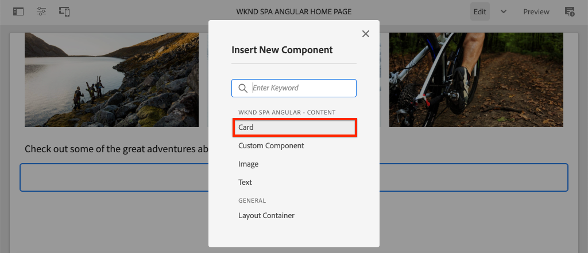

# Utöka en kärnkomponent {#extend-component}

Lär dig hur du utökar en befintlig Core Component som ska användas med AEM SPA Editor. Att förstå hur man utökar en befintlig komponent är en kraftfull teknik för att anpassa och utöka funktionerna i en AEM redigeringsimplementering.

## Syfte

1. Utöka en befintlig Core Component med ytterligare egenskaper och innehåll.
2. Förstå grunderna för komponentarv med användning av `sling:resourceSuperType`.
3. Lär dig använda [Delegeringsmönster](https://github.com/adobe/aem-core-wcm-components/wiki/Delegation-Pattern-for-Sling-Models) för Sling Models för att återanvända befintlig logik och funktionalitet.

## Vad du ska bygga

I det här kapitlet finns en ny `Card` -komponenten skapas. The `Card` -komponenten utökar [Image Core Component](https://experienceleague.adobe.com/docs/experience-manager-core-components/using/components/image.html) lägga till ytterligare innehållsfält som en titel och en Call To Action-knapp för att utföra rollen som teaser för annat innehåll i SPA.


>[!NOTE]
>
> I en implementering i verkligheten kan det vara lämpligare att använda [Teaser Component](https://experienceleague.adobe.com/docs/experience-manager-core-components/using/components/teaser.html) än att utöka [Image Core Component](https://experienceleague.adobe.com/docs/experience-manager-core-components/using/components/image.html) för att skapa `Card` -komponenten beroende på projektkraven. Det rekommenderas alltid att använda [Kärnkomponenter](https://experienceleague.adobe.com/docs/experience-manager-core-components/using/introduction.html) direkt om möjligt.

## Förutsättningar

Granska de verktyg och instruktioner som krävs för att ställa in en [lokal utvecklingsmiljö](overview.md#local-dev-environment).

### Hämta koden

1. Hämta startpunkten för den här självstudiekursen via Git:

   ```shell
   $ git clone git@github.com:adobe/aem-guides-wknd-spa.git
   $ cd aem-guides-wknd-spa
   $ git checkout Angular/extend-component-start
   ```

2. Distribuera kodbasen till en lokal AEM med Maven:

   ```shell
   $ mvn clean install -PautoInstallSinglePackage
   ```

   Om du använder [AEM 6.x](overview.md#compatibility) lägg till `classic` profil:

   ```shell
   $ mvn clean install -PautoInstallSinglePackage -Pclassic
   ```

3. Installera det färdiga paketet för det traditionella [WKND-referensplats](https://github.com/adobe/aem-guides-wknd/releases/tag/aem-guides-wknd-2.1.0). Bilderna från [WKND-referensplats](https://github.com/adobe/aem-guides-wknd/releases/latest) återanvänds på WKND-SPA. Paketet kan installeras med [AEM](http://localhost:4502/crx/packmgr/index.jsp).

   

Du kan alltid visa den färdiga koden på [GitHub](https://github.com/adobe/aem-guides-wknd-spa/tree/Angular/extend-component-solution) eller checka ut koden lokalt genom att växla till grenen `Angular/extend-component-solution`.

## Implementering av Inspect initial Card

En initial kortkomponent har tillhandahållits av kapitelstartkoden. Inspect som startpunkt för kortimplementeringen.

1. I den utvecklingsmiljö du väljer öppnar du `ui.apps` -modul.
2. Navigera till `ui.apps/src/main/content/jcr_root/apps/wknd-spa-angular/components/card` och visa `.content.xml` -fil.

   

   ```xml
   <?xml version="1.0" encoding="UTF-8"?>
   <jcr:root xmlns:sling="http://sling.apache.org/jcr/sling/1.0" xmlns:cq="http://www.day.com/jcr/cq/1.0" xmlns:jcr="http://www.jcp.org/jcr/1.0"
       jcr:primaryType="cq:Component"
       jcr:title="Card"
       sling:resourceSuperType="wknd-spa-angular/components/image"
       componentGroup="WKND SPA Angular - Content"/>
   ```

   Egenskapen `sling:resourceSuperType` pekar på `wknd-spa-angular/components/image` som anger att `Card` -komponenten ärver funktionaliteten från WKND SPA Image-komponenten.

3. Inspect filen `ui.apps/src/main/content/jcr_root/apps/wknd-spa-angular/components/image/.content.xml`:

   ```xml
   <?xml version="1.0" encoding="UTF-8"?>
   <jcr:root xmlns:sling="http://sling.apache.org/jcr/sling/1.0" xmlns:cq="http://www.day.com/jcr/cq/1.0" xmlns:jcr="http://www.jcp.org/jcr/1.0"
       jcr:primaryType="cq:Component"
       jcr:title="Image"
       sling:resourceSuperType="core/wcm/components/image/v2/image"
       componentGroup="WKND SPA Angular - Content"/>
   ```

   Observera att `sling:resourceSuperType` pekar på `core/wcm/components/image/v2/image`. Detta anger att WKND-SPA Image-komponenten ärver funktionaliteten från Core Component Image.

   Kallas även [Proxymönster](https://experienceleague.adobe.com/docs/experience-manager-core-components/using/developing/guidelines.html#proxy-component-pattern) Samling av resursarv är ett kraftfullt designmönster som tillåter att underordnade komponenter ärver funktioner och utökar/åsidosätter beteenden när det behövs. Sling-arv har stöd för flera arvsnivåer, så i slutändan är det nya `Card` -komponenten ärver kärnkomponentens funktioner.

   Många utvecklingsteam strävar efter att bli D.R.Y. (upprepa inte dig själv). Sling arv gör detta möjligt med AEM.

4. Under `card` öppna filen `_cq_dialog/.content.xml`.

   Den här filen är definitionen av komponentdialogrutan för `Card` -komponenten. Om du använder Samling-arv är det möjligt att använda funktionerna i [Samla resurser](https://experienceleague.adobe.com/docs/experience-manager-65/developing/platform/sling-resource-merger.html) om du vill åsidosätta eller utöka delar av dialogrutan. I det här exemplet har en ny flik lagts till i dialogrutan för att hämta ytterligare data från en författare som ska fylla i kortkomponenten.

   Egenskaper som `sling:orderBefore` låter en utvecklare välja var nya flikar eller formulärfält ska infogas. I det här fallet `Text` infogas före `asset` -fliken. Om du vill använda Sling Resource Merger fullt ut är det viktigt att du känner till den ursprungliga nodstrukturen i dialogrutan för [Dialogruta för bildkomponent](https://github.com/adobe/aem-core-wcm-components/blob/master/content/src/content/jcr_root/apps/core/wcm/components/image/v2/image/_cq_dialog/.content.xml).

5. Under `card` öppna filen `_cq_editConfig.xml`. Den här filen styr dra och släpp-beteendet i AEM redigeringsgränssnitt. När du utökar bildkomponenten är det viktigt att resurstypen matchar själva komponenten. Granska `<parameters>` nod:

   ```xml
   <parameters
       jcr:primaryType="nt:unstructured"
       sling:resourceType="wknd-spa-angular/components/card"
       imageCrop=""
       imageMap=""
       imageRotate=""/>
   ```

   De flesta komponenter kräver ingen `cq:editConfig`, bilden och de underordnade för bildkomponenten är undantag.

6. I IDE växlar du till `ui.frontend` modul, navigera till `ui.frontend/src/app/components/card`:

   

7. Inspect filen `card.component.ts`.

   Komponenten har redan stuvats ut för att mappa till AEM `Card` Komponent som använder standarden `MapTo` funktion.

   ```js
   MapTo('wknd-spa-angular/components/card')(CardComponent, CardEditConfig);
   ```

   Granska de tre `@Input` parametrar i klassen för `src`, `alt`och `title`. Dessa är förväntade JSON-värden från AEM som mappas till komponenten Angular.

8. Öppna filen `card.component.html`:

   ```html
   <div class="card"  *ngIf="hasContent">
       <app-image class="card__image" [src]="src" [alt]="alt" [title]="title"></app-image>
   </div>
   ```

   I det här exemplet valde vi att återanvända den befintliga Angularna Image-komponent `app-image` genom att helt enkelt skicka `@Input` parametrar från `card.component.ts`. Senare i självstudiekursen läggs ytterligare egenskaper till och visas.

## Uppdatera mallprincipen

Med denna inledande `Card` implementeringen granskar funktionen i AEM SPA Editor. Så här ser du de inledande `Card` -komponenten måste mallprincipen uppdateras.

1. Distribuera startkoden till en lokal instans av AEM, om du inte redan har gjort det:

   ```shell
   $ cd aem-guides-wknd-spa
   $ mvn clean install -PautoInstallSinglePackage
   ```

2. Navigera till SPA sidmall på [http://localhost:4502/editor.html/conf/wknd-spa-angular/settings/wcm/templates/spa-page-template/structure.html](http://localhost:4502/editor.html/conf/wknd-spa-angular/settings/wcm/templates/spa-page-template/structure.html).
3. Uppdatera layoutbehållarens profil för att lägga till den nya `Card` -komponent som en tillåten komponent:

   

   Spara ändringarna i profilen och observera `Card` -komponent som en tillåten komponent:

   

## Initialkortskomponent för författare

Nästa steg är att skapa `Card` med AEM SPA Editor.

1. Navigera till [http://localhost:4502/editor.html/content/wknd-spa-angular/us/en/home.html](http://localhost:4502/editor.html/content/wknd-spa-angular/us/en/home.html).
2. I `Edit` läge, lägga till `Card` -komponenten till `Layout Container`:

   

3. Dra och släpp en bild från Resurssökaren till `Card` komponent:

   

4. Öppna `Card` och lägg märke till att en **Text** Tabb.
5. Ange följande värden på **Text** tab:

   

   **Kortsökväg** - välj en sida under SPA.

   **CTA-text** -&quot;Läs mer&quot;

   **Korttitel** - lämna tomt

   **Hämta rubrik från länkad sida** - markera kryssrutan för att ange true.

6. Uppdatera **Resursmetadata** för att lägga till värden för **Alternativ text** och **Bildtext**.

   Inga ytterligare ändringar visas efter att dialogrutan har uppdaterats. Om du vill visa de nya fälten för komponenten Angular måste vi uppdatera Sling Model för `Card` -komponenten.

7. Öppna en ny flik och navigera till [CRXDE-Lite](http://localhost:4502/crx/de/index.jsp#/content/wknd-spa-angular/us/en/home/jcr%3Acontent/root/responsivegrid/card). Inspect the content nodes below `/content/wknd-spa-angular/us/en/home/jcr:content/root/responsivegrid` för att hitta `Card` komponentinnehåll.

   

   Observera dessa egenskaper `cardPath`, `ctaText`, `titleFromPage` bevaras av dialogrutan.

## Uppdatera kortförsäljningsmodell

För att slutligen visa värdena från komponentdialogrutan för komponenten Angular måste vi uppdatera Sling Model som fyller i JSON för `Card` -komponenten. Vi har också möjlighet att implementera två affärslogikfunktioner:

* If `titleFromPage` till **true**, returnerar sidans rubrik som anges av `cardPath` annars returneras värdet för `cardTitle` textfält.
* Returnera det senaste ändringsdatumet för sidan som anges av `cardPath`.

Gå tillbaka till den utvecklingsmiljö du valt och öppna `core` -modul.

1. Öppna filen `Card.java` på `core/src/main/java/com/adobe/aem/guides/wknd/spa/angular/core/models/Card.java`.

   Observera att `Card` gränssnitt utökar för närvarande `com.adobe.cq.wcm.core.components.models.Image` och ärver därför metoderna i `Image` gränssnitt. The `Image` gränssnittet utökar redan `ComponentExporter` -gränssnitt som gör att Sling Model kan exporteras som JSON och mappas av SPA redigerare. Därför behöver vi inte uttryckligen utöka `ComponentExporter` som i [Anpassat komponentkapitel](custom-component.md).

2. Lägg till följande metoder i gränssnittet:

   ```java
   @ProviderType
   public interface Card extends Image {
   
       /***
       * The URL to populate the CTA button as part of the card.
       * The link should be based on the cardPath property that points to a page.
       * @return String URL
       */
       public String getCtaLinkURL();
   
       /***
       * The text to display on the CTA button of the card.
       * @return String CTA text
       */
       public String getCtaText();
   
   
   
       /***
       * The date to be displayed as part of the card.
       * This is based on the last modified date of the page specified by the cardPath
       * @return
       */
       public Calendar getCardLastModified();
   
   
       /**
       * Return the title of the page specified by cardPath if `titleFromPage` is set to true.
       * Otherwise return the value of `cardTitle`
       * @return
       */
       public String getCardTitle();
   }
   ```

   Dessa metoder exponeras via JSON-modellens API och skickas till Angular-komponenten.

3. Öppna `CardImpl.java`. Detta är genomförandet av `Card.java` gränssnitt. Implementeringen har delvis stoppats för att snabba upp självstudiekursen.  Lägg märke till att `@Model` och `@Exporter` annoteringar för att säkerställa att Sling-modellen kan serialiseras som JSON via Sling Model Exporter.

   `CardImpl.java` använder [Delegeringsmönster för segmenteringsmodeller](https://github.com/adobe/aem-core-wcm-components/wiki/Delegation-Pattern-for-Sling-Models) för att undvika att skriva om logiken från Image Core-komponenten.

4. Observera följande rader:

   ```java
   @Self
   @Via(type = ResourceSuperType.class)
   private Image image;
   ```

   Anteckningen ovan instansierar ett bildobjekt med namnet `image` baserat på `sling:resourceSuperType` arv av `Card` -komponenten.

   ```java
   @Override
   public String getSrc() {
       return null != image ? image.getSrc() : null;
   }
   ```

   Då kan du helt enkelt använda `image` -objekt som implementerar metoder som definieras av `Image` utan att behöva skriva själva logiken. Den här tekniken används för `getSrc()`, `getAlt()`och `getTitle()`.

5. Implementera sedan `initModel()` metod för att initiera en privat variabel `cardPage` baserat på värdet av `cardPath`

   ```java
   @PostConstruct
   public void initModel() {
       if(StringUtils.isNotBlank(cardPath) && pageManager != null) {
           cardPage = pageManager.getPage(this.cardPath);
       }
   }
   ```

   The `@PostConstruct initModel()` anropas när delningsmodellen initieras, därför är det en bra möjlighet att initiera objekt som kan användas av andra metoder i modellen. The `pageManager` är en av flera [Java™-baserade globala objekt](https://experienceleague.adobe.com/docs/experience-manager-htl/content/global-objects.html) som är tillgängliga för Sling Models via `@ScriptVariable` anteckning. The [getPage](https://developer.adobe.com/experience-manager/reference-materials/cloud-service/javadoc/com/day/cq/wcm/api/PageManager.html) metoden tar in en bana och returnerar en AEM [Sida](https://developer.adobe.com/experience-manager/reference-materials/cloud-service/javadoc/com/day/cq/wcm/api/Page.html) eller null om sökvägen inte pekar på en giltig sida.

   Detta initierar `cardPage` variabel, som används av andra nya metoder för att returnera data om den underliggande länkade sidan.

6. Granska de globala variabler som redan är mappade till JCR-egenskaperna som sparade författardialogrutan. The `@ValueMapValue` Anteckningen används för att automatiskt utföra mappningen.

   ```java
   @ValueMapValue
   private String cardPath;
   
   @ValueMapValue
   private String ctaText;
   
   @ValueMapValue
   private boolean titleFromPage;
   
   @ValueMapValue
   private String cardTitle;
   ```

   Dessa variabler används för att implementera ytterligare metoder för `Card.java` gränssnitt.

7. Implementera de ytterligare metoder som definieras i `Card.java` gränssnitt:

   ```java
   @Override
   public String getCtaLinkURL() {
       if(cardPage != null) {
           return cardPage.getPath() + ".html";
       }
       return null;
   }
   
   @Override
   public String getCtaText() {
       return ctaText;
   }
   
   @Override
   public Calendar getCardLastModified() {
      if(cardPage != null) {
          return cardPage.getLastModified();
      }
      return null;
   }
   
   @Override
   public String getCardTitle() {
       if(titleFromPage) {
           return cardPage != null ? cardPage.getTitle() : null;
       }
       return cardTitle;
   }
   ```

   >[!NOTE]
   >
   > Du kan visa [färdigt CardImpl.java här](https://github.com/adobe/aem-guides-wknd-spa/blob/Angular/extend-component-solution/core/src/main/java/com/adobe/aem/guides/wknd/spa/angular/core/models/impl/CardImpl.java).

8. Öppna ett terminalfönster och distribuera bara uppdateringarna till `core` modul som använder Maven `autoInstallBundle` från `core` katalog.

   ```shell
   $ cd core/
   $ mvn clean install -PautoInstallBundle
   ```

   Om du använder [AEM 6.x](overview.md#compatibility) lägg till `classic` profil.

9. Visa JSON-modellsvaret på: [http://localhost:4502/content/wknd-spa-angular/us/en.model.json](http://localhost:4502/content/wknd-spa-angular/us/en.model.json) och söka efter `wknd-spa-angular/components/card`:

   ```json
   "card": {
       "ctaText": "Read More",
       "cardTitle": "Page 1",
       "title": "Woman chillaxing with river views in Australian bushland",
       "src": "/content/wknd-spa-angular/us/en/home/_jcr_content/root/responsivegrid/card.coreimg.jpeg/1595190732886/adobestock-216674449.jpeg",
       "alt": "Female sitting on a large rock relaxing in afternoon dappled light the Australian bushland with views over the river",
       "cardLastModified": 1591360492414,
       "ctaLinkURL": "/content/wknd-spa-angular/us/en/home/page-1.html",
       ":type": "wknd-spa-angular/components/card"
   }
   ```

   Observera att JSON-modellen uppdateras med ytterligare nyckel/värde-par efter att metoderna i `CardImpl` Sling Model.

## Uppdatera Angular-komponent

Nu när JSON-modellen har fyllts i med nya egenskaper för `ctaLinkURL`, `ctaText`, `cardTitle`och `cardLastModified` kan vi uppdatera Angularna så att den visas.

1. Återgå till utvecklingsmiljön och öppna `ui.frontend` -modul. Du kan också starta webbpaketets dev-server från ett nytt terminalfönster för att se ändringarna i realtid:

   ```shell
   $ cd ui.frontend
   $ npm install
   $ npm start
   ```

2. Öppna `card.component.ts` på `ui.frontend/src/app/components/card/card.component.ts`. Lägg till ytterligare `@Input` anteckningar för att fånga den nya modellen:

   ```diff
   export class CardComponent implements OnInit {
   
        @Input() src: string;
        @Input() alt: string;
        @Input() title: string;
   +    @Input() cardTitle: string;
   +    @Input() cardLastModified: number;
   +    @Input() ctaLinkURL: string;
   +    @Input() ctaText: string;
   ```

3. Lägg till metoder för att kontrollera om Call to Action är klart och för att returnera en datum/tid-sträng baserat på `cardLastModified` indata:

   ```js
   export class CardComponent implements OnInit {
       ...
       get hasCTA(): boolean {
           return this.ctaLinkURL && this.ctaLinkURL.trim().length > 0 && this.ctaText && this.ctaText.trim().length > 0;
       }
   
       get lastModifiedDate(): string {
           const lastModifiedDate = this.cardLastModified ? new Date(this.cardLastModified) : null;
   
           if (lastModifiedDate) {
           return lastModifiedDate.toLocaleDateString();
           }
           return null;
       }
       ...
   }
   ```

4. Öppna `card.component.html` och lägg till följande kod för att visa rubriken, anropet till åtgärd och det senast ändrade datumet:

   ```html
   <div class="card"  *ngIf="hasContent">
       <app-image class="card__image" [src]="src" [alt]="alt" [title]="title"></app-image>
       <div class="card__content">
           <h2 class="card__title">
               {{cardTitle}}
               <span class="card__lastmod" *ngIf="lastModifiedDate">{{lastModifiedDate}}</span>
           </h2>
           <div class="card__action-container" *ngIf="hasCTA">
               <a [routerLink]="ctaLinkURL" class="card__action-link" [title]="ctaText">
                   {{ctaText}}
               </a>
           </div>
       </div>
   </div>
   ```

   Sass-regler har redan lagts till på `card.component.scss` om du vill formatera titeln, anropa till åtgärd och datum för senaste ändring.

   >[!NOTE]
   >
   > Du kan visa det färdiga [Angular card component code here](https://github.com/adobe/aem-guides-wknd-spa/tree/Angular/extend-component-solution/ui.frontend/src/app/components/card).

5. Använd de fullständiga ändringarna i AEM från projektets rot i Maven:

   ```shell
   $ cd aem-guides-wknd-spa
   $ mvn clean install -PautoInstallSinglePackage
   ```

6. Navigera till [http://localhost:4502/editor.html/content/wknd-spa-angular/us/en/home.html](http://localhost:4502/editor.html/content/wknd-spa-angular/us/en/home.html) för att se den uppdaterade komponenten:

   

7. Du bör kunna omskapa det befintliga innehållet för att skapa en sida som ser ut ungefär så här:

   

## Grattis! {#congratulations}

Grattis! Du har lärt dig hur du utökar en AEM och hur Sling-modeller och dialogrutor fungerar med JSON-modellen.

Du kan alltid visa den färdiga koden på [GitHub](https://github.com/adobe/aem-guides-wknd-spa/tree/Angular/extend-component-solution) eller checka ut koden lokalt genom att växla till grenen `Angular/extend-component-solution`.
