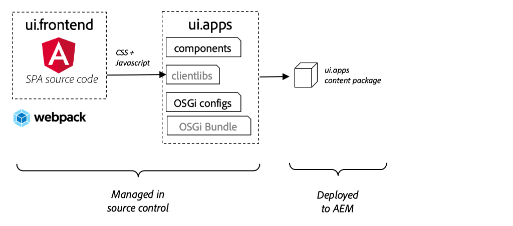

# Integrera en SPA {#integrate-spa}

{{spa-editor-deprecation}}

Förstå hur källkoden för ett SPA-program (Single Page Application) skrivet i Angular kan integreras med ett Adobe Experience Manager-projekt (AEM). Lär dig använda moderna front-end-verktyg, som en webpack-dev-server, för att snabbt utveckla SPA mot AEM JSON-modellens API.

## Syfte

1. Förstå hur SPA-projektet integreras med AEM med klientbibliotek.
2. Lär dig hur du använder en lokal utvecklingsserver för dedikerad frontendutveckling.
3. Utforska användningen av en **proxy**- och statisk **mock**-fil för utveckling mot AEM JSON-modell-API

## Vad du ska bygga

I det här kapitlet läggs en enkel `Header`-komponent till i SPA-filen. Under processen att skapa den här statiska `Header`-komponenten används flera metoder för utveckling av AEM SPA.


*SPA utökas för att lägga till en statisk `Header`-komponent*

## Förutsättningar

Granska de verktyg och instruktioner som krävs för att konfigurera en [lokal utvecklingsmiljö](overview.md#local-dev-environment).

### Hämta koden

1. Hämta startpunkten för den här självstudiekursen via Git:

   ```shell
   $ git clone git@github.com:adobe/aem-guides-wknd-spa.git
   $ cd aem-guides-wknd-spa
   $ git checkout Angular/integrate-spa-start
   ```

2. Distribuera kodbasen till en lokal AEM-instans med Maven:

   ```shell
   $ mvn clean install -PautoInstallSinglePackage
   ```

   Om du använder [AEM 6.x](overview.md#compatibility) lägger du till profilen `classic`:

   ```shell
   $ mvn clean install -PautoInstallSinglePackage -Pclassic
   ```

Du kan alltid visa den färdiga koden på [GitHub](https://github.com/adobe/aem-guides-wknd-spa/tree/Angular/integrate-spa-solution) eller checka ut koden lokalt genom att växla till grenen `Angular/integrate-spa-solution`.

## Integreringsmetod {#integration-approach}

Två moduler skapades som en del av AEM-projektet: `ui.apps` och `ui.frontend`.

Modulen `ui.frontend` är ett [webpack](https://webpack.js.org/)-projekt som innehåller all SPA-källkod. Huvuddelen av utvecklingen och testningen av SPA görs i webbpaketsprojektet. När en produktionsbygge utlöses byggs och kompileras SPA med webbpack. De kompilerade artefakterna (CSS och Javascript) kopieras till modulen `ui.apps` som sedan distribueras till AEM.



*En högnivåbild av SPA-integreringen.*

Ytterligare information om Front-end-bygget finns [här](https://experienceleague.adobe.com/docs/experience-manager-core-components/using/developing/archetype/uifrontend-angular.html).

## Inspektera SPA-integreringen {#inspect-spa-integration}

Granska sedan modulen `ui.frontend` för att förstå SPA-filen som har genererats automatiskt av [AEM Project-arkivtypen](https://experienceleague.adobe.com/docs/experience-manager-core-components/using/developing/archetype/uifrontend-angular.html).

1. Öppna AEM Project för WKND SPA i den utvecklingsmiljö du valt. I den här självstudien används [Visual Studio-kod-IDE](https://experienceleague.adobe.com/docs/experience-manager-learn/cloud-service/local-development-environment-set-up/development-tools.html#microsoft-visual-studio-code).

   

2. Expandera och inspektera mappen `ui.frontend`. Öppna filen `ui.frontend/package.json`

3. Under `dependencies` ska du se flera relaterade till `@angular`:

   ```json
   "@angular/animations": "~9.1.11",
   "@angular/common": "~9.1.11",
   "@angular/compiler": "~9.1.11",
   "@angular/core": "~9.1.11",
   "@angular/forms": "~9.1.10",
   "@angular/platform-browser": "~9.1.10",
   "@angular/platform-browser-dynamic": "~9.1.10",
   "@angular/router": "~9.1.10",
   ```

   Modulen `ui.frontend` är ett [Angular-program](https://angular.io) som genereras med [Angular CLI-verktyget](https://angular.io/cli) som innehåller routning.

4. Det finns även tre beroenden som har prefixats med `@adobe`:

   ```json
   "@adobe/cq-angular-editable-components": "^2.0.2",
   "@adobe/cq-spa-component-mapping": "^1.0.3",
   "@adobe/cq-spa-page-model-manager": "^1.1.3",
   ```

   Ovanstående moduler utgör [AEM SPA Editor JS SDK](https://experienceleague.adobe.com/docs/experience-manager-65/developing/headless/spas/spa-blueprint.html) och tillhandahåller funktioner som gör det möjligt att mappa SPA-komponenter till AEM-komponenter.

5. I filen `package.json` definieras flera `scripts`:

   ```json
   "scripts": {
       "start": "ng serve --open --proxy-config ./proxy.conf.json",
       "build": "ng lint && ng build && clientlib",
       "build:production": "ng lint && ng build --prod && clientlib",
       "test": "ng test",
       "sync": "aemsync -d -w ../ui.apps/src/main/content"
   }
   ```

   Dessa skript baseras på [Angular CLI-kommandon](https://angular.io/cli/build) men har ändrats något för att fungera med det större AEM-projektet.

   `start` - kör Angular-programmet lokalt med en lokal webbserver. Den har uppdaterats för att proxyvisa innehållet i den lokala AEM-instansen.

   `build` - kompilerar Angular-appen för produktionsdistribution. Tillägget av `&& clientlib` ansvarar för att kopiera den kompilerade SPA-filen till modulen `ui.apps` som ett klientbibliotek under ett bygge. NPM-modulen [aem-clientlib-generator](https://github.com/wcm-io-frontend/aem-clientlib-generator) används för att underlätta detta.

   Mer information om tillgängliga skript finns [här](https://experienceleague.adobe.com/docs/experience-manager-core-components/using/developing/archetype/uifrontend-angular.html).

6. Granska filen `ui.frontend/clientlib.config.js`. Den här konfigurationsfilen används av [aem-clientlib-generator](https://github.com/wcm-io-frontend/aem-clientlib-generator#clientlibconfigjs) för att avgöra hur klientbiblioteket ska genereras.

7. Granska filen `ui.frontend/pom.xml`. Den här filen omvandlar mappen `ui.frontend` till en [Maven-modul](https://maven.apache.org/guides/mini/guide-multiple-modules.html). Filen `pom.xml` har uppdaterats för att använda SPA-filen [front-maven-plugin](https://github.com/eirslett/frontend-maven-plugin) till **test** och **build** under en Maven-konstruktion.

8. Granska filen `app.component.ts` vid `ui.frontend/src/app/app.component.ts`:

   ```js
   import { Constants } from '@adobe/cq-angular-editable-components';
   import { ModelManager } from '@adobe/cq-spa-page-model-manager';
   import { Component } from '@angular/core';
   
   @Component({
   selector: '#spa-root', // tslint:disable-line
   styleUrls: ['./app.component.css'],
   templateUrl: './app.component.html'
   })
   export class AppComponent {
       ...
   
       constructor() {
           ModelManager.initialize().then(this.updateData);
       }
   
       private updateData = pageModel => {
           this.path = pageModel[Constants.PATH_PROP];
           this.items = pageModel[Constants.ITEMS_PROP];
           this.itemsOrder = pageModel[Constants.ITEMS_ORDER_PROP];
       }
   }
   ```

   `app.component.js` är ingångspunkten för SPA. `ModelManager` tillhandahålls av AEM SPA Editor JS SDK. Den ansvarar för att anropa och injicera `pageModel` (JSON-innehållet) i programmet.

## Lägga till en rubrikkomponent {#header-component}

Lägg sedan till en ny komponent i SPA och distribuera ändringarna till en lokal AEM-instans för att se integreringen.

1. Öppna ett nytt terminalfönster och navigera till mappen `ui.frontend`:

   ```shell
   $ cd aem-guides-wknd-spa/ui.frontend
   ```

2. Installera [Angular CLI](https://angular.io/cli#installing-angular-cli) globalt Detta används för att generera Angular-komponenter samt för att skapa och betjäna Angular-programmet via kommandot **ng**.

   ```shell
   $ npm install -g @angular/cli
   ```

   >[!CAUTION]
   >
   > Den version av **@angular/cli** som används av det här projektet är **9.1.7**. Vi rekommenderar att du håller Angular CLI-versionerna synkroniserade.

3. Skapa en ny `Header`-komponent genom att köra Angular CLI `ng generate component`-kommandot inifrån mappen `ui.frontend`.

   ```shell
   $ ng generate component components/header
   
   CREATE src/app/components/header/header.component.css (0 bytes)
   CREATE src/app/components/header/header.component.html (21 bytes)
   CREATE src/app/components/header/header.component.spec.ts (628 bytes)
   CREATE src/app/components/header/header.component.ts (269 bytes)
   UPDATE src/app/app.module.ts (1809 bytes)
   ```

   Detta skapar ett skelett för den nya Angular Header-komponenten på `ui.frontend/src/app/components/header`.

4. Öppna projektet `aem-guides-wknd-spa` i den utvecklingsmiljö du vill använda. Navigera till mappen `ui.frontend/src/app/components/header`.

   

5. Öppna filen `header.component.html` och ersätt innehållet med följande:

   ```html
   <!--/* header.component.html */-->
   <header className="header">
       <div className="header-container">
           <h1>WKND</h1>
       </div>
   </header>
   ```

   Observera att detta visar statiskt innehåll, så den här Angular-komponenten behöver inte justeras till standardgenererade `header.component.ts`.

6. Öppna filen **app.component.html** på `ui.frontend/src/app/app.component.html`. Lägg till `app-header`:

   ```html
   <app-header></app-header>
   <router-outlet></router-outlet>
   ```

   Detta inkluderar `header`-komponenten ovanför allt sidinnehåll.

7. Öppna en ny terminal och navigera till mappen `ui.frontend` och kör kommandot `npm run build`:

   ```shell
   $ cd ui.frontend
   $ npm run build
   
   Linting "angular-app"...
   All files pass linting.
   Generating ES5 bundles for differential loading...
   ES5 bundle generation complete.
   ```

8. Navigera till mappen `ui.apps`. Under `ui.apps/src/main/content/jcr_root/apps/wknd-spa-angular/clientlibs/clientlib-angular` bör du se att de kompilerade SPA-filerna har kopierats från mappen `ui.frontend/build`.

   

9. Återgå till terminalen och navigera till mappen `ui.apps`. Kör följande Maven-kommando:

   ```shell
   $ cd ../ui.apps
   $ mvn clean install -PautoInstallPackage
   ...
   [INFO] ------------------------------------------------------------------------
   [INFO] BUILD SUCCESS
   [INFO] ------------------------------------------------------------------------
   [INFO] Total time:  9.629 s
   [INFO] Finished at: 2020-05-04T17:48:07-07:00
   [INFO] ------------------------------------------------------------------------
   ```

   Detta distribuerar paketet `ui.apps` till en lokal instans av AEM som körs.

10. Öppna en webbläsarflik och gå till [http://localhost:4502/editor.html/content/wknd-spa-angular/us/en/home.html](http://localhost:4502/editor.html/content/wknd-spa-angular/us/en/home.html). Nu bör du se innehållet i komponenten `Header` som visas i SPA.

   

   Steg **7-9** körs automatiskt när en Maven-bygge utlöses från projektets rot (dvs. `mvn clean install -PautoInstallSinglePackage`). Nu bör du förstå grunderna i integrationen mellan SPA och AEM klientbibliotek. Observera att du fortfarande kan redigera och lägga till `Text`-komponenter i AEM, men `Header`-komponenten kan inte redigeras.

## Webpack Dev Server - Proxy för JSON API {#proxy-json}

Så som vi sett i tidigare övningar tar det några minuter att skapa och synkronisera klientbiblioteket till en lokal instans av AEM. Detta är godtagbart för sluttestning, men är inte idealiskt för större delen av SPA-utvecklingen.

Du kan använda en [webpack-dev-server](https://webpack.js.org/configuration/dev-server/) för att snabbt utveckla SPA. SPA drivs av en JSON-modell som genererats av AEM. I den här övningen är JSON-innehållet från en instans av AEM **proxied** till den utvecklingsserver som konfigurerats av [Angular-projektet](https://angular.io/guide/build).

1. Gå tillbaka till IDE och öppna filen **proxy.conf.json** på `ui.frontend/proxy.conf.json`.

   ```json
   [
       {
           "context": [
                       "/content/**/*.(jpg|jpeg|png|model.json)",
                       "/etc.clientlibs/**/*"
                   ],
           "target": "http://localhost:4502",
           "auth": "admin:admin",
           "logLevel": "debug"
       }
   ]
   ```

   Med [Angular-appen](https://angular.io/guide/build#proxying-to-a-backend-server) får du en enkel mekanism för att hantera proxy-API-begäranden. Mönstren som anges i `context` proxideras via `localhost:4502`, den lokala AEM-snabbstarten.

2. Öppna filen **index.html** vid `ui.frontend/src/index.html`. Detta är HTML-rotfilen som används av dev-servern.

   Observera att det finns en post för `base href="/"`. [bastaggen](https://angular.io/guide/deployment#the-base-tag) är viktig för att programmet ska kunna matcha relativa URL-adresser.

   ```html
   <base href="/">
   ```

3. Öppna ett terminalfönster och navigera till mappen `ui.frontend`. Kör kommandot `npm start`:

   ```shell
   $ cd ui.frontend
   $ npm start
   
   > wknd-spa-angular@0.1.0 start /Users/dgordon/Documents/code/aem-guides-wknd-spa/ui.frontend
   > ng serve --open --proxy-config ./proxy.conf.json
   
   10% building 3/3 modules 0 active[HPM] Proxy created: [ '/content/**/*.(jpg|jpeg|png|model.json)', '/etc.clientlibs/**/*' ]  ->  http://localhost:4502
   [HPM] Subscribed to http-proxy events:  [ 'error', 'close' ]
   ℹ ｢wds｣: Project is running at http://localhost:4200/webpack-dev-server/
   ℹ ｢wds｣: webpack output is served from /
   ℹ ｢wds｣: 404s will fallback to //index.html
   ```

4. Öppna en ny flik i webbläsaren (om den inte redan är öppen) och gå till [http://localhost:4200/content/wknd-spa-angular/us/en/home.html](http://localhost:4200/content/wknd-spa-angular/us/en/home.html).

   

   Du bör se samma innehåll som i AEM, men utan att någon av redigeringsfunktionerna är aktiverade.

5. Återgå till IDE och skapa en ny mapp med namnet `img` på `ui.frontend/src/assets`.
6. Hämta och lägg till följande WKND-logotyp i mappen `img`:

   

7. Öppna **header.component.html** at `ui.frontend/src/app/components/header/header.component.html` och inkludera logotypen:

   ```html
   <header class="header">
       <div class="header-container">
           <div class="logo">
               
           </div>
       </div>
   </header>
   ```

   Spara ändringarna i **header.component.html**.

8. Återgå till webbläsaren. Du bör omedelbart se ändringarna av appen återspeglas.

   

   Du kan fortsätta att göra innehållsuppdateringar i **AEM** och se hur de återspeglas i **webbpaketets dev-server** eftersom vi proxyerar innehållet. Observera att innehållsändringarna bara visas på **webbpaketets dev-server**.

9. Stoppa den lokala webbservern med `ctrl+c` i terminalen.

## Webpack Dev Server - Mock JSON API {#mock-json}

Ett annat sätt att snabbt utveckla är att använda en statisk JSON-fil som fungerar som JSON-modell. Genom att&quot;maska&quot; JSON tar vi bort beroendet av en lokal AEM-instans. Den gör det också möjligt för en frontendutvecklare att uppdatera JSON-modellen för att testa funktionalitet och driva ändringar i JSON API som senare skulle implementeras av en backend-utvecklare.

Den första konfigurationen av modell-JSON kräver **en lokal AEM-instans**.

1. Gå till [http://localhost:4502/content/wknd-spa-angular/us/en.model.json](http://localhost:4502/content/wknd-spa-angular/us/en.model.json) i webbläsaren.

   Detta är den JSON som exporteras av AEM och som driver programmet. Kopiera JSON-utdata.

2. Gå tillbaka till IDE, navigera till `ui.frontend/src` och lägg till nya mappar med namnen **mocks** och **json** så att de matchar följande mappstruktur:

   ```plain
   |-- ui.frontend
       |-- src
           |-- mocks
               |-- json
   ```

3. Skapa en ny fil med namnet **en.model.json** under `ui.frontend/public/mocks/json`. Klistra in JSON-utdata från **Steg 1** här.

   

4. Skapa en ny fil **proxy.mock.conf.json** under `ui.frontend`. Fyll filen med följande:

   ```json
   [
       {
       "context": [
           "/content/**/*.model.json"
       ],
       "pathRewrite": { "^/content/wknd-spa-angular/us" : "/mocks/json"} ,
       "target": "http://localhost:4200",
       "logLevel": "debug"
       }
   ]
   ```

   Den här proxykonfigurationen skriver om begäranden som börjar med `/content/wknd-spa-angular/us` med `/mocks/json` och betjänar motsvarande statiska JSON-fil, till exempel:

   ```plain
   /content/wknd-spa-angular/us/en.model.json -> /mocks/json/en.model.json
   ```

5. Öppna filen **angular.json**. Lägg till en ny **dev**-konfiguration med en uppdaterad **assets** -array som refererar till den **mocks**-mapp som skapats.

   ```json
    "dev": {
             "assets": [
               "src/mocks",
               "src/assets",
               "src/favicon.ico",
               "src/logo192.png",
               "src/logo512.png",
               "src/manifest.json"
             ]
       },
   ```

   

   Genom att skapa en dedikerad **dev**-konfiguration försäkrar du dig om att mappen **mocks** bara används under utvecklingen och aldrig distribueras till AEM i en produktionsversion.

6. I filen **angular.json** uppdaterar du **browserTarget** -konfigurationen till den nya **dev** -konfigurationen:

   ```diff
     ...
     "serve": {
         "builder": "@angular-devkit/build-angular:dev-server",
         "options": {
   +       "browserTarget": "angular-app:build:dev"
   -       "browserTarget": "angular-app:build"
         },
     ...
   ```

   

7. Öppna filen `ui.frontend/package.json` och lägg till ett nytt **start:mock**-kommando som refererar till filen **proxy.mock.conf.json**.

   ```diff
       "scripts": {
           "start": "ng serve --open --proxy-config ./proxy.conf.json",
   +       "start:mock": "ng serve --open --proxy-config ./proxy.mock.conf.json",
           "build": "ng lint && ng build && clientlib",
           "build:production": "ng lint && ng build --prod && clientlib",
           "test": "ng test",
           "sync": "aemsync -d -w ../ui.apps/src/main/content"
       }
   ```

   Om du lägger till ett nytt kommando är det enkelt att växla mellan proxykonfigurationerna.

8. Om den körs just nu stoppar du **webbpaketets dev-server**. Starta **webbpaketets dev-server** med skriptet **start:mock**:

   ```shell
   $ npm run start:mock
   
   > wknd-spa-angular@0.1.0 start:mock /Users/dgordon/Documents/code/aem-guides-wknd-spa/ui.frontend
   > ng serve --open --proxy-config ./proxy.mock.conf.json
   ```

   Navigera till [http://localhost:4200/content/wknd-spa-angular/us/en/home.html](http://localhost:4200/content/wknd-spa-angular/us/en/home.html) och se samma SPA men innehållet hämtas nu från JSON-filen **mock** .

9. Gör en liten ändring i filen **en.model.json** som skapades tidigare. Det uppdaterade innehållet bör omedelbart återspeglas i **webbpaketets dev-server**.

   

   Att kunna manipulera JSON-modellen och se effekterna på en aktiv SPA kan hjälpa en utvecklare att förstå JSON-modellens API. Det gör det även möjligt att utveckla både fram- och bakände parallellt.

## Lägg till format med Sass

Därefter läggs en del uppdaterade format till i projektet. Det här projektet lägger till [Sass](https://sass-lang.com/)-stöd för några användbara funktioner som variabler.

1. Öppna ett terminalfönster och stoppa **webpack-dev-servern** om den startas. I mappen `ui.frontend` anger du följande kommando för att uppdatera Angular-appen så att **.scss** -filer bearbetas.

   ```shell
   $ cd ui.frontend
   $ ng config schematics.@schematics/angular:component.styleext scss
   ```

   Då uppdateras filen `angular.json` med en ny post längst ned i filen:

   ```json
   "schematics": {
       "@schematics/angular:component": {
       "styleext": "scss"
       }
   }
   ```

2. Installera `normalize-scss` om du vill normalisera formaten i olika webbläsare:

   ```shell
   $ npm install normalize-scss --save
   ```

3. Återgå till IDE och skapa en ny mapp med namnet `styles` under `ui.frontend/src`.
4. Skapa en ny fil under `ui.frontend/src/styles` med namnet `_variables.scss` och fyll i den med följande variabler:

   ```scss
   //_variables.scss
   
   //== Colors
   //
   //## Gray and brand colors for use across theme.
   
   $black:                  #202020;
   $gray:                   #696969;
   $gray-light:             #EBEBEB;
   $gray-lighter:           #F7F7F7;
   $white:                  #FFFFFF;
   $yellow:                 #FFEA00;
   $blue:                   #0045FF;
   
   
   //== Typography
   //
   //## Font, line-height, and color for body text, headings, and more.
   
   $font-family-sans-serif:  "Helvetica Neue", Helvetica, Arial, sans-serif;
   $font-family-serif:       Georgia, "Times New Roman", Times, serif;
   $font-family-base:        $font-family-sans-serif;
   $font-size-base:          18px;
   
   $line-height-base:        1.5;
   $line-height-computed:    floor(($font-size-base * $line-height-base));
   
   // Functional Colors
   $brand-primary:             $yellow;
   $body-bg:                   $white;
   $text-color:                $black;
   $text-color-inverse:        $gray-light;
   $link-color:                $blue;
   
   //Layout
   $max-width: 1024px;
   $header-height: 75px;
   
   // Spacing
   $gutter-padding: 12px;
   ```

5. Byt namn på filtillägget **styles.css** vid `ui.frontend/src/styles.css` till **styles.scss**. Ersätt innehållet med följande:

   ```scss
   /* styles.scss * /
   
   /* Normalize */
   @import '~normalize-scss/sass/normalize';
   
   @import './styles/variables';
   
   body {
       background-color: $body-bg;
       font-family: $font-family-base;
       margin: 0;
       padding: 0;
       font-size: $font-size-base;
       text-align: left;
       color: $text-color;
       line-height: $line-height-base;
   }
   
   body.page {
       max-width: $max-width;
       margin: 0 auto;
       padding: $gutter-padding;
       padding-top: $header-height;
   }
   ```

6. Uppdatera **angular.json** och ge alla referenser till **style.css** ett nytt namn med **styles.scss**. Det ska finnas tre referenser.

   ```diff
     "styles": [
   -    "src/styles.css"
   +    "src/styles.scss"
      ],
   ```

## Uppdatera rubrikformat

Lägg sedan till några varumärkesspecifika format i komponenten **Header** med Sass.

1. Starta **webbpaketets dev-server** om du vill se formaten uppdateras i realtid:

   ```shell
   $ npm run start:mock
   ```

2. Under `ui.frontend/src/app/components/header` ska du namnge **header.component.css** till **header.component.scss**. Fyll filen med följande:

   ```scss
   @import "~src/styles/variables";
   
   .header {
       width: 100%;
       position: fixed;
       top: 0;
       left:0;
       z-index: 99;
       background-color: $brand-primary;
       box-shadow: 0px 0px 10px 0px rgba(0, 0, 0, 0.24);
   }
   
   .header-container {
       display: flex;
       max-width: $max-width;
       margin: 0 auto;
       padding-left: $gutter-padding;
       padding-right: $gutter-padding;
   }
   
   .logo {
       z-index: 100;
       display: flex;
       padding-top: $gutter-padding;
       padding-bottom: $gutter-padding;
   }
   
   .logo-img {
       width: 100px;
   }
   ```

3. Uppdatera **header.component.ts** så att den refererar till **header.component.scss**:

   ```diff
   ...
     @Component({
       selector: 'app-header',
       templateUrl: './header.component.html',
   -   styleUrls: ['./header.component.css']
   +   styleUrls: ['./header.component.scss']
     })
   ...
   ```

4. Återgå till webbläsaren och **webbpaketets dev-server**:

   

   Du bör nu se de uppdaterade formaten som lagts till i komponenten **Header**.

## Distribuera SPA-uppdateringar till AEM

Ändringarna som gjorts i **Header** är för närvarande bara synliga via **webbpaketets dev-server**. Distribuera den uppdaterade SPA-filen till AEM för att se ändringarna.

1. Stoppa **webbpaketets dev-server**.
2. Navigera till roten för projektet `/aem-guides-wknd-spa` och distribuera projektet till AEM med Maven:

   ```shell
   $ cd ..
   $ mvn clean install -PautoInstallSinglePackage
   ```

3. Gå till [http://localhost:4502/editor.html/content/wknd-spa-angular/us/en/home.html](http://localhost:4502/editor.html/content/wknd-spa-angular/us/en/home.html). Den uppdaterade **sidhuvudet** med logotyp och format:

   

   Nu när den uppdaterade produktresumén finns i AEM kan man fortsätta med utvecklingen.

## Grattis! {#congratulations}

Grattis! Du har uppdaterat SPA-avtalet och utforskat integreringen med AEM! Du kan nu använda två olika metoder för att utveckla SPA mot AEM JSON-modell-API:t med en **webbpack-dev-server**.

Du kan alltid visa den färdiga koden på [GitHub](https://github.com/adobe/aem-guides-wknd-spa/tree/Angular/integrate-spa-solution) eller checka ut koden lokalt genom att växla till grenen `Angular/integrate-spa-solution`.

### Nästa steg {#next-steps}

[Mappa SPA-komponenter till AEM-komponenter](map-components.md) - Lär dig hur du mappar Angular-komponenter till Adobe Experience Manager-komponenter (AEM) med AEM SPA Editor JS SDK. Med hjälp av komponentmappning kan författare göra dynamiska uppdateringar av SPA-komponenter i AEM SPA Editor, på samma sätt som i traditionell AEM-redigering.
