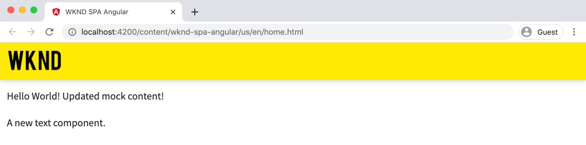
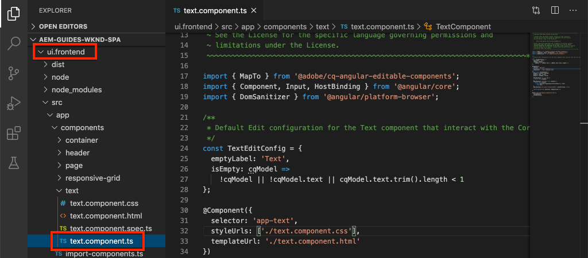
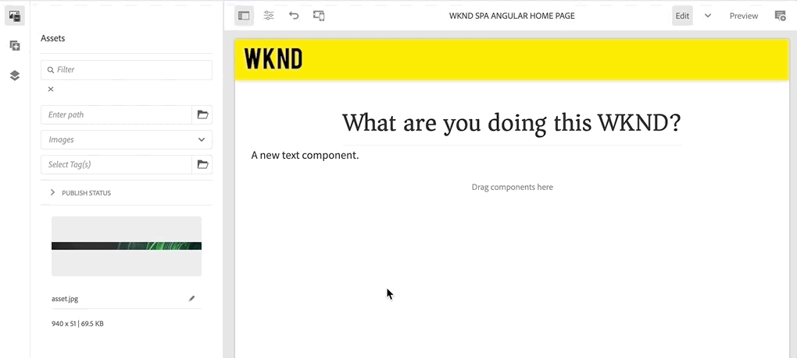

# Mappa SPA-komponenter till AEM-komponenter {#map-components}

{{spa-editor-deprecation}}

Lär dig mappa Angular-komponenter till Adobe Experience Manager-komponenter (AEM) med AEM SPA Editor JS SDK. Med komponentmappning kan man göra dynamiska uppdateringar av SPA-komponenter i AEM SPA Editor, på samma sätt som vid vanlig redigering i AEM.

Det här kapitlet innehåller en djupdykning i AEM JSON-modell-API:t och hur JSON-innehåll som exponeras av en AEM-komponent automatiskt kan injiceras i en Angular-komponent som props.

## Syfte

1. Lär dig mappa AEM-komponenter till SPA-komponenter.
2. Förstå skillnaden mellan **Container**-komponenter och **Content**-komponenter.
3. Skapa en ny Angular-komponent som mappar till en befintlig AEM-komponent.

## Vad du ska bygga

I det här kapitlet granskas hur den angivna `Text` SPA-komponenten mappas till AEM `Text` -komponenten. En ny SPA-komponent för `Image` skapas som kan användas i SPA och skapas i AEM. Funktionerna i **Layoutbehållaren** och **Mallredigeraren** kommer också att användas för att skapa en vy som är lite mer varierad.


## Förutsättningar

Granska de verktyg och instruktioner som krävs för att konfigurera en [lokal utvecklingsmiljö](overview.md#local-dev-environment).

### Hämta koden

1. Hämta startpunkten för den här självstudiekursen via Git:

   ```shell
   $ git clone git@github.com:adobe/aem-guides-wknd-spa.git
   $ cd aem-guides-wknd-spa
   $ git checkout Angular/map-components-start
   ```

2. Distribuera kodbasen till en lokal AEM-instans med Maven:

   ```shell
   $ mvn clean install -PautoInstallSinglePackage
   ```

   Om du använder [AEM 6.x](overview.md#compatibility) lägger du till profilen `classic`:

   ```shell
   $ mvn clean install -PautoInstallSinglePackage -Pclassic
   ```

Du kan alltid visa den färdiga koden på [GitHub](https://github.com/adobe/aem-guides-wknd-spa/tree/Angular/map-components-solution) eller checka ut koden lokalt genom att växla till grenen `Angular/map-components-solution`.

## Mappningsmetod

Det grundläggande konceptet är att mappa en SPA-komponent till en AEM-komponent. AEM-komponenter kör serversidan och exporterar innehåll som en del av JSON-modellens API. JSON-innehållet används av SPA, som kör klientsidan i webbläsaren. En 1:1-mappning mellan SPA-komponenter och en AEM-komponent skapas.


*Översikt på hög nivå över mappning av en AEM-komponent till en Angular-komponent*

## Inspektera textkomponenten

[AEM Project Archetype](https://github.com/adobe/aem-project-archetype) innehåller en `Text`-komponent som är mappad till AEM [Text-komponent](https://experienceleague.adobe.com/docs/experience-manager-core-components/using/components/text.html?lang=sv-SE). Det här är ett exempel på en **content** -komponent, eftersom den återger *innehåll* från AEM.

Låt oss se hur komponenten fungerar.

### Inspektera JSON-modellen

1. Innan du hoppar in i SPA-koden är det viktigt att förstå den JSON-modell som AEM tillhandahåller. Navigera till [Core Component Library](https://www.aemcomponents.dev/content/core-components-examples/library/core-content/text.html) och visa sidan för Text-komponenten. Core Component Library innehåller exempel på alla AEM Core-komponenter.
2. Välj fliken **JSON** för ett av exemplen:

   

   Du bör se tre egenskaper: `text`, `richText` och `:type`.

   `:type` är en reserverad egenskap som visar `sling:resourceType` (eller sökväg) för AEM-komponenten. Värdet `:type` är det som används för att mappa AEM-komponenten till SPA-komponenten.

   `text` och `richText` är ytterligare egenskaper som exponeras för SPA-komponenten.

### Inspektera komponenten Text

1. Öppna en ny terminal och navigera till mappen `ui.frontend` i projektet. Kör `npm install` och sedan `npm start` för att starta **webbpaketets dev-server**:

   ```shell
   $ cd ui.frontend
   $ npm run start:mock
   ```

   Modulen `ui.frontend` är för närvarande inställd på att använda JSON-modellen [mock](./integrate-spa.md#mock-json).

2. Ett nytt webbläsarfönster öppnas för [http://localhost:4200/content/wknd-spa-angular/us/en/home.html](http://localhost:4200/content/wknd-spa-angular/us/en/home.html)

   

3. Öppna AEM Project för WKND SPA i den utvecklingsmiljö du valt. Expandera modulen `ui.frontend` och öppna filen **text.component.ts** under `ui.frontend/src/app/components/text/text.component.ts`:

   

4. Det första området som ska inspekteras är `class TextComponent` på ~rad 35:

   ```js
   export class TextComponent {
       @Input() richText: boolean;
       @Input() text: string;
       @Input() itemName: string;
   
       @HostBinding('innerHtml') get content() {
           return this.richText
           ? this.sanitizer.bypassSecurityTrustHtml(this.text)
           : this.text;
       }
       @HostBinding('attr.data-rte-editelement') editAttribute = true;
   
       constructor(private sanitizer: DomSanitizer) {}
   }
   ```

   [@Input()](https://angular.io/api/core/Input) används för att deklarera fält vars värden anges via det mappade JSON-objektet som granskats tidigare.

   `@HostBinding('innerHtml') get content()` är en metod som visar det redigerade textinnehållet från värdet `this.text`. Om innehållet är RTF (som bestäms av flaggan `this.richText`) kringgås Angular inbyggda säkerhet. Angular [DomSanitizer](https://angular.io/api/platform-browser/DomSanitizer) används för att&quot;rensa&quot; HTML-råfilen och förhindra serveröverskridande skriptproblem (cross site scripting). Metoden är bunden till egenskapen `innerHtml` med dekoratorn [@HostBinding](https://angular.io/api/core/HostBinding).

5. Kontrollera sedan `TextEditConfig` på ~rad 24:

   ```js
   const TextEditConfig = {
       emptyLabel: 'Text',
       isEmpty: cqModel =>
           !cqModel || !cqModel.text || cqModel.text.trim().length < 1
   };
   ```

   Koden ovan avgör när platshållaren ska återges i AEM redigeringsmiljö. Om metoden `isEmpty` returnerar **true** återges platshållaren.

6. Ta till sist en titt på `MapTo`-anropet på ~rad 53:

   ```js
   MapTo('wknd-spa-angular/components/text')(TextComponent, TextEditConfig );
   ```

   **MapTo** tillhandahålls av AEM SPA Editor JS SDK (`@adobe/cq-angular-editable-components`). Sökvägen `wknd-spa-angular/components/text` representerar `sling:resourceType` för AEM-komponenten. Den här sökvägen matchas med `:type` som exponeras av JSON-modellen som observerats tidigare. **MapTo** tolkar JSON-modellsvaret och skickar de korrekta värdena till `@Input()` -variablerna i SPA-komponenten.

   Komponentdefinitionen för AEM `Text` finns på `ui.apps/src/main/content/jcr_root/apps/wknd-spa-angular/components/text`.

7. Experimentera genom att ändra filen **en.model.json** på `ui.frontend/src/mocks/json/en.model.json`.

   På ~rad 62 uppdaterar du det första `Text`-värdet till att använda en **`H1`** - och **`u`** -tagg:

   ```json
       "text": {
           "text": "<h1><u>Hello World!</u></h1>",
           "richText": true,
           ":type": "wknd-spa-angular/components/text"
       }
   ```

   Gå tillbaka till webbläsaren för att se de effekter som hanteras av **webbpaketets dev-server**:

   

   Försök att växla egenskapen `richText` mellan **true** / **false** för att se hur återgivningslogiken fungerar.

8. Granska **text.component.html** på `ui.frontend/src/app/components/text/text.component.html`.

   Den här filen är tom eftersom hela innehållet i komponenten anges av egenskapen `innerHTML`.

9. Granska **app.module.ts** vid `ui.frontend/src/app/app.module.ts`.

   ```js
   @NgModule({
   imports: [
       BrowserModule,
       SpaAngularEditableComponentsModule,
       AppRoutingModule
   ],
   providers: [ModelManagerService, { provide: APP_BASE_HREF, useValue: '/' }],
   declarations: [AppComponent, TextComponent, PageComponent, HeaderComponent],
   entryComponents: [TextComponent, PageComponent],
   bootstrap: [AppComponent]
   })
   export class AppModule {}
   ```

   **TextComponent** inkluderas inte explicit, utan dynamiskt via **AEMResponsiveGridComponent** som tillhandahålls av AEM SPA Editor JS SDK. Därför måste finnas med i listan i arrayen **app.module.ts** [entryComponents](https://angular.io/guide/entry-components) .

## Skapa bildkomponenten

Skapa sedan en `Image` Angular-komponent som är mappad till AEM [Image-komponent](https://experienceleague.adobe.com/docs/experience-manager-core-components/using/components/image.html?lang=sv-SE). Komponenten `Image` är ett annat exempel på en **content**-komponent.

### Inspektera JSON

Innan du hoppar in i SPA-koden ska du kontrollera JSON-modellen som tillhandahålls av AEM.

1. Navigera till [Bildexemplen i Core Component Library](https://www.aemcomponents.dev/content/core-components-examples/library/core-content/image.html).

   

   Egenskaper för `src`, `alt` och `title` används för att fylla i SPA-komponenten `Image`.

   >[!NOTE]
   >
   > Andra bildegenskaper visas (`lazyEnabled`, `widths`) som gör att en utvecklare kan skapa en adaptiv och lat inläsningskomponent. Komponenten som är inbyggd i den här självstudiekursen är enkel och använder **inte** dessa avancerade egenskaper.

2. Återgå till din IDE och öppna `en.model.json` på `ui.frontend/src/mocks/json/en.model.json`. Eftersom det här är en ny komponent i vårt projekt måste vi&quot;göra dummy&quot; av Image JSON.

   På ~rad 70 lägger du till en JSON-post för modellen `image` (glöm inte bort det avslutande kommatecknet `,` efter den andra `text_386303036`) och uppdaterar arrayen `:itemsOrder`.

   ```json
   ...
   ":items": {
               ...
               "text_386303036": {
                   "text": "<p>A new text component.</p>\r\n",
                   "richText": true,
                   ":type": "wknd-spa-angular/components/text"
                   },
               "image": {
                   "alt": "Rock Climber in New Zealand",
                   "title": "Rock Climber in New Zealand",
                   "src": "/mocks/images/adobestock-140634652.jpeg",
                   ":type": "wknd-spa-angular/components/image"
               }
           },
           ":itemsOrder": [
               "text",
               "text_386303036",
               "image"
           ],
   ```

   Projektet innehåller en exempelbild på `/mock-content/adobestock-140634652.jpeg` som används med **webpack-dev-servern**.

   Du kan visa den fullständiga versionen av [en.model.json här](https://github.com/adobe/aem-guides-wknd-spa/blob/Angular/map-components-solution/ui.frontend/src/mocks/json/en.model.json).

3. Lägg till ett stockfoto som ska visas av komponenten.

   Skapa en ny mapp med namnet **images** under `ui.frontend/src/mocks`. Hämta [adobestock-140634652.jpeg](assets/map-components/adobestock-140634652.jpeg) och placera den i mappen **images** som du nyss skapade. Du kan använda din egen bild om du vill.

### Implementera komponenten Bild

1. Stoppa **webbpaketets dev-server** om den startas.
2. Skapa en ny Image-komponent genom att köra Angular CLI `ng generate component`-kommandot från mappen `ui.frontend`:

   ```shell
   $ ng generate component components/image
   ```

3. Öppna **image.component.ts** vid `ui.frontend/src/app/components/image/image.component.ts` i den integrerade utvecklingsmiljön och uppdatera enligt följande:

   ```js
   import {Component, Input, OnInit} from '@angular/core';
   import {MapTo} from '@adobe/cq-angular-editable-components';
   
   const ImageEditConfig = {
   emptyLabel: 'Image',
   isEmpty: cqModel =>
       !cqModel || !cqModel.src || cqModel.src.trim().length < 1
   };
   
   @Component({
   selector: 'app-image',
   templateUrl: './image.component.html',
   styleUrls: ['./image.component.scss']
   })
   export class ImageComponent implements OnInit {
   
   @Input() src: string;
   @Input() alt: string;
   @Input() title: string;
   
   constructor() { }
   
   get hasImage() {
       return this.src && this.src.trim().length > 0;
   }
   
   ngOnInit() { }
   }
   
   MapTo('wknd-spa-angular/components/image')(ImageComponent, ImageEditConfig);
   ```

   `ImageEditConfig` är konfigurationen som avgör om författarplatshållaren ska återges i AEM utifrån om egenskapen `src` fylls i.

   `@Input()` av `src`, `alt` och `title` är de egenskaper som mappas från JSON API.

   `hasImage()` är en metod som avgör om bilden ska återges eller inte.

   `MapTo` mappar SPA-komponenten till AEM-komponenten på `ui.apps/src/main/content/jcr_root/apps/wknd-spa-angular/components/image`.

4. Öppna **image.component.html** och uppdatera den enligt följande:

   ```html
   <ng-container *ngIf="hasImage">
       
   </ng-container>
   ```

   Detta återger elementet `` om `hasImage` returnerar **true**.

5. Öppna **image.component.scss** och uppdatera den enligt följande:

   ```scss
   :host-context {
       display: block;
   }
   
   .image {
       margin: 1rem 0;
       width: 100%;
       border: 0;
   }
   ```

   >[!NOTE]
   >
   > Regeln `:host-context` är **kritisk** för att AEM SPA-redigerarplatshållaren ska fungera korrekt. Alla SPA-komponenter som ska redigeras i AEM sidredigerare måste ha den här regeln minst.

6. Öppna `app.module.ts` och lägg till `ImageComponent` i arrayen `entryComponents`:

   ```js
   entryComponents: [TextComponent, PageComponent, ImageComponent],
   ```

   Precis som `TextComponent` läses `ImageComponent` in dynamiskt och måste inkluderas i `entryComponents`-arrayen.

7. Starta **webbpaketets dev-server** för att se renderingen `ImageComponent`.

   ```shell
   $ npm run start:mock
   ```

   

   *Bild har lagts till i SPA*

   >[!NOTE]
   >
   > **Bonusutmaning**: Implementera en ny metod för att visa värdet för `title` som en bildtext under bilden.

## Uppdatera principer i AEM

Komponenten `ImageComponent` visas bara på **webbpaketets dev-server**. Distribuera sedan den uppdaterade produktinformationen till AEM och uppdatera mallprofilerna.

1. Stoppa **webpack-dev-servern** och distribuera ändringarna till AEM med dina Maven-kunskaper från **root** i projektet:

   ```shell
   $ cd aem-guides-wknd-spa
   $ mvn clean install -PautoInstallSinglePackage
   ```

2. Gå till **[!UICONTROL Tools]** > **[!UICONTROL Templates]** > **[WKND SPA Angular](http://localhost:4502/libs/wcm/core/content/sites/templates.html/conf/wknd-spa-angular)** från startskärmen i AEM.

   Markera och redigera **SPA-sidan**:

   

3. Markera **layoutbehållaren** och klicka på dess **policy**-ikon för att redigera profilen:

   

4. Under **Tillåtna komponenter** > **WKND SPA Angular - Innehåll** > kontrollerar du **Image** -komponenten:

   

   Under **Standardkomponenter** > **Lägg till mappning** och välj komponenten **Image - WKND SPA Angular - Content** :

   

   Ange **mime-typen** av `image/*`.

   Klicka på **Klar** om du vill spara principuppdateringarna.

5. I **layoutbehållaren** klickar du på ikonen **policy** för komponenten **Text** :

   

   Skapa en ny princip med namnet **WKND SPA-text**. Under **Plugins** > **Formatering** > markerar du alla rutor för att aktivera ytterligare formateringsalternativ:

   

   Under **Plugins** > **Styckeformat** > markerar du kryssrutan för att **aktivera styckeformat**:

   

   Klicka på **Klar** för att spara principuppdateringen.

6. Navigera till **hemsidan** [http://localhost:4502/editor.html/content/wknd-spa-angular/us/en/home.html](http://localhost:4502/editor.html/content/wknd-spa-angular/us/en/home.html).

   Du bör också kunna redigera komponenten `Text` och lägga till ytterligare styckeformat i **helskärmsläge** .

   

7. Du bör också kunna dra och släppa en bild från **Resurssökaren**:

   

8. Lägg till egna bilder via [AEM Assets](http://localhost:4502/assets.html/content/dam) eller installera den färdiga kodbasen för standardreferensplatsen [WKND](https://github.com/adobe/aem-guides-wknd/releases/latest). [WKND-referenswebbplatsen](https://github.com/adobe/aem-guides-wknd/releases/latest) innehåller många bilder som kan återanvändas på WKND SPA. Paketet kan installeras med [AEM Package Manager](http://localhost:4502/crx/packmgr/index.jsp).

   

## Inspektera layoutbehållaren

Stöd för **layoutbehållaren** tillhandahålls automatiskt av AEM SPA Editor SDK. **Layoutbehållaren**, som anges av namnet, är en **container**-komponent. Behållarkomponenter är komponenter som accepterar JSON-strukturer som representerar *andra* komponenter och instansierar dem dynamiskt.

Låt oss inspektera layoutbehållaren ytterligare.

1. Öppna **responsive-grid.component.ts** på `ui.frontend/src/app/components/responsive-grid` i IDE:

   ```js
   import { AEMResponsiveGridComponent,MapTo } from '@adobe/cq-angular-editable-components';
   
   MapTo('wcm/foundation/components/responsivegrid')(AEMResponsiveGridComponent);
   ```

   `AEMResponsiveGridComponent` implementeras som en del av AEM SPA Editor SDK och ingår i projektet via `import-components`.

2. I en webbläsare går du till [http://localhost:4502/content/wknd-spa-angular/us/en.model.json](http://localhost:4502/content/wknd-spa-angular/us/en.model.json)

   

   Komponenten **Layoutbehållare** har `sling:resourceType` `wcm/foundation/components/responsivegrid` och känns igen av SPA-redigeraren med egenskapen `:type`, precis som komponenterna `Text` och `Image`.

   Samma funktioner för att ändra storlek på en komponent med [Layoutläge](https://experienceleague.adobe.com/docs/experience-manager-65/authoring/siteandpage/responsive-layout.html?lang=sv-SE#defining-layouts-layout-mode) finns i SPA-redigeraren.

3. Gå tillbaka till [http://localhost:4502/editor.html/content/wknd-spa-angular/us/en/home.html](http://localhost:4502/editor.html/content/wknd-spa-angular/us/en/home.html). Lägg till ytterligare **Bild**-komponenter och försök ändra storlek på dem med alternativet **Layout** :

   

4. Öppna JSON-modellen [http://localhost:4502/content/wknd-spa-angular/us/en.model.json](http://localhost:4502/content/wknd-spa-angular/us/en.model.json) igen och observera `columnClassNames` som en del av JSON:

   

   Klassnamnet `aem-GridColumn--default--4` anger att komponenten ska vara 4 kolumner bred baserat på ett 12-kolumnsrutnät. Mer information om det [responsiva rutnätet finns här](https://adobe-marketing-cloud.github.io/aem-responsivegrid/).

5. Återgå till IDE och i modulen `ui.apps` finns ett klientbibliotek definierat vid `ui.apps/src/main/content/jcr_root/apps/wknd-spa-angular/clientlibs/clientlib-grid`. Öppna filen `less/grid.less`.

   Den här filen avgör vilka brytpunkter (`default`, `tablet` och `phone`) som används av **layoutbehållaren**. Den här filen är avsedd att anpassas efter projektspecifikationer. För närvarande är brytpunkterna inställda på `1200px` och `650px`.

6. Du bör kunna använda responsiva funktioner och uppdaterade RTF-principer för komponenten `Text` för att skapa en vy som följande:

   

## Grattis! {#congratulations}

Du lärde dig att mappa SPA-komponenter till AEM-komponenter och du implementerade en ny `Image`-komponent. Du har också en chans att utforska de responsiva funktionerna i **layoutbehållaren**.

Du kan alltid visa den färdiga koden på [GitHub](https://github.com/adobe/aem-guides-wknd-spa/tree/Angular/map-components-solution) eller checka ut koden lokalt genom att växla till grenen `Angular/map-components-solution`.

### Nästa steg {#next-steps}

[Navigering och routning](navigation-routing.md) - Lär dig hur flera vyer i SPA kan användas genom att mappa till AEM Pages med SPA Editor SDK. Dynamisk navigering implementeras med Angular Router och läggs till i en befintlig Header-komponent.

## Bonus - Beständiga konfigurationer till källkontroll {#bonus}

I många fall, särskilt i början av ett AEM-projekt, är det värdefullt att behålla konfigurationer som mallar och relaterade innehållsprinciper för källkontroll. Detta garanterar att alla utvecklare arbetar mot samma uppsättning innehåll och konfigurationer och kan säkerställa ytterligare enhetlighet mellan miljöer. När ett projekt når en viss mognadsnivå kan rutinen med mallhantering överföras till en särskild grupp med avancerade användare.

Nästa steg kommer att utföras med Visual Studio Code IDE och [VSCode AEM Sync](https://marketplace.visualstudio.com/items?itemName=yamato-ltd.vscode-aem-sync) men kan utföras med alla verktyg och alla IDE som du har konfigurerat till **pull** - eller **import** -innehåll från en lokal instans av AEM.

1. I Visual Studio Code IDE kontrollerar du att du har **VSCode AEM Sync** installerat via Marketplace-tillägget:

   

2. Utöka modulen **ui.content** i Project Explorer och gå till `/conf/wknd-spa-angular/settings/wcm/templates`.

3. **Högerklicka** på mappen `templates` och välj **Importera från AEM Server**:

   

4. Upprepa stegen för att importera innehåll men välj mappen **policies** på `/conf/wknd-spa-angular/settings/wcm/policies`.

5. Granska filen `filter.xml` som finns på `ui.content/src/main/content/META-INF/vault/filter.xml`.

   ```xml
   <!--ui.content filter.xml-->
   <?xml version="1.0" encoding="UTF-8"?>
    <workspaceFilter version="1.0">
        <filter root="/conf/wknd-spa-angular" mode="merge"/>
        <filter root="/content/wknd-spa-angular" mode="merge"/>
        <filter root="/content/dam/wknd-spa-angular" mode="merge"/>
        <filter root="/content/experience-fragments/wknd-spa-angular" mode="merge"/>
    </workspaceFilter>
   ```

   Filen `filter.xml` ansvarar för att identifiera sökvägarna till noder som har installerats med paketet. Observera `mode="merge"` på vart och ett av filtren som anger att befintligt innehåll inte ändras, endast nytt innehåll läggs till. Eftersom innehållsförfattare kan uppdatera dessa sökvägar är det viktigt att en koddistribution **inte** skriver över innehåll. Mer information om hur du arbetar med filterelement finns i [dokumentationen för FileVault](https://jackrabbit.apache.org/filevault/filter.html).

   Jämför `ui.content/src/main/content/META-INF/vault/filter.xml` och `ui.apps/src/main/content/META-INF/vault/filter.xml` för att förstå de olika noder som hanteras av varje modul.
