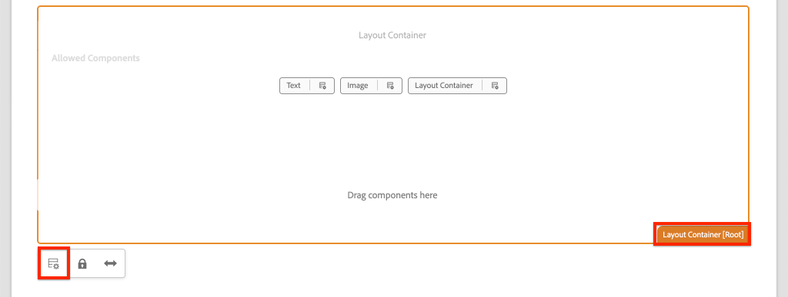

# Lägga till navigering och routning {#navigation-routing}

Lär dig hur flera vyer i SPA stöds med AEM sidor och SPA Editor SDK. Dynamisk navigering implementeras med hjälp av Angular och läggs till i en befintlig Header-komponent.

## Syfte

1. Förstå de alternativ för SPA modellroutning som är tillgängliga när du använder SPA Editor.
2. Lär dig använda [routning av angular](https://angular.io/guide/router) för att navigera mellan olika vyer av SPA.
3. Implementera en dynamisk navigering som styrs av AEM sidhierarki.

## Vad du ska bygga

I det här kapitlet läggs en navigeringsmeny till i en befintlig `Header` -komponenten. Navigeringsmenyn styrs av AEM sidhierarki och använder den JSON-modell som finns i [Kärnkomponent för navigering](https://experienceleague.adobe.com/docs/experience-manager-core-components/using/components/navigation.html).


## Förutsättningar

Granska de verktyg och instruktioner som krävs för att ställa in en [lokal utvecklingsmiljö](overview.md#local-dev-environment).

### Hämta koden

1. Hämta startpunkten för den här självstudiekursen via Git:

   ```shell
   $ git clone git@github.com:adobe/aem-guides-wknd-spa.git
   $ cd aem-guides-wknd-spa
   $ git checkout Angular/navigation-routing-start
   ```

2. Distribuera kodbasen till en lokal AEM med Maven:

   ```shell
   $ mvn clean install -PautoInstallSinglePackage
   ```

   Om du använder [AEM 6.x](overview.md#compatibility) lägg till `classic` profil:

   ```shell
   $ mvn clean install -PautoInstallSinglePackage -Pclassic
   ```

3. Installera det färdiga paketet för det traditionella [WKND-referensplats](https://github.com/adobe/aem-guides-wknd/releases/latest). Bilderna från [WKND-referensplats](https://github.com/adobe/aem-guides-wknd/releases/latest) används på WKND-SPA. Paketet kan installeras med [AEM](http://localhost:4502/crx/packmgr/index.jsp).

   

Du kan alltid visa den färdiga koden på [GitHub](https://github.com/adobe/aem-guides-wknd-spa/tree/Angular/navigation-routing-solution) eller checka ut koden lokalt genom att växla till grenen `Angular/navigation-routing-solution`.

## Inspect HeaderComponent - uppdateringar {#inspect-header}

I tidigare kapitel `HeaderComponent` -komponenten har lagts till som en ren Angular-komponent som ingår via `app.component.html`. I detta kapitel `HeaderComponent` -komponenten tas bort från programmet och läggs till via [Mallredigerare](https://experienceleague.adobe.com/docs/experience-manager-learn/sites/page-authoring/template-editor-feature-video-use.html). Detta gör att användarna kan konfigurera navigeringsmenyn för `HeaderComponent` från AEM.

>[!NOTE]
>
> Flera CSS- och JavaScript-uppdateringar har redan gjorts i kodbasen för att starta det här kapitlet. Fokusera på centrala koncept, inte **alla** av kodändringarna diskuteras. Du kan visa de fullständiga ändringarna [här](https://github.com/adobe/aem-guides-wknd-spa/compare/Angular/map-components-solution...Angular/navigation-routing-start).

1. Öppna SPA startprojekt för det här kapitlet i den IDE du väljer.
2. Under `ui.frontend` modulen inspektera filen `header.component.ts` vid: `ui.frontend/src/app/components/header/header.component.ts`.

   Flera uppdateringar har gjorts, bland annat tillägg av en `HeaderEditConfig` och `MapTo` för att göra det möjligt att mappa komponenten till en AEM `wknd-spa-angular/components/header`.

   ```js
   /* header.component.ts */
   ...
   const HeaderEditConfig = {
       ...
   };
   
   @Component({
   selector: 'app-header',
   templateUrl: './header.component.html',
   styleUrls: ['./header.component.scss']
   })
   export class HeaderComponent implements OnInit {
   @Input() items: object[];
       ...
   }
   ...
   MapTo('wknd-spa-angular/components/header')(withRouter(Header), HeaderEditConfig);
   ```

   Anteckna `@Input()` anteckning för `items`. `items` innehåller en array med navigeringsobjekt som skickas från AEM.

3. I `ui.apps` modulen inspektera komponentdefinitionen för AEM `Header` komponent: `ui.apps/src/main/content/jcr_root/apps/wknd-spa-angular/components/header/.content.xml`:

   ```xml
   <?xml version="1.0" encoding="UTF-8"?>
   <jcr:root xmlns:sling="http://sling.apache.org/jcr/sling/1.0" xmlns:cq="http://www.day.com/jcr/cq/1.0"
       xmlns:jcr="http://www.jcp.org/jcr/1.0"
       jcr:primaryType="cq:Component"
       jcr:title="Header"
       sling:resourceSuperType="wknd-spa-angular/components/navigation"
       componentGroup="WKND SPA Angular - Structure"/>
   ```

   AEM `Header` -komponenten ärver alla funktioner i [Kärnkomponent för navigering](https://experienceleague.adobe.com/docs/experience-manager-core-components/using/components/navigation.html) via `sling:resourceSuperType` -egenskap.

## Lägg till HeaderComponent i SPA {#add-header-template}

1. Öppna en webbläsare och logga in på AEM, [http://localhost:4502/](http://localhost:4502/). Startkodbasen ska redan distribueras.
2. Navigera till **[!UICONTROL SPA Page Template]**: [http://localhost:4502/editor.html/conf/wknd-spa-angular/settings/wcm/templates/spa-page-template/structure.html](http://localhost:4502/editor.html/conf/wknd-spa-angular/settings/wcm/templates/spa-page-template/structure.html).
3. Markera den yttre **[!UICONTROL Root Layout Container]** och klicka på **[!UICONTROL Policy]** -ikon. Var försiktig **not** för att välja **[!UICONTROL Layout Container]** ej låst för redigering.

   

4. Kopiera den aktuella profilen och skapa en ny profil med namnet **[!UICONTROL SPA Structure]**:

   

   Under **[!UICONTROL Allowed Components]** > **[!UICONTROL General]** > välj **[!UICONTROL Layout Container]** -komponenten.

   Under **[!UICONTROL Allowed Components]** > **[!UICONTROL WKND SPA ANGULAR - STRUCTURE]** > välj **[!UICONTROL Header]** komponent:

   

   Under **[!UICONTROL Allowed Components]** > **[!UICONTROL WKND SPA ANGULAR - Content]** > välj **[!UICONTROL Image]** och **[!UICONTROL Text]** -komponenter. Du bör välja totalt 4 komponenter.

   Klicka **[!UICONTROL Done]** för att spara ändringarna.

5. **Uppdatera** sidan. Lägg till **[!UICONTROL Header]** -komponenten ovanför det olåsta **[!UICONTROL Layout Container]**:

   

6. Välj **[!UICONTROL Header]** och klicka på dess **Policy** om du vill redigera profilen.

   

7. Skapa en ny profil med en **[!UICONTROL Policy Title]** av **&quot;WKND SPA Header&quot;**.

   Under **[!UICONTROL Properties]**:

   * Ange **[!UICONTROL Navigation Root]** till `/content/wknd-spa-angular/us/en`.
   * Ange **[!UICONTROL Exclude Root Levels]** till **1**.
   * Avmarkera **[!UICONTROL Collect al child pages]**.
   * Ange **[!UICONTROL Navigation Structure Depth]** till **3**.

   

   Detta samlar in navigeringen 2 nivåer under `/content/wknd-spa-angular/us/en`.

8. När du har sparat ändringarna bör du se det ifyllda `Header` som en del av mallen:

   

## Skapa underordnade sidor

Skapa sedan ytterligare sidor i AEM som ska fungera som de olika vyerna i SPA. Vi kommer också att inspektera den hierarkiska strukturen i JSON-modellen som AEM tillhandahåller.

1. Navigera till **Webbplatser** konsol: [http://localhost:4502/sites.html/content/wknd-spa-angular/us/en/home](http://localhost:4502/sites.html/content/wknd-spa-angular/us/en/home). Välj **WKND SPA Angularnas startsida** och klicka **[!UICONTROL Create]** > **[!UICONTROL Page]**:

   

2. Under **[!UICONTROL Template]** välj **[!UICONTROL SPA Page]**. Under **[!UICONTROL Properties]** enter **&quot;Sidan 1&quot;** för **[!UICONTROL Title]** och **&quot;page-1&quot;** som namn.

   

   Klicka **[!UICONTROL Create]** och i dialogrutan klickar du på **[!UICONTROL Open]** för att öppna sidan i AEM SPA Editor.

3. Lägg till en ny **[!UICONTROL Text]** till huvudkomponenten **[!UICONTROL Layout Container]**. Redigera komponenten och ange texten: **&quot;Sidan 1&quot;** med RTE och **H1** element (du måste ange helskärmsläge för att kunna ändra styckeelementen)

   

   Du kan lägga till ytterligare innehåll, som en bild.

4. Återgå till AEM Sites-konsolen och upprepa stegen ovan och skapa en andra sida med namnet **&quot;Sidan 2&quot;** som ett syskon av **Sida 1**. Lägg till innehåll i **Sidan 2** så att den lätt kan identifieras.
5. Skapa slutligen en tredje sida, **&quot;Sidan 3&quot;** men som **child** av **Sidan 2**. När webbplatshierarkin är klar ska den se ut så här:

   

6. På en ny flik öppnar du JSON-modell-API:t från AEM: [http://localhost:4502/content/wknd-spa-angular/us/en.model.json](http://localhost:4502/content/wknd-spa-angular/us/en.model.json). Detta JSON-innehåll begärs när SPA läses in första gången. Den yttre strukturen ser ut så här:

   ```json
   {
   "language": "en",
   "title": "en",
   "templateName": "spa-app-template",
   "designPath": "/libs/settings/wcm/designs/default",
   "cssClassNames": "spa page basicpage",
   ":type": "wknd-spa-angular/components/spa",
   ":items": {},
   ":itemsOrder": [],
   ":hierarchyType": "page",
   ":path": "/content/wknd-spa-angular/us/en",
   ":children": {
       "/content/wknd-spa-angular/us/en/home": {},
       "/content/wknd-spa-angular/us/en/home/page-1": {},
       "/content/wknd-spa-angular/us/en/home/page-2": {},
       "/content/wknd-spa-angular/us/en/home/page-2/page-3": {}
       }
   }
   ```

   Under `:children` Du bör se en post för varje sida som skapas. Innehållet för alla sidor finns i den här inledande JSON-begäran. När navigeringsflödet har implementerats läses efterföljande vyer av SPA in snabbt eftersom innehållet redan är tillgängligt på klientsidan.

   Det är inte klokt att läsa in **ALLA** av innehållet i en SPA i den inledande JSON-begäran, eftersom detta skulle göra den inledande sidinläsningen långsammare. Nu ska vi titta på hur sidornas hierarkiska djup samlas in.

7. Navigera till **SPA** mall på: [http://localhost:4502/editor.html/conf/wknd-spa-angular/settings/wcm/templates/spa-app-template/structure.html](http://localhost:4502/editor.html/conf/wknd-spa-angular/settings/wcm/templates/spa-app-template/structure.html).

   Klicka på **[!UICONTROL Page properties menu]** > **[!UICONTROL Page Policy]**:

   

8. The **SPA** mallen har en extra **[!UICONTROL Hierarchical Structure]** för att kontrollera det insamlade JSON-innehållet. The **[!UICONTROL Structure Depth]** avgör hur djupt i platshierarkin underordnade sidor ska samlas under **root**. Du kan också använda **[!UICONTROL Structure Patterns]** om du vill filtrera ut ytterligare sidor baserat på ett reguljärt uttryck.

   Uppdatera **[!UICONTROL Structure Depth]** till **&quot;2&quot;**:

   

   Klicka **[!UICONTROL Done]** om du vill spara ändringarna i profilen.

9. Öppna JSON-modellen igen [http://localhost:4502/content/wknd-spa-angular/us/en.model.json](http://localhost:4502/content/wknd-spa-angular/us/en.model.json).

   ```json
   {
   "language": "en",
   "title": "en",
   "templateName": "spa-app-template",
   "designPath": "/libs/settings/wcm/designs/default",
   "cssClassNames": "spa page basicpage",
   ":type": "wknd-spa-angular/components/spa",
   ":items": {},
   ":itemsOrder": [],
   ":hierarchyType": "page",
   ":path": "/content/wknd-spa-angular/us/en",
   ":children": {
       "/content/wknd-spa-angular/us/en/home": {},
       "/content/wknd-spa-angular/us/en/home/page-1": {},
       "/content/wknd-spa-angular/us/en/home/page-2": {}
       }
   }
   ```

   Observera att **Sidan 3** Sökvägen har tagits bort: `/content/wknd-spa-angular/us/en/home/page-2/page-3` från den ursprungliga JSON-modellen.

   Senare kommer vi att se hur AEM SDK för redigeraren kan läsa in ytterligare innehåll dynamiskt.

## Implementera navigeringen

Implementera sedan navigeringsmenyn med en ny `NavigationComponent`. Vi kan lägga till koden direkt i `header.component.html` men det är bättre att undvika stora komponenter. Implementera i stället en `NavigationComponent` som kan återanvändas senare.

1. Granska den JSON som visas av AEM `Header` komponent vid [http://localhost:4502/content/wknd-spa-angular/us/en.model.json](http://localhost:4502/content/wknd-spa-angular/us/en.model.json):

   ```json
   ...
   "header": {
       "items": [
       {
       "level": 0,
       "active": true,
       "path": "/content/wknd-spa-angular/us/en/home",
       "description": null,
       "url": "/content/wknd-spa-angular/us/en/home.html",
       "lastModified": 1589062597083,
       "title": "WKND SPA Angular Home Page",
       "children": [
               {
               "children": [],
               "level": 1,
               "active": false,
               "path": "/content/wknd-spa-angular/us/en/home/page-1",
               "description": null,
               "url": "/content/wknd-spa-angular/us/en/home/page-1.html",
               "lastModified": 1589429385100,
               "title": "Page 1"
               },
               {
               "level": 1,
               "active": true,
               "path": "/content/wknd-spa-angular/us/en/home/page-2",
               "description": null,
               "url": "/content/wknd-spa-angular/us/en/home/page-2.html",
               "lastModified": 1589429603507,
               "title": "Page 2",
               "children": [
                   {
                   "children": [],
                   "level": 2,
                   "active": false,
                   "path": "/content/wknd-spa-angular/us/en/home/page-2/page-3",
                   "description": null,
                   "url": "/content/wknd-spa-angular/us/en/home/page-2/page-3.html",
                   "lastModified": 1589430413831,
                   "title": "Page 3"
                   }
               ],
               }
           ]
           }
       ],
   ":type": "wknd-spa-angular/components/header"
   ```

   De AEM sidornas hierarkiska karaktär modelleras i JSON som kan användas för att fylla i en navigeringsmeny. Kom ihåg att `Header` -komponenten ärver alla funktioner i [Kärnkomponent för navigering](https://www.aemcomponents.dev/content/core-components-examples/library/core-structure/navigation.html) och det innehåll som visas via JSON mappas automatiskt till Angularna `@Input` anteckning.

2. Öppna ett nytt terminalfönster och navigera till `ui.frontend` SPA. Skapa ett nytt `NavigationComponent` med Angular CLI-verktyget:

   ```shell
   $ cd ui.frontend
   $ ng generate component components/navigation
   CREATE src/app/components/navigation/navigation.component.scss (0 bytes)
   CREATE src/app/components/navigation/navigation.component.html (25 bytes)
   CREATE src/app/components/navigation/navigation.component.spec.ts (656 bytes)
   CREATE src/app/components/navigation/navigation.component.ts (286 bytes)
   UPDATE src/app/app.module.ts (2032 bytes)
   ```

3. Skapa sedan en klass med namnet `NavigationLink` med Angular-CLI i den nyskapade `components/navigation` katalog:

   ```shell
   $ cd src/app/components/navigation/
   $ ng generate class NavigationLink
   CREATE src/app/components/navigation/navigation-link.spec.ts (187 bytes)
   CREATE src/app/components/navigation/navigation-link.ts (32 bytes)
   ```

4. Gå tillbaka till den utvecklingsmiljö du valt och öppna filen på `navigation-link.ts` på `/src/app/components/navigation/navigation-link.ts`.

   

5. Fylla `navigation-link.ts` med följande:

   ```js
   export class NavigationLink {
   
       title: string;
       path: string;
       url: string;
       level: number;
       children: NavigationLink[];
       active: boolean;
   
       constructor(data) {
           this.path = data.path;
           this.title = data.title;
           this.url = data.url;
           this.level = data.level;
           this.active = data.active;
           this.children = data.children.map( item => {
               return new NavigationLink(item);
           });
       }
   }
   ```

   Det här är en enkel klass som representerar en enskild navigeringslänk. I klasskonstruktorn förväntar vi oss `data` som det JSON-objekt som skickas från AEM. Den här klassen används i båda `NavigationComponent` och `HeaderComponent` för att enkelt fylla i navigeringsstrukturen.

   Ingen dataomvandling utförs, den här klassen skapas främst för att skriva JSON-modellen med hög kvalitet. Observera att `this.children` skrivs som `NavigationLink[]` och att konstruktorn skapar nya rekursivt `NavigationLink` för vart och ett av objekten i `children` array. Återkalla JSON-modellen för `Header` är hierarkiskt.

6. Öppna filen `navigation-link.spec.ts`. Det här är testfilen för `NavigationLink` klassen. Uppdatera den med följande:

   ```js
   import { NavigationLink } from './navigation-link';
   
   describe('NavigationLink', () => {
       it('should create an instance', () => {
           const data = {
               children: [],
               level: 1,
               active: false,
               path: '/content/wknd-spa-angular/us/en/home/page-1',
               description: null,
               url: '/content/wknd-spa-angular/us/en/home/page-1.html',
               lastModified: 1589429385100,
               title: 'Page 1'
           };
           expect(new NavigationLink(data)).toBeTruthy();
       });
   });
   ```

   Observera att `const data` följer samma JSON-modell som tidigare inspekterats för en enda länk. Detta är långt ifrån ett robust enhetstest, men det bör räcka att testa konstruktorn för `NavigationLink`.

7. Öppna filen `navigation.component.ts`. Uppdatera den med följande:

   ```js
   import { Component, OnInit, Input } from '@angular/core';
   import { NavigationLink } from './navigation-link';
   
   @Component({
   selector: 'app-navigation',
   templateUrl: './navigation.component.html',
   styleUrls: ['./navigation.component.scss']
   })
   export class NavigationComponent implements OnInit {
   
       @Input() items: object[];
   
       constructor() { }
   
       get navigationLinks(): NavigationLink[] {
   
           if (this.items && this.items.length > 0) {
               return this.items.map(item => {
                   return new NavigationLink(item);
               });
           }
   
           return null;
       }
   
       ngOnInit() {}
   
   }
   ```

   `NavigationComponent` förväntar sig `object[]` namngiven `items` det är JSON-modellen från AEM. Den här klassen visar en enda metod `get navigationLinks()` som returnerar en array med `NavigationLink` objekt.

8. Öppna filen `navigation.component.html` och uppdatera med följande:

   ```html
   <ul *ngIf="navigationLinks && navigationLinks.length > 0" class="navigation__group">
       <ng-container *ngTemplateOutlet="recursiveListTmpl; context:{ links: navigationLinks }"></ng-container>
   </ul>
   ```

   Detta genererar en initial `<ul>` och anropar `get navigationLinks()` metod från `navigation.component.ts`. An `<ng-container>` används för att ringa ett anrop till en mall med namnet `recursiveListTmpl` och skickar `navigationLinks` som en variabel med namnet `links`.

   Lägg till `recursiveListTmpl` nästa:

   ```html
   <ng-template #recursiveListTmpl let-links="links">
       <li *ngFor="let link of links" class="{{'navigation__item navigation__item--' + link.level}}">
           <a [routerLink]="link.url" class="navigation__item-link" [title]="link.title" [attr.aria-current]="link.active">
               {{link.title}}
           </a>
           <ul *ngIf="link.children && link.children.length > 0">
               <ng-container *ngTemplateOutlet="recursiveListTmpl; context:{ links: link.children }"></ng-container>
           </ul>
       </li>
   </ng-template>
   ```

   Här implementeras resten av återgivningen för navigeringslänken. Observera att variabeln `link` är av typen `NavigationLink` och alla metoder och egenskaper som skapas av den klassen är tillgängliga. [`[routerLink]`](https://angular.io/api/router/RouterLink) används i stället för normalt `href` -attribut. Det gör att vi kan länka till specifika vägar i appen utan att behöva uppdatera hela sidan.

   Den rekursiva delen av navigeringen implementeras också genom att skapa en annan `<ul>` om aktuell `link` har ett värde som inte är tomt `children` array.

9. Uppdatera `navigation.component.spec.ts` för att lägga till stöd för `RouterTestingModule`:

   ```diff
    ...
   + import { RouterTestingModule } from '@angular/router/testing';
    ...
    beforeEach(async(() => {
       TestBed.configureTestingModule({
   +   imports: [ RouterTestingModule ],
       declarations: [ NavigationComponent ]
       })
       .compileComponents();
    }));
    ...
   ```

   Lägga till `RouterTestingModule` krävs eftersom komponenten använder `[routerLink]`.

10. Uppdatera `navigation.component.scss` för att lägga till vissa grundläggande format i `NavigationComponent`:

   ```scss
   @import "~src/styles/variables";
   
   $link-color: $black;
   $link-hover-color: $white;
   $link-background: $black;
   
   :host-context {
       display: block;
       width: 100%;
   }
   
   .navigation__item {
       list-style: none;
   }
   
   .navigation__item-link {
       color: $link-color;
       font-size: $font-size-large;
       text-transform: uppercase;
       padding: $gutter-padding;
       display: flex;
       border-bottom: 1px solid $gray;
   
       &:hover {
           background: $link-background;
           color: $link-hover-color;
       }
   
   }
   ```

## Uppdatera huvudkomponenten

Nu när `NavigationComponent` har implementerats, `HeaderComponent` måste uppdateras för att referera till det.

1. Öppna en terminal och navigera till `ui.frontend` i SPA. Starta **dev-server för webbpaket**:

   ```shell
   $ npm start
   ```

2. Öppna en webbläsarflik och navigera till [http://localhost:4200/](http://localhost:4200/).

   The **dev-server för webbpaket** ska konfigureras för att proxyautentisera JSON-modellen från en lokal instans av AEM (`ui.frontend/proxy.conf.json`). Detta gör att vi kan koda direkt mot innehåll som skapats i AEM från tidigare kurser.

   

   The `HeaderComponent` har menyväxlingsfunktionen redan implementerats. Lägg sedan till navigeringskomponenten.

3. Gå tillbaka till den utvecklingsmiljö du valt och öppna filen `header.component.ts` på `ui.frontend/src/app/components/header/header.component.ts`.
4. Uppdatera `setHomePage()` för att ta bort den hårdkodade strängen och använda de dynamiska förloppen som skickas av AEM:

   ```js
   /* header.component.ts */
   import { NavigationLink } from '../navigation/navigation-link';
   ...
    setHomePage() {
       if (this.hasNavigation) {
           const rootNavigationLink: NavigationLink = new NavigationLink(this.items[0]);
           this.isHome = rootNavigationLink.path === this.route.snapshot.data.path;
           this.homePageUrl = rootNavigationLink.url;
       }
   }
   ...
   ```

   En ny instans av `NavigationLink` skapas baserat på `items[0]`, roten för den JSON-navigeringsmodell som skickas från AEM. `this.route.snapshot.data.path` returnerar Angularnas sökväg. Det här värdet används för att avgöra om det aktuella flödet är **Hemsida**. `this.homePageUrl` används för att fylla i ankarlänken på **logo**.

5. Öppna `header.component.html` och ersätt den statiska platshållaren för navigeringen med en referens till den nya `NavigationComponent`:

   ```diff
       <div class="header-navigation">
           <div class="navigation">
   -            Navigation Placeholder
   +           <app-navigation [items]="items"></app-navigation>
           </div>
       </div>
   ```

   `[items]=items` attributet skickar `@Input() items` från `HeaderComponent` till `NavigationComponent` där navigeringen ska byggas ut.

6. Öppna `header.component.spec.ts` och lägga till en deklaration för `NavigationComponent`:

   ```diff
       /* header.component.spect.ts */
   +   import { NavigationComponent } from '../navigation/navigation.component';
   
       describe('HeaderComponent', () => {
       let component: HeaderComponent;
       let fixture: ComponentFixture<HeaderComponent>;
   
       beforeEach(async(() => {
           TestBed.configureTestingModule({
           imports: [ RouterTestingModule ],
   +       declarations: [ HeaderComponent, NavigationComponent ]
           })
           .compileComponents();
       }));
   ```

   Sedan `NavigationComponent` används nu som en del av `HeaderComponent` Den måste deklareras som en del av testbädden.

7. Spara ändringar i alla öppna filer och gå tillbaka till **dev-server för webbpaket**: [http://localhost:4200/](http://localhost:4200/)

   

   Öppna navigeringen genom att klicka på menyväxlingsknappen så visas de ifyllda navigeringslänkarna. Du bör kunna navigera till olika vyer av SPA.

## Förstå SPA

Nu när navigeringen har implementerats inspekterar du routningen i AEM.

1. Öppna filen i IDE `app-routing.module.ts` på `ui.frontend/src/app`.

   ```js
   /* app-routing.module.ts */
   import { AemPageDataResolver, AemPageRouteReuseStrategy } from '@adobe/cq-angular-editable-components';
   import { NgModule } from '@angular/core';
   import { RouteReuseStrategy, RouterModule, Routes, UrlMatchResult, UrlSegment } from '@angular/router';
   import { PageComponent } from './components/page/page.component';
   
   export function AemPageMatcher(url: UrlSegment[]): UrlMatchResult {
       if (url.length) {
           return {
               consumed: url,
               posParams: {
                   path: url[url.length - 1]
               }
           };
       }
   }
   
   const routes: Routes = [
       {
           matcher: AemPageMatcher,
           component: PageComponent,
           resolve: {
               path: AemPageDataResolver
           }
       }
   ];
   @NgModule({
       imports: [RouterModule.forRoot(routes)],
       exports: [RouterModule],
       providers: [
           AemPageDataResolver,
           {
           provide: RouteReuseStrategy,
           useClass: AemPageRouteReuseStrategy
           }
       ]
   })
   export class AppRoutingModule {}
   ```

   The `routes: Routes = [];` arrayen definierar vägar eller navigeringssökvägar till komponentmappningar för Angular.

   `AemPageMatcher` är en anpassad Angular router [UrlMatcher](https://angular.io/api/router/UrlMatcher), som matchar allt som &quot;ser ut som&quot; på en sida i AEM som är en del av det här Angularna.

   `PageComponent` är den sidkomponent som representerar en Angular i AEM och som används för att återge de matchande vägarna. The `PageComponent` senare i självstudien.

   `AemPageDataResolver`, som tillhandahålls av AEM JS SDK, är en anpassad [Angular Router Resolver](https://angular.io/api/router/Resolve) som används för att omforma väg-URL:en, som är sökvägen i AEM inklusive tillägget .html, till resurssökvägen i AEM, som är sidsökvägen minus tillägget.

   Till exempel `AemPageDataResolver` omformar ett vägs URL `content/wknd-spa-angular/us/en/home.html` till en bana `/content/wknd-spa-angular/us/en/home`. Detta används för att matcha sidans innehåll baserat på sökvägen i JSON-modellens API.

   `AemPageRouteReuseStrategy`, som tillhandahålls av AEM JS SDK, är en anpassad [RouteReuseStrategy](https://angular.io/api/router/RouteReuseStrategy) som förhindrar att `PageComponent` på olika vägar. Annars kan innehåll från sidan &quot;A&quot; visas vid navigering till sidan &quot;B&quot;.

2. Öppna filen `page.component.ts` på `ui.frontend/src/app/components/page/`.

   ```js
   ...
   export class PageComponent {
       items;
       itemsOrder;
       path;
   
       constructor(
           private route: ActivatedRoute,
           private modelManagerService: ModelManagerService
       ) {
           this.modelManagerService
           .getData({ path: this.route.snapshot.data.path })
           .then(data => {
               this.path = data[Constants.PATH_PROP];
               this.items = data[Constants.ITEMS_PROP];
               this.itemsOrder = data[Constants.ITEMS_ORDER_PROP];
           });
       }
   }
   ```

   The `PageComponent` krävs för att bearbeta den JSON som hämtats från AEM och används som Angular-komponent för att återge vägarna.

   `ActivatedRoute`, som tillhandahålls av modulen Angular Router, innehåller läget som anger vilket AEM sidans JSON-innehåll som ska läsas in i den här komponentinstansen för Angular Page.

   `ModelManagerService`hämtar JSON-data baserat på vägen och mappar data till klassvariabler `path`, `items`, `itemsOrder`. Dessa skickas sedan till [AEMPageComponent](https://www.npmjs.com/package/@adobe/cq-angular-editable-components#aempagecomponent.md)

3. Öppna filen `page.component.html` på `ui.frontend/src/app/components/page/`

   ```html
   <aem-page 
       class="structure-page" 
       [attr.data-cq-page-path]="path" 
       [cqPath]="path" 
       [cqItems]="items" 
       [cqItemsOrder]="itemsOrder">
   </aem-page>
   ```

   `aem-page` innehåller [AEMPageComponent](https://www.npmjs.com/package/@adobe/cq-angular-editable-components#aempagecomponent.md). Variablerna `path`, `items`och `itemsOrder` skickas till `AEMPageComponent`. The `AemPageComponent`, som tillhandahålls via SPA Editor JavaScript SDK:er, itererar sedan över dessa data och instansierar dynamiskt komponenterna i Angularna baserat på JSON-data som visas i [Kartkomponenter, genomgång](./map-components.md).

   The `PageComponent` är egentligen bara en proxy för `AEMPageComponent` och `AEMPageComponent` som gör det mesta av det tunga lyftet för att korrekt mappa JSON-modellen till Angularnas komponenter.

## Inspect the SPA routing in AEM

1. Öppna en terminal och stoppa **dev-server för webbpaket** om det startas. Navigera till projektets rot och distribuera projektet till AEM med dina Maven-kunskaper:

   ```shell
   $ cd aem-guides-wknd-spa
   $ mvn clean install -PautoInstallSinglePackage
   ```

   >[!CAUTION]
   >
   > Vissa mycket strikta lintingregler är aktiverade i projektet Angular. Om Maven-bygget misslyckas, kontrollera felet och sök efter **Lintfel hittades i de listade filerna.**. Åtgärda eventuella fel som uppstått vid markören och kör kommandot Maven igen.

2. Navigera till SPA hemsida i AEM: [http://localhost:4502/content/wknd-spa-angular/us/en/home.html](http://localhost:4502/content/wknd-spa-angular/us/en/home.html) och öppna utvecklarverktygen i webbläsaren. Skärmbilder nedan hämtas från webbläsaren Google Chrome.

   Uppdatera sidan så ska du se en XHR-förfrågan om att `/content/wknd-spa-angular/us/en.model.json`, som är SPA. Observera att endast tre underordnade sidor inkluderas baserat på hierarkidjupets konfiguration till SPA rotmall som skapades tidigare i självstudiekursen. Detta inkluderar inte **Sidan 3**.

   

3. Med utvecklingsverktygen öppna går du till **Sidan 3**:

   

   Observera att en ny XHR-begäran görs till: `/content/wknd-spa-angular/us/en/home/page-2/page-3.model.json`

   

   AEM Modellhanteraren förstår att **Sidan 3** JSON-innehåll är inte tillgängligt och utlöser automatiskt ytterligare XHR-begäran.

4. Fortsätt navigera i SPA med de olika navigeringslänkarna. Observera att inga ytterligare XHR-begäranden görs och att inga fullständiga siduppdateringar görs. Detta gör SPA snabbt för slutanvändaren och minskar antalet onödiga förfrågningar som skickas tillbaka till AEM.

   

5. Experimentera med länkar genom att navigera direkt till: [http://localhost:4502/content/wknd-spa-angular/us/en/home/page-2.html](http://localhost:4502/content/wknd-spa-angular/us/en/home/page-2.html). Observera att webbläsarens bakåtknapp fortsätter att fungera.

## Grattis! {#congratulations}

Grattis! Du har lärt dig hur flera vyer i SPA kan användas genom att mappa till AEM sidor med SPA Editor SDK. Dynamisk navigering har implementerats med Angular-routning och lagts till i `Header` -komponenten.

Du kan alltid visa den färdiga koden på [GitHub](https://github.com/adobe/aem-guides-wknd-spa/tree/Angular/navigation-routing-solution) eller checka ut koden lokalt genom att växla till grenen `Angular/navigation-routing-solution`.

### Nästa steg {#next-steps}

[Skapa en anpassad komponent](custom-component.md) - Lär dig hur du skapar en anpassad komponent som ska användas med AEM SPA. Lär dig hur du utvecklar redigeringsdialogrutor och Sling-modeller för att utöka JSON-modellen så att den fyller i en anpassad komponent.
