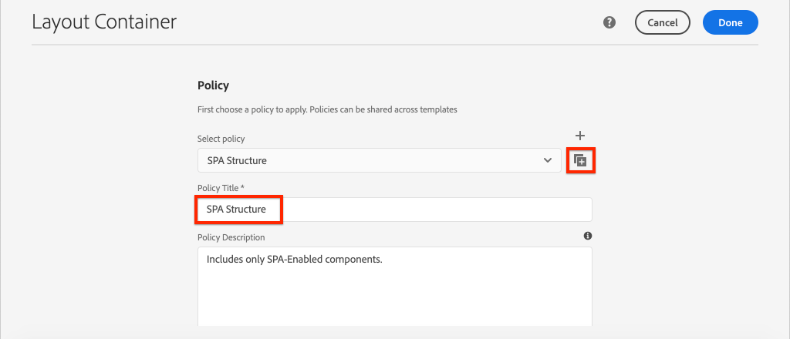

# Lägga till navigering och routning {#navigation-routing}

{{spa-editor-deprecation}}

Lär dig hur flera vyer i SPA stöds med AEM Pages och SPA Editor SDK. Dynamisk navigering implementeras med Angular-vägar och läggs till i en befintlig Header-komponent.

## Syfte

1. Förstå de alternativ för SPA-modellroutning som är tillgängliga när du använder SPA-redigeraren.
2. Lär dig att använda [Angular-routning](https://angular.io/guide/router) för att navigera mellan olika vyer av SPA.
3. Implementera en dynamisk navigering som styrs av AEM sidhierarki.

## Vad du ska bygga

I det här kapitlet läggs en navigeringsmeny till i en befintlig `Header`-komponent. Navigeringsmenyn styrs av AEM sidhierarki och använder JSON-modellen som tillhandahålls av [kärnkomponenten för navigering](https://experienceleague.adobe.com/docs/experience-manager-core-components/using/components/navigation.html).


## Förutsättningar

Granska de verktyg och instruktioner som krävs för att konfigurera en [lokal utvecklingsmiljö](overview.md#local-dev-environment).

### Hämta koden

1. Hämta startpunkten för den här självstudiekursen via Git:

   ```shell
   $ git clone git@github.com:adobe/aem-guides-wknd-spa.git
   $ cd aem-guides-wknd-spa
   $ git checkout Angular/navigation-routing-start
   ```

2. Distribuera kodbasen till en lokal AEM-instans med Maven:

   ```shell
   $ mvn clean install -PautoInstallSinglePackage
   ```

   Om du använder [AEM 6.x](overview.md#compatibility) lägger du till profilen `classic`:

   ```shell
   $ mvn clean install -PautoInstallSinglePackage -Pclassic
   ```

3. Installera det färdiga paketet för den traditionella [WKND-referensplatsen](https://github.com/adobe/aem-guides-wknd/releases/latest). Bilderna som tillhandahålls av [WKND-referensplatsen](https://github.com/adobe/aem-guides-wknd/releases/latest) återanvänds på WKND SPA. Paketet kan installeras med [AEM Package Manager](http://localhost:4502/crx/packmgr/index.jsp).

   

Du kan alltid visa den färdiga koden på [GitHub](https://github.com/adobe/aem-guides-wknd-spa/tree/Angular/navigation-routing-solution) eller checka ut koden lokalt genom att växla till grenen `Angular/navigation-routing-solution`.

## Granska uppdateringar av HeaderComponent {#inspect-header}

I tidigare kapitel lades komponenten `HeaderComponent` till som en ren Angular-komponent som inkluderades via `app.component.html`. I det här kapitlet tas komponenten `HeaderComponent` bort från programmet och läggs till via [mallredigeraren](https://experienceleague.adobe.com/docs/experience-manager-learn/sites/page-authoring/template-editor-feature-video-use.html). Detta gör att användare kan konfigurera navigeringsmenyn för `HeaderComponent` inifrån AEM.

>[!NOTE]
>
> Flera CSS- och JavaScript-uppdateringar har redan gjorts i kodbasen för att starta det här kapitlet. Om du vill fokusera på kärnkoncept beskrivs inte **alla** av kodändringarna. Du kan visa de fullständiga ändringarna [här](https://github.com/adobe/aem-guides-wknd-spa/compare/Angular/map-components-solution...Angular/navigation-routing-start).

1. I den IDE du väljer öppnar du SPA-startprojektet för det här kapitlet.
2. Under modulen `ui.frontend` undersöker du filen `header.component.ts` vid: `ui.frontend/src/app/components/header/header.component.ts`.

   Flera uppdateringar har gjorts, bland annat tillägg av en `HeaderEditConfig` och en `MapTo` som gör att komponenten kan mappas till en AEM-komponent `wknd-spa-angular/components/header`.

   ```js
   /* header.component.ts */
   ...
   const HeaderEditConfig = {
       ...
   };
   
   @Component({
   selector: 'app-header',
   templateUrl: './header.component.html',
   styleUrls: ['./header.component.scss']
   })
   export class HeaderComponent implements OnInit {
   @Input() items: object[];
       ...
   }
   ...
   MapTo('wknd-spa-angular/components/header')(withRouter(Header), HeaderEditConfig);
   ```

   Observera `@Input()`-anteckningen för `items`. `items` innehåller en array med navigeringsobjekt som skickas från AEM.

3. Kontrollera komponentdefinitionen för AEM `Header`-komponenten i modulen `ui.apps`: `ui.apps/src/main/content/jcr_root/apps/wknd-spa-angular/components/header/.content.xml`:

   ```xml
   <?xml version="1.0" encoding="UTF-8"?>
   <jcr:root xmlns:sling="http://sling.apache.org/jcr/sling/1.0" xmlns:cq="http://www.day.com/jcr/cq/1.0"
       xmlns:jcr="http://www.jcp.org/jcr/1.0"
       jcr:primaryType="cq:Component"
       jcr:title="Header"
       sling:resourceSuperType="wknd-spa-angular/components/navigation"
       componentGroup="WKND SPA Angular - Structure"/>
   ```

   AEM `Header`-komponenten ärver alla funktioner i [ Navigation Core Component ](https://experienceleague.adobe.com/docs/experience-manager-core-components/using/components/navigation.html) via egenskapen `sling:resourceSuperType` .

## Lägg till HeaderComponent i SPA-mallen {#add-header-template}

1. Öppna en webbläsare och logga in på AEM, [http://localhost:4502/](http://localhost:4502/). Startkodbasen ska redan distribueras.
2. Navigera till **[!UICONTROL SPA Page Template]**: [http://localhost:4502/editor.html/conf/wknd-spa-angular/settings/wcm/templates/spa-page-template/structure.html](http://localhost:4502/editor.html/conf/wknd-spa-angular/settings/wcm/templates/spa-page-template/structure.html).
3. Markera den yttre **[!UICONTROL Root Layout Container]** och klicka på ikonen **[!UICONTROL Policy]** för den. Var försiktig med att **inte** väljer **[!UICONTROL Layout Container]** som inte är låst för redigering.

   

4. Kopiera den aktuella principen och skapa en ny princip med namnet **[!UICONTROL SPA Structure]**:

   

   Välj komponenten **[!UICONTROL Layout Container]** under **[!UICONTROL Allowed Components]** > **[!UICONTROL General]** >.

   Under **[!UICONTROL Allowed Components]** > **[!UICONTROL WKND SPA ANGULAR - STRUCTURE]** > väljer du komponenten **[!UICONTROL Header]**:

   

   Under **[!UICONTROL Allowed Components]** > **[!UICONTROL WKND SPA ANGULAR - Content]** > markerar du komponenterna **[!UICONTROL Image]** och **[!UICONTROL Text]**. Du bör välja totalt 4 komponenter.

   Klicka på **[!UICONTROL Done]** om du vill spara ändringarna.

5. **Uppdatera** sidan. Lägg till komponenten **[!UICONTROL Header]** ovanför den olåsta **[!UICONTROL Layout Container]**:

   

6. Markera komponenten **[!UICONTROL Header]** och klicka på dess **princip**-ikon för att redigera profilen.

   

7. Skapa en ny princip med **[!UICONTROL Policy Title]** av **&quot;WKND SPA Header&quot;**.

   Under **[!UICONTROL Properties]**:

   * Ange **[!UICONTROL Navigation Root]** som `/content/wknd-spa-angular/us/en`.
   * Ange **[!UICONTROL Exclude Root Levels]** till **1**.
   * Avmarkera **[!UICONTROL Collect al child pages]**.
   * Ange **[!UICONTROL Navigation Structure Depth]** till **3**.

   

   Detta samlar in navigering 2 nivåer under `/content/wknd-spa-angular/us/en`.

8. När du har sparat dina ändringar bör du se det ifyllda `Header` som en del av mallen:

   

## Skapa underordnade sidor

Skapa sedan ytterligare sidor i AEM som ska fungera som de olika vyerna i SPA. Vi kommer också att undersöka den hierarkiska strukturen för JSON-modellen som tillhandahålls av AEM.

1. Gå till konsolen **Platser**: [http://localhost:4502/sites.html/content/wknd-spa-angular/us/en/home](http://localhost:4502/sites.html/content/wknd-spa-angular/us/en/home). Markera **WKND SPA Angular hemsida** och klicka på **[!UICONTROL Create]** > **[!UICONTROL Page]**:

   

2. Under **[!UICONTROL Template]** väljer du **[!UICONTROL SPA Page]**. Under **[!UICONTROL Properties]** anger du **&quot;Sida 1&quot;** som namn för **[!UICONTROL Title]** och **&quot;sida-1&quot;**.

   

   Klicka på **[!UICONTROL Create]** och öppna sidan i AEM SPA Editor genom att klicka på **[!UICONTROL Open]** i dialogrutan.

3. Lägg till en ny **[!UICONTROL Text]**-komponent i huvudkomponenten **[!UICONTROL Layout Container]**. Redigera komponenten och ange texten: **&quot;Sida 1&quot;** med RTE- och elementet **H1** (du måste ange helskärmsläge för att ändra styckeelementen)

   

   Du kan lägga till ytterligare innehåll, som en bild.

4. Gå tillbaka till AEM Sites-konsolen och upprepa stegen ovan, och skapa en andra sida med namnet **&quot;Sida 2&quot;** som en jämställd sida med **sidan 1**. Lägg till innehåll på **sidan 2** så att det är lätt att identifiera.
5. Skapa slutligen en tredje sida, **&quot;Sida 3&quot;**, men som **underordnad** till **sidan 2**. När webbplatshierarkin är klar ska den se ut så här:

   

6. Öppna JSON-modell-API:t från AEM på en ny flik: [http://localhost:4502/content/wknd-spa-angular/us/en.model.json](http://localhost:4502/content/wknd-spa-angular/us/en.model.json). Det här JSON-innehållet begärs när SPA läses in för första gången. Den yttre strukturen ser ut så här:

   ```json
   {
   "language": "en",
   "title": "en",
   "templateName": "spa-app-template",
   "designPath": "/libs/settings/wcm/designs/default",
   "cssClassNames": "spa page basicpage",
   ":type": "wknd-spa-angular/components/spa",
   ":items": {},
   ":itemsOrder": [],
   ":hierarchyType": "page",
   ":path": "/content/wknd-spa-angular/us/en",
   ":children": {
       "/content/wknd-spa-angular/us/en/home": {},
       "/content/wknd-spa-angular/us/en/home/page-1": {},
       "/content/wknd-spa-angular/us/en/home/page-2": {},
       "/content/wknd-spa-angular/us/en/home/page-2/page-3": {}
       }
   }
   ```

   Under `:children` ska du se en post för varje sida som skapas. Innehållet för alla sidor finns i den här inledande JSON-begäran. När navigeringsflödet har implementerats läses efterföljande vyer av SPA in snabbt eftersom innehållet redan är tillgängligt på klientsidan.

   Det är inte klokt att läsa in **ALL** av innehållet i en SPA i den inledande JSON-begäran eftersom det skulle göra den inledande sidinläsningen långsammare. Nu ska vi titta på hur sidornas hierarkiska djup samlas in.

7. Gå till mallen **SPA Root** på: [http://localhost:4502/editor.html/conf/wknd-spa-angular/settings/wcm/templates/spa-app-template/structure.html](http://localhost:4502/editor.html/conf/wknd-spa-angular/settings/wcm/templates/spa-app-template/structure.html).

   Klicka på **[!UICONTROL Page properties menu]** > **[!UICONTROL Page Policy]**:

   

8. Mallen **SPA Root** har en extra **[!UICONTROL Hierarchical Structure]**-flik som styr det JSON-innehåll som samlas in. **[!UICONTROL Structure Depth]** avgör hur djupt i platshierarkin underordnade sidor ska samlas under **roten**. Du kan också använda fältet **[!UICONTROL Structure Patterns]** för att filtrera bort ytterligare sidor baserat på ett reguljärt uttryck.

   Uppdatera **[!UICONTROL Structure Depth]** till **&quot;2&quot;**:

   

   Klicka på **[!UICONTROL Done]** om du vill spara ändringarna i profilen.

9. Öppna JSON-modellen [http://localhost:4502/content/wknd-spa-angular/us/en.model.json](http://localhost:4502/content/wknd-spa-angular/us/en.model.json) igen.

   ```json
   {
   "language": "en",
   "title": "en",
   "templateName": "spa-app-template",
   "designPath": "/libs/settings/wcm/designs/default",
   "cssClassNames": "spa page basicpage",
   ":type": "wknd-spa-angular/components/spa",
   ":items": {},
   ":itemsOrder": [],
   ":hierarchyType": "page",
   ":path": "/content/wknd-spa-angular/us/en",
   ":children": {
       "/content/wknd-spa-angular/us/en/home": {},
       "/content/wknd-spa-angular/us/en/home/page-1": {},
       "/content/wknd-spa-angular/us/en/home/page-2": {}
       }
   }
   ```

   Observera att sökvägen **Sidan 3** har tagits bort: `/content/wknd-spa-angular/us/en/home/page-2/page-3` från den ursprungliga JSON-modellen.

   Senare kommer vi att se hur AEM SPA Editor SDK dynamiskt kan läsa in ytterligare innehåll.

## Implementera navigeringen

Implementera sedan navigeringsmenyn med en ny `NavigationComponent`. Vi kan lägga till koden direkt i `header.component.html`, men det är bättre att undvika stora komponenter. Implementera i stället en `NavigationComponent` som kan återanvändas senare.

1. Granska den JSON som exponeras av AEM `Header`-komponenten på [http://localhost:4502/content/wknd-spa-angular/us/en.model.json](http://localhost:4502/content/wknd-spa-angular/us/en.model.json):

   ```json
   ...
   "header": {
       "items": [
       {
       "level": 0,
       "active": true,
       "path": "/content/wknd-spa-angular/us/en/home",
       "description": null,
       "url": "/content/wknd-spa-angular/us/en/home.html",
       "lastModified": 1589062597083,
       "title": "WKND SPA Angular Home Page",
       "children": [
               {
               "children": [],
               "level": 1,
               "active": false,
               "path": "/content/wknd-spa-angular/us/en/home/page-1",
               "description": null,
               "url": "/content/wknd-spa-angular/us/en/home/page-1.html",
               "lastModified": 1589429385100,
               "title": "Page 1"
               },
               {
               "level": 1,
               "active": true,
               "path": "/content/wknd-spa-angular/us/en/home/page-2",
               "description": null,
               "url": "/content/wknd-spa-angular/us/en/home/page-2.html",
               "lastModified": 1589429603507,
               "title": "Page 2",
               "children": [
                   {
                   "children": [],
                   "level": 2,
                   "active": false,
                   "path": "/content/wknd-spa-angular/us/en/home/page-2/page-3",
                   "description": null,
                   "url": "/content/wknd-spa-angular/us/en/home/page-2/page-3.html",
                   "lastModified": 1589430413831,
                   "title": "Page 3"
                   }
               ],
               }
           ]
           }
       ],
   ":type": "wknd-spa-angular/components/header"
   ```

   AEM-sidornas hierarkiska karaktär modelleras i JSON som kan användas för att fylla i en navigeringsmeny. Kom ihåg att komponenten `Header` ärver alla funktioner i [ Navigation Core Component ](https://www.aemcomponents.dev/content/core-components-examples/library/core-structure/navigation.html) och att innehållet som visas via JSON automatiskt mappas till Angular `@Input` -anteckningen.

2. Öppna ett nytt terminalfönster och navigera till mappen `ui.frontend` i SPA-projektet. Skapa en ny `NavigationComponent` med Angular CLI-verktyget:

   ```shell
   $ cd ui.frontend
   $ ng generate component components/navigation
   CREATE src/app/components/navigation/navigation.component.scss (0 bytes)
   CREATE src/app/components/navigation/navigation.component.html (25 bytes)
   CREATE src/app/components/navigation/navigation.component.spec.ts (656 bytes)
   CREATE src/app/components/navigation/navigation.component.ts (286 bytes)
   UPDATE src/app/app.module.ts (2032 bytes)
   ```

3. Skapa sedan en klass med namnet `NavigationLink` med Angular CLI i den nyligen skapade katalogen `components/navigation`:

   ```shell
   $ cd src/app/components/navigation/
   $ ng generate class NavigationLink
   CREATE src/app/components/navigation/navigation-link.spec.ts (187 bytes)
   CREATE src/app/components/navigation/navigation-link.ts (32 bytes)
   ```

4. Gå tillbaka till den utvecklingsmiljö du valt och öppna filen `navigation-link.ts` kl. `/src/app/components/navigation/navigation-link.ts`.

   

5. Fyll i `navigation-link.ts` med följande:

   ```js
   export class NavigationLink {
   
       title: string;
       path: string;
       url: string;
       level: number;
       children: NavigationLink[];
       active: boolean;
   
       constructor(data) {
           this.path = data.path;
           this.title = data.title;
           this.url = data.url;
           this.level = data.level;
           this.active = data.active;
           this.children = data.children.map( item => {
               return new NavigationLink(item);
           });
       }
   }
   ```

   Det här är en enkel klass som representerar en enskild navigeringslänk. I klasskonstruktorn förväntar vi att `data` ska vara det JSON-objekt som skickas från AEM. Den här klassen används både i `NavigationComponent` och `HeaderComponent` för att enkelt fylla i navigeringsstrukturen.

   Ingen dataomvandling utförs, den här klassen skapas främst för att skriva JSON-modellen med hög kvalitet. Observera att `this.children` har typen `NavigationLink[]` och att konstruktorn skapar nya `NavigationLink`-objekt rekursivt för vart och ett av objekten i arrayen `children`. Kom ihåg att JSON-modellen för `Header` är hierarkisk.

6. Öppna filen `navigation-link.spec.ts`. Det här är testfilen för klassen `NavigationLink`. Uppdatera den med följande:

   ```js
   import { NavigationLink } from './navigation-link';
   
   describe('NavigationLink', () => {
       it('should create an instance', () => {
           const data = {
               children: [],
               level: 1,
               active: false,
               path: '/content/wknd-spa-angular/us/en/home/page-1',
               description: null,
               url: '/content/wknd-spa-angular/us/en/home/page-1.html',
               lastModified: 1589429385100,
               title: 'Page 1'
           };
           expect(new NavigationLink(data)).toBeTruthy();
       });
   });
   ```

   Observera att `const data` följer samma JSON-modell som tidigare inspekterats för en enda länk. Detta är långt ifrån ett robust enhetstest, men det bör räcka att testa konstruktorn för `NavigationLink`.

7. Öppna filen `navigation.component.ts`. Uppdatera den med följande:

   ```js
   import { Component, OnInit, Input } from '@angular/core';
   import { NavigationLink } from './navigation-link';
   
   @Component({
   selector: 'app-navigation',
   templateUrl: './navigation.component.html',
   styleUrls: ['./navigation.component.scss']
   })
   export class NavigationComponent implements OnInit {
   
       @Input() items: object[];
   
       constructor() { }
   
       get navigationLinks(): NavigationLink[] {
   
           if (this.items && this.items.length > 0) {
               return this.items.map(item => {
                   return new NavigationLink(item);
               });
           }
   
           return null;
       }
   
       ngOnInit() {}
   
   }
   ```

   `NavigationComponent` förväntar sig en `object[]` med namnet `items` som är JSON-modellen från AEM. Den här klassen visar en enskild metod, `get navigationLinks()`, som returnerar en array med `NavigationLink` objekt.

8. Öppna filen `navigation.component.html` och uppdatera den med följande:

   ```html
   <ul *ngIf="navigationLinks && navigationLinks.length > 0" class="navigation__group">
       <ng-container *ngTemplateOutlet="recursiveListTmpl; context:{ links: navigationLinks }"></ng-container>
   </ul>
   ```

   Detta genererar en inledande `<ul>` och anropar metoden `get navigationLinks()` från `navigation.component.ts`. En `<ng-container>` används för att göra ett anrop till en mall med namnet `recursiveListTmpl` och skickar den till `navigationLinks` som en variabel med namnet `links`.

   Lägg till nästa `recursiveListTmpl`:

   ```html
   <ng-template #recursiveListTmpl let-links="links">
       <li *ngFor="let link of links" class="{{'navigation__item navigation__item--' + link.level}}">
           <a [routerLink]="link.url" class="navigation__item-link" [title]="link.title" [attr.aria-current]="link.active">
               {{link.title}}
           </a>
           <ul *ngIf="link.children && link.children.length > 0">
               <ng-container *ngTemplateOutlet="recursiveListTmpl; context:{ links: link.children }"></ng-container>
           </ul>
       </li>
   </ng-template>
   ```

   Här implementeras resten av återgivningen för navigeringslänken. Observera att variabeln `link` är av typen `NavigationLink` och att alla metoder och egenskaper som skapats av den klassen är tillgängliga. [`[routerLink]`](https://angular.io/api/router/RouterLink) används i stället för normalt `href`-attribut. Det gör att vi kan länka till specifika vägar i appen utan att behöva uppdatera hela sidan.

   Den rekursiva delen av navigeringen implementeras också genom att en annan `<ul>` skapas om den aktuella `link` har en icke-tom `children`-matris.

9. Uppdatera `navigation.component.spec.ts` om du vill lägga till stöd för `RouterTestingModule`:

   ```diff
    ...
   + import { RouterTestingModule } from '@angular/router/testing';
    ...
    beforeEach(async(() => {
       TestBed.configureTestingModule({
   +   imports: [ RouterTestingModule ],
       declarations: [ NavigationComponent ]
       })
       .compileComponents();
    }));
    ...
   ```

   Det krävs att `RouterTestingModule` läggs till eftersom komponenten använder `[routerLink]`.

10. Uppdatera `navigation.component.scss` om du vill lägga till några grundläggande format i `NavigationComponent`:

   ```scss
   @import "~src/styles/variables";
   
   $link-color: $black;
   $link-hover-color: $white;
   $link-background: $black;
   
   :host-context {
       display: block;
       width: 100%;
   }
   
   .navigation__item {
       list-style: none;
   }
   
   .navigation__item-link {
       color: $link-color;
       font-size: $font-size-large;
       text-transform: uppercase;
       padding: $gutter-padding;
       display: flex;
       border-bottom: 1px solid $gray;
   
       &:hover {
           background: $link-background;
           color: $link-hover-color;
       }
   
   }
   ```

## Uppdatera huvudkomponenten

Nu när `NavigationComponent` har implementerats måste `HeaderComponent` uppdateras för att referera till den.

1. Öppna en terminal och navigera till mappen `ui.frontend` i SPA-projektet. Starta **webbpaketets dev-server**:

   ```shell
   $ npm start
   ```

2. Öppna en webbläsarflik och gå till [http://localhost:4200/](http://localhost:4200/).

   Webbpaketets dev-server **** ska konfigureras att proxyansluta JSON-modellen från en lokal instans av AEM (`ui.frontend/proxy.conf.json`). På så sätt kan vi koda direkt mot innehåll som skapats i AEM tidigare i kursen.

   

   Menyalternativfunktionen är redan implementerad i `HeaderComponent`. Lägg sedan till navigeringskomponenten.

3. Gå tillbaka till den utvecklingsmiljö du vill använda och öppna filen `header.component.ts` på `ui.frontend/src/app/components/header/header.component.ts`.
4. Uppdatera metoden `setHomePage()` om du vill ta bort den hårdkodade strängen och använda de dynamiska uttryck som skickas av AEM-komponenten:

   ```js
   /* header.component.ts */
   import { NavigationLink } from '../navigation/navigation-link';
   ...
    setHomePage() {
       if (this.hasNavigation) {
           const rootNavigationLink: NavigationLink = new NavigationLink(this.items[0]);
           this.isHome = rootNavigationLink.path === this.route.snapshot.data.path;
           this.homePageUrl = rootNavigationLink.url;
       }
   }
   ...
   ```

   En ny instans av `NavigationLink` skapas baserat på `items[0]`, roten för den JSON-navigeringsmodell som skickas från AEM. `this.route.snapshot.data.path` returnerar sökvägen för den aktuella Angular-vägen. Det här värdet används för att avgöra om den aktuella vägen är **startsidan**. `this.homePageUrl` används för att fylla i ankarlänken på **logotypen**.

5. Öppna `header.component.html` och ersätt den statiska platshållaren för navigeringen med en referens till den nya `NavigationComponent`:

   ```diff
       <div class="header-navigation">
           <div class="navigation">
   -            Navigation Placeholder
   +           <app-navigation [items]="items"></app-navigation>
           </div>
       </div>
   ```

   `[items]=items`-attributet skickar `@Input() items` från `HeaderComponent` till `NavigationComponent` där navigeringen ska skapas.

6. Öppna `header.component.spec.ts` och lägg till en deklaration för `NavigationComponent`:

   ```diff
       /* header.component.spect.ts */
   +   import { NavigationComponent } from '../navigation/navigation.component';
   
       describe('HeaderComponent', () => {
       let component: HeaderComponent;
       let fixture: ComponentFixture<HeaderComponent>;
   
       beforeEach(async(() => {
           TestBed.configureTestingModule({
           imports: [ RouterTestingModule ],
   +       declarations: [ HeaderComponent, NavigationComponent ]
           })
           .compileComponents();
       }));
   ```

   Eftersom `NavigationComponent` nu används som en del av `HeaderComponent` måste den deklareras som en del av testbädden.

7. Spara ändringar i alla öppna filer och gå tillbaka till **webbpaketets dev-server**: [http://localhost:4200/](http://localhost:4200/)

   

   Öppna navigeringen genom att klicka på menyväxlingsknappen så visas de ifyllda navigeringslänkarna. Du bör kunna navigera till olika vyer av SPA.

## Förstå SPA-routning

Nu när navigeringen har implementerats inspekterar du routningen i AEM.

1. I IDE öppnar du filen `app-routing.module.ts` vid `ui.frontend/src/app`.

   ```js
   /* app-routing.module.ts */
   import { AemPageDataResolver, AemPageRouteReuseStrategy } from '@adobe/cq-angular-editable-components';
   import { NgModule } from '@angular/core';
   import { RouteReuseStrategy, RouterModule, Routes, UrlMatchResult, UrlSegment } from '@angular/router';
   import { PageComponent } from './components/page/page.component';
   
   export function AemPageMatcher(url: UrlSegment[]): UrlMatchResult {
       if (url.length) {
           return {
               consumed: url,
               posParams: {
                   path: url[url.length - 1]
               }
           };
       }
   }
   
   const routes: Routes = [
       {
           matcher: AemPageMatcher,
           component: PageComponent,
           resolve: {
               path: AemPageDataResolver
           }
       }
   ];
   @NgModule({
       imports: [RouterModule.forRoot(routes)],
       exports: [RouterModule],
       providers: [
           AemPageDataResolver,
           {
           provide: RouteReuseStrategy,
           useClass: AemPageRouteReuseStrategy
           }
       ]
   })
   export class AppRoutingModule {}
   ```

   Arrayen `routes: Routes = [];` definierar vägar eller navigeringssökvägar till Angular-komponentmappningar.

   `AemPageMatcher` är en anpassad Angular-router, [UrlMatcher](https://angular.io/api/router/UrlMatcher), som matchar allt som &quot;ser ut som&quot; en sida i AEM som är en del av det här Angular-programmet.

   `PageComponent` är den Angular-komponent som representerar en sida i AEM och som används för att återge de matchande vägarna. `PageComponent` granskas senare i självstudien.

   `AemPageDataResolver`, som tillhandahålls av AEM SPA Editor JS SDK, är en anpassad [Angular Router Resolver](https://angular.io/api/router/Resolve) som används för att omforma väg-URL:en, som är sökvägen i AEM inklusive tillägget .html, till resurssökvägen i AEM, som är sidsökvägen minus tillägget.

   `AemPageDataResolver` omformar till exempel en vägs URL `content/wknd-spa-angular/us/en/home.html` till sökvägen `/content/wknd-spa-angular/us/en/home`. Detta används för att matcha sidans innehåll baserat på sökvägen i JSON-modellens API.

   `AemPageRouteReuseStrategy`, som tillhandahålls av AEM SPA Editor JS SDK, är en anpassad [ RouteReuseStrategy ](https://angular.io/api/router/RouteReuseStrategy) som förhindrar återanvändning av `PageComponent` över vägar. Annars kan innehåll från sidan &quot;A&quot; visas vid navigering till sidan &quot;B&quot;.

2. Öppna filen `page.component.ts` vid `ui.frontend/src/app/components/page/`.

   ```js
   ...
   export class PageComponent {
       items;
       itemsOrder;
       path;
   
       constructor(
           private route: ActivatedRoute,
           private modelManagerService: ModelManagerService
       ) {
           this.modelManagerService
           .getData({ path: this.route.snapshot.data.path })
           .then(data => {
               this.path = data[Constants.PATH_PROP];
               this.items = data[Constants.ITEMS_PROP];
               this.itemsOrder = data[Constants.ITEMS_ORDER_PROP];
           });
       }
   }
   ```

   `PageComponent` krävs för att bearbeta den JSON som har hämtats från AEM och används som Angular-komponent för att återge vägarna.

   `ActivatedRoute`, som tillhandahålls av modulen Angular Router, innehåller läget som anger vilket JSON-innehåll för AEM Page som ska läsas in i den här instansen av Angular Page-komponenten.

   `ModelManagerService` hämtar JSON-data baserat på vägen och mappar data till klassvariablerna `path`, `items`, `itemsOrder`. Dessa skickas sedan till [AEMPageComponent](https://www.npmjs.com/package/@adobe/cq-angular-editable-components#aempagecomponent.md)

3. Öppna filen `page.component.html` vid `ui.frontend/src/app/components/page/`

   ```html
   <aem-page 
       class="structure-page" 
       [attr.data-cq-page-path]="path" 
       [cqPath]="path" 
       [cqItems]="items" 
       [cqItemsOrder]="itemsOrder">
   </aem-page>
   ```

   `aem-page` innehåller [AEMPageComponent](https://www.npmjs.com/package/@adobe/cq-angular-editable-components#aempagecomponent.md). Variablerna `path`, `items` och `itemsOrder` skickas till `AEMPageComponent`. `AemPageComponent` som tillhandahålls via SPA-redigeraren JavaScript SDK itererar sedan över dessa data och instansierar dynamiskt Angular-komponenter baserat på JSON-data som visas i självstudiekursen [Kartkomponenter](./map-components.md).

   `PageComponent` är egentligen bara en proxy för `AEMPageComponent` och det är `AEMPageComponent` som gör större delen av det tunga lyftet för att korrekt mappa JSON-modellen till Angular-komponenterna.

## Inspektera SPA-routningen i AEM

1. Öppna en terminal och stoppa **webbpaketets dev-server** om den startas. Navigera till projektets rot och distribuera projektet till AEM med dina Maven-kunskaper:

   ```shell
   $ cd aem-guides-wknd-spa
   $ mvn clean install -PautoInstallSinglePackage
   ```

   >[!CAUTION]
   >
   > Vissa mycket strikta lintingregler är aktiverade i Angular-projektet. Om det inte går att skapa Maven kontrollerar du felet och söker efter **Lint-fel i de listade filerna.**. Åtgärda eventuella fel som uppstått vid markören och kör kommandot Maven igen.

2. Gå till SPA-startsidan i AEM: [http://localhost:4502/content/wknd-spa-angular/us/en/home.html](http://localhost:4502/content/wknd-spa-angular/us/en/home.html) och öppna webbläsarens utvecklingsverktyg. Skärmbilder nedan hämtas från Google Chrome webbläsare.

   Uppdatera sidan så ser du en XHR-begäran till `/content/wknd-spa-angular/us/en.model.json`, som är SPA-roten. Observera att endast tre underordnade sidor inkluderas baserat på hierarkidjupets konfiguration till SPA-rotmallen som skapades tidigare i självstudiekursen. Detta inkluderar inte **sidan 3**.

   

3. Gå till **sidan 3** när utvecklingsverktygen är öppna:

   

   Observera att en ny XHR-begäran görs till: `/content/wknd-spa-angular/us/en/home/page-2/page-3.model.json`

   

   AEM Model Manager förstår att JSON-innehållet **Sidan 3** inte är tillgängligt och utlöser automatiskt den ytterligare XHR-begäran.

4. Fortsätt navigera i SPA med de olika navigeringslänkarna. Observera att inga ytterligare XHR-begäranden görs och att inga fullständiga siduppdateringar görs. Detta gör att SPA-avtalet blir snabbt för slutanvändaren och minskar onödiga förfrågningar till AEM.

   

5. Experimentera med djupa länkar genom att navigera direkt till: [http://localhost:4502/content/wknd-spa-angular/us/en/home/page-2.html](http://localhost:4502/content/wknd-spa-angular/us/en/home/page-2.html). Observera att webbläsarens bakåtknapp fortsätter att fungera.

## Grattis! {#congratulations}

Grattis! Du har lärt dig hur flera vyer i SPA kan användas genom att mappa till AEM Pages med SPA Editor SDK. Dynamisk navigering har implementerats med Angular-routning och lagts till i komponenten `Header`.

Du kan alltid visa den färdiga koden på [GitHub](https://github.com/adobe/aem-guides-wknd-spa/tree/Angular/navigation-routing-solution) eller checka ut koden lokalt genom att växla till grenen `Angular/navigation-routing-solution`.

### Nästa steg {#next-steps}

[Skapa en anpassad komponent](custom-component.md) - Lär dig hur du skapar en anpassad komponent som ska användas med AEM SPA Editor. Lär dig hur du utvecklar redigeringsdialogrutor och Sling-modeller för att utöka JSON-modellen så att den fyller i en anpassad komponent.
