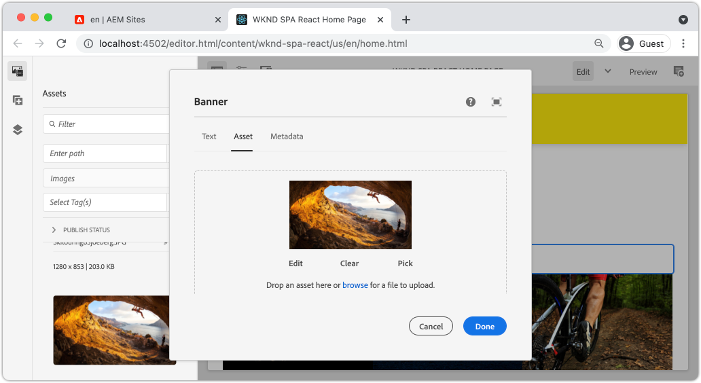

# Utöka en kärnkomponent {#extend-component}

{{spa-editor-deprecation}}

Lär dig hur du utökar en befintlig Core Component som ska användas med AEM SPA Editor. Att förstå hur man utökar en befintlig komponent är en kraftfull teknik för att anpassa och utöka funktionerna i en AEM SPA Editor-implementering.

## Syfte

1. Utöka en befintlig Core Component med ytterligare egenskaper och innehåll.
2. Förstå grunderna för komponentarv med användningen av `sling:resourceSuperType`.
3. Lär dig hur du återanvänder befintlig logik och funktionalitet med hjälp av [delegeringsmönstret](https://github.com/adobe/aem-core-wcm-components/wiki/Delegation-Pattern-for-Sling-Models) för delningsmodeller.

## Vad du ska bygga

I det här kapitlet visas den ytterligare kod som behövs för att lägga till en extra egenskap i en `Image`-standardkomponent för att uppfylla kraven för en ny `Banner`-komponent. Komponenten `Banner` innehåller alla samma egenskaper som standardkomponenten `Image` men innehåller en extra egenskap som användare kan använda för att fylla i **banderolltexten**.


## Förutsättningar

Granska de verktyg och instruktioner som krävs för att konfigurera en [lokal utvecklingsmiljö](overview.md#local-dev-environment). I det här skedet antas att användarna har en god förståelse för AEM SPA Editor.

## Arv med SSling Resource Super Type {#sling-resource-super-type}

Om du vill utöka en befintlig komponentuppsättning anger du en egenskap med namnet `sling:resourceSuperType` i komponentdefinitionen.  `sling:resourceSuperType` är en [egenskap](https://sling.apache.org/documentation/the-sling-engine/resources.html#resource-properties) som kan anges för en AEM-komponents definition som pekar på en annan komponent. Detta anger uttryckligen att komponenten ska ärva alla funktioner i komponenten som identifieras som `sling:resourceSuperType`.

Om vi vill utöka komponenten `Image` på `wknd-spa-react/components/image` måste vi uppdatera koden i modulen `ui.apps`.

1. Skapa en ny mapp under modulen `ui.apps` för `banner` vid `ui.apps/src/main/content/jcr_root/apps/wknd-spa-react/components/banner`.
1. Under `banner` skapar du en komponentdefinition (`.content.xml`) enligt följande:

   ```xml
   <?xml version="1.0" encoding="UTF-8"?>
   <jcr:root xmlns:sling="http://sling.apache.org/jcr/sling/1.0" xmlns:cq="http://www.day.com/jcr/cq/1.0" xmlns:jcr="http://www.jcp.org/jcr/1.0"
       jcr:primaryType="cq:Component"
       jcr:title="Banner"
       sling:resourceSuperType="wknd-spa-react/components/image"
       componentGroup="WKND SPA React - Content"/>
   ```

   Detta anger att `wknd-spa-react/components/banner` ska ärva alla funktioner i `wknd-spa-react/components/image`.

## cq:editConfig {#cq-edit-config}

Filen `_cq_editConfig.xml` styr dra och släpp-beteendet i AEM redigeringsgränssnitt. När du utökar bildkomponenten är det viktigt att resurstypen matchar själva komponenten.

1. I modulen `ui.apps` skapar du en annan fil under `banner` med namnet `_cq_editConfig.xml`.
1. Fyll `_cq_editConfig.xml` med följande XML:

   ```xml
   <?xml version="1.0" encoding="UTF-8"?>
   <jcr:root xmlns:sling="http://sling.apache.org/jcr/sling/1.0" xmlns:cq="http://www.day.com/jcr/cq/1.0" xmlns:jcr="http://www.jcp.org/jcr/1.0" xmlns:nt="http://www.jcp.org/jcr/nt/1.0"
       jcr:primaryType="cq:EditConfig">
       <cq:dropTargets jcr:primaryType="nt:unstructured">
           <image
               jcr:primaryType="cq:DropTargetConfig"
               accept="[image/gif,image/jpeg,image/png,image/webp,image/tiff,image/svg\\+xml]"
               groups="[media]"
               propertyName="./fileReference">
               <parameters
                   jcr:primaryType="nt:unstructured"
                   sling:resourceType="wknd-spa-react/components/banner"
                   imageCrop=""
                   imageMap=""
                   imageRotate=""/>
           </image>
       </cq:dropTargets>
       <cq:inplaceEditing
           jcr:primaryType="cq:InplaceEditingConfig"
           active="{Boolean}true"
           editorType="image">
           <inplaceEditingConfig jcr:primaryType="nt:unstructured">
               <plugins jcr:primaryType="nt:unstructured">
                   <crop
                       jcr:primaryType="nt:unstructured"
                       supportedMimeTypes="[image/jpeg,image/png,image/webp,image/tiff]"
                       features="*">
                       <aspectRatios jcr:primaryType="nt:unstructured">
                           <wideLandscape
                               jcr:primaryType="nt:unstructured"
                               name="Wide Landscape"
                               ratio="0.6180"/>
                           <landscape
                               jcr:primaryType="nt:unstructured"
                               name="Landscape"
                               ratio="0.8284"/>
                           <square
                               jcr:primaryType="nt:unstructured"
                               name="Square"
                               ratio="1"/>
                           <portrait
                               jcr:primaryType="nt:unstructured"
                               name="Portrait"
                               ratio="1.6180"/>
                       </aspectRatios>
                   </crop>
                   <flip
                       jcr:primaryType="nt:unstructured"
                       supportedMimeTypes="[image/jpeg,image/png,image/webp,image/tiff]"
                       features="-"/>
                   <map
                       jcr:primaryType="nt:unstructured"
                       supportedMimeTypes="[image/jpeg,image/png,image/webp,image/tiff,image/svg+xml]"
                       features="*"/>
                   <rotate
                       jcr:primaryType="nt:unstructured"
                       supportedMimeTypes="[image/jpeg,image/png,image/webp,image/tiff]"
                       features="*"/>
                   <zoom
                       jcr:primaryType="nt:unstructured"
                       supportedMimeTypes="[image/jpeg,image/png,image/webp,image/tiff]"
                       features="*"/>
               </plugins>
               <ui jcr:primaryType="nt:unstructured">
                   <inline
                       jcr:primaryType="nt:unstructured"
                       toolbar="[crop#launch,rotate#right,history#undo,history#redo,fullscreen#fullscreen,control#close,control#finish]">
                       <replacementToolbars
                           jcr:primaryType="nt:unstructured"
                           crop="[crop#identifier,crop#unlaunch,crop#confirm]"/>
                   </inline>
                   <fullscreen jcr:primaryType="nt:unstructured">
                       <toolbar
                           jcr:primaryType="nt:unstructured"
                           left="[crop#launchwithratio,rotate#right,flip#horizontal,flip#vertical,zoom#reset100,zoom#popupslider]"
                           right="[history#undo,history#redo,fullscreen#fullscreenexit]"/>
                       <replacementToolbars jcr:primaryType="nt:unstructured">
                           <crop
                               jcr:primaryType="nt:unstructured"
                               left="[crop#identifier]"
                               right="[crop#unlaunch,crop#confirm]"/>
                           <map
                               jcr:primaryType="nt:unstructured"
                               left="[map#rectangle,map#circle,map#polygon]"
                               right="[map#unlaunch,map#confirm]"/>
                       </replacementToolbars>
                   </fullscreen>
               </ui>
           </inplaceEditingConfig>
       </cq:inplaceEditing>
   </jcr:root>
   ```

1. Den unika aspekten av filen är noden `<parameters>` som anger resourceType till `wknd-spa-react/components/banner`.

   ```xml
   <parameters
       jcr:primaryType="nt:unstructured"
       sling:resourceType="wknd-spa-react/components/banner"
       imageCrop=""
       imageMap=""
       imageRotate=""/>
   ```

   De flesta komponenter kräver inte `_cq_editConfig`. Bildkomponenter och underordnade är undantag.

## Utöka dialogrutan {#extend-dialog}

Komponenten `Banner` kräver ett extra textfält i dialogrutan för att hämta `bannerText`. Eftersom vi använder ling-arv kan vi använda funktionerna i [Sling Resource Merger](https://experienceleague.adobe.com/docs/experience-manager-65/developing/platform/sling-resource-merger.html?lang=sv-SE) för att åsidosätta eller utöka delar av dialogrutan. I det här exemplet har en ny flik lagts till i dialogrutan för att hämta ytterligare data från en författare som ska fylla i kortkomponenten.

1. Skapa en mapp med namnet `_cq_dialog` i modulen `ui.apps` under mappen `banner`.
1. Under `_cq_dialog` skapar du en dialogrutedefinitionsfil `.content.xml`. Fyll den med följande:

   ```xml
   <?xml version="1.0" encoding="UTF-8"?>
   <jcr:root xmlns:sling="http://sling.apache.org/jcr/sling/1.0" xmlns:granite="http://www.adobe.com/jcr/granite/1.0" xmlns:cq="http://www.day.com/jcr/cq/1.0" xmlns:jcr="http://www.jcp.org/jcr/1.0" xmlns:nt="http://www.jcp.org/jcr/nt/1.0"
       jcr:primaryType="nt:unstructured"
       jcr:title="Banner"
       sling:resourceType="cq/gui/components/authoring/dialog">
       <content jcr:primaryType="nt:unstructured">
           <items jcr:primaryType="nt:unstructured">
               <tabs jcr:primaryType="nt:unstructured">
                   <items jcr:primaryType="nt:unstructured">
                       <text
                           jcr:primaryType="nt:unstructured"
                           jcr:title="Text"
                           sling:orderBefore="asset"
                           sling:resourceType="granite/ui/components/coral/foundation/container"
                           margin="{Boolean}true">
                           <items jcr:primaryType="nt:unstructured">
                               <columns
                                   jcr:primaryType="nt:unstructured"
                                   sling:resourceType="granite/ui/components/coral/foundation/fixedcolumns"
                                   margin="{Boolean}true">
                                   <items jcr:primaryType="nt:unstructured">
                                       <column
                                           jcr:primaryType="nt:unstructured"
                                           sling:resourceType="granite/ui/components/coral/foundation/container">
                                           <items jcr:primaryType="nt:unstructured">
                                               <textGroup
                                                   granite:hide="${cqDesign.titleHidden}"
                                                   jcr:primaryType="nt:unstructured"
                                                   sling:resourceType="granite/ui/components/coral/foundation/well">
                                                   <items jcr:primaryType="nt:unstructured">
                                                       <bannerText
                                                           jcr:primaryType="nt:unstructured"
                                                           sling:resourceType="granite/ui/components/coral/foundation/form/textfield"
                                                           fieldDescription="Text to display on top of the banner."
                                                           fieldLabel="Banner Text"
                                                           name="./bannerText"/>
                                                   </items>
                                               </textGroup>
                                           </items>
                                       </column>
                                   </items>
                               </columns>
                           </items>
                       </text>
                   </items>
               </tabs>
           </items>
       </content>
   </jcr:root>
   ```

   Ovanstående XML-definition skapar en ny flik med namnet **Text** och sorterar den *före* den befintliga fliken **Resurs**. Det kommer att innehålla ett enda fält, **banderolltext**.

1. Dialogrutan ser ut så här:

   

   Observera att vi inte behövde definiera flikarna för **Resurs** eller **Metadata**. Dessa ärvs via egenskapen `sling:resourceSuperType`.

   Innan vi kan förhandsgranska dialogrutan måste vi implementera SPA-komponenten och funktionen `MapTo`.

## Implementera SPA-komponent {#implement-spa-component}

Om du vill använda banderollkomponenten med SPA-redigeraren måste en ny SPA-komponent skapas som ska mappas till `wknd-spa-react/components/banner`. Detta görs i modulen `ui.frontend`.

1. Skapa en ny mapp för `Banner` på `ui.frontend/src/components/Banner` i modulen `ui.frontend`.
1. Skapa en ny fil med namnet `Banner.js` under mappen `Banner`. Fyll den med följande:

   ```js
   import React, {Component} from 'react';
   import {MapTo} from '@adobe/aem-react-editable-components';
   
   export const BannerEditConfig = {
       emptyLabel: 'Banner',
   
       isEmpty: function(props) {
           return !props || !props.src || props.src.trim().length < 1;
       }
   };
   
   export default class Banner extends Component {
   
       get content() {
           return ;
       }
   
       // display our custom bannerText property!
       get bannerText() {
           if(this.props.bannerText) {
               return <h4>{this.props.bannerText}</h4>;
           }
   
           return null;
       }
   
       render() {
           if (BannerEditConfig.isEmpty(this.props)) {
               return null;
           }
   
           return (
               <div className="Banner">
                   {this.bannerText}
                   <div className="BannerImage">{this.content}</div>
               </div>
           );
       }
   }
   
   MapTo('wknd-spa-react/components/banner')(Banner, BannerEditConfig);
   ```

   Den här SPA-komponenten mappar till AEM-komponenten `wknd-spa-react/components/banner` som skapades tidigare.

1. Uppdatera `import-components.js` vid `ui.frontend/src/components/import-components.js` om du vill inkludera den nya SPA-komponenten `Banner`:

   ```diff
     import './ExperienceFragment/ExperienceFragment';
     import './OpenWeather/OpenWeather';
   + import './Banner/Banner';
   ```

1. Nu kan projektet distribueras till AEM och dialogen kan testas. Driftsätt projektet med dina Maven-kunskaper:

   ```shell
   $ cd aem-guides-wknd-spa.react
   $ mvn clean install -PautoInstallSinglePackage
   ```

1. Uppdatera SPA-mallens princip för att lägga till komponenten `Banner` som en **tillåten komponent**.

1. Navigera till en SPA-sida och lägg till komponenten `Banner` på en av SPA-sidorna:

   

   >[!NOTE]
   >
   > I dialogrutan kan du spara ett värde för **banderolltext**, men det här värdet återspeglas inte i SPA-komponenten. För att aktivera måste vi utöka komponentens Sling-modell.

## Lägg till Java-gränssnitt {#java-interface}

För att exponera värdena från komponentdialogrutan för React-komponenten måste vi uppdatera Sling-modellen som fyller i JSON-koden för `Banner`-komponenten. Detta görs i modulen `core` som innehåller all Java-kod för vårt SPA-projekt.

Först skapar vi ett nytt Java-gränssnitt för `Banner` som utökar Java-gränssnittet i `Image`.

1. Skapa en ny fil med namnet `BannerModel.java` på `core/src/main/java/com/adobe/aem/guides/wkndspa/react/core/models` i modulen `core`.
1. Fyll i `BannerModel.java` med följande:

   ```java
   package com.adobe.aem.guides.wkndspa.react.core.models;
   
   import com.adobe.cq.wcm.core.components.models.Image;
   import org.osgi.annotation.versioning.ProviderType;
   
   @ProviderType
   public interface BannerModel extends Image {
   
       public String getBannerText();
   
   }
   ```

   Detta ärver alla metoder från Core Component `Image`-gränssnittet och lägger till en ny metod, `getBannerText()`.

## Implementera segmenteringsmodell {#sling-model}

Implementera sedan Sling-modellen för gränssnittet `BannerModel`.

1. Skapa en ny fil med namnet `BannerModelImpl.java` på `core/src/main/java/com/adobe/aem/guides/wkndspa/react/core/models/impl` i modulen `core`.

1. Fyll i `BannerModelImpl.java` med följande:

   ```java
   package com.adobe.aem.guides.wkndspa.react.core.models.impl;
   
   import com.adobe.aem.guides.wkndspa.react.core.models.BannerModel;
   import com.adobe.cq.export.json.ComponentExporter;
   import com.adobe.cq.export.json.ExporterConstants;
   import com.adobe.cq.wcm.core.components.models.Image;
   import org.apache.sling.models.annotations.*;
   import org.apache.sling.api.SlingHttpServletRequest;
   import org.apache.sling.models.annotations.Model;
   import org.apache.sling.models.annotations.injectorspecific.Self;
   import org.apache.sling.models.annotations.injectorspecific.ValueMapValue;
   import org.apache.sling.models.annotations.via.ResourceSuperType;
   
   @Model(
       adaptables = SlingHttpServletRequest.class, 
       adapters = { BannerModel.class,ComponentExporter.class}, 
       resourceType = BannerModelImpl.RESOURCE_TYPE, 
       defaultInjectionStrategy = DefaultInjectionStrategy.OPTIONAL
   )
   @Exporter(name = ExporterConstants.SLING_MODEL_EXPORTER_NAME, extensions = ExporterConstants.SLING_MODEL_EXTENSION)
   public class BannerModelImpl implements BannerModel {
   
       // points to the the component resource path in ui.apps
       static final String RESOURCE_TYPE = "wknd-spa-react/components/banner";
   
       @Self
       private SlingHttpServletRequest request;
   
       // With sling inheritance (sling:resourceSuperType) we can adapt the current resource to the Image class
       // this allows us to re-use all of the functionality of the Image class, without having to implement it ourself
       // see https://github.com/adobe/aem-core-wcm-components/wiki/Delegation-Pattern-for-Sling-Models
       @Self
       @Via(type = ResourceSuperType.class)
       private Image image;
   
       // map the property saved by the dialog to a variable named `bannerText`
       @ValueMapValue
       private String bannerText;
   
       // public getter to expose the value of `bannerText` via the Sling Model and JSON output
       @Override
       public String getBannerText() {
           return bannerText;
       }
   
       // Re-use the Image class for all other methods:
   
       @Override
       public String getSrc() {
           return null != image ? image.getSrc() : null;
       }
   
       @Override
       public String getAlt() {
           return null != image ? image.getAlt() : null;
       }
   
       @Override
       public String getTitle() {
           return null != image ? image.getTitle() : null;
       }
   
       // method required by `ComponentExporter` interface
       // exposes a JSON property named `:type` with a value of `wknd-spa-react/components/banner`
       // required to map the JSON export to the SPA component props via the `MapTo`
       @Override
       public String getExportedType() {
           return BannerModelImpl.RESOURCE_TYPE;
       }
   }
   ```

   Observera att anteckningarna `@Model` och `@Exporter` används för att säkerställa att Sling Model kan serialiseras som JSON via Sling Model Exporter.

   `BannerModelImpl.java` använder [Delegeringsmönstret för delningsmodeller](https://github.com/adobe/aem-core-wcm-components/wiki/Delegation-Pattern-for-Sling-Models) för att undvika att skriva om all logik från huvudkomponenten i Image.

1. Granska följande rader:

   ```java
   @Self
   @Via(type = ResourceSuperType.class)
   private Image image;
   ```

   Anteckningen ovan instansierar ett bildobjekt med namnet `image` baserat på `sling:resourceSuperType`-arvet för komponenten `Banner`.

   ```java
   @Override
   public String getSrc() {
       return null != image ? image.getSrc() : null;
   }
   ```

   Det går sedan att använda objektet `image` för att implementera metoder som definieras av gränssnittet `Image`, utan att behöva skriva logiken själv. Den här tekniken används för `getSrc()`, `getAlt()` och `getTitle()`.

1. Öppna ett terminalfönster och distribuera bara uppdateringarna till modulen `core` med profilen Maven `autoInstallBundle` från katalogen `core`.

   ```shell
   $ cd core/
   $ mvn clean install -PautoInstallBundle
   ```

## Sammanställ allt {#put-together}

1. Återgå till AEM och öppna den SPA-sida som innehåller komponenten `Banner`.
1. Uppdatera komponenten `Banner` så att den innehåller **banderolltext**:

   

1. Fyll komponenten med en bild:

   

   Spara uppdateringarna i dialogrutan.

1. Du bör nu se det återgivna värdet för **banderolltext**:


1. Visa JSON-modellsvaret på: [http://localhost:4502/content/wknd-spa-react/us/en.model.json](http://localhost:4502/content/wknd-spa-react/us/en.model.json) och sök efter `wknd-spa-react/components/card`:

   ```json
   "banner": {
       "bannerText": "My Banner Text",
       "src": "/content/wknd-spa-react/us/en/home/_jcr_content/root/responsivegrid/banner.coreimg.jpeg/1622167884688/sport-climbing.jpeg",
       "alt": "alt banner rock climber",
       ":type": "wknd-spa-react/components/banner"
    },
   ```

   Observera att JSON-modellen uppdateras med ytterligare nyckel-/värdepar när Sling-modellen har implementerats i `BannerModelImpl.java`.

## Grattis! {#congratulations}

Grattis! Du har lärt dig att utöka en AEM-komponent med hjälp av och hur Sling-modeller och dialogrutor fungerar med JSON-modellen.
