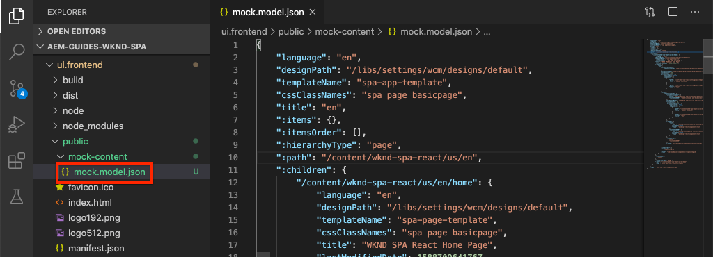

# Integrera SPA {#developer-workflow}

Förstå hur källkoden för ett Single Page-program (SPA) skrivet i React kan integreras med ett Adobe Experience Manager (AEM)-projekt. Lär dig använda moderna front end-verktyg, som en webpack-dev-server, för att snabbt utveckla SPA mot AEM JSON-modell-API:t.

## Syfte

1. Förstå hur SPA projekt integreras med AEM med bibliotek på klientsidan.
2. Lär dig hur du använder en webbpaketutvecklingsserver för dedikerad frontendutveckling.
3. Utforska användningen av en **proxy**- och statisk **mock**-fil för utveckling mot AEM JSON-modell-API.

## Vad du ska bygga

I det här kapitlet gör du flera små ändringar av SPA för att förstå hur den är integrerad med AEM.
I det här kapitlet läggs en enkel `Header`-komponent till i SPA. Under processen att skapa den här **statiska** `Header` komponenten används flera metoder för AEM SPA.


*SPA utökas för att lägga till en statisk `Header`-komponent*

## Förutsättningar

Granska de verktyg och instruktioner som krävs för att konfigurera en [lokal utvecklingsmiljö](overview.md#local-dev-environment). Det här kapitlet är en fortsättning på kapitlet [Skapa projekt](create-project.md), men för att följa med i det här steget behöver du bara ha ett fungerande SPA-aktiverat AEM.

## Integreringsmetod {#integration-approach}

Två moduler skapades som en del av AEM: `ui.apps` och `ui.frontend`.

Modulen `ui.frontend` är ett [webpack](https://webpack.js.org/)-projekt som innehåller all SPA källkod. Huvuddelen av SPA utveckling och testning görs i webbpaketsprojektet. När ett produktionsbygge utlöses byggs SPA och kompileras med webpack. De kompilerade artefakterna (CSS och Javascript) kopieras till modulen `ui.apps` som sedan distribueras till AEM.


*En högnivåbild av SPA.*

Ytterligare information om Front-end-bygget finns [här](https://experienceleague.adobe.com/docs/experience-manager-core-components/using/developing/archetype/uifrontend-react.html).

## Integreringen av Inspect SPA {#inspect-spa-integration}

Kontrollera sedan modulen `ui.frontend` för att förstå SPA som har genererats automatiskt av [AEM Project-arkitypen](https://experienceleague.adobe.com/docs/experience-manager-core-components/using/developing/archetype/uifrontend-react.html).

1. I den utvecklingsmiljö du väljer öppnar du AEM. I den här självstudien används [Visual Studio-kod-IDE](https://experienceleague.adobe.com/docs/experience-manager-learn/cloud-service/local-development-environment-set-up/development-tools.html#microsoft-visual-studio-code).

   

1. Expandera och inspektera mappen `ui.frontend`. Öppna filen `ui.frontend/package.json`

1. Under `dependencies` ska du se flera relaterade till `react` inklusive `react-scripts`

   `ui.frontend` är ett React-program som bygger på [Create React App ](https://create-react-app.dev/) eller CRA kort. Versionen `react-scripts` anger vilken version av CRA som används.

1. Det finns också flera beroenden som har prefixats med `@adobe`:

   ```json
   "@adobe/aem-react-editable-components": "~1.1.2",
   "@adobe/aem-spa-component-mapping": "~1.1.0",
   "@adobe/aem-spa-page-model-manager": "~1.3.3",
   "@adobe/aem-core-components-react-base": "1.1.8",
   "@adobe/aem-core-components-react-spa": "1.1.7",
   ```

   Ovanstående moduler utgör [AEM JS SDK](https://experienceleague.adobe.com/docs/experience-manager-65/developing/headless/spas/spa-blueprint.html) SPA Editor och tillhandahåller funktioner som gör det möjligt att mappa SPA komponenter till AEM.

   Innehåller också [AEM WCM-komponenter - React Core-implementering](https://github.com/adobe/aem-react-core-wcm-components-base) och [AEM WCM-komponenter - Spa editor - React Core-implementering](https://github.com/adobe/aem-react-core-wcm-components-spa). Detta är en uppsättning återanvändbara gränssnittskomponenter som mappas till AEM. Dessa är utformade för att användas i befintligt skick och med den utformning som passar ditt projekt.

1. I filen `package.json` finns flera `scripts` definierade:

   ```json
   "scripts": {
       "start": "react-scripts start",
       "build": "react-scripts build && clientlib",
       "test": "react-scripts test",
       "eject": "react-scripts eject",
   }
   ```

   Det här är standardbyggskript som gjorts [tillgängliga](https://create-react-app.dev/docs/available-scripts) av Create React App.

   Den enda skillnaden är att `&& clientlib` har lagts till i skriptet `build`. Den här extra instruktionen ansvarar för att kopiera den kompilerade SPA till modulen `ui.apps` som ett klientbibliotek under en bygge.

   NPM-modulen [aem-clientlib-generator](https://github.com/wcm-io-frontend/aem-clientlib-generator) används för att underlätta detta.

1. Inspect filen `ui.frontend/clientlib.config.js`. Den här konfigurationsfilen används av [aem-clientlib-generator](https://github.com/wcm-io-frontend/aem-clientlib-generator#clientlibconfigjs) för att avgöra hur klientbiblioteket ska genereras.

1. Inspect filen `ui.frontend/pom.xml`. Den här filen omvandlar mappen `ui.frontend` till en [Maven-modul](https://maven.apache.org/guides/mini/guide-multiple-modules.html). Filen `pom.xml` har uppdaterats för att använda plugin-programmet [front-maven](https://github.com/eirslett/frontend-maven-plugin) till **test** och **build** SPA under en Maven-konstruktion.

1. Inspect filen `index.js` på `ui.frontend/src/index.js`:

   ```js
   //ui.frontend/src/index.js
   ...
   document.addEventListener('DOMContentLoaded', () => {
       ModelManager.initialize().then(pageModel => {
           const history = createBrowserHistory();
           render(
           <Router history={history}>
               <App
               history={history}
               cqChildren={pageModel[Constants.CHILDREN_PROP]}
               cqItems={pageModel[Constants.ITEMS_PROP]}
               cqItemsOrder={pageModel[Constants.ITEMS_ORDER_PROP]}
               cqPath={pageModel[Constants.PATH_PROP]}
               locationPathname={window.location.pathname}
               />
           </Router>,
           document.getElementById('spa-root')
           );
       });
   });
   ```

   `index.js` är SPA ingångspunkt. `ModelManager` tillhandahålls av AEM JS SDK för SPA. Den ansvarar för att anropa och injicera `pageModel` (JSON-innehållet) i programmet.

1. Inspect filen `import-components.js` på `ui.frontend/src/components/import-components.js`. Den här filen importerar de färdiga **React Core-komponenterna** och gör dem tillgängliga för projektet. Vi undersöker mappningen av AEM innehåll till SPA komponenter i nästa kapitel.

## Lägga till en statisk SPA {#static-spa-component}

Lägg sedan till en ny komponent i SPA och distribuera ändringarna till en lokal AEM. Det här är en enkel förändring, bara för att illustrera hur SPA uppdateras.

1. Skapa en ny mapp med namnet `Header` i modulen `ui.frontend` under `ui.frontend/src/components`.
1. Skapa en fil med namnet `Header.js` under mappen `Header`.

   

1. Fyll i `Header.js` med följande:

   ```js
   //Header.js
   import React, {Component} from 'react';
   
   export default class Header extends Component {
   
       render() {
           return (
                   <header className="Header">
                       <div className="Header-container">
                           <h1>WKND</h1>
                       </div>
                   </header>
           );
       }
   }
   ```

   Ovanför är en standardreaktionskomponent som ger en statisk textsträng.

1. Öppna filen `ui.frontend/src/App.js`. Detta är programmets startpunkt.
1. Gör följande uppdateringar av `App.js` för att inkludera den statiska `Header`:

   ```diff
     import { Page, withModel } from '@adobe/aem-react-editable-components';
     import React from 'react';
   + import Header from './components/Header/Header';
   
     // This component is the application entry point
     class App extends Page {
     render() {
         return (
         <div>
   +       <Header />
            {this.childComponents}
            {this.childPages}
        </div>
   ```

1. Öppna en ny terminal och navigera till mappen `ui.frontend` och kör kommandot `npm run build`:

   ```shell
   $ cd aem-guides-wknd-spa
   $ cd ui.frontend
   $ npm run build
   ...
   Compiled successfully.
   
   File sizes after gzip:
   
   118.95 KB (-33 B)  build/static/js/2.489f399a.chunk.js
   1.11 KB (+48 B)    build/static/js/main.6cfa5095.chunk.js
   806 B              build/static/js/runtime-main.42b998df.js
   451 B              build/static/css/main.e57bbe8a.chunk.css
   ```

1. Navigera till mappen `ui.apps`. Under `ui.apps/src/main/content/jcr_root/apps/wknd-spa-react/clientlibs/clientlib-react` bör du se att de kompilerade SPA har kopierats från mappen `ui.frontend/build`.

   

1. Återgå till terminalen och navigera till mappen `ui.apps`. Kör följande Maven-kommando:

   ```shell
   $ cd ../ui.apps
   $ mvn clean install -PautoInstallPackage
   ...
   [INFO] ------------------------------------------------------------------------
   [INFO] BUILD SUCCESS
   [INFO] ------------------------------------------------------------------------
   [INFO] Total time:  9.629 s
   [INFO] Finished at: 2020-05-04T17:48:07-07:00
   [INFO] ------------------------------------------------------------------------
   ```

   Detta distribuerar paketet `ui.apps` till en lokal instans av AEM som körs.

1. Öppna en webbläsarflik och gå till [http://localhost:4502/editor.html/content/wknd-spa-react/us/en/home.html](http://localhost:4502/editor.html/content/wknd-spa-react/us/en/home.html). Nu bör du se innehållet i komponenten `Header` som visas i SPA.

   

   Ovanstående steg utförs automatiskt när en Maven-bygge aktiveras från projektets rot (dvs `mvn clean install -PautoInstallSinglePackage`). Nu bör du förstå grunderna i integrationen mellan SPA och AEM klientbibliotek. Observera att du fortfarande kan redigera och lägga till `Text`-komponenter i AEM under den statiska `Header` -komponenten.

## Webpack Dev Server - Proxy för JSON API {#proxy-json}

Som vi har sett i tidigare övningar tar det några minuter att skapa och synkronisera klientbiblioteket till en lokal instans av AEM. Detta är godtagbart för sluttestning, men är inte idealiskt för större delen av SPA.

En [webpack-dev-server](https://webpack.js.org/configuration/dev-server/) kan användas för att snabbt utveckla SPA. SPA drivs av en JSON-modell som genereras av AEM. I den här övningen är JSON-innehållet från en instans av AEM **proxied** till utvecklingsservern.

1. Återgå till IDE och öppna filen `ui.frontend/package.json`.

   Leta efter en rad som följande:

   ```json
   "proxy": "http://localhost:4502",
   ```

   [Skapa React App](https://create-react-app.dev/docs/proxying-api-requests-in-development) är en enkel mekanism för proxy-API-begäranden. Alla okända begäranden proxiceras via `localhost:4502`, den lokala AEM snabbstarten.

1. Öppna ett terminalfönster och navigera till mappen `ui.frontend`. Kör kommandot `npm start`:

   ```shell
   $ cd ui.frontend
   $ npm start
   ...
   Compiled successfully!
   
   You can now view wknd-spa-react in the browser.
   
   Local:            http://localhost:3000
   On Your Network:  http://192.168.86.136:3000
   
   Note that the development build is not optimized.
   To create a production build, use npm run build.
   ```

1. Öppna en ny flik i webbläsaren (om den inte redan är öppen) och gå till [http://localhost:3000/content/wknd-spa-react/us/en/home.html](http://localhost:3000/content/wknd-spa-react/us/en/home.html).

   

   Du bör se samma innehåll som i AEM, men utan att någon av redigeringsfunktionerna är aktiverade.

   >[!NOTE]
   >
   > På grund av säkerhetskraven för AEM måste du vara inloggad på den lokala AEM (http://localhost:4502) i samma webbläsare, men på en annan flik.

1. Återgå till IDE och skapa en fil med namnet `Header.css` i mappen `src/components/Header`.
1. Fyll i `Header.css` med följande:

   ```css
   .Header {
       background-color: #FFEA00;
       width: 100%;
       position: fixed;
       top: 0;
       left: 0;
       z-index: 99;
       box-shadow: 0px 0px 10px 0px rgba(0, 0, 0, 0.24);
   }
   
   .Header-container {
       display: flex;
       max-width: 1024px;
       margin: 0 auto;
       padding: 12px;
   }
   
   .Header-container h1 {
       letter-spacing: 0;
       font-size: 48px;
   }
   ```

   

1. Öppna `Header.js` igen och lägg till följande rad i referensen `Header.css`:

   ```diff
     //Header.js
     import React, {Component} from 'react';
   + require('./Header.css');
   ```

   Spara ändringarna.

1. Navigera till [http://localhost:3000/content/wknd-spa-react/us/en/home.html](http://localhost:3000/content/wknd-spa-react/us/en/home.html) om du vill se formatändringarna automatiskt.

1. Öppna filen `Page.css` vid `ui.frontend/src/components/Page`. Gör följande ändringar för att korrigera utfyllnaden:

   ```css
   .page {
     max-width: 1024px;
     margin: 0 auto;
     padding: 12px;
     padding-top: 50px;
   }
   ```

1. Gå tillbaka till webbläsaren på [http://localhost:3000/content/wknd-spa-react/us/en/home.html](http://localhost:3000/content/wknd-spa-react/us/en/home.html). Du bör omedelbart se ändringarna av appen återspeglas.

   

   Du kan fortsätta att göra innehållsuppdateringar i AEM och se hur de återspeglas i **webpack-dev-server**, eftersom vi proxyerar innehållet.

1. Stoppa webbpaketets dev-server med `ctrl+c` i terminalen.

## Distribuera SPA uppdateringar till AEM

Ändringarna som gjorts i `Header` är för närvarande bara synliga genom **webpack-dev-server**. Distribuera den uppdaterade SPA för att AEM se ändringarna.

1. Navigera till projektets rot (`aem-guides-wknd-spa`) och distribuera projektet till AEM med Maven:

   ```shell
   $ cd ..
   $ mvn clean install -PautoInstallSinglePackage
   ```

2. Gå till [http://localhost:4502/editor.html/content/wknd-spa-react/us/en/home.html](http://localhost:4502/editor.html/content/wknd-spa-react/us/en/home.html). Du bör se de uppdaterade `Header` och de format som används.

   

   Nu när den uppdaterade SPA är i AEM kan redigeringen fortsätta.

## Grattis! {#congratulations}

Grattis, du har uppdaterat SPA och utforskat integreringen med AEM! Du vet nu hur du utvecklar SPA mot AEM JSON-modell-API:t med en **webpack-dev-server**.

### Nästa steg {#next-steps}

[Mappa SPA komponenter till AEM komponenter](map-components.md) - Lär dig hur du mappar React-komponenter till Adobe Experience Manager-komponenter (AEM) med AEM SPA Editor JS SDK. Komponentmappning gör att användare kan göra dynamiska uppdateringar av SPA komponenter i AEM SPA Editor, på samma sätt som vid traditionell AEM.

## (Bonus) Webpack Dev Server - Mock JSON API {#mock-json}

Ett annat sätt att snabbt utveckla är att använda en statisk JSON-fil som fungerar som JSON-modell. Genom att&quot;maska&quot; JSON tar vi bort beroendet av en lokal AEM. Den gör det också möjligt för en frontendutvecklare att uppdatera JSON-modellen för att testa funktionalitet och driva ändringar i JSON API som senare skulle implementeras av en backend-utvecklare.

Den första konfigurationen av JSON-modellinstansen **kräver en lokal AEM**.

1. Återgå till IDE och navigera till `ui.frontend/public` och lägg till en ny mapp med namnet `mock-content`.
1. Skapa en ny fil med namnet `mock.model.json` under `ui.frontend/public/mock-content`.
1. Gå till [http://localhost:4502/content/wknd-spa-react/us/en.model.json](http://localhost:4502/content/wknd-spa-react/us/en.model.json) i webbläsaren.

   Detta är den JSON som exporteras av AEM som driver programmet. Kopiera JSON-utdata.

1. Klistra in JSON-utdata från föregående steg i filen `mock.model.json`.

   

1. Öppna filen `index.html` vid `ui.frontend/public/index.html`. Uppdatera metadataegenskapen för den AEM sidmodellen så att den pekar på variabeln `%REACT_APP_PAGE_MODEL_PATH%`:

   ```html
       <!-- AEM page model -->
       <meta
          property="cq:pagemodel_root_url"
          content="%REACT_APP_PAGE_MODEL_PATH%"
       />
   ```

   Om du använder en variabel för värdet för `cq:pagemodel_root_url` blir det enklare att växla mellan proxy- och mock-json-modellen.

1. Öppna filen `ui.frontend/.env.development` och gör följande uppdateringar för att kommentera det tidigare värdet för `REACT_APP_PAGE_MODEL_PATH` och `REACT_APP_API_HOST`:

   ```diff
   + PUBLIC_URL=/
   - PUBLIC_URL=/etc.clientlibs/wknd-spa-react/clientlibs/clientlib-react/resources
   
   - REACT_APP_PAGE_MODEL_PATH=/content/wknd-spa-react/us/en.model.json
   + REACT_APP_PAGE_MODEL_PATH=/mock-content/mock.model.json
   
   - REACT_APP_API_HOST=http://localhost:4502
   + #REACT_APP_API_HOST=http://localhost:4502
   
   REACT_APP_ROOT=/content/wknd-spa-react/us/en/home.html
   ```

1. Om den körs för närvarande stoppar du **webpack-dev-server**. Starta **webpack-dev-server** från terminalen:

   ```shell
   $ cd ui.frontend
   $ npm start
   ```

   Navigera till [http://localhost:3000/content/wknd-spa-react/us/en/home.html](http://localhost:3000/content/wknd-spa-react/us/en/home.html) så ser du SPA med samma innehåll som används i **proxy** json.

1. Gör en liten ändring i filen `mock.model.json` som skapades tidigare. Det uppdaterade innehållet visas omedelbart i **webpack-dev-server**.

   

Att kunna manipulera JSON-modellen och se effekterna på en live-SPA kan hjälpa en utvecklare att förstå JSON-modellens API. Det gör det även möjligt att utveckla både fram- och bakände parallellt.

Nu kan du växla var JSON-innehållet ska användas genom att växla posterna i filen `env.development`:

```plain
# JSON API via proxy to AEM
#REACT_APP_PAGE_MODEL_PATH=/content/wknd-spa-react/us/en.model.json
#REACT_APP_API_HOST=http://localhost:4502

# JSON API via static mock file
REACT_APP_PAGE_MODEL_PATH=/mock-content/mock.model.json
```
