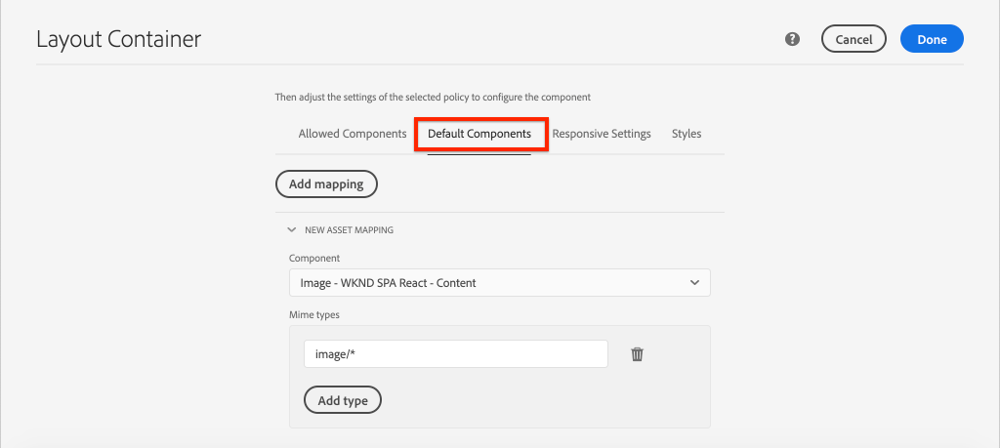

# Mappa SPA komponenter till AEM {#map-components}

Lär dig hur du mappar React-komponenter till Adobe Experience Manager-komponenter (AEM) med AEM SPA Editor JS SDK. Komponentmappning gör att användare kan göra dynamiska uppdateringar av SPA komponenter i AEM SPA Editor, på samma sätt som vid traditionell AEM.

Det här kapitlet innehåller en djupdykning i AEM JSON-modell-API:t och hur JSON-innehåll som exponeras av en AEM automatiskt kan injiceras i en React-komponent som utkast.

## Syfte

1. Lär dig hur du mappar AEM komponenter till SPA.
1. Inspect hur en React-komponent använder dynamiska egenskaper som skickas från AEM.
1. Lär dig hur du använder [React AEM Core Components](https://github.com/adobe/aem-react-core-wcm-components-examples).

## Vad du ska bygga

I det här kapitlet granskas hur den tillhandahållna `Text`-SPA mappas till AEM `Text`komponenten. Reaktionskomponenter som SPA `Image` används i SPA och skapas i AEM. Utgångsfunktionerna i **layoutbehållaren** och **mallredigeraren** används också för att skapa en vy som ser lite mer varierad ut.


## Förutsättningar

Granska de verktyg och instruktioner som krävs för att konfigurera en [lokal utvecklingsmiljö](overview.md#local-dev-environment). Det här kapitlet är en fortsättning på kapitlet [Integrera SPA](integrate-spa.md), men för att följa med i det du behöver finns det ett SPA-aktiverat AEM.

## Mappningsmetod

Det grundläggande konceptet är att mappa en SPA till en AEM. AEM komponenter, kör serversidan, exportera innehåll som en del av JSON-modellens API. JSON-innehållet används av SPA, som kör klientsidan i webbläsaren. En 1:1-mappning skapas mellan SPA och en AEM.


*Översikt på hög nivå över att mappa en AEM till en React-komponent*

## Inspect textkomponenten

[AEM Project Archetype](https://github.com/adobe/aem-project-archetype) innehåller en `Text`-komponent som är mappad till AEM [Text-komponent](https://experienceleague.adobe.com/docs/experience-manager-core-components/using/components/text.html). Detta är ett exempel på en **content** -komponent, eftersom den återger *innehåll* från AEM.

Låt oss se hur komponenten fungerar.

### Inspect JSON-modellen

1. Innan du hoppar in i SPA är det viktigt att förstå den JSON-modell som AEM tillhandahåller. Navigera till [Core Component Library](https://www.aemcomponents.dev/content/core-components-examples/library/core-content/text.html) och visa sidan för Text-komponenten. Core Component Library innehåller exempel på alla AEM Core Components.
1. Välj fliken **JSON** för ett av exemplen:

   

   Du bör se tre egenskaper: `text`, `richText` och `:type`.

   `:type` är en reserverad egenskap som visar `sling:resourceType` (eller sökväg) för AEM. Värdet `:type` är det som används för att mappa AEM till SPA.

   `text` och `richText` är ytterligare egenskaper som exponeras för SPA.

1. Visa JSON-utdata på [http://localhost:4502/content/wknd-spa-react/us/en.model.json](http://localhost:4502/content/wknd-spa-react/us/en.model.json). Du bör kunna hitta en post som liknar:

   ```json
   "text": {
       "id": "text-a647cec03a",
       "text": "<p>Hello World! Updated content!</p>\r\n",
       "richText": true,
       ":type": "wknd-spa-react/components/text",
       "dataLayer": {}
      }
   ```

### Inspect SPA komponenten Text

1. I den utvecklingsmiljö du väljer öppnar du AEM för SPA. Expandera modulen `ui.frontend` och öppna filen `Text.js` under `ui.frontend/src/components/Text/Text.js`.

1. Det första området som ska inspekteras är `class Text` på ~40:

   ```js
   class Text extends Component {
   
       get richTextContent() {
           return (<div
                   id={extractModelId(this.props.cqPath)}
                   data-rte-editelement
                   dangerouslySetInnerHTML={{__html: DOMPurify.sanitize(this.props.text)}} />
                   );
       }
   
       get textContent() {
           return <div>{this.props.text}</div>;
       }
   
       render() {
           return this.props.richText ? this.richTextContent : this.textContent;
       }
   }
   ```

   `Text` är en standardreaktionskomponent. Komponenten använder `this.props.richText` för att avgöra om innehållet som ska återges kommer att vara RTF eller oformaterad text. Det faktiska &quot;innehåll&quot; som används kommer från `this.props.text`.

   För att undvika en potentiell XSS-attack placeras den RTF-text som flödar via `DOMPurify` innan [farligtSetInnerHTML](https://reactjs.org/docs/dom-elements.html#dangerouslysetinnerhtml) används för att återge innehållet. Återkalla egenskaperna `richText` och `text` från JSON-modellen tidigare i övningen.

1. Öppna sedan `ui.frontend/src/components/import-components.js` och titta på `TextEditConfig` på ~rad 86:

   ```js
   const TextEditConfig = {
   emptyLabel: 'Text',
   
       isEmpty: function(props) {
           return !props || !props.text || props.text.trim().length < 1;
       }
   };
   ```

   Koden ovan avgör när platshållaren ska återges i AEM redigeringsmiljö. Om metoden `isEmpty` returnerar **true** återges platshållaren.

1. Ta till sist en titt på `MapTo`-anropet på ~rad 94:

   ```js
   export default MapTo('wknd-spa-react/components/text')(LazyTextComponent, TextEditConfig);
   ```

   `MapTo` tillhandahålls av AEM JS SDK för SPA (`@adobe/aem-react-editable-components`). Sökvägen `wknd-spa-react/components/text` representerar `sling:resourceType` för AEM. Den här sökvägen matchas med `:type` som exponeras av JSON-modellen som observerats tidigare. `MapTo` hanterar tolkningen av JSON-modellsvaret och skickar de korrekta värdena som `props` till SPA.

   Du hittar AEM `Text`-komponentdefinitionen på `ui.apps/src/main/content/jcr_root/apps/wknd-spa-react/components/text`.

## Använd React Core-komponenter

[AEM WCM-komponenter - React Core-implementering](https://github.com/adobe/aem-react-core-wcm-components-base) och [AEM WCM-komponenter - Spa editor - React Core-implementering](https://github.com/adobe/aem-react-core-wcm-components-spa). Detta är en uppsättning återanvändbara gränssnittskomponenter som mappas till AEM. De flesta projekt kan återanvända dessa komponenter som en startpunkt för sin egen implementering.

1. Öppna filen `import-components.js` vid `ui.frontend/src/components` i projektkoden.
Den här filen importerar alla SPA som mappar till AEM. Med tanke på den dynamiska karaktären hos implementeringen av SPA Editor måste vi uttryckligen referera till alla SPA komponenter som är kopplade till AEM redigerbara komponenter. Detta gör att en AEM kan välja att använda en komponent var de vill i programmet.
1. Följande import-programsatser innehåller SPA komponenter skrivna i projektet:

   ```js
   import './Page/Page';
   import './Text/Text';
   import './Container/Container';
   import './ExperienceFragment/ExperienceFragment';
   ```

1. Det finns flera andra `imports` från `@adobe/aem-core-components-react-spa` och `@adobe/aem-core-components-react-base`. Dessa importerar komponenterna React Core och gör dem tillgängliga i det aktuella projektet. Dessa mappas sedan till projektspecifika AEM med `MapTo`, precis som med komponentexemplet `Text` tidigare.

### Uppdatera AEM

Profiler är en funktion i AEM mallar som ger utvecklare och avancerade användare detaljkontroll över vilka komponenter som är tillgängliga för användning. React Core-komponenterna ingår i SPA Code men måste aktiveras via en policy innan de kan användas i programmet.

1. Gå till **Verktyg** > **Mallar** > **[WKND-SPA](http://localhost:4502/libs/wcm/core/content/sites/templates.html/conf/wknd-spa-react)** från AEM startskärm.

1. Markera och öppna mallen **SPA sida** för redigering.

1. Markera **layoutbehållaren** och klicka på dess **policy**-ikon för att redigera profilen:

   

1. Under **Tillåtna komponenter** > **WKND-SPA - innehåll** > kontrollera **Bild**, **Teaser** och **Titel**.

   

   Under **Standardkomponenter** > **Lägg till mappning** och välj komponenten **Bild - WKND SPA React - Innehåll**:

   

   Ange **mime-typen** av `image/*`.

   Klicka på **Klar** om du vill spara principuppdateringarna.

1. I **layoutbehållaren** klickar du på ikonen **policy** för komponenten **Text** .

   Skapa en ny princip med namnet **WKND SPA Text**. Under **Plugins** > **Formatering** > markerar du alla rutor för att aktivera ytterligare formateringsalternativ:

   

   Under **Plugins** > **Styckeformat** > markerar du kryssrutan för att **aktivera styckeformat**:

   

   Klicka på **Klar** för att spara principuppdateringen.

### Författarinnehåll

1. Navigera till **hemsidan** [http://localhost:4502/editor.html/content/wknd-spa-react/us/en/home.html](http://localhost:4502/editor.html/content/wknd-spa-react/us/en/home.html).

1. Du bör nu kunna använda de ytterligare komponenterna **Bild**, **Teaser** och **Titel** på sidan.

   

1. Du bör också kunna redigera komponenten `Text` och lägga till ytterligare styckeformat i **helskärmsläge** .

   

1. Du bör också kunna dra och släppa en bild från **Resurssökaren**:

   

1. Upplev komponenterna **Title** och **Teaser**.

1. Lägg till egna bilder via [AEM Assets](http://localhost:4502/assets.html/content/dam) eller installera den färdiga kodbasen för standardreferensplatsen [WKND](https://github.com/adobe/aem-guides-wknd/releases/latest). [WKND-referenswebbplatsen](https://github.com/adobe/aem-guides-wknd/releases/latest) innehåller många bilder som kan återanvändas på WKND-SPA. Paketet kan installeras med [AEM Package Manager](http://localhost:4502/crx/packmgr/index.jsp).

   

## Inspect layoutbehållaren

Stöd för **layoutbehållaren** tillhandahålls automatiskt av AEM SDK för SPA. **Layoutbehållaren**, som anges av namnet, är en **container**-komponent. Behållarkomponenter är komponenter som accepterar JSON-strukturer som representerar *andra* komponenter och instansierar dem dynamiskt.

Låt oss inspektera layoutbehållaren ytterligare.

1. I en webbläsare går du till [http://localhost:4502/content/wknd-spa-react/us/en.model.json](http://localhost:4502/content/wknd-spa-react/us/en.model.json)

   

   Komponenten **Layoutbehållare** har `sling:resourceType` `wcm/foundation/components/responsivegrid` och känns igen av SPA Editor med egenskapen `:type`, precis som komponenterna `Text` och `Image`.

   Samma funktioner för att ändra storlek på en komponent med [layoutläget](https://experienceleague.adobe.com/docs/experience-manager-65/authoring/siteandpage/responsive-layout.html#defining-layouts-layout-mode) finns i SPA Editor.

2. Gå tillbaka till [http://localhost:4502/editor.html/content/wknd-spa-react/us/en/home.html](http://localhost:4502/editor.html/content/wknd-spa-react/us/en/home.html). Lägg till ytterligare **Bild**-komponenter och försök ändra storlek på dem med alternativet **Layout** :

   

3. Öppna JSON-modellen [http://localhost:4502/content/wknd-spa-react/us/en.model.json](http://localhost:4502/content/wknd-spa-react/us/en.model.json) igen och observera `columnClassNames` som en del av JSON:

   

   Klassnamnet `aem-GridColumn--default--4` anger att komponenten ska vara 4 kolumner bred baserat på ett 12-kolumnsrutnät. Mer information om det [responsiva rutnätet finns här](https://adobe-marketing-cloud.github.io/aem-responsivegrid/).

4. Återgå till IDE och i modulen `ui.apps` finns ett klientbibliotek definierat vid `ui.apps/src/main/content/jcr_root/apps/wknd-spa-react/clientlibs/clientlib-grid`. Öppna filen `less/grid.less`.

   Den här filen avgör vilka brytpunkter (`default`, `tablet` och `phone`) som används av **layoutbehållaren**. Den här filen är avsedd att anpassas efter projektspecifikationer. För närvarande är brytpunkterna inställda på `1200px` och `768px`.

5. Du bör kunna använda responsiva funktioner och uppdaterade RTF-principer för komponenten `Text` för att skapa en vy som följande:

   

## Grattis! {#congratulations}

Grattis, du lärde dig att mappa SPA till AEM komponenter och du använde React Core-komponenterna. Du har också en chans att utforska de responsiva funktionerna i **layoutbehållaren**.

### Nästa steg {#next-steps}

[Navigering och routning](navigation-routing.md) - Lär dig hur flera vyer i SPA kan användas genom att mappa till AEM sidor med SPA Editor SDK. Dynamisk navigering implementeras med React Router och React Core Components.

## (Bonus) Beständiga konfigurationer av källkontrollen {#bonus-configs}

I många fall, särskilt i början av ett AEM projekt, är det viktigt att behålla konfigurationer som mallar och relaterade innehållsprinciper för källkontroll. Detta garanterar att alla utvecklare arbetar mot samma uppsättning innehåll och konfigurationer och kan säkerställa ytterligare enhetlighet mellan miljöer. När ett projekt når en viss mognadsnivå kan rutinen med mallhantering överföras till en särskild grupp med avancerade användare.

Nästa steg kommer att utföras med Visual Studio Code IDE och [VSCode AEM Sync](https://marketplace.visualstudio.com/items?itemName=yamato-ltd.vscode-aem-sync) men kan utföras med alla verktyg och alla IDE som du har konfigurerat till **pull** - eller **import** -innehåll från en lokal AEM.

1. I Visual Studio Code IDE kontrollerar du att du har **VSCode AEM Sync** installerat via Marketplace-tillägget:

   

2. Utöka modulen **ui.content** i Project Explorer och gå till `/conf/wknd-spa-react/settings/wcm/templates`.

3. **Högerklicka** på mappen `templates` och välj **Importera från AEM server**:

   

4. Upprepa stegen för att importera innehåll men välj mappen **policies** på `/conf/wknd-spa-react/settings/wcm/templates/policies`.

5. Inspect filen `filter.xml` på `ui.content/src/main/content/META-INF/vault/filter.xml`.

   ```xml
   <!--ui.content filter.xml-->
   <?xml version="1.0" encoding="UTF-8"?>
    <workspaceFilter version="1.0">
        <filter root="/conf/wknd-spa-react" mode="merge"/>
        <filter root="/content/wknd-spa-react" mode="merge"/>
        <filter root="/content/dam/wknd-spa-react" mode="merge"/>
        <filter root="/content/experience-fragments/wknd-spa-react" mode="merge"/>
    </workspaceFilter>
   ```

   Filen `filter.xml` ansvarar för att identifiera sökvägarna till noder som har installerats med paketet. Observera `mode="merge"` på vart och ett av filtren som anger att befintligt innehåll inte ändras, endast nytt innehåll läggs till. Eftersom innehållsförfattare kan uppdatera dessa sökvägar är det viktigt att en koddistribution **inte** skriver över innehåll. Mer information om hur du arbetar med filterelement finns i [dokumentationen för FileVault](https://jackrabbit.apache.org/filevault/filter.html).

   Jämför `ui.content/src/main/content/META-INF/vault/filter.xml` och `ui.apps/src/main/content/META-INF/vault/filter.xml` för att förstå de olika noder som hanteras av varje modul.

## (Bonus) Skapa en anpassad bildkomponent {#bonus-image}

En SPA Image-komponent har redan tillhandahållits av React Core-komponenterna. Om du vill ha en extra övning skapar du en egen React-implementering som mappar till AEM [Image-komponenten](https://experienceleague.adobe.com/docs/experience-manager-core-components/using/components/image.html). Komponenten `Image` är ett annat exempel på en **content**-komponent.

### Inspect the JSON

Innan du hoppar in i SPA ska du kontrollera JSON-modellen som finns i AEM.

1. Navigera till [Bildexemplen i Core Component Library](https://www.aemcomponents.dev/content/core-components-examples/library/core-content/image.html).

   

   Egenskaper för `src`, `alt` och `title` används för att fylla i SPA `Image` -komponenten.

   >[!NOTE]
   >
   > Andra bildegenskaper visas (`lazyEnabled`, `widths`) som gör att en utvecklare kan skapa en adaptiv och lat inläsningskomponent. Komponenten som är inbyggd i den här självstudiekursen är enkel och använder **inte** dessa avancerade egenskaper.

### Implementera komponenten Bild

1. Skapa sedan en ny mapp med namnet `Image` under `ui.frontend/src/components`.
1. Under mappen `Image` skapar du en ny fil med namnet `Image.js`.

   

1. Lägg till följande `import`-programsatser i `Image.js`:

   ```js
   import React, {Component} from 'react';
   import {MapTo} from '@adobe/aem-react-editable-components';
   ```

1. Lägg sedan till `ImageEditConfig` för att bestämma när platshållaren ska visas i AEM:

   ```js
   export const ImageEditConfig = {
   
       emptyLabel: 'Image',
   
       isEmpty: function(props) {
           return !props || !props.src || props.src.trim().length < 1;
       }
   };
   ```

   Platshållaren visas om egenskapen `src` inte har angetts.

1. Implementera sedan klassen `Image`:

   ```js
    export default class Image extends Component {
   
       get content() {
           return ;
       }
   
       render() {
           if(ImageEditConfig.isEmpty(this.props)) {
               return null;
           }
   
           return (
                   <div className="Image">
                       {this.content}
                   </div>
           );
       }
   }
   ```

   Ovanstående kod återger ett `` baserat på de avhandlingar `src`, `alt` och `title` som skickas in av JSON-modellen.

1. Lägg till `MapTo`-koden för att mappa React-komponenten till AEM:

   ```js
   MapTo('wknd-spa-react/components/image')(Image, ImageEditConfig);
   ```

   Observera att strängen `wknd-spa-react/components/image` motsvarar platsen för AEM i `ui.apps` vid: `ui.apps/src/main/content/jcr_root/apps/wknd-spa-react/components/image`.

1. Skapa en ny fil med namnet `Image.css` i samma katalog och lägg till följande:

   ```scss
   .Image-src {
       margin: 1rem 0;
       width: 100%;
       border: 0;
   }
   ```

1. I `Image.js` lägger du till en referens till filen högst upp under programsatserna `import`:

   ```js
   import React, {Component} from 'react';
   import {MapTo} from '@adobe/aem-react-editable-components';
   
   require('./Image.css');
   ```

1. Öppna filen `ui.frontend/src/components/import-components.js` och lägg till en referens till den nya `Image`-komponenten:

   ```js
   import './Page/Page';
   import './Text/Text';
   import './Container/Container';
   import './ExperienceFragment/ExperienceFragment';
   import './Image/Image'; //add reference to Image component
   ```

1. In `import-components.js` comment out the React Core Component Image:

   ```js
   //MapTo('wknd-spa-react/components/image')(ImageV2, {isEmpty: ImageV2IsEmptyFn});
   ```

   Detta säkerställer att vår anpassade Image-komponent används i stället.

1. Distribuera SPA kod från projektets rot till AEM med Maven:

   ```shell
   $ cd aem-guides-wknd-spa.react
   $ mvn clean install -PautoInstallSinglePackage
   ```

1. Inspect SPA i AEM. Alla bildkomponenter på sidan ska fortsätta att fungera. Inspect den återgivna utskriften så ska du se koden för vår anpassade Image-komponent i stället för React Core-komponenten.

   *Anpassad bildkomponentkod*

   ```html
   <div class="Image">
       
   </div>
   ```

   *React Core Component Image markup*

   ```html
   <div class="cmp-image cq-dd-image">
       
   </div>
   ```

   Detta är en bra introduktion till att utöka och implementera dina egna komponenter.
