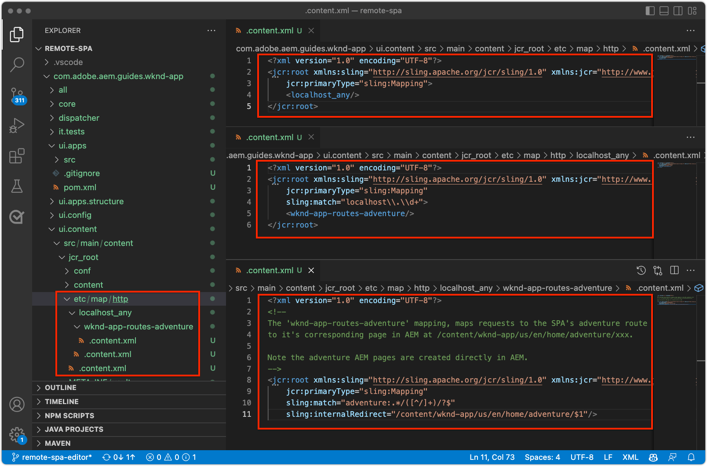

# Konfigurera AEM för SPA Editor

SPA-kodbasen hanteras utanför AEM, men det krävs ett AEM för att ställa in konfigurations- och innehållskrav. I det här kapitlet beskrivs hur du skapar ett AEM som innehåller nödvändiga konfigurationer:

+ AEM WCM Core Components-proxy
+ AEM för SPA
+ AEM SPA sidmallar
+ SPA för AEM
+ Delprojekt för att definiera SPA till AEM URL-mappningar
+ Konfigurationsmappar för OSGi

## Hämta basprojektet från GitHub

Hämta projektet `aem-guides-wknd-graphql` från Github.com. Detta kommer att innehålla vissa baslinjefiler som används i det här projektet.

```
$ mkdir -p ~/Code
$ git clone https://github.com/adobe/aem-guides-wknd-graphql.git
$ cd remote-spa-tutorial
```

## Skapa ett AEM projekt

Skapa ett AEM projekt där konfigurationer och baslinjeinnehåll hanteras. Det här projektet genereras i det klonade `aem-guides-wknd-graphql`-projektets `remote-spa-tutorial`-mapp.

_Använd alltid den senaste versionen av [AEM-arkitekturen](https://github.com/adobe/aem-project-archetype)._

```
$ cd ~/Code/aem-guides-wknd-graphql/remote-spa-tutorial
$ mvn -B archetype:generate \
 -D archetypeGroupId=com.adobe.aem \
 -D archetypeArtifactId=aem-project-archetype \
 -D archetypeVersion=39 \
 -D aemVersion=cloud \
 -D appTitle="WKND App" \
 -D appId="wknd-app" \
 -D groupId="com.adobe.aem.guides.wkndapp" \
 -D frontendModule="react"
$ mv ~/Code/aem-guides-wknd-graphql/remote-spa-tutorial/wknd-app ~/Code/aem-guides-wknd-graphql/remote-spa-tutorial/com.adobe.aem.guides.wknd-app
```

_Det sista kommandot byter bara namn på AEM projektmapp så att det är klart att det är det AEM projektet och inte ska blandas ihop med SPA__

När `frontendModule="react"` har angetts används inte projektet `ui.frontend` för SPA. SPA utvecklas och hanteras externt för att AEM och använder bara AEM som innehålls-API. Flaggan `frontendModule="react"` krävs för projektet, inklusive `spa-project` AEM Java™-beroenden och konfigurera SPA sidmallar.

AEM Project Archetype genererar följande element som används för att konfigurera AEM för integrering med SPA.

+ __AEM WCM Core Components-proxies__ vid `ui.apps/src/.../apps/wknd-app/components`
+ __AEM SPA fjärrsidproxy__ vid `ui.apps/src/.../apps/wknd-app/components/remotepage`
+ __AEM sidmallar__ vid `ui.content/src/.../conf/wknd-app/settings/wcm/templates`
+ __Delprojekt för att definiera innehållsmappningar__ vid `ui.content/src/...`
+ __SPA för baslinjestöd AEM sidor__ vid `ui.content/src/.../content/wknd-app`
+ __OSGi-konfigurationsmappar__ vid `ui.config/src/.../apps/wknd-app/osgiconfig`

När AEM grundprojekt genereras kan du med några justeringar säkerställa SPA redigerarkompatibilitet med SPA.

## Ta bort ui.fronttend-projekt

Eftersom SPA är en SPA, anta att den har utvecklats och hanteras utanför det AEM projektet. Undvik konflikter genom att ta bort projektet `ui.frontend` från distributionen. Om `ui.frontend`-projektet inte tas bort läses två SPA in samtidigt som SPA i `ui.frontend` -projektet och SPA i AEM SPA.

1. Öppna AEM (`~/Code/aem-guides-wknd-graphql/remote-spa-tutorial/com.adobe.aem.guides.wknd-app`) i din IDE
1. Öppna roten `pom.xml`
1. Kommentera `<module>ui.frontend</module` från listan `<modules>`

   ```
   <modules>
       <module>all</module>
       <module>core</module>
   
       <!-- <module>ui.frontend</module> -->
   
       <module>ui.apps</module>
       <module>ui.apps.structure</module>
       <module>ui.config</module>
       <module>ui.content</module>
       <module>it.tests</module>
       <module>dispatcher</module>
       <module>ui.tests</module>
       <module>analyse</module>
   </modules>
   ```

   Filen `pom.xml` ska se ut så här:

   

1. Öppna `ui.apps/pom.xml`
1. Kommentera `<dependency>` på `<artifactId>wknd-app.ui.frontend</artifactId>`

   ```
   <dependencies>
   
       <!-- Remote SPA project will provide all frontend resources
       <dependency>
           <groupId>com.adobe.aem.guides.wkndapp</groupId>
           <artifactId>wknd-app.ui.frontend</artifactId>
           <version>${project.version}</version>
           <type>zip</type>
       </dependency>
       --> 
   </dependencies>
   ```

   Filen `ui.apps/pom.xml` ska se ut så här:

   

Om det AEM projektet skapades före dessa ändringar tar du manuellt bort det `ui.frontend` genererade klientbiblioteket från `ui.apps`-projektet på `ui.apps/src/main/content/jcr_root/apps/wknd-app/clientlibs/clientlib-react`.

## AEM

För att AEM ska kunna läsa in SPA i SPA Editor måste mappningar mellan SPA och de AEM sidor som används för att öppna och redigera innehåll upprättas.

Vikten av den här konfigurationen utforskas senare.

Mappningen kan utföras med [Sling Mapping](https://sling.apache.org/documentation/the-sling-engine/mappings-for-resource-resolution.html#root-level-mappings-1) som definieras i `/etc/map`.

1. Öppna delprojektet `ui.content` i den integrerade utvecklingsmiljön
1. Navigera till `src/main/content/jcr_root`
1. Skapa en mapp `etc`
1. Skapa en mapp `map` i `etc`
1. Skapa en mapp `http` i `map`
1. I `http` skapar du en fil `.content.xml` med innehållet:

   ```
   <?xml version="1.0" encoding="UTF-8"?>
   <jcr:root xmlns:sling="http://sling.apache.org/jcr/sling/1.0" xmlns:jcr="http://www.jcp.org/jcr/1.0"
       jcr:primaryType="sling:Mapping">
       <localhost_any/>
   </jcr:root>
   ```

1. Skapa en mapp `localhost_any` i `http`
1. I `localhost_any` skapar du en fil `.content.xml` med innehållet:

   ```
   <?xml version="1.0" encoding="UTF-8"?>
   <jcr:root xmlns:sling="http://sling.apache.org/jcr/sling/1.0" xmlns:jcr="http://www.jcp.org/jcr/1.0"
       jcr:primaryType="sling:Mapping"
       sling:match="localhost\\.\\d+">
       <wknd-app-routes-adventure/>
   </jcr:root>
   ```

1. Skapa en mapp `wknd-app-routes-adventure` i `localhost_any`
1. I `wknd-app-routes-adventure` skapar du en fil `.content.xml` med innehållet:

   ```
   <?xml version="1.0" encoding="UTF-8"?>
   
   <!--
   The 'wknd-app-routes-adventure' mapping, maps requests to the SPA's adventure route 
   to it's corresponding page in AEM at /content/wknd-app/us/en/home/adventure/xxx.
   
   Note the adventure AEM pages are created directly in AEM.
   -->
   
   <jcr:root xmlns:sling="http://sling.apache.org/jcr/sling/1.0" xmlns:jcr="http://www.jcp.org/jcr/1.0"
       jcr:primaryType="sling:Mapping"
       sling:match="adventure:.*/([^/]+)/?$"
       sling:internalRedirect="/content/wknd-app/us/en/home/adventure/$1"/>
   ```

1. Lägg till mappningsnoderna i `ui.content/src/main/content/META-INF/vault/filter.xml` till de som ingår i AEM.

   ```
   <?xml version="1.0" encoding="UTF-8"?>
   <workspaceFilter version="1.0">
       <filter root="/conf/wknd-app" mode="merge"/>
       <filter root="/content/wknd-app" mode="merge"/>
       <filter root="/content/dam/wknd-app/asset.jpg" mode="merge"/>
       <filter root="/content/experience-fragments/wknd-app" mode="merge"/>
   
       <!-- Add the Sling Mapping rules for the WKND App -->
       <filter root="/etc/map" mode="merge"/>
   </workspaceFilter>
   ```

Mappstrukturen och `.context.xml` filer ska se ut så här:



Filen `filter.xml` ska se ut så här:


När det AEM projektet distribueras inkluderas dessa konfigurationer automatiskt.

Samlingsmappningseffekterna AEM på `http` och `localhost`, så det finns bara stöd för lokal utveckling. Vid distribution till AEM as a Cloud Service måste liknande kopplingsmappningar läggas till för målet `https` och för rätt AEM as a Cloud Service-domän/domäner. Mer information finns i [ Dokumentation om kopplingsmappning ](https://sling.apache.org/documentation/the-sling-engine/mappings-for-resource-resolution.html) .

## Cross-Origin Resource Sharing - säkerhetsprinciper

Konfigurera sedan AEM för att skydda innehållet så att bara den här SPA kan komma åt det AEM innehållet. Konfigurera resursdelning mellan [ursprung i AEM](https://experienceleague.adobe.com/docs/experience-manager-learn/foundation/security/develop-for-cross-origin-resource-sharing.html?lang=sv-SE).

1. Öppna `ui.config` Maven-delprojektet i din utvecklingsmiljö
1. Navigera `src/main/content/jcr_root/apps/wknd-app/osgiconfig/config`
1. Skapa en fil med namnet `com.adobe.granite.cors.impl.CORSPolicyImpl~wknd-app_remote-spa.cfg.json`
1. Lägg till följande i filen:

   ```
   {
       "supportscredentials":true,
       "exposedheaders":[
           ""
       ],
       "supportedmethods":[
           "GET",
           "HEAD",
           "POST",
           "OPTIONS"
       ],
       "alloworigin":[
           "https://external-hosted-app", "localhost:3000"
       ],
       "maxage:Integer":1800,
       "alloworiginregexp":[
           ".*"
       ],
       "allowedpaths":[
           ".*"
       ],
       "supportedheaders":[
           "Origin",
           "Accept",
           "X-Requested-With",
           "Content-Type",
           "Access-Control-Request-Method",
           "Access-Control-Request-Headers",
           "authorization"
       ]
   }
   ```

Filen `com.adobe.granite.cors.impl.CORSPolicyImpl~wknd-app_remote-spa.cfg.json` ska se ut så här:


Nyckelkonfigurationselementen är:

+ `alloworigin` anger vilka värdar som tillåts hämta innehåll från AEM.
   + `localhost:3000` har lagts till som stöd för SPA som körs lokalt
   + `https://external-hosted-app` fungerar som en platshållare som ska ersättas med domänen som SPA finns på.
+ `allowedpaths` anger vilka sökvägar i AEM som omfattas av den här CORS-konfigurationen. Som standard tillåts åtkomst till allt innehåll i AEM, men detta kan endast omfatta de specifika sökvägar som SPA kan komma åt, till exempel: `/content/wknd-app`.

## Ange AEM sida som SPA

AEM Project Archetype genererar ett projekt som är utformat för AEM integrering med en SPA, men som kräver en liten, men viktig justering av den automatiskt genererade AEM sidstrukturen. Den automatiskt genererade AEM-sidan måste ha ändrats till __SPA__ i stället för till en __SPA sida__.

1. Öppna delprojektet `ui.content` i din utvecklingsmiljö
1. Öppna för `src/main/content/jcr_root/content/wknd-app/us/en/home/.content.xml`
1. Uppdatera `.content.xml`-filen med:

   ```
   <?xml version="1.0" encoding="UTF-8"?>
   <jcr:root xmlns:sling="http://sling.apache.org/jcr/sling/1.0" xmlns:cq="http://www.day.com/jcr/cq/1.0" xmlns:jcr="http://www.jcp.org/jcr/1.0" xmlns:nt="http://www.jcp.org/jcr/nt/1.0"
           jcr:primaryType="cq:Page">
       <jcr:content
           cq:template="/conf/wknd-app/settings/wcm/templates/spa-remote-page"
           jcr:primaryType="cq:PageContent"
           jcr:title="WKND App Home Page"
           sling:resourceType="wknd-app/components/remotepage">
           <root
               jcr:primaryType="nt:unstructured"
               sling:resourceType="wcm/foundation/components/responsivegrid">
               <responsivegrid
                   jcr:primaryType="nt:unstructured"
                   sling:resourceType="wcm/foundation/components/responsivegrid">
                   <text
                       jcr:primaryType="nt:unstructured"
                       sling:resourceType="wknd-app/components/text"
                       text="&lt;p>Hello World!&lt;/p>"
                       textIsRich="true">
                       <cq:responsive jcr:primaryType="nt:unstructured"/>
                   </text>
               </responsivegrid>
           </root>
       </jcr:content>
   </jcr:root>
   ```

De viktigaste ändringarna är uppdateringar av noden `jcr:content`:

+ `cq:template` till `/conf/wknd-app/settings/wcm/templates/spa-remote-page`
+ `sling:resourceType` till `wknd-app/components/remotepage`

Filen `src/main/content/jcr_root/content/wknd-app/us/en/home/.content.xml` ska se ut så här:


Dessa ändringar gör att den här sidan, som fungerar som SPA i AEM, kan läsa in SPA i SPA Editor.

>[!NOTE]
>
>Om det här projektet tidigare har distribuerats till AEM ska du ta bort den AEM sidan som __Sites > WKND App > us > en > WKND App Home Page__ eftersom `ui.content` -projektet är inställt på __merge__ -noder i stället för __update__ .

Den här sidan kan också tas bort och återskapas som en SPA i AEM, men eftersom den här sidan skapas automatiskt i projektet `ui.content` är det bäst att uppdatera den i kodbasen.

## Distribuera AEM till AEM SDK

1. Kontrollera att AEM Author-tjänsten körs på port 4502
1. Navigera från kommandoraden till roten i AEM Maven-projektet
1. Använd Maven för att distribuera projektet till den lokala AEM SDK Author Service

   ```
   $ mvn clean install -PautoInstallSinglePackage
   ```

   

## Konfigurera AEM

När AEM Project är driftsatt finns det ett sista steg för att förbereda SPA Editor för att läsa in vår SPA. I AEM markerar du den AEM sidan som motsvarar den SPA roten, `/content/wknd-app/us/en/home`, som har genererats av den AEM Project Archetype.

1. Logga in på AEM författare
1. Navigera till __Sites > WKND App > us > en__
1. Markera __WKND-appens hemsida__ och tryck på __Egenskaper__

   

1. Navigera till fliken __SPA__
1. Fyll i __konfigurationen för SPA__
   + __SPA värd-URL__: `http://localhost:3000`
      + URL:en till SPA

   

1. Tryck på __Spara och stäng__

Kom ihåg att vi har ändrat den här sidans typ till typen för en __SPA__, vilket gör att vi kan se fliken __SPA__ i dess __Sidegenskaper__.

Den här konfigurationen måste bara anges på den AEM sidan som motsvarar SPA rot. Alla AEM sidor under den här sidan ärver värdet.

## Grattis

Du har nu förberett AEM konfigurationer och distribuerat dem till den lokala AEM författaren! Nu kan du:

+ Ta bort den AEM projektarkitekturgenererade SPA genom att kommentera bort beroenden i `ui.frontend`
+ Lägg till delningskartor för AEM som mappar SPA till resurser i AEM
+ Ställ in AEM säkerhetsprinciper för resursdelning mellan ursprung som tillåter att fjärranslutna SPA använder innehåll från AEM
+ Distribuera AEM till den lokala AEM SDK Author Service
+ Markera en AEM sida som SPA med egenskapen SPA värd-URL

## Nästa steg

Med AEM konfigurerat kan vi fokusera på att [starta SPA](./spa-bootstrap.md) med stöd för redigerbara områden med AEM SPA Editor!
