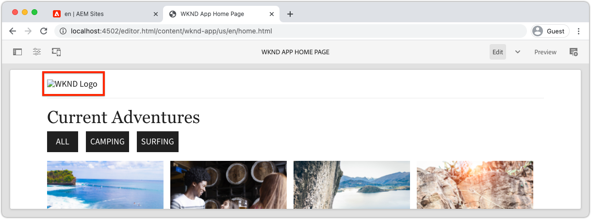

# Bootstrap the Remote SPA for SPA Editor

Innan de redigerbara områdena kan läggas till i SPA, måste det startas med AEM SPA Editor JavaScript SDK och några andra konfigurationer.

## Installera AEM JS SDK npm-beroenden för SPA Editor

Börja med att AEM igenom SPA npm-beroenden för React-projektet och installera dem.

+ [`@adobe/aem-spa-page-model-manager`](https://github.com/adobe/aem-spa-page-model-manager) : innehåller API:t för att hämta innehåll från AEM.
+ [`@adobe/aem-spa-component-mapping`](https://github.com/adobe/aem-spa-component-mapping) : innehåller API:t som mappar AEM innehåll till SPA komponenter.
+ [`@adobe/aem-react-editable-components` v2](https://github.com/adobe/aem-react-editable-components) : innehåller ett API för att skapa anpassade SPA och innehåller implementeringar som används ofta, till exempel React-komponenten `AEMPage` .

```shell
$ cd ~/Code/aem-guides-wknd-graphql/remote-spa-tutorial/react-app
$ npm install @adobe/aem-spa-page-model-manager 
$ npm install @adobe/aem-spa-component-mapping
$ npm install @adobe/aem-react-editable-components 
```

## Granska SPA miljövariabler

Flera miljövariabler måste exponeras för SPA så att de kan interagera med AEM.

1. Öppna SPA på `~/Code/aem-guides-wknd-graphql/remote-spa-tutorial/react-app` i din IDE
1. Öppna filen `.env.development`
1. Var särskilt uppmärksam på knapparna i filen och uppdatera efter behov:

   ```
   REACT_APP_HOST_URI=http://localhost:4502
   
   REACT_APP_USE_PROXY=true
   
   REACT_APP_AUTH_METHOD=basic
   
   REACT_APP_BASIC_AUTH_USER=admin
   REACT_APP_BASIC_AUTH_PASS=admin
   ```

   

   *Kom ihåg att anpassade miljövariabler i React måste ha prefixet `REACT_APP_`.*

   + `REACT_APP_HOST_URI`: schemat och värddatorn för den AEM tjänsten som fjärr-SPA ansluter till.
      + Det här värdet ändras baserat på om AEM (lokal, Dev, Stage eller Production) och AEM Service Type (Author vs. Publish) ändras
   + `REACT_APP_USE_PROXY`: På så sätt undviker du CORS-problem under utvecklingen genom att tala om för responsutvecklingsservern att proxybegäranden AEM till exempel `/content, /graphql, .model.json` med modulen `http-proxy-middleware`.
   + `REACT_APP_AUTH_METHOD`: autentiseringsmetod för AEM hanterade begäranden, alternativ är service-token, dev-token, basic eller lämna tomt för no-auth-användningsfall
      + Krävs för användning med AEM författare
      + Krävs eventuellt för användning med AEM Publish (om innehållet skyddas)
      + Utvecklingar mot AEM SDK har stöd för lokala konton via Basic Auth. Det här är den metod som används i den här självstudien.
      + Använd [åtkomsttoken](https://experienceleague.adobe.com/docs/experience-manager-learn/getting-started-with-aem-headless/authentication/overview.html) när du integrerar med AEM as a Cloud Service
   + `REACT_APP_BASIC_AUTH_USER`: AEM __användarnamn__ av SPA som ska autentiseras när AEM hämtas.
   + `REACT_APP_BASIC_AUTH_PASS`: AEM __password__ av SPA som ska autentiseras när AEM hämtas.

## Integrera ModelManager API

Med AEM npm-SPA tillgängliga för appen initieras AEM `ModelManager` i projektets `index.js` innan `ReactDOM.render(...)` anropas.

[ModelManager](https://github.com/adobe/aem-spa-page-model-manager/blob/master/src/ModelManager.ts) ansvarar för att ansluta till AEM för att hämta redigerbart innehåll.

1. Öppna SPA i IDE
1. Öppna filen `src/index.js`
1. Lägg till import `ModelManager` och initiera den före anropet `root.render(..)`,

   ```javascript
   ...
   import { ModelManager } from "@adobe/aem-spa-page-model-manager";
   
   // Initialize the ModelManager before invoking root.render(..).
   ModelManager.initializeAsync();
   
   const container = document.getElementById('root');
   const root = createRoot(container);
   root.render(<App />);
   ```

Filen `src/index.js` ska se ut så här:


## Konfigurera en intern SPA

När du skapar en redigerbar SPA är det bäst att ställa in en [intern proxy i SPA](https://create-react-app.dev/docs/proxying-api-requests-in-development/#configuring-the-proxy-manually) som är konfigurerad att dirigera lämpliga begäranden till AEM. Detta görs genom att använda [http-proxy-middleware](https://www.npmjs.com/package/http-proxy-middleware) npm-modulen, som redan är installerad av WKND-basens GraphQL-app.

1. Öppna SPA i IDE
1. Öppna filen på `src/proxy/setupProxy.spa-editor.auth.basic.js`
1. Uppdatera filen med följande kod:

   ```javascript
   const { createProxyMiddleware } = require('http-proxy-middleware');
   const {REACT_APP_HOST_URI, REACT_APP_BASIC_AUTH_USER, REACT_APP_BASIC_AUTH_PASS } = process.env;
   
   /*
       Set up a proxy with AEM for local development
       In a production environment this proxy should be set up at the webserver level or absolute URLs should be used.
   */
   module.exports = function(app) {
   
       /**
       * Filter to check if the request should be re-routed to AEM. The paths to be re-routed at:
       * - Starts with /content (AEM content)
       * - Starts with /graphql (AEM graphQL endpoint)
       * - Ends with .model.json (AEM Content Services)
       * 
       * @param {*} path the path being requested of the SPA
       * @param {*} req the request object
       * @returns true if the SPA request should be re-routed to AEM
       */
       const toAEM = function(path, req) {
           return path.startsWith('/content') || 
               path.startsWith('/graphql') ||
               path.endsWith('.model.json')
       }
   
       /**
       * Re-writes URLs being proxied to AEM such that they can resolve to real AEM resources
       * - The "root" case of `/.model.json` are rewritten to the SPA's home page in AEM
       * - .model.json requests for /adventure:xxx routes are rewritten to their corresponding adventure page under /content/wknd-app/us/en/home/adventure/ 
       * 
       * @param {*} path the path being requested of the SPA
       * @param {*} req the request object
       * @returns returns a re-written path, or nothing to use the @param path
       */
       const pathRewriteToAEM = function (path, req) { 
           if (path === '/.model.json') {
               return '/content/wknd-app/us/en/home.model.json';
           } else if (path.startsWith('/adventure/') && path.endsWith('.model.json')) {
               return '/content/wknd-app/us/en/home/adventure/' + path.split('/').pop();
           }    
       }
   
       /**
       * Register the proxy middleware using the toAEM filter and pathRewriteToAEM rewriter 
       */
       app.use(
           createProxyMiddleware(
               toAEM, // Only route the configured requests to AEM
               {
                   target: REACT_APP_HOST_URI,
                   changeOrigin: true,
                   // Pass in credentials when developing against an Author environment
                   auth: `${REACT_APP_BASIC_AUTH_USER}:${REACT_APP_BASIC_AUTH_PASS}`,
                   pathRewrite: pathRewriteToAEM // Rewrite SPA paths being sent to AEM
               }
           )
       );
   
       /**
       * Enable CORS on requests from the SPA to AEM
       * 
       * If this rule is not in place, CORS errors will occur when running the SPA on http://localhost:3000
       */
       app.use((req, res, next) => {
           res.header("Access-Control-Allow-Origin", REACT_APP_HOST_URI);
           next();
       });
   };
   ```

   Filen `setupProxy.spa-editor.auth.basic.js` ska se ut så här:

   

   Den här proxykonfigurationen gör två huvudsaker:

   1. Proxies-specifika begäranden som gjorts till SPA (`http://localhost:3000`) till AEM `http://localhost:4502`
      + Det är bara proxybegäranden vars sökvägar matchar mönster som anger att de ska hanteras av AEM, enligt definitionen i `toAEM(path, req)`.
      + SPA sökvägar skrivs om till motsvarande AEM, enligt definitionen i `pathRewriteToAEM(path, req)`
   1. CORS-huvuden läggs till i alla begäranden om att tillåta åtkomst till AEM innehåll, enligt definitionen av `res.header("Access-Control-Allow-Origin", REACT_APP_HOST_URI);`
      + Om detta inte läggs till inträffar CORS-fel vid inläsning AEM innehåll i SPA.

1. Öppna filen `src/setupProxy.js`
1. Granska raden som pekar på proxykonfigurationsfilen `setupProxy.spa-editor.auth.basic`:

   ```
   ...
   case BASIC:
   // Use user/pass for local development with Local Author Env
   return require('./proxy/setupProxy.spa-editor.auth.basic');
   ...
   ```

Observera att alla ändringar i `src/setupProxy.js` eller de refererade filerna kräver att SPA startas om.

## Statisk SPA

Statiska SPA-resurser som WKND-logotypen och inläsningsgrafik måste ha sina src-URL:er uppdaterade för att de ska kunna läsas in från SPA. Om den vänstra URL:en är relativ används AEM värd i stället för SPA när SPA läses in i SPA Editor för att redigeras, vilket resulterar i 404 begäranden enligt bilden nedan.



För att lösa det här problemet måste du se till att en statisk resurs som SPA är värd för använder absoluta sökvägar som innehåller SPA.

1. Öppna SPA i din utvecklingsmiljö
1. Öppna SPA miljövariabelfilen `src/.env.development` och lägg till en variabel för SPA offentliga URI:

   ```
   ...
   # The base URI the SPA is accessed from
   REACT_APP_PUBLIC_URI=http://localhost:3000
   ```

   _När du distribuerar till AEM as a Cloud Service måste du göra samma sak för motsvarande `.env`-filer._

1. Öppna filen `src/App.js`
1. Importera den SPA offentliga URI:n från SPA miljövariabler

   ```javascript
   const {  REACT_APP_PUBLIC_URI } = process.env;
   
   function App() { ... }
   ```

1. Använd WKND-logotypen `` som prefix för `REACT_APP_PUBLIC_URI` för att tvinga fram upplösning mot SPA.

   ```html
   
   ```

1. Gör samma sak när du läser in bild i `src/components/Loading.js`

   ```javascript
   const { REACT_APP_PUBLIC_URI } = process.env;
   
   class Loading extends Component {
   
       render() {
           return (<div className="loading">
               
           </div>);
       }
   }
   ```

1. Och för __två instanser__ av bakåtknappen i `src/components/AdventureDetails.js`

   ```javascript
   const { REACT_APP_PUBLIC_URI } = process.env;
   
   function AdventureDetail(props) {
       ...
       render() {
           
       }
   }
   ```

Filerna `App.js`, `Loading.js` och `AdventureDetails.js` ska se ut så här:


## AEM responsivt rutnät

För att SPA redigerarens layoutläge för redigerbara områden i SPA måste vi integrera AEM responsiv CSS för stödraster i SPA. Oroa dig inte - det här rutnätssystemet gäller bara för de redigerbara behållarna, och du kan använda det rutnätssystem du väljer för att styra layouten för resten av SPA.

Lägg till AEM Responsive Grid SCSS-filer i SPA.

1. Öppna SPA i din utvecklingsmiljö
1. Hämta och kopiera följande två filer till `src/styles`
   + [_grid.scss](./assets/spa-bootstrap/_grid.scss)
      + AEM Responsive Grid SCSS-generator
   + [_grid-init.scss](./assets/spa-bootstrap/_grid-init.scss)
      + Anropar `_grid.scss` med SPA specifika brytpunkter (skrivbord och mobil) och kolumner (12).
1. Öppna `src/App.scss` och importera `./styles/grid-init.scss`

   ```scss
   ...
   @import './styles/grid-init';
   ...
   ```

Filerna `_grid.scss` och `_grid-init.scss` ska se ut så här:


Nu innehåller SPA den CSS som krävs för att AEM layoutläget ska kunna användas för komponenter som läggs till i en AEM.

## Verktygsklasser

Kopiera i följande verktygsklasser till ditt React-appprojekt.

+ [RoutedLink.js](./assets/spa-bootstrap/RoutedLink.js) till `~/Code/aem-guides-wknd-graphql/remote-spa-tutorial/react-app/src/components/editable/core/RoutedLink.js`
+ [EditorPlaceholder.js](./assets/spa-bootstrap/EditorPlaceholder.js) till `~/Code/aem-guides-wknd-graphql/remote-spa-tutorial/react-app/src/components/editable/core/util/EditorPlaceholder.js`
+ [withConditionalPlaceholder.js](./assets/spa-bootstrap/withConditionalPlaceholder.js) till `~/Code/aem-guides-wknd-graphql/remote-spa-tutorial/react-app/src/components/editable/core/util/withConditionalPlaceholder.js`
+ [withStandardBaseCssClass.js](./assets/spa-bootstrap/withStandardBaseCssClass.js) till `~/Code/aem-guides-wknd-graphql/remote-spa-tutorial/react-app/src/components/editable/core/util/withStandardBaseCssClass.js`


## Starta SPA

Nu när SPA har startats för integrering med AEM, kör vi SPA och ser hur den ser ut!

1. Navigera till roten för SPA på kommandoraden
1. Starta SPA med de vanliga kommandona (om du inte redan har gjort det)

   ```shell
   $ cd ~/Code/aem-guides-wknd-graphql/remote-spa-tutorial/react-app
   $ npm install 
   $ npm run start
   ```

1. Bläddra i SPA på [http://localhost:3000](http://localhost:3000). Allt borde se bra ut!


## Öppna SPA i AEM SPA

När SPA körs på [http://localhost:3000](http://localhost:3000) kan vi öppna den med AEM SPA. Inget är redigerbart i SPA än. Detta validerar bara SPA i AEM.

1. Logga in på AEM författare
1. Navigera till __Sites > WKND App > us > en__
1. Markera __WKND-appens startsida__ och tryck på __Redigera__ så visas SPA.

   

1. Växla till __Förhandsgranska__ med lägesväljaren i det övre högra hörnet
1. Klicka runt SPA

   

## Grattis!

Du har startat SPA för att vara AEM SPA Editor-kompatibel! Nu kan du:

+ Lägg till JS SDK npm-beroenden AEM redigeraren i det SPA projektet
+ Konfigurera SPA
+ Integrera ModelManager-API:t med SPA
+ Konfigurera en intern proxy för SPA så att rätt innehållsbegäran dirigeras till AEM
+ Åtgärda problem med statiska SPA resurser som åtgärdas i kontexten SPA redigeraren
+ Lägg till AEM responsiv CSS för stödraster som stöder layouting i AEM redigerbara behållare

## Nästa steg

Nu när vi har nått en nivå av kompatibilitet med AEM SPA Editor kan vi börja införa redigerbara områden. Vi tittar först på hur du placerar en [fast redigerbar komponent](./spa-fixed-component.md) i SPA.
