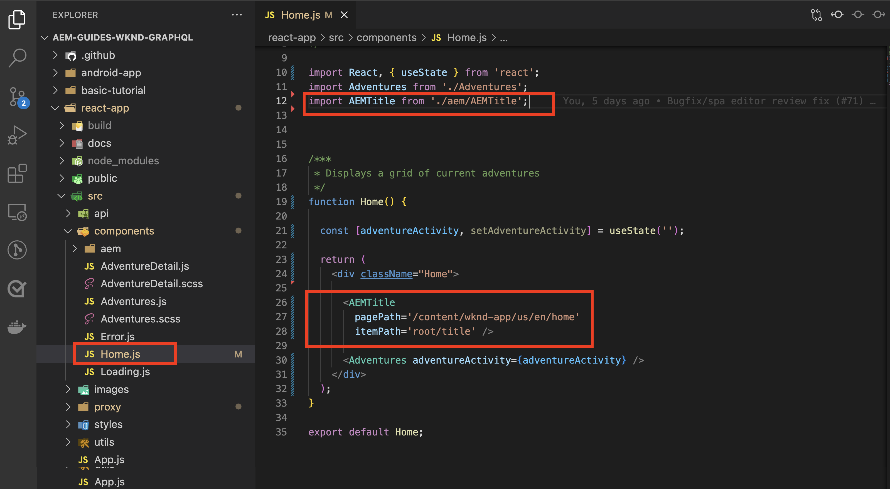

# Redigerbara fasta komponenter

Redigerbara Reaktionskomponenter kan vara&quot;fasta&quot; eller hårdkodade i SPA. Detta gör att utvecklare kan placera SPA redigerarkompatibla komponenter i SPA och tillåta användare att skapa komponenternas innehåll i AEM SPA Editor.


I det här kapitlet ersätter vi hemvyns titel&quot;Aktuella anteckningar&quot;, som är hårdkodad text i `Home.js` med en fast, men redigerbar Title-komponent. Fasta komponenter garanterar titelns placering, men tillåter även att titeltexten kan redigeras och ändras utanför utvecklingscykeln.

## Uppdatera WKND-appen

Lägga till en __Fast__ till hemvyn:

+ Importera komponenten AEM React Core Component Title och registrera den i projektets resurstyp
+ Placera den redigerbara titelkomponenten i SPA hemvy

### Importera i komponenten AEM React Core

Ersätt den hårdkodade texten i SPA hemvy `<h2>Current Adventures</h2>` med komponenten AEM React Core Components&#39; Title. Innan komponenten Title kan användas måste vi:

1. Importera komponenten Title från `@adobe/aem-core-components-react-base`
1. Registrera det med `withMappable` så att utvecklare kan placera den i SPA
1. Registrera dig även med `MapTo` så att den kan användas i [behållarkomponent senare](./spa-container-component.md).

Så här gör du:

1. Öppna SPA på `~/Code/wknd-app/aem-guides-wknd-graphql/react-app` i din IDE
1. Skapa en React-komponent på `react-app/src/components/aem/AEMTitle.js`
1. Lägg till följande kod i `AEMTitle.js`.

   ```
   // Import the withMappable API provided by the AEM SPA Editor JS SDK
   import { withMappable, MapTo } from '@adobe/aem-react-editable-components';
   
   // Import the AEM React Core Components' Title component implementation and it's Empty Function 
   import { TitleV2, TitleV2IsEmptyFn } from "@adobe/aem-core-components-react-base";
   
   // The sling:resourceType for which this Core Component is registered with in AEM
   const RESOURCE_TYPE = "wknd-app/components/title";
   
   // Create an EditConfig to allow the AEM SPA Editor to properly render the component in the Editor's context
   const EditConfig = {    
       emptyLabel: "Title",  // The component placeholder in AEM SPA Editor
       isEmpty: TitleV2IsEmptyFn, // The function to determine if this component has been authored
       resourceType: RESOURCE_TYPE // The sling:resourceType this component is mapped to
   };
   
   // MapTo allows the AEM SPA Editor JS SDK to dynamically render components added to SPA Editor Containers
   MapTo(RESOURCE_TYPE)(TitleV2, EditConfig);
   
   // withMappable allows the component to be hardcoded into the SPA; <AEMTitle .../>
   const AEMTitle = withMappable(TitleV2, EditConfig);
   
   export default AEMTitle;
   ```

Läs igenom kodens kommentarer för mer information om implementeringen.

The `AEMTitle.js` filen ska se ut så här:


### Använda komponenten React AEMTitle

Nu när AEM React Core Components Title-komponent är registrerad i och tillgänglig för användning i React-appen, ska du ersätta den hårdkodade titeltexten i hemvyn.

1. Redigera `react-app/src/Home.js`
1. I `Home()` längst ned ersätter du den hårdkodade titeln med den nya `AEMTitle` komponent:

   ```
   <h2>Current Adventures</h2>
   ```

   med

   ```
   <AEMTitle
       pagePath='/content/wknd-app/us/en/home' 
       itemPath='root/title'/>
   ```

   Uppdatera `Home.js` med följande kod:

   ```
   ...
   import { AEMTitle } from './aem/AEMTitle';
   ...
   function Home() {
       return (
           <div className="Home">
   
               <AEMTitle
                   pagePath='/content/wknd-app/us/en/home' 
                   itemPath='root/title'/>
   
               <Adventures />
           </div>
       );
   }
   ```

The `Home.js` filen ska se ut så här:



## Skapa komponenten Title i AEM

1. Logga in på AEM Author
1. Navigera till __Sites > WKND App__
1. Tryck __Startsida__ och markera __Redigera__ i det övre åtgärdsfältet
1. Välj __Redigera__ i redigeringslägesväljaren längst upp till höger i sidredigeraren
1. Håll muspekaren över standardtexten under WKND-logotypen och ovanför äventyrslistan tills den blå redigeringsramen visas
1. Tryck för att visa komponentens åtgärdsfält och tryck sedan på __wrench__  redigera

   

1. Skriv komponenten Title:
   + Titel: __WKND-annonser__
   + Typ/storlek: __H2__

      

1. Tryck __Klar__ spara
1. Förhandsgranska ändringarna i AEM SPA
1. Uppdatera WKND-appen som körs lokalt på [http://localhost:3000](http://localhost:3000) och se hur den skrivna texten ändras direkt.

   

## Grattis!

Du har lagt till en fast, redigerbar komponent i WKND-appen! Nu kan du:

+ Importera från och återanvänd en AEM React Core-komponent i SPA
+ Lägg till en fast, men redigerbar, komponent i SPA
+ Skapa den fasta komponenten i AEM
+ Se det innehåll som skapats i SPA

## Nästa steg

Nästa steg är att [lägga till en AEM ResponsiveGrid-behållarkomponent](./spa-container-component.md) till SPA där författaren kan lägga till och redigera komponenter i SPA!
