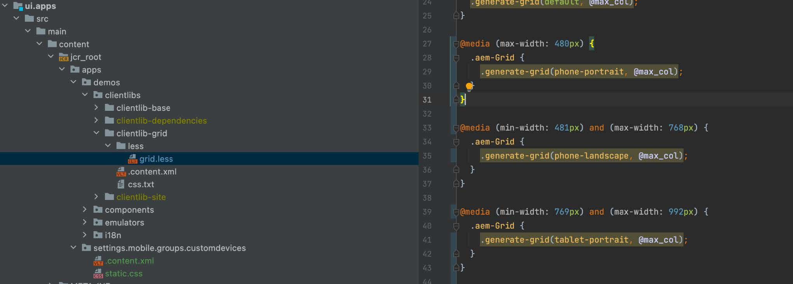
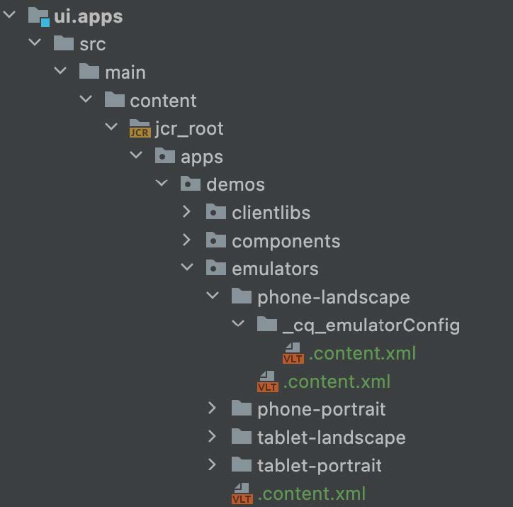
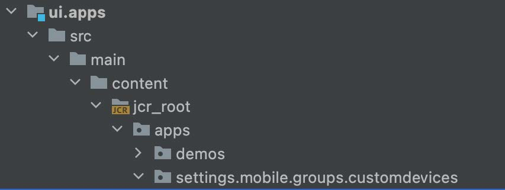

# Responsiva brytpunkter

Lär dig hur du konfigurerar nya responsiva brytpunkter för AEM responsiva sidredigerare.

## Skapa CSS-brytpunkter

Skapa först brytpunkter i AEM responsiva stödraster-CSS som den responsiva AEM-webbplatsen följer.

Skapa brytpunkter som ska användas tillsammans med mobilemulatorn i filen `/ui.apps/src/main/content/jcr_root/apps/[app name]/clientlibs/clientlib-grid/less/grid.less`. Notera `max-width` för varje brytpunkt, eftersom detta mappar CSS-brytpunkterna till brytpunkterna i AEM responsive Page Editor.

## Anpassa mallens brytpunkter

Öppna filen `ui.content/src/main/content/jcr_root/conf/<app name>/settings/wcm/templates/page-content/structure/.content.xml` och uppdatera `cq:responsive/breakpoints` med de nya brytpunktsnoddefinitionerna. Varje [CSS-brytpunkt ](#create-new-css-breakpoints) ska ha en motsvarande nod under `breakpoints` med egenskapen `width` inställd på CSS-brytpunktens `max-width`.

## Skapa emulatorer

AEM-emulatorer måste definieras så att författare kan välja den responsiva vyn som ska redigeras i sidredigeraren.

Skapa emulatornoder under `/ui.apps/src/main/content/jcr_root/apps/<app name>/emulators`

Exempel: `/ui.apps/src/main/content/jcr_root/apps/wknd-examples/emulators/phone-landscape`. Kopiera en referensemulatornod från `/libs/wcm/mobile/components/emulators` i CRXDE Lite till och uppdatera kopian för att underlätta noddefinitionen.

## Skapa enhetsgrupp

Gruppera emulatorerna för att [göra dem tillgängliga i AEM Page Editor](#update-the-templates-device-group).

Skapa nodstrukturen `/apps/settings/mobile/groups/<name of device group>` under `/ui.apps/src/main/content/jcr_root`.

Skapa en `.content.xml`-fil i `/apps/settings/mobile/groups/<device group name>` och definiera
de nya emulatorerna med kod som liknar den nedan:

## Uppdatera mallens enhetsgrupp

Koppla slutligen enhetsgruppen tillbaka till sidmallen så att emulatorerna är tillgängliga i sidredigeraren för sidor som skapas från den här mallen.

Öppna filen `ui.content/src/main/content/jcr_root/conf/[app name]/settings/wcm/templates/page-content/structure/.content.xml` och uppdatera egenskapen `cq:deviceGroups` så att den refererar till den nya mobilgruppen (till exempel `cq:deviceGroups="[mobile/groups/customdevices]"`)
