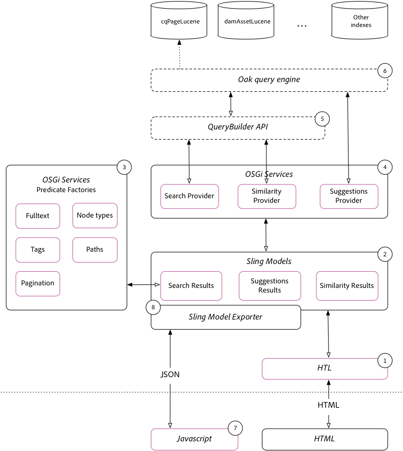

# Implementeringshandbok för enkel sökning{#simple-search-implementation-guide}

Den enkla sökimplementeringen är material från **Adobe Summit labb AEM Search Demystified**. Den här sidan innehåller material från det här labbet. En guidad visning av labbet finns i Lab-arbetsboken i avsnittet Presentation på den här sidan.



## Presentationsmaterial {#bookmarks}

* [Lab-arbetsbok](assets/l4080/l4080-lab-workbook.pdf)
* [Presentation](assets/l4080/l4080-presentation.pdf)

## Bokmärken {#bookmarks-1}

### verktyg {#tools}

* [Indexhanteraren](http://localhost:4502/libs/granite/operations/content/diagnosis/tool.html/granite_oakindexmanager)
* [Förklara fråga](http://localhost:4502/libs/granite/operations/content/diagnosis/tool.html/granite_queryperformance)
* [CRXDE Lite](http://localhost:4502/crx/de/index.jsp#/oak%3Aindex/cqPageLucene) > /oak:index/cqPageLucene
* [CRX Package Manager](http://localhost:4502/crx/packmgr/index.jsp)
* [QueryBuilder-felsökning](http://localhost:4502/libs/cq/search/content/querydebug.html?)
* [Oak Index Definition Generator](https://thomasmueller.github.io/oakTools/indexDefGenerator.html)

### Kapitel {#chapters}

*Kapitel-länkarna nedan förutsätter att [Initiala paket](#initialpackages) är installerade på AEM Author på`http://localhost:4502`*

* [Kapitel 1](http://localhost:4502/editor.html/content/summit/l4080/chapter-1.html)
* [Kapitel 2](http://localhost:4502/editor.html/content/summit/l4080/chapter-2.html)
* [Kapitel 3](http://localhost:4502/editor.html/content/summit/l4080/chapter-3.html)
* [Kapitel 4](http://localhost:4502/editor.html/content/summit/l4080/chapter-4.html)
* [Kapitel 5](http://localhost:4502/editor.html/content/summit/l4080/chapter-5.html)
* [Kapitel 6](http://localhost:4502/editor.html/content/summit/l4080/chapter-6.html)
* [Kapitel 7](http://localhost:4502/editor.html/content/summit/l4080/chapter-7.html)
* [Kapitel 8](http://localhost:4502/editor.html/content/summit/l4080/chapter-8.html)
* [Kapitel 9](http://localhost:4502/editor.html/content/summit/l4080/chapter-9.html)

## Paket {#packages}

### Inledande paket {#initial-packages}

* [Taggar](assets/l4080/summit-tags.zip)
* [Enkelt sökprogrampaket](assets/l4080/simple.ui.apps-0.0.1-snapshot.zip)

### Kapitelpaket {#chapter-packages}

* [Kapitel 1 lösning](assets/l4080/l4080-chapter1.zip)
* [Kapitel 2 lösning](assets/l4080/l4080-chapter2.zip)
* [Kapitel 3 lösning](assets/l4080/l4080-chapter3.zip)
* [Kapitel 4 lösning](assets/l4080/l4080-chapter4.zip)
* [Inställningar för kapitel 5](assets/l4080/l4080-chapter5-setup.zip)
* [Kapitel 5 lösning](assets/l4080/l4080-chapter5-solution.zip)
* [Kapitel 6 lösning](assets/l4080/l4080-chapter6.zip)
* [Kapitel 9 lösning](assets/l4080/l4080-chapter9.zip)

## Refererat material {#reference-materials}

* [Github-databas](https://github.com/Adobe-Marketing-Cloud/aem-guides/tree/master/simple-search-guide)
* [Sling Models](https://sling.apache.org/documentation/bundles/models.html)
* [Sling Model Exporter](https://sling.apache.org/documentation/bundles/models.html#exporter-framework-since-130)
* [QueryBuilder API](https://experienceleague.adobe.com/docs/)
* [AEM Chrome Plug-in](https://chrome.google.com/webstore/detail/aem-chrome-plug-in/ejdcnikffjleeffpigekhccpepplaode) ([Dokumentationssida](https://adobe-consulting-services.github.io/acs-aem-tools/aem-chrome-plugin/))

## Korrigeringar och uppföljning {#corrections-and-follow-up}

Rättelser och förtydliganden från labbdiskussionerna och svar på uppföljningsfrågor från deltagarna.

1. **Hur avbryter jag omindexering?**

   Omindexering kan stoppas via IndexStats MBean som är tillgängligt via [AEM Web Console > JMX](http://localhost:4502/system/console/jmx)

   * [http://localhost:4502/system/console/jmx/org.apache.jackrabbit.oak%3Aname%3dasync%2Ctype%3DIndexStats](http://localhost:4502/system/console/jmx/org.apache.jackrabbit.oak%3Aname%3Dasync%2Ctype%3DIndexStats)
      * Kör `abortAndPause()` om du vill avbryta omindexeringen. Detta låser indexet för ytterligare omindexering tills `resume()` anropas.
      * Indexeringsprocessen startas om när `resume()` körs.
   * Dokumentation: [https://jackrabbit.apache.org/oak/docs/query/indexing.html#async-index-mbean](https://jackrabbit.apache.org/oak/docs/query/indexing.html#async-index-mbean)

2. **Hur kan oak-index stödja flera innehavare?**

   Oak har stöd för att placera index genom innehållsträdet, och dessa index indexeras bara inom det underträdet. **`/content/site-a/oak:index/cqPageLucene`** kan till exempel bara skapas för indexinnehåll under **`/content/site-a`.**

   Ett likvärdigt sätt är att använda egenskaperna **`includePaths`** och **`queryPaths`** i ett index under **`/oak:index`**. Till exempel:

   * `/oak:index/siteAcqPageLucene@includePaths=/content/site-a`
   * `/oak:index/siteAcqPageLucene@queryPaths=/content/site-a`

   Följande överväganden bör göras:

   * Frågor MÅSTE ange en sökvägsbegränsning som är lika med indexets sökvägsomfång, eller vara en underordnad där till.
   * Bredare index (till exempel `/oak:index/cqPageLucene`) indexerar också data, vilket resulterar i duplicerat intag och kostnad för diskanvändning.
   * Kan kräva duplicerad konfigurationshantering (t.ex. lägga till samma indexRules i flera innehavarindex om de måste uppfylla samma frågeuppsättningar)
   * Det här arbetssättet används bäst på AEM Publish-nivån för anpassad webbplatssökning, som på AEM Author, det är vanligt att frågor körs uppåt i innehållsträdet för olika innehavare (till exempel via OmniSearch) - olika indexdefinitioner kan ge olika beteenden baserat enbart på sökvägsbegränsningen.

3. **Var finns en lista över alla tillgängliga analytiker?**

   Oak visar en uppsättning lucene-provides analyzer-konfigurationselement som kan användas i AEM.

   * [API-dokumentation för Oak Analyzers](https://jackrabbit.apache.org/oak/docs/query/lucene.html#analyzers)
      * [Tokenizers](https://cwiki.apache.org/confluence/display/solr/Tokenizers)
      * [Filter](https://cwiki.apache.org/confluence/display/solr/Filter+Descriptions)
      * [CharFilters](https://cwiki.apache.org/confluence/display/solr/CharFilterFactories)

4. **Hur söker jag efter sidor och Assets i samma fråga?**

   Nytt i AEM 6.3 är möjligheten att söka efter flera nodtyper i samma fråga. Följande QueryBuilder-fråga. Observera att varje underfråga kan matchas till sitt eget index, så i det här exemplet tolkas underfrågan `cq:Page` till `/oak:index/cqPageLucene` och underfrågan `dam:Asset` blir `/oak:index/damAssetLucene`.

   ```plain
   group.p.or=true
   group.1_group.type=cq:Page
   # add all page restrictions to this group
   group.2_group.type=dam:Asset
   # add all asset restrictions to this group
   ```

   resulterar i följande fråge- och frågeplan:

   ```plain
   QUERY:(//element(*, cq:Page) | //element(*, dam:Asset))
   
   PLAN: [cq:Page] as [a] /* lucene:cqPageLucene(/oak:index/cqPageLucene) *:* */ union [dam:Asset] as [a] /* lucene:damAssetLucene(/oak:index/damAssetLucene) *:* */
   ```

   Utforska frågan och resultaten via [QueryBuilder Debugger](http://localhost:4502/libs/cq/search/content/querydebug.html?_charset_=UTF-8&query=group.p.or%3Dtrue%0D%0Agroup.1_group.type%3Dcq%3APage%0D%0A%23+add+all+page+restrictions+to+this+group%0D%0Agroup.2_group.type%3Ddam%3AAsset%0D%0A%23+add+all+asset+restrictions+to+this+group) och [AEM Chrome Plug-in](https://chrome.google.com/webstore/detail/aem-chrome-plug-in/ejdcnikffjleeffpigekhccpepplaode?hl=en-US).

5. **Hur söker man över flera sökvägar i samma fråga?**

   Nytt i AEM 6.3 är möjligheten att fråga flera sökvägar i samma fråga. Följande QueryBuilder-fråga. Observera att varje &quot;underfråga&quot; kan tolkas som ett eget index.

   ```plain
   group.p.or=true
   group.1_group.type=cq:Page
   group.1_group.path=/content/docs/en/6-2
   # add all page restrictions to this group
   group.2_group.type=cq:Page
   group.2_group.path=/content/docs/en/6-3
   # add all asset restrictions to this group
   ```

   resultat i följande fråge- och frågeplan

   ```plain
   QUERY: (/jcr:root/content/docs/en/_x0036_-2//element(*, cq:Page) | /jcr:root/content/docs/en/_x0036_-3//element(*, cq:Page))
   
   PLAN: [cq:Page] as [a] /* traverse "/content/docs/en/6-2//*" where isdescendantnode([a], [/content/docs/en/6-2]) */ union [cq:Page] as [a] /* traverse "/content/docs/en/6-3//*" where isdescendantnode([a], [/content/docs/en/6-3]) */
   ```

   Utforska frågan och resultaten via [QueryBuilder Debugger](http://localhost:4502/libs/cq/search/content/querydebug.html?_charset_=UTF-8&query=group.p.or%3Dtrue%0D%0Agroup.1_group.type%3Dcq%3APage%0D%0Agroup.1_group.path%3D%2Fcontent%2Fdocs%2Fen%2F6-2%0D%0A%23+add+all+page+restrictions+to+this+group%0D%0Agroup.2_group.type%3Dcq%3APage%0D%0Agroup.2_group.path%3D%2Fcontent%2Fdocs%2Fen%2F6-3%0D%0A%23+add+all+asset+restrictions+to+this+group) och [AEM Chrome Plug-in](https://chrome.google.com/webstore/detail/aem-chrome-plug-in/ejdcnikffjleeffpigekhccpepplaode?hl=en-US).
