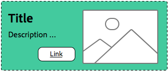

# Mer om metodtips för formatsystem{#understanding-style-organization-with-the-aem-style-system}

>[!NOTE]
>
>Granska innehållet på [Så här kodar du för formatsystemet](style-system-technical-video-understand.md), för att säkerställa en förståelse för de BEM-liknande konventioner som används av AEM Style System.

Det finns två huvudvarianter eller format som implementeras för AEM Style System:

* **Layoutstilar**
* **Visningsformat**

**Layoutstilar** påverkar många element i en komponent för att skapa en väldefinierad och identifierbar återgivning (design och layout) av komponenten, som ofta anpassas till ett visst återanvändbart varumärkeskoncept. En Teaser-komponent kan till exempel presenteras i den traditionella kortbaserade layouten, en horisontell marknadsföringsstil eller som en Hero-layout som täcker text på en bild.

**Visningsformat** används för att påverka mindre variationer av layoutformat, men de ändrar inte den grundläggande typen eller avsikten för layoutformatet. En Hero-layoutstil kan till exempel ha visningsformat som ändrar färgschemat från det primära färgschemat till det sekundära färgschemat.

## Bästa praxis för att organisera {#style-organization-best-practices}

När du definierar de formatnamn som är tillgängliga för AEM författare är det bäst att:

* Namnge format med hjälp av ett språk som författarna förstår
* Minimera antalet formatalternativ
* Visa endast formatalternativ och kombinationer som är tillåtna enligt varumärkesstandarder
* Visa endast formatkombinationer som har en effekt
   * Om ineffektiva kombinationer exponeras, se till att de åtminstone inte har någon skadlig effekt

I takt med att antalet möjliga formatkombinationer som är tillgängliga för AEM ökar, finns det fler permutationer som måste vara QAd och valideras mot varumärkesstandarder. För många alternativ kan också förvirra författare eftersom det kan bli oklart vilket alternativ eller vilken kombination som krävs för att skapa önskad effekt.

### Formatnamn jämfört med CSS-klasser {#style-names-vs-css-classes}

Formatnamn, eller de alternativ som visas för AEM författare, och de implementerande CSS-klassnamnen är inte kopplade till AEM.

Detta gör att formatalternativen kan märkas i en ordlista som är klar och som kan tolkas av de AEM författarna, men gör att CSS-utvecklare kan namnge CSS-klasserna på ett framtidssäkert, semantiskt sätt. Till exempel:

En komponent måste ha möjlighet att färgläggas med varumärkets **primär** och **sekundär** AEM kan dock se färgerna som **grön** och **gul**, i stället för det primära och sekundära språkets designspråk.

AEM Style System kan visa dessa färgningsvisningsformat med hjälp av författarvänliga etiketter **Grön** och **Gul**, samtidigt som CSS-utvecklarna kan använda semantisk namngivning av `.cmp-component--primary-color` och `.cmp-component--secondary-color` för att definiera den faktiska formatimplementeringen i CSS.

Formatnamnet för **Grön** är mappad till `.cmp-component--primary-color`och **Gul** till `.cmp-component--secondary-color`.

Om företagets varumärkeskänsla förändras i framtiden behöver man bara ändra de enskilda implementeringarna av `.cmp-component--primary-color` och `.cmp-component--secondary-color`och formatnamnen.

## Teaser-komponenten som exempel på användningsfall {#the-teaser-component-as-an-example-use-case}

Följande är ett exempel på hur du formaterar en Teaser-komponent så att den har flera olika layout- och visningsformat.

Då utforskas hur formatnamn (exponerade för författare) och hur CSS-klasserna som ligger till grund för dem är ordnade.

### Konfiguration av komponentformat för Teaser {#component-styles-configuration}

Följande bild visar [!UICONTROL Styles] konfiguration för Teaser-komponenten för de variationer som diskuteras i användningsfallet.

The [!UICONTROL Style Group] namn, layout och visning matchar, som en händelse, de allmänna begreppen för visningsformat och layoutformat som används för att konceptuellt kategorisera olika typer av format i den här artikeln.

The [!UICONTROL Style Group] namn och antal [!UICONTROL Style Groups] ska anpassas till komponentens användningsfall och till projektspecifika regler för komponentformat.

Till exempel **Visa** formatgruppsnamn kan ha namngetts **Färger**.


### Meny för val av format {#style-selection-menu}

Bilden nedan visar [!UICONTROL Style] menyförfattare interagerar med för att välja lämpliga format för komponenten. Anteckna [!UICONTROL Style Grpi] Alla namn, liksom formatnamnen, visas för författaren.


### Standardformat {#default-style}

Standardformatet är ofta det vanligaste formatet för komponenten och den icke-formaterade standardvyn för suddgummit när den läggs till på en sida.

Beroende på hur vanligt standardformatet är kan CSS användas direkt på `.cmp-teaser` (utan modifierare) eller på en `.cmp-teaser--default`.

Om standardformatreglerna används oftare än inte för alla variationer är det bäst att använda `.cmp-teaser` som standardformatets CSS-klasser, eftersom alla variationer ska ärva dem implicit, förutsatt att BEM-liknande konventioner följs. Om inte bör de användas med standardmodifieraren, till exempel `.cmp-teaser--default`som i sin tur måste läggas till i [komponentens formatkonfigurations standard-CSS-klasser](#component-styles-configuration) i, annars måste dessa formatregler åsidosättas i varje variant.

Du kan till och med tilldela ett namngivet format som standardformat, till exempel Hero-formatet `(.cmp-teaser--hero)` som definieras nedan, men det är tydligare att implementera standardformatet mot `.cmp-teaser` eller `.cmp-teaser--default` Implementeringar av CSS-klass.

>[!NOTE]
>
>Observera att standardlayoutstilen INTE har något visningsformatnamn, men författaren kan välja ett visningsalternativ i det AEM formatsystemmarkeringsverktyget.
>
>Detta bryter mot bästa praxis:
>
>**Visa endast formatkombinationer som har en effekt**
>
>Om en författare väljer visningsformat för **Grön** inget kommer att hända.
>
>I det här fallet kommer vi att avstå från den här överträdelsen, eftersom alla andra layoutformat måste vara färgglada med hjälp av varumärkets färger.
>
>I **Promo (right-aligned)** nedan kommer vi att se hur du kan förhindra oönskade formatkombinationer.


* **Layoutstil**
   * Standard
* **Visningsformat**
   * Ingen
* **Effektiva CSS-klasser**: `.cmp-teaser--promo` eller `.cmp-teaser--default`

### Promo style {#promo-style}

The **Promo layout style** används för att marknadsföra högklassigt innehåll på webbplatsen och är horisontellt utformat för att ta upp ett utrymme på webbsidan och måste kunna formateras av varumärken, med standardlayoutstilen för Promo som använder svart text.

För att uppnå detta **layoutstil** av **Promo** och **visningsformat** av **Grön** och **Gul** har konfigurerats i AEM Style System för Teaser-komponenten.

#### Promo Default


* **Layoutstil**
   * Formatnamn: **Promo**
   * CSS-klass: `cmp-teaser--promo`
* **Visningsformat**
   * Ingen
* **Effektiva CSS-klasser**: `.cmp-teaser--promo`

#### Primär kampanj


* **Layoutstil**
   * Formatnamn: **Promo**
   * CSS-klass: `cmp-teaser--promo`
* **Visningsformat**
   * Formatnamn: **Grön**
   * CSS-klass: `cmp-teaser--primary-color`
* **Effektiva CSS-klasser**: `cmp-teaser--promo.cmp-teaser--primary-color`

#### Promo Secondary


* **Layoutstil**
   * Formatnamn: **Promo**
   * CSS-klass: `cmp-teaser--promo`
* **Visningsformat**
   * Formatnamn: **Gul**
   * CSS-klass: `cmp-teaser--secondary-color`
* **Effektiva CSS-klasser**: `cmp-teaser--promo.cmp-teaser--secondary-color`

### Promo Right-aligned style {#promo-r-align}

The **Högerjusterad kampanj** layoutstil är en variation av tävlingsformatet som byter plats på bilden och texten (bild till höger, text till vänster).

Den högra justeringen, i sin helhet, är ett visningsformat som du kan ange i AEM Style System som ett visningsformat som du väljer i samband med kampanjlayoutformatet. Detta bryter mot bästa praxis:

**Visa endast formatkombinationer som har en effekt**

..som redan överträtts i [Standardformat](#default-style).

Eftersom den högra justeringen bara påverkar layoutformatet Promo, och inte de andra två layoutformaten: standard och hjälte, kan vi skapa en ny layoutstil Promo (högerjusterad) som innehåller CSS-klassen som högerjusterar innehållet i Promo-layoutstilarna: `cmp -teaser--alternate`.

Den här kombinationen av flera format till en enda formatpost kan också minska antalet tillgängliga format och formatändringar, vilket är bäst för att minimera.

Observera namnet på CSS-klassen, `cmp-teaser--alternate`, behöver inte matcha den upphovsvänliga nomenklaturen för &quot;högerjusterad&quot;.

#### Promo right-aligned Default


* **Layoutstil**
   * Formatnamn: **Promo (right-aligned)**
   * CSS-klasser: `cmp-teaser--promo cmp-teaser--alternate`
* **Visningsformat**
   * Ingen
* **Effektiva CSS-klasser**: `.cmp-teaser--promo.cmp-teaser--alternate`

#### Högerjusterad primär kampanj



* **Layoutstil**
   * Formatnamn: **Promo (right-aligned)**
   * CSS-klasser: `cmp-teaser--promo cmp-teaser--alternate`
* **Visningsformat**
   * Formatnamn: **Grön**
   * CSS-klass: `cmp-teaser--primary-color`
* **Effektiva CSS-klasser**: `.cmp-teaser--promo.cmp-teaser--alternate.cmp-teaser--primary-color`

#### Högerjusterad sekundär kampanj


* **Layoutstil**
   * Formatnamn: **Promo (right-aligned)**
   * CSS-klasser: `cmp-teaser--promo cmp-teaser--alternate`
* **Visningsformat**
   * Formatnamn: **Gul**
   * CSS-klass: `cmp-teaser--secondary-color`
* **Effektiva CSS-klasser**: `.cmp-teaser--promo.cmp-teaser--alternate.cmp-teaser--secondary-color`

### Hero-stil {#hero-style}

Layoutstilen Hero visar komponentens bild som en bakgrund med titeln och länken överlagrad. Layoutstilen Hero, liksom layoutstilen Promo, måste vara färgstark med varumärkesfärger.

Om du vill färglägga Hero-layoutstilen med varumärkesfärger kan du använda samma visningsstilar som används för Promo-layoutstilen.

För varje komponent mappas formatnamnet till en enda uppsättning CSS-klasser, vilket innebär att CSS-klassnamnen som färgar bakgrunden i Promo-layoutstilen måste färglägga texten och länken i Hero-layoutstilen.

Detta kan uppnås delvis genom att CSS-reglerna omdefinieras, men detta kräver att CSS-utvecklarna förstår hur dessa permutationer påverkar AEM.

CSS för att färglägga bakgrunden i **Befordra** layoutstil med den primära (gröna) färgen:

```css
.cmp-teaser--promo.cmp-teaser--primary--color {
   ...
   background-color: green;
   ...
}
```

CSS för att färglägga texten i **Hero** layoutstil med den primära (gröna) färgen:

```css
.cmp-teaser--hero.cmp-teaser--primary--color {
   ...
   color: green;
   ...
}
```

#### Hero-standard


* **Layoutstil**
   * Formatnamn: **Hero**
   * CSS-klass: `cmp-teaser--hero`
* **Visningsformat**
   * Ingen
* **Effektiva CSS-klasser**: `.cmp-teaser--hero`

#### Hero Primary


* **Layoutstil**
   * Formatnamn: **Promo**
   * CSS-klass: `cmp-teaser--hero`
* **Visningsformat**
   * Formatnamn: **Grön**
   * CSS-klass: `cmp-teaser--primary-color`
* **Effektiva CSS-klasser**: `cmp-teaser--hero.cmp-teaser--primary-color`

#### Hero sekundär


* **Layoutstil**
   * Formatnamn: **Promo**
   * CSS-klass: `cmp-teaser--hero`
* **Visningsformat**
   * Formatnamn: **Gul**
   * CSS-klass: `cmp-teaser--secondary-color`
* **Effektiva CSS-klasser**: `cmp-teaser--hero.cmp-teaser--secondary-color`

## Ytterligare resurser {#additional-resources}

* [Systemdokumentation](https://helpx.adobe.com/experience-manager/6-5/sites/authoring/using/style-system.html)
* [Skapa AEM klientbibliotek](https://helpx.adobe.com/experience-manager/6-5/sites/developing/using/clientlibs.html)
* [Dokumentationswebbplats för BEM (Block Element Modifier)](https://getbem.com/)
* [LESS Documentation webbplats](https://lesscss.org/)
* [jQuery-webbplats](https://jquery.com/)
