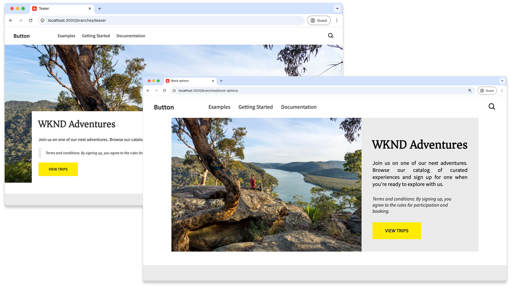

# Edge Delivery Services and Universal Editor developer tutorial

I den här självstudiekursen får du lära dig grunderna i att skapa en AEM-webbplats som kombinerar kraftfull redigering med Universal Editor och blixtsnabb leverans med Edge Delivery Services. Slutligen får du grundläggande kunskaper om hur du skapar ett nytt projekt, konfigurerar en lokal utvecklingsmiljö och skapar ett nytt block.

## Projektinställningar

Lär dig hur du skapar ett kodprojekt och konfigurerar en ny webbplats i AEM as a Cloud Service. Med den här installationen kan du utveckla material smidigt med Universal Editor och snabbt leverera material via Edge Delivery Services.

<!-- CARDS 

* ./1-new-code-project.md
* ./2-new-aem-site.md

-->
<!-- START CARDS HTML - DO NOT MODIFY BY HAND -->

    

        

            

                <figure class="image x-is-16by9">
                    
                </figure>
            

            

                

                    

                        <a href="./1-new-code-project.md" target="_blank" rel="referrer" title="Skapa ett kodprojekt">Skapa ett kodprojekt</a>
                    

                    
Skapa ett kodprojekt för Edge Delivery Services som kan redigeras med Universell redigerare.

                

                <a href="./1-new-code-project.md" target="_blank" rel="referrer" class="spectrum-Button spectrum-Button--outline spectrum-Button--primary spectrum-Button--sizeM" style="align-self: flex-start; margin-top: 1rem;">
                    Läs mer
                </a>
            

        

    

    

        

            

                <figure class="image x-is-16by9">
                    
                </figure>
            

            

                

                    

                        <a href="./2-new-aem-site.md" target="_blank" rel="referrer" title="Skapa en AEM-webbplats">Skapa en AEM-webbplats</a>
                    

                    
Skapa en webbplats i AEM Sites för Edge Delivery Services, som kan redigeras med den universella redigeraren.

                

                <a href="./2-new-aem-site.md" target="_blank" rel="referrer" class="spectrum-Button spectrum-Button--outline spectrum-Button--primary spectrum-Button--sizeM" style="align-self: flex-start; margin-top: 1rem;">
                    Läs mer
                </a>
            

        

    

<!-- END CARDS HTML - DO NOT MODIFY BY HAND -->

## Utvecklingsinställning

Lär dig hur du konfigurerar din lokala utvecklingsmiljö för snabb webbplatsutveckling. Med den här installationen kan du skapa webbplatser smidigt med den universella redigeraren och leverera effektivt material via Edge Delivery Services, vilket ger ett smidigt och optimerat utvecklingsarbetsflöde.
<!-- CARDS 

* ./3-local-development-environment.md
* ./4-website-branding.md

-->
<!-- START CARDS HTML - DO NOT MODIFY BY HAND -->

    

        

            

                <figure class="image x-is-16by9">
                    
                </figure>
            

            

                

                    

                        <a href="./3-local-development-environment.md" target="_blank" rel="referrer" title="Konfigurera en lokal utvecklingsmiljö">Konfigurera en lokal utvecklingsmiljö</a>
                    

                    
Konfigurera en lokal utvecklingsmiljö för webbplatser som levereras med Edge Delivery Services och kan redigeras med Universal Editor.

                

                <a href="./3-local-development-environment.md" target="_blank" rel="referrer" class="spectrum-Button spectrum-Button--outline spectrum-Button--primary spectrum-Button--sizeM" style="align-self: flex-start; margin-top: 1rem;">
                    Läs mer
                </a>
            

        

    

    

        

            

                <figure class="image x-is-16by9">
                    
                </figure>
            

            

                

                    

                        <a href="./4-website-branding.md" target="_blank" rel="referrer" title="Lägg till webbplatsmärkning">Lägg till webbplatsmärkning</a>
                    

                    
Definiera global CSS, CSS-variabler och webbteckensnitt för en Edge Delivery Services-webbplats.

                

                <a href="./4-website-branding.md" target="_blank" rel="referrer" class="spectrum-Button spectrum-Button--outline spectrum-Button--primary spectrum-Button--sizeM" style="align-self: flex-start; margin-top: 1rem;">
                    Läs mer
                </a>
            

        

    

<!-- END CARDS HTML - DO NOT MODIFY BY HAND -->

## Blockutveckling

Lär dig hur du skapar ett nytt block genom att definiera dess innehållsmodell och konfigurera exempelinnehåll för testning och utveckling. Upptäck två metoder för att rendera blocket och förstå hur du strukturerar det för optimala prestanda och flexibilitet i AEM och Edge Delivery Services.

<!-- CARDS 

* ./5-new-block.md {image = ./assets/5-new-block/card.png}
* ./6-author-block.md {image = ./assets/6-author-block/card.png}
* ./7a-block-css.md {image = ./assets/7a-block-css/card.png}
* ./7b-block-js-css.md {image = ./assets/7b-block-js-css/card.png}

-->
<!-- START CARDS HTML - DO NOT MODIFY BY HAND -->

    

        

            

                <figure class="image x-is-16by9">
                    
                </figure>
            

            

                

                    

                        <a href="./5-new-block.md" target="_blank" rel="referrer" title="Skapa ett block">Skapa ett block</a>
                    

                    
Bygg ett block för en Edge Delivery Services-webbplats som kan redigeras med Universell redigerare.

                

                <a href="./5-new-block.md" target="_blank" rel="referrer" class="spectrum-Button spectrum-Button--outline spectrum-Button--primary spectrum-Button--sizeM" style="align-self: flex-start; margin-top: 1rem;">
                    Läs mer
                </a>
            

        

    

    

        

            

                <figure class="image x-is-16by9">
                    
                </figure>
            

            

                

                    

                        <a href="./6-author-block.md" target="_blank" rel="referrer" title="Skapa ett block">Skapa ett block</a>
                    

                    
Skapa ett Edge Delivery Services-block med Universal Editor.

                

                <a href="./6-author-block.md" target="_blank" rel="referrer" class="spectrum-Button spectrum-Button--outline spectrum-Button--primary spectrum-Button--sizeM" style="align-self: flex-start; margin-top: 1rem;">
                    Läs mer
                </a>
            

        

    

    

        

            

                <figure class="image x-is-16by9">
                    
                </figure>
            

            

                

                    

                        <a href="./7a-block-css.md" target="_blank" rel="referrer" title="Utveckla ett block med CSS">Utveckla ett block med CSS</a>
                    

                    
Utveckla ett block med CSS för Edge Delivery Services, som kan redigeras med den universella redigeraren.

                

                <a href="./7a-block-css.md" target="_blank" rel="referrer" class="spectrum-Button spectrum-Button--outline spectrum-Button--primary spectrum-Button--sizeM" style="align-self: flex-start; margin-top: 1rem;">
                    Läs mer
                </a>
            

        

    

    

        

            

                <figure class="image x-is-16by9">
                    
                </figure>
            

            

                

                    

                        <a href="./7b-block-js-css.md" target="_blank" rel="referrer" title="Utveckla ett block med CSS och JS">Utveckla ett block med CSS och JS</a>
                    

                    
Utveckla ett block med CSS och JavaScript för Edge Delivery Services, som kan redigeras med den universella redigeraren.

                

                <a href="./7b-block-js-css.md" target="_blank" rel="referrer" class="spectrum-Button spectrum-Button--outline spectrum-Button--primary spectrum-Button--sizeM" style="align-self: flex-start; margin-top: 1rem;">
                    Läs mer
                </a>
            

        

    

<!-- END CARDS HTML - DO NOT MODIFY BY HAND -->

## Nästa steg

Nu när du är klar med den här självstudiekursen kan du bygga vidare på det du lärt dig med dessa fokuserade tips. Guiderna innehåller kod och koncept som beskrivs här och beskriver rollspecifika användningsområden, avancerade tekniker och ytterligare tips som förbättrar utvecklingskunskaperna i Edge Delivery Services och Universal Editor.

<!-- CARDS 

* ./how-to/block-options.md
* ./how-to/header-and-footer.md

-->
<!-- START CARDS HTML - DO NOT MODIFY BY HAND -->

    

        

            

                <figure class="image x-is-16by9">
                    
                </figure>
            

            

                

                    

                        <a href="./how-to/block-options.md" target="_blank" rel="referrer" title="Blockalternativ">Blockalternativ</a>
                    

                    
Lär dig hur du skapar ett block med flera visningsalternativ.

                

                <a href="./how-to/block-options.md" target="_blank" rel="referrer" class="spectrum-Button spectrum-Button--outline spectrum-Button--primary spectrum-Button--sizeM" style="align-self: flex-start; margin-top: 1rem;">
                    Läs mer
                </a>
            

        

    

    

        

            

                <figure class="image x-is-16by9">
                    
                </figure>
            

            

                

                    

                        <a href="./how-to/header-and-footer.md" target="_blank" rel="referrer" title="Sidhuvud och sidfot">Sidhuvud och sidfot</a>
                    

                    
Läs om hur sidhuvud och sidfot används i Edge Delivery Services och Universell redigerare.

                

                <a href="./how-to/header-and-footer.md" target="_blank" rel="referrer" class="spectrum-Button spectrum-Button--outline spectrum-Button--primary spectrum-Button--sizeM" style="align-self: flex-start; margin-top: 1rem;">
                    Läs mer
                </a>
            

        

    

<!-- END CARDS HTML - DO NOT MODIFY BY HAND -->
