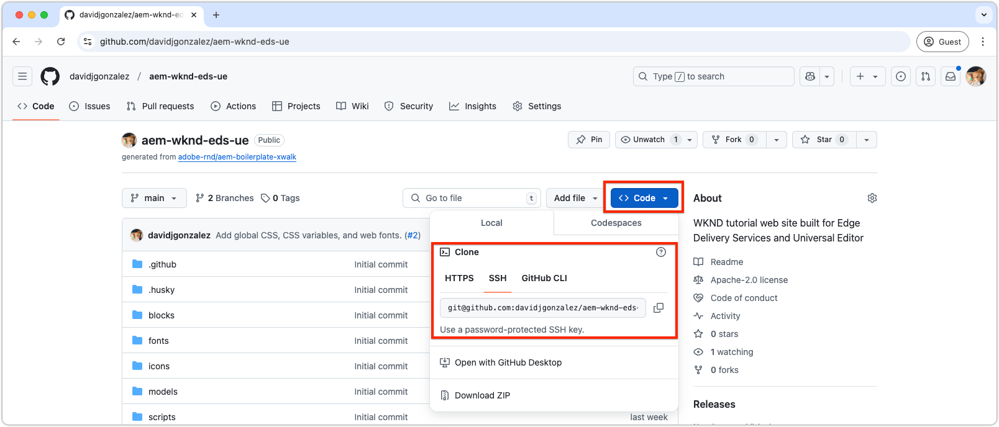

# Konfigurera en lokal utvecklingsmiljö

En lokal utvecklingsmiljö är nödvändig för att snabbt utveckla webbplatser som levereras av Edge Delivery Services. Miljön använder lokalt utvecklad kod när man hämtar material från Edge Delivery Services, vilket gör att utvecklarna omedelbart kan se kodändringar. En sådan installation stöder snabb, iterativ utveckling och testning.

Utvecklingsverktygen och processerna för ett Edge Delivery Services webbplatsprojekt är utformade för att vara välkända för webbutvecklare och ge en snabb och effektiv utvecklingsupplevelse.

## Utvecklingstopologi

I den här videon finns en översikt över utvecklingstopologin för ett Edge Delivery Services-webbplatsprojekt som kan redigeras med Universal Editor.

>[!VIDEO](https://video.tv.adobe.com/v/3443978/?learn=on&enablevpops)

+++Se ytterligare information om utvecklingstopologi

- **GitHub-databas**:
   - **Syfte**: Värdar för webbplatsens kod (CSS och JavaScript).
   - **Struktur**: Huvudgrenen **** innehåller produktionsklar kod, medan andra grenar innehåller arbetskod.
   - **Funktionalitet**: Kod från vilken gren som helst kan köras mot miljöerna **production** eller **preview** utan att den aktiva webbplatsen påverkas.

- **AEM Author service**:
   - **Syfte**: Fungerar som databas för kanoniskt innehåll där webbplatsinnehåll redigeras och hanteras.
   - **Funktionalitet**: Innehållet läses och skrivs av **den universella redigeraren**. Redigerat innehåll publiceras till **Edge Delivery Services** i **produktions**- eller **förhandsvisningsmiljöer** .

- **Universell redigerare**:
   - **Syfte**: Tillhandahåller ett WYSIWYG-gränssnitt för redigering av webbplatsinnehåll.
   - **Funktionalitet**: Läser från och skriver till **AEM Author-tjänsten**. Kan konfigureras att använda kod från valfri gren i **GitHub-databasen** för att testa och validera ändringar.

- **Edge Delivery Services**:
   - **Produktionsmiljö**:
      - **Syfte**: Levererar innehåll och kod för den aktiva webbplatsen till slutanvändare.
      - **Funktionalitet**: Serverar innehåll som publiceras från **AEM Author-tjänsten** med kod från **huvudgrenen** i **GitHub-databasen**.
   - **Förhandsvisningsmiljö**:
      - **Syfte**: Tillhandahåller en mellanlagringsmiljö för att testa och förhandsgranska innehåll och kod före distributionen.
      - **Funktionalitet**: Serverar innehåll som publiceras från **AEM Author-tjänsten** med kod från valfri gren i **GitHub-databasen**, vilket möjliggör grundlig testning utan att den aktiva webbplatsen påverkas.

- **Lokal utvecklarmiljö**:
   - **Syfte**: Låter utvecklare skriva och testa kod (CSS och JavaScript) lokalt.
   - **Struktur**:
      - En lokal klon av **GitHub-databasen** för filialbaserad utveckling.
      - **AEM CLI**, som fungerar som en utvecklingsserver, tillämpar lokala kodändringar i **förhandsvisningsmiljön** för att underlätta körning.
   - **Arbetsflöde**: Utvecklare skriver kod lokalt, implementerar ändringar i en arbetsgren, flyttar grenen till GitHub, validerar den i **Universal Editor** (med den angivna grenen) och sammanfogar den i **huvudgrenen** när den är klar för produktionsdistribution.

+++

## Förutsättningar

Installera följande på datorn innan du påbörjar utvecklingen:

1. [Git](https://git-scm.com/)
1. [Node.js &amp; npm](https://nodejs.org)
1. [Microsoft Visual Studio-kod](https://code.visualstudio.com/) (eller liknande kodredigerare)

## Klona GitHub-databasen

Klona [GitHub-databasen som skapats i det nya kodprojektkapitlet ](./1-new-code-project.md) som innehåller AEM Edge Delivery Services-kodprojektet till din lokala utvecklingsmiljö.



```bash
$ cd ~/Code
$ git clone git@github.com:<YOUR_ORG>/aem-wknd-eds-ue.git
```

En ny `aem-wknd-eds-ue`-mapp skapas i katalogen `Code` som fungerar som projektets rot. Även om projektet kan klonas till vilken plats som helst på datorn använder den här självstudien `~/Code` som rotkatalog.

## Installera projektberoenden

Navigera till projektmappen och installera nödvändiga beroenden med `npm install`. Även om Edge Delivery Services-projekt inte använder traditionella Node.js-byggsystem som Webpack eller Vite, kräver de ändå flera beroenden för lokal utveckling.

```bash
# ~/Code/aem-wknd-eds-ue

$ npm install
```

## Installera AEM CLI

AEM CLI är ett kommandoradsverktyg för Node.js som har utformats för att effektivisera utvecklingen av Edge Delivery Services-baserade AEM-webbplatser, vilket ger en lokal utvecklingsserver för snabb utveckling och testning av er webbplats.

Installera AEM CLI genom att köra:

```bash
# ~/Code/aem-wknd-eds-ue

$ npm install @adobe/aem-cli
```

AEM CLI kan också installeras globalt med `npm install --global @adobe/aem-cli`.

## Starta den lokala AEM-utvecklingsservern

Kommandot `aem up` startar den lokala utvecklingsservern och öppnar automatiskt ett webbläsarfönster till serverns URL. Den här servern fungerar som en omvänd proxy till Edge Delivery Services-miljön och levererar innehåll därifrån samtidigt som den lokala kodbasen används för utveckling.

```bash
$ cd ~/Code/aem-wknd-eds-ue 
$ aem up

    ___    ________  ___                          __      __ 
   /   |  / ____/  |/  /  _____(_)___ ___  __  __/ /___ _/ /_____  _____
  / /| | / __/ / /|_/ /  / ___/ / __ `__ \/ / / / / __ `/ __/ __ \/ ___/
 / ___ |/ /___/ /  / /  (__  ) / / / / / / /_/ / / /_/ / /_/ /_/ / /
/_/  |_/_____/_/  /_/  /____/_/_/ /_/ /_/\__,_/_/\__,_/\__/\____/_/

info: Starting AEM dev server version x.x.x
info: Local AEM dev server up and running: http://localhost:3000/
info: Enabled reverse proxy to https://main--aem-wknd-eds-ue--<YOUR_ORG>.aem.page
```

AEM CLI öppnar webbplatsen i webbläsaren på `http://localhost:3000/`. Ändringar i projektet läses automatiskt in på nytt i webbläsaren, medan innehållsändringar i [kräver publicering i förhandsvisningsmiljön](./6-author-block.md) och uppdatering av webbläsaren.

Om webbplatsen öppnas med en 404-sida är det sannolikt att [fstab.yaml eller paths.json](https://experienceleague.adobe.com/en/docs/experience-manager-cloud-service/content/edge-delivery/wysiwyg-authoring/edge-dev-getting-started#create-github-project) som uppdaterats i [nytt kodprojekt](./1-new-code-project.md) är felaktigt konfigurerade eller att ändringarna inte har implementerats i `main`-grenen.

## Bygg JSON-fragment

Edge Delivery Services-projekt som skapats med [AEM-mallen XWalk ](https://github.com/adobe-rnd/aem-boilerplate-xwalk) förlitar sig på JSON-konfigurationer som aktiverar blockredigering i Universell redigerare.

- **JSON-fragment**: Lagrades med tillhörande block och blockmodellerna, definitionerna och filtren definieras.
   - **Modellfragment**: Lagrat på `/blocks/example/_example.json`.
   - **Definitionsfragment**: Lagrat på `/blocks/example/_example.json`.
   - **Filtrera fragment**: Lagrat på `/blocks/example/_example.json`.


[AEM-mallens XWalk-projektmall ](https://github.com/adobe-rnd/aem-boilerplate-xwalk) innehåller en [Husky](https://typicode.github.io/husky/)-förimplementeringsfunktion som identifierar ändringar i JSON-fragment och kompilerar dem till lämpliga `component-*.json`-filer vid `git commit`.

Följande NPM-skript kan köras manuellt via `npm run` för att skapa JSON-filer, men detta är vanligtvis inte nödvändigt eftersom den himiska pre-commit-kroken hanterar den automatiskt.

```bash
# ~/Code/aem-wknd-eds-ue

npm run build:json
```

| NPM-skript | Beskrivning |
|--------------------|-----------------------------------------------------------------------------|
| `build:json` | Skapar alla JSON-filer från fragment och lägger till dem i rätt `component-*.json`-filer. |
| `build:json:models` | Blockerar JSON-fragment och kompilerar dem till `/component-models.json`. |
| `build:json:definitions` | Skapar JSON-sidfragment och kompilerar dem till `/component-definitions.json`. |
| `build:json:filters` | Skapar JSON-sidfragment och kompilerar dem till `/component-filters.json`. |

>[!TIP]
>
> Kör `npm run build:json` efter ändringar i fragmentfiler för att återskapa JSON-huvudfilerna.

## Linting

Linting säkerställer kodkvalitet och konsekvens, vilket krävs för Edge Delivery Services-projekt innan du sammanfogar ändringar i grenen `main`.

NPM-skripten kan köras via `npm run`, till exempel:

```bash
# ~/Code/aem-wknd-eds-ue

$ npm run lint
```

| NPM-skript | Beskrivning |
|------------------|--------------------------------------------------|
| `lint:js` | Kör JavaScript lintingkontroller. |
| `lint:css` | Kör CSS-lintingkontroller. |
| `lint` | Kör både JavaScript- och CSS-lintingkontroller. |

### Korrigera lintingproblem automatiskt

Du kan lösa problem med linting automatiskt genom att lägga till följande `scripts` i projektets `package.json` och sedan köra via `npm run`:

```bash
# ~/Code/aem-wknd-eds-ue

$ npm run lint:fix
```

Dessa skript levereras inte förkonfigurerade med AEM-mallen XWalk, men kan läggas till i filen `package.json`:

>[!BEGINTABS]

>[!TAB Ytterligare skript]

| NPM-skript | Kommando | Beskrivning |
|------------------|------------------------------------------------|-------------------------------------------------------|
| `lint:js:fix` | `npm run lint:js -- --fix` | Korrigerar automatiskt JavaScript lintingproblem. |
| `lint:css:fix` | `stylelint blocks/**/*.css styles/*.css -- --fix` | Korrigerar automatiskt CSS-lintingproblem. |
| `lint:fix` | `npm run lint:js:fix && npm run lint:css:fix` | Kör både JS- och CSS-korrigeringsskript för snabb rensning. |

>[!TAB exempel på package.json]

Följande skriptposter kan läggas till i `package.json` `scripts` -arrayen.

```json
{
  ...
  "scripts": [
    ...,
    "lint:js:fix": "npm run lint:js -- --fix",
    "lint:css:fix": "npm run lint:css -- --fix",
    "lint:fix": "npm run lint:js:fix && npm run lint:css:fix",
    ...
  ]
  ...
}
```

>[!ENDTABS]
