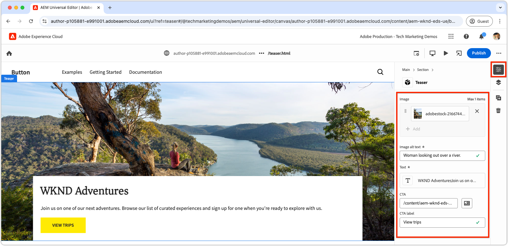
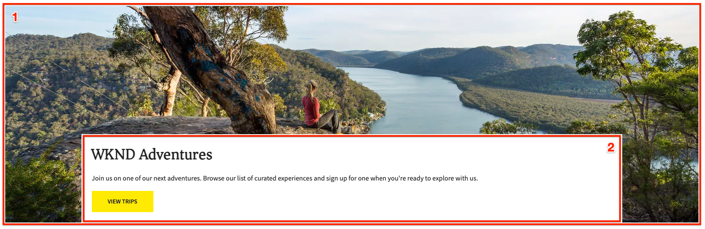
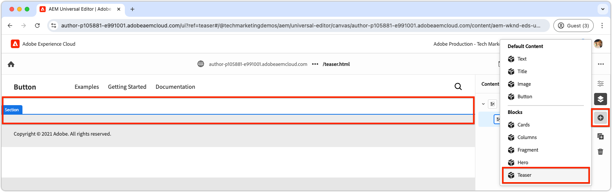

# Skapa ett nytt block

I det här kapitlet beskrivs hur du skapar ett nytt, redigerbart teaserblock för en Edge Delivery Services webbplats med hjälp av Universellt redigeringsprogram.


Blocket `teaser` visar följande element:

- **Bild**: En visuellt engagerande bild.
- **Textinnehåll**:
   - **Titel**: En intressant rubrik som drar fokus.
   - **Brödtext**: Beskrivande innehåll som ger kontext eller information, inklusive valfria villkor.
   - **Knappen Call-to-action (CTA)**: En länk som utformats för att uppmuntra användarinteraktion och vägleda dem till ytterligare engagemang.

`teaser`-blockets innehåll kan redigeras i Universell redigerare vilket gör det enkelt att använda och återanvända på hela webbplatsen.

Observera att `teaser`-blocket liknar mallens `hero`-block. `teaser`-blocket är därför endast avsett att fungera som ett enkelt exempel för att illustrera utvecklingskoncept.

## Skapa en ny Git-gren

Om du vill ha ett rent och organiserat arbetsflöde skapar du en ny gren för varje specifik utvecklingsuppgift. På så sätt undviker du problem med att distribuera ofullständig eller otestad kod till produktionen.

1. **Börja från huvudgrenen**: En stabil grund garanteras om du arbetar från den senaste produktionskoden.
2. **Hämta fjärrändringar**: Genom att hämta de senaste uppdateringarna från GitHub ser du till att den senaste koden är tillgänglig innan du påbörjar utvecklingen.
   - Exempel: Hämta de senaste uppdateringarna när du har sammanfogat ändringar från grenen `wknd-styles` till `main`.
3. **Skapa en ny gren**:

```bash
# ~/Code/aem-wknd-eds-ue

$ git fetch origin  
$ git checkout -b teaser origin/main  
```

När grenen `teaser` har skapats kan du börja utveckla teaserblocket.

## Blockera mapp

Skapa en ny mapp med namnet `teaser` i projektkatalogen `blocks`. Den här mappen innehåller blockets JSON-, CSS- och JavaScript-filer och ordnar blockets filer på en plats:

```
# ~/Code/aem-wknd-eds-ue

/blocks/teaser
```

Blockmappens namn fungerar som blockets ID och används för att referera till blocket under hela dess utveckling.

## Blockera JSON

Blocket JSON definierar tre huvudaspekter av blocket:

- **Definition**: Registrerar blocket som en redigerbar komponent i Universal Editor, som länkar det till en blockmodell och eventuellt ett filter.
- **Modell**: Anger blockets redigeringsfält och hur dessa fält återges som semantiska Edge Delivery Services HTML.
- **Filter**: Konfigurerar filtreringsregler för att begränsa vilka behållare som blocket kan läggas till i via den universella redigeraren. De flesta block är inte behållare, utan deras ID:n läggs till i andra behållarblocks filter.

Skapa en ny fil på `/blocks/teaser/_teaser.json` med följande inledande struktur, i exakt ordning. Om nycklarna inte är i ordning kanske de inte byggs som de ska.

[!BADGE /blocks/teaser/_teaser.json]{type=Neutral tooltip="Filnamn på kodexemplet nedan."}

```json
{
    "definitions": [],
    "models": [],
    "filters": []
}
```

### Blockmodell

Blockmodellen är en viktig del av blockets konfiguration, eftersom den definierar:

1. Redigeringsupplevelsen genom att definiera de fält som är tillgängliga för redigering.

   

2. Hur fältets värden återges i Edge Delivery Services HTML.

Modeller tilldelas en `id` som motsvarar [blockets definition](#block-definition) och innehåller en `fields`-array som anger de redigerbara fälten.

Varje fält i arrayen `fields` har ett JSON-objekt som innehåller följande obligatoriska egenskaper:

| JSON-egenskap | Beskrivning |
|---------------|-----------------------------------------------------------------------------------------------------------------------|
| `component` | Fälttypen [](https://experienceleague.adobe.com/en/docs/experience-manager-cloud-service/content/implementing/developing/universal-editor/field-types#component-types), till exempel `text`, `reference` eller `aem-content`. |
| `name` | Fältets namn, mappning till JCR-egenskapen där värdet lagras i AEM. |
| `label` | Den etikett som visas för författare i Universell redigerare. |

En omfattande lista med egenskaper, inklusive valfria, finns i dokumentationen för [fält i den universella redigeraren](https://experienceleague.adobe.com/en/docs/experience-manager-cloud-service/content/implementing/developing/universal-editor/field-types#fields).

#### Blockdesign



Teaser-blocket innehåller följande redigerbara element:

1. **Bild**: Representerar suddgummits visuella innehåll.
2. **Textinnehåll**: Innehåller titeln, brödtexten och knappen för att ringa in-åtgärd, och placeras i en vit rektangel.
   - **title** och **body text** kan redigeras med samma RTF-redigerare.
   - **CTA** kan redigeras via ett `text`-fält för **label** och `aem-content`-fältet för **link**.

Teaser-blockets design är uppdelad i två logiska komponenter (bild- och textinnehåll), vilket ger en strukturerad och intuitiv redigeringsupplevelse för användarna.

### Blockera fält

Definiera de fält som krävs för blocket: bild, bildalternativ text, text, CTA-etikett och CTA-länk.

>[!BEGINTABS]

>[!TAB Rätt väg]

**Den här fliken visar det rätta sättet att modellera teaserblocket.**

Teaser består av två logiska områden: bild och text. För att förenkla koden som behövs för att visa Edge Delivery Servicens HTML som önskad webbupplevelse bör blockmodellen återspegla den här strukturen.

- Gruppera **bilden** och **bilden alt text** med [fältkomprimering](https://experienceleague.adobe.com/en/docs/experience-manager-cloud-service/content/edge-delivery/wysiwyg-authoring/content-modeling#field-collapse).
- Gruppera textinnehållsfälten med [elementgruppering](https://experienceleague.adobe.com/en/docs/experience-manager-cloud-service/content/edge-delivery/wysiwyg-authoring/content-modeling#element-grouping) och [fältkomprimering för CTA](https://experienceleague.adobe.com/en/docs/experience-manager-cloud-service/content/edge-delivery/wysiwyg-authoring/content-modeling#field-collapse).

Om du inte är bekant med [fältkomprimering](https://experienceleague.adobe.com/en/docs/experience-manager-cloud-service/content/edge-delivery/wysiwyg-authoring/content-modeling#field-collapse), [elementgruppering](https://experienceleague.adobe.com/en/docs/experience-manager-cloud-service/content/edge-delivery/wysiwyg-authoring/content-modeling#element-grouping) eller [typhärledning](https://experienceleague.adobe.com/en/docs/experience-manager-cloud-service/content/edge-delivery/wysiwyg-authoring/content-modeling#type-inference) granskar du den länkade dokumentationen innan du fortsätter, eftersom de är nödvändiga för att skapa en välstrukturerad blockmodell.

[!BADGE /blocks/teaser/_teaser.json]{type=Neutral tooltip="Filnamn på kodexemplet nedan."}

```json
{
    "definitions": [],
    "models": [
        {
            "id": "teaser", 
            "fields": [
                {
                    "component": "reference",
                    "valueType": "string",
                    "name": "image",
                    "label": "Image",
                    "multi": false
                },
                {
                    "component": "text",
                    "valueType": "string",
                    "name": "imageAlt",
                    "label": "Image alt text",
                    "required": true
                },
                {
                    "component": "richtext",
                    "name": "textContent_text",
                    "label": "Text",
                    "valueType": "string",
                    "required": true
                },
                {
                    "component": "aem-content",
                    "name": "textContent_cta",
                    "label": "CTA",
                    "valueType": "string"
                },
                {
                    "component": "text",
                    "name": "textContent_ctaText",
                    "label": "CTA label",
                    "valueType": "string"
                }
            ]
        }
    ],
    "filters": []
}
```

Den här modellen definierar redigeringsindata i Universell redigerare för blocket.

De resulterande Edge Delivery Servicens HTML för det här blocket placerar bilden i den första div-taggen och elementgruppsfälten `textContent` i den andra div-taggen.

```html
<div>
    <div>
        <!-- This div contains the field-collapsed image fields  -->
        <picture>
            ...
            <source .../>            
            
        </picture>
    </div>
    <div>
        <!-- This div, via element grouping contains the textContent fields -->
        <h2>The authored title</h2>
        <p>The authored body text</p>
        <a href="/authored/cta/link">The authored CTA label</a>
    </div>
</div>        
```

Som du kan se [ i nästa kapitel](./7a-block-css.md) förenklar den här HTML-strukturen formateringen av blocket som en kohesiv enhet.

Om du vill förstå konsekvenserna av att inte använda fältkomprimering och elementgruppering läser du fliken **Fel sätt** ovan.

>[!TAB Fel sätt]

**På den här fliken visas ett suboptimalt sätt att modellera teaserblocket, och det är bara ett juxposition åt höger.**

Det kan verka frestande att definiera varje fält som ett fristående fält i blockmodellen utan att använda [fältkomprimering](https://experienceleague.adobe.com/en/docs/experience-manager-cloud-service/content/edge-delivery/wysiwyg-authoring/content-modeling#field-collapse) och [elementgruppering](https://experienceleague.adobe.com/en/docs/experience-manager-cloud-service/content/edge-delivery/wysiwyg-authoring/content-modeling#element-grouping). Denna tillsyn komplicerar dock att formatera blocket som en sammanhängande enhet.

Teaser-modellen kan till exempel definieras som **utan**-fältkomprimering eller elementgruppering enligt följande:

[!BADGE /blocks/teaser/_teaser.json]{type=Neutral tooltip="Filnamn på kodexemplet nedan."}

```json
{
    "definitions": [],
    "models": [
        {
            "id": "teaser", 
            "fields": [
                {
                    "component": "reference",
                    "valueType": "string",
                    "name": "image",
                    "label": "Image",
                    "multi": false
                },
                {
                    "component": "text",
                    "valueType": "string",
                    "name": "alt",
                    "label": "Image alt text",
                    "required": true
                },
                {
                    "component": "richtext",
                    "name": "text",
                    "label": "Text",
                    "valueType": "string",
                    "required": true
                },
                {
                    "component": "aem-content",
                    "name": "link",
                    "label": "CTA",
                    "valueType": "string"
                },
                {
                    "component": "text",
                    "name": "label",
                    "label": "CTA label",
                    "valueType": "string"
                }
            ]
        }
    ],
    "filters": []
}
```

Edge Delivery Servicens HTML för blocket återger varje fälts värde i en separat `div`, vilket komplicerar innehållets förståelse, formatprogrammet och strukturjusteringarna för HTML för att uppnå önskad design.

```html
<div>
    <div>
        <!-- This div contains the field-collapsed image  -->
        <picture>
            ...
            <source .../>            
            
        </picture>
    </div>
    <div>
        <p>The authored alt text</p>
    </div>
    <div>
        <h2>The authored title</h2>
        <p>The authored body text</p>
    </div>
    <div>
        <a href="/authored/cta/link">/authored/cta/link</a>
    </div>
    <div>
        The authored CTA label
    </div>
</div>        
```

Varje fält isoleras i sin egen `div`, vilket gör det svårt att formatera bilden och textinnehållet som sammanhängande enheter. Det går att uppnå önskad design med ansträngning och kreativitet, men det är enklare, enklare och semantiskt att använda [elementgruppering](https://experienceleague.adobe.com/en/docs/experience-manager-cloud-service/content/edge-delivery/wysiwyg-authoring/content-modeling#element-grouping) för att gruppera textinnehållsfält och [fältkomprimering](https://experienceleague.adobe.com/en/docs/experience-manager-cloud-service/content/edge-delivery/wysiwyg-authoring/content-modeling#field-collapse) för att lägga till redigerade värden som elementattribut.

Se **Skrivvägs-fliken** ovan för mer information om hur du modellerar teaserblocket bättre.

>[!ENDTABS]


### Blockdefinition

Blockdefinitionen registrerar blocket i Universell redigerare. Här är en beskrivning av JSON-egenskaperna som används i blockdefinitionen:

| JSON-egenskap | Beskrivning |
|---------------|-------------|
| `definition.title` | Namnet på blocket som det visas i den universella redigerarens **Add** -block. |
| `definition.id` | Ett unikt ID för blocket, som används för att styra dess användning i `filters`. |
| `definition.plugins.xwalk.page.resourceType` | Definierar Sling-resurstypen för återgivning av komponenten i den universella redigeraren. Använd alltid resurstypen `core/franklin/components/block/v#/block`. |
| `definition.plugins.xwalk.page.template.name` | Blockets namn. Den ska vara i gemener och avstavad så att den matchar blockets mappnamn. Det här värdet används också för att etikettera blockinstansen i Universella redigerare. |
| `definition.plugins.xwalk.page.template.model` | Länkar den här definitionen till dess `model`-definition, som styr de redigeringsfält som visas för blocket i den universella redigeraren. Värdet här måste matcha ett `model.id`-värde. |

Här är ett exempel på JSON för blockdefinitionen:

[!BADGE /blocks/teaser/_teaser.json]{type=Neutral tooltip="Filnamn på kodexemplet nedan."}

```json
{
    "definitions": [{
      "title": "Teaser",
      "id": "teaser",
      "plugins": {
        "xwalk": {
          "page": {
            "resourceType": "core/franklin/components/block/v1/block",
            "template": {
              "name": "Teaser",
              "model": "teaser",
              "textContent_text": "<h2>Enter a title</h2><p>...and body text here!</p>",
              "textContent_cta": "/",
              "textContent_ctaText": "Click me!"
            }
          }
        }
      }
    }],
    "models": [... from previous section ...],
    "filters": []
}
```

I detta exempel:

- Blocket heter&quot;Teaser&quot; och använder modellen `teaser` som avgör vilka fält som är tillgängliga för redigering i Universell redigerare.
- Blocket innehåller standardinnehåll för fältet `textContent_text`, som är ett RTF-område för titel- och brödtexten, samt `textContent_cta` och `textContent_ctaText` för CTA-länken och etiketten (call-to-action). Mallens fältnamn som innehåller ursprungligt innehåll matchar fältnamnen som definierats i [innehållsmodellens fältarray](#block-model);

Den här strukturen ser till att blocket är konfigurerat i den universella redigeraren med rätt fält, innehållsmodell och resurstyp för återgivning.

### Blockfilter

Blockets `filters`-array definierar, för [ behållarblock](https://experienceleague.adobe.com/en/docs/experience-manager-cloud-service/content/edge-delivery/wysiwyg-authoring/content-modeling#container), vilka andra block som kan läggas till i behållaren. Filter definierar en lista med block-ID (`model.id`) som kan läggas till i behållaren.

[!BADGE /blocks/teaser/_teaser.json]{type=Neutral tooltip="Filnamn på kodexemplet nedan."}

```json
{
  "definitions": [... populated from previous section ...],
  "models": [... populated from previous section ...],
  "filters": []
}
```

Teaser-komponenten är inte ett [behållarblock](https://experienceleague.adobe.com/en/docs/experience-manager-cloud-service/content/edge-delivery/wysiwyg-authoring/content-modeling#container), vilket innebär att du inte kan lägga till andra block i den. Därför är `filters`-arrayen tom. Lägg i stället till teaser-ID:t i avsnittsblockets filterlista så att teaser kan läggas till i ett avsnitt.



Butiksfilter i projektets `models`-mapp, till exempel avsnittsblocket, finns i Adobe. Du kan justera genom att leta upp JSON-filen för blocket som tillhandahålls av Adobe (till exempel `/models/_section.json`) och lägga till teaser-ID:t (`teaser`) i filterlistan. Konfigurationen signalerar till Universal Editor att teaser-komponenten kan läggas till i avsnittets behållarblock.

[!BADGE /models/_section.json]{type=Neutral tooltip="Filnamn på kodexemplet nedan."}

```json
{
  "definitions": [],
  "models": [],
  "filters": [
    {
      "id": "section",
      "components": [
        "text",
        "image",
        "button",
        "title",
        "hero",
        "cards",
        "columns",
        "fragment",
        "teaser"
      ]
    }
  ]
}
```

Teaser block definition ID för `teaser` läggs till i `components`-arrayen.

## Laga dina JSON-filer

Se till att du [ofta ](./3-local-development-environment.md#linting) lintar dina ändringar så att de blir rena och konsekventa. Linting hjälper dig att fånga upp problem tidigt och minskar den totala utvecklingstiden. Kommandot `npm run lint:js` begränsar också JSON-filer och fångar upp eventuella syntaxfel.

```bash
# ~/Code/aem-wknd-eds-ue

$ npm run lint:js
```

## Bygg projekt-JSON

När du har konfigurerat blockets JSON-filer (`blocks/teaser/_teaser.json`, `models/_section.json`) måste de kompileras till projektets `component-models.json` -, `component-definitions.json` - och `component-filters.json`-filer. Kompileringen görs genom att köra projektets [build JSON](./3-local-development-environment.md#build-json-fragments) npm-skript.

```bash
# ~/Code/aem-wknd-eds-ue

$ npm run build:json
```

## Distribuera blockdefinitionen

Om du vill göra blocket tillgängligt i Universal Editor måste projektet implementeras och skickas till en GitHub-databasgren, i det här fallet grenen `teaser`.

Det exakta förgreningsnamnet Universal Editor använder kan justeras per användare via Universal Editors URL.

```bash
# ~/Code/aem-wknd-eds-ue

$ git add .
$ git commit -m "Add teaser block JSON files so it is available in Universal Editor"
$ git push origin teaser
```

När den universella redigeraren öppnas med frågeparametern `?ref=teaser` visas det nya `teaser`-blocket på blockpaletten. Observera att blocket inte har någon formatering. Blockets fält återges som semantiska HTML, formaterade endast via [global CSS](./4-website-branding.md#global-css).
