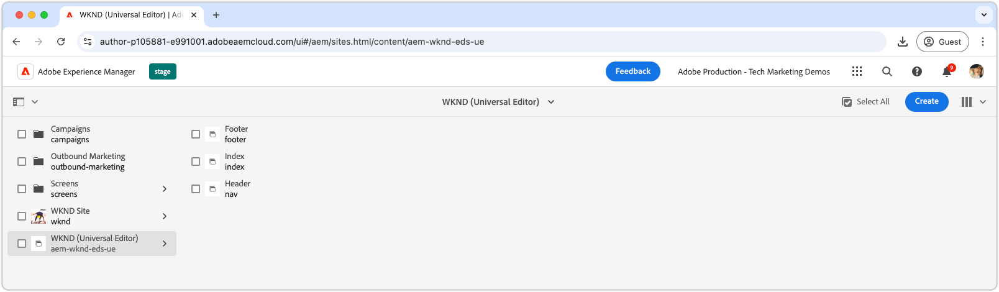
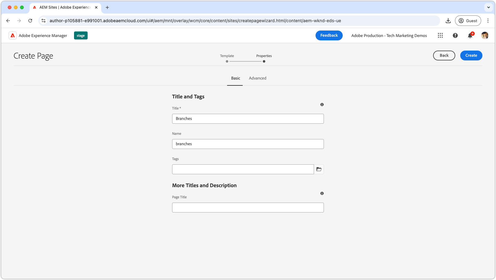
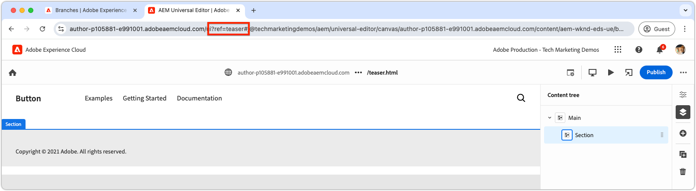
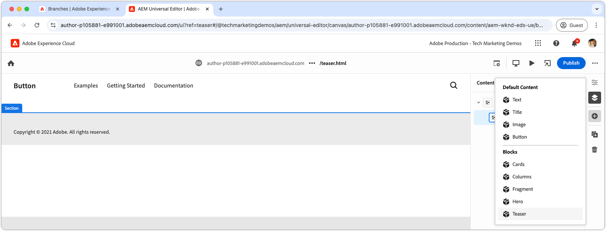

# Skapa ett block

När JSON ](./5-new-block.md) för [teaser-blocket har placerats i `teaser`-grenen kan blocket redigeras i AEM Universal Editor.

Det finns flera skäl till att det är viktigt att skapa ett block under utveckling:

1. Den verifierar att blockets definition och modell är korrekta.
1. Det gör att utvecklare kan granska blockets semantiska HTML, som fungerar som grund för utvecklingen.
1. Det gör det möjligt att använda både innehåll och semantiska HTML i förhandsvisningsmiljön, vilket ger snabbare blockutveckling.

## Öppna Universal Editor med kod från grenen `teaser`

1. Logga in på AEM Author.
2. Navigera till **Webbplatser** och markera webbplatsen (WKND (Universal Editor)) som skapades i det [föregående kapitlet](./2-new-aem-site.md).

   

3. Skapa eller redigera en sida för att lägga till det nya blocket och se till att kontexten är tillgänglig för lokal utveckling. Sidor kan skapas var som helst på webbplatsen, men det är oftast bäst att skapa separata sidor för varje ny arbetsbrödtext. Skapa en ny mappsida med namnet **grenar**. Varje undersida används som stöd för utveckling av Git-grenen med samma namn.

   

4. Under sidan **Förgreningar** skapar du en ny sida med namnet **Teaser** som matchar namnet på utvecklingsgrenen och redigerar sidan genom att klicka på **Öppna** .

   

5. Uppdatera den universella redigeraren för att läsa in koden från grenen `teaser` genom att lägga till `?ref=teaser` i URL:en. Lägg till frågeparametern **BEFORE** i `#`-symbolen.

   

6. Markera det första avsnittet under **Huvudsida**, klicka på knappen **Lägg till** och välj **Teaser** -blocket.

   

7. Markera det nya lagret på arbetsytan och författare fälten till höger eller via funktionen för redigering direkt.

   

8. När du är klar med redigeringen väljer du knappen **Publicera** längst upp till höger i Universal Editor, väljer Publicera till **Förhandsgranska** och publicerar ändringarna i förhandsvisningsmiljön. Ändringarna publiceras sedan till domänen `aem.page` för webbplatsen.
   

9. Vänta tills ändringarna har publicerats för förhandsgranskning och öppna sedan webbsidan via [AEM CLI](./3-local-development-environment.md#install-the-aem-cli) på [http://localhost:3000/branches/teaser](http://localhost:3000/branches/teaser).

   

Nu finns det material och semantiska HTML som skapats av teaser-blocket på förhandsgranskningswebbplatsen, som är klart för utveckling med AEM CLI i den lokala utvecklingsmiljön.
