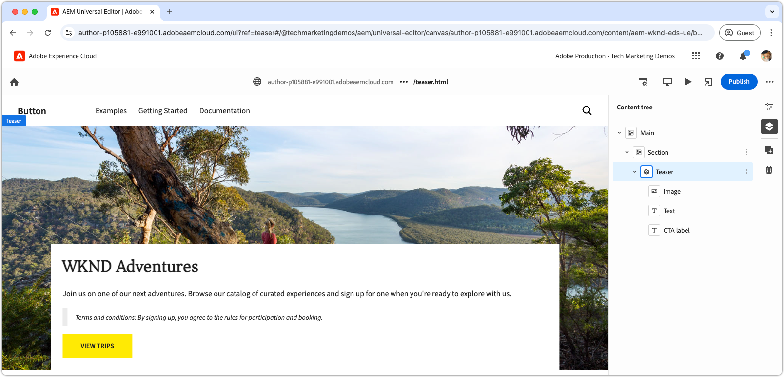

# Utveckla ett block med CSS och JavaScript

I det [föregående kapitlet](./7b-block-js-css.md) har formatering av ett block med enbart CSS täckts. Nu går fokus över till att utveckla ett block med både JavaScript och CSS.

I det här exemplet visas hur du förbättrar ett block på tre sätt:

1. Lägga till anpassade CSS-klasser.
1. Använda händelseavlyssnare för att lägga till rörelse.
1. Hantera termer och villkor som kan inkluderas i suddgummits text.

## Vanliga användningsområden

Den här metoden är särskilt användbar i följande scenarier:

- **Extern CSS-hantering:** När blockets CSS hanteras utanför Edge Delivery Services och inte justeras mot HTML-strukturen.
- **Ytterligare attribut:** När extra attribut, som [ARIA](https://developer.mozilla.org/en-US/docs/Web/Accessibility/ARIA) för hjälpmedel eller [mikrodata](https://developer.mozilla.org/en-US/docs/Web/HTML/Microdata), krävs.
- **JavaScript-förbättringar:** När interaktiva funktioner, som händelseavlyssnare, behövs.

Den här metoden är beroende av webbläsarspecifik JavaScript DOM-manipulering, men du måste vara försiktig när du ändrar DOM, särskilt när du flyttar element. Sådana ändringar kan störa den universella redigerarens redigeringsupplevelse. Helst bör blockets [innehållsmodell](./5-new-block.md#block-model) utformas noggrant för att minimera behovet av omfattande DOM-ändringar.

## Block HTML

Börja med att granska DOM som exponeras av Edge Delivery Services för att närma dig blockutveckling. Strukturen har förbättrats med JavaScript och formaterats med CSS.

>[!BEGINTABS]

>[!TAB DOM att dekorera]

Nedan följer det teaser-blockets DOM som är målet att dekorera med JavaScript och CSS.

```html
...
<body>
    <header/>
    <main>
        <div>
            <!-- Start block HTML -->
            <div class="teaser block" data-block-name="teaser" data-block-status="loaded">
                <div>
                    <div>
                    <picture>
                        <source type="image/webp" srcset="./media_15ba2b455e29aca38c1ca653d24c40acaec8a008f.jpeg?width=2000&amp;format=webply&amp;optimize=medium" media="(min-width: 600px)">
                        <source type="image/webp" srcset="./media_15ba2b455e29aca38c1ca653d24c40acaec8a008f.jpeg?width=750&amp;format=webply&amp;optimize=medium">
                        <source type="image/jpeg" srcset="./media_15ba2b455e29aca38c1ca653d24c40acaec8a008f.jpeg?width=2000&amp;format=jpeg&amp;optimize=medium" media="(min-width: 600px)">
                        
                    </picture>
                    </div>
                </div>
                <div>
                    <div>
                    <h2 id="wknd-adventures">WKND Adventures</h2>
                    <p>Join us on one of our next adventures. Browse our list of curated experiences and sign up for one when you're ready to explore with us.</p>
                    <p class="button-container"><a href="/" title="View trips" class="button">View trips</a></p>
                    </div>
                </div>
            </div>     
            <!-- End block HTML -->
        </div>
    </main>
    <footer/>
</body>
...
```

>[!TAB Hitta DOM]

Om du vill hitta det DOM som ska dekoreras öppnar du sidan med det odekorerade blocket i den lokala utvecklingsmiljön, markerar blocket och inspekterar DOM.


>[!ENDTABS]


## Blockera JavaScript

Om du vill lägga till JavaScript-funktioner i ett block skapar du en JavaScript-fil i blockets katalog med samma namn som blocket, till exempel `/blocks/teaser/teaser.js`.

JavaScript-filen bör exportera en standardfunktion:

```javascript
export default function decorate(block) { ... }
```

Standardfunktionen tar det DOM-element/det DOM-träd som representerar blocket i Edge Delivery Services HTML och innehåller den anpassade JavaScript som körs när blocket återges.

I det här exemplet utför JavaScript tre huvudåtgärder:

1. Lägger till en händelseavlyssnare till CTA-knappen och zoomar bilden vid hovring.
1. Lägger till semantiska CSS-klasser i blockets element, vilket är användbart när du integrerar befintliga CSS-designsystem.
1. Lägger till en särskild CSS-klass i stycken som börjar med `Terms and conditions:`.

[!BADGE /blocks/teaser/teaser.js]{type=Neutral tooltip="Filnamn på kodexemplet nedan."}

```javascript
/* /blocks/teaser/teaser.js */

/**
 * Adds a zoom effect to image using event listeners.
 *
 * When the CTA button is hovered over, the image zooms in.
 *
 * @param {HTMLElement} block represents the block's' DOM tree
 */
function addEventListeners(block) {
  block.querySelector('.button').addEventListener('mouseover', () => {
    block.querySelector('.image').classList.add('zoom');
  });

  block.querySelector('.button').addEventListener('mouseout', () => {
    block.querySelector('.image').classList.remove('zoom');
  });
}

/**
   * Entry point to block's JavaScript.
   * Must be exported as default and accept a block's DOM element.
   * This function is called by the project's style.js, and passed the block's element.
   *
   * @param {HTMLElement} block represents the block's' DOM element/tree
   */
export default function decorate(block) {
  /* This JavaScript makes minor adjustments to the block's DOM */

  // Dress the DOM elements with semantic CSS classes so it's obvious what they are.
  // If needed we could also add ARIA roles and attributes, or add/remove/move DOM elements.

  // Add a class to the first picture element to target it with CSS
  block.querySelector('picture').classList.add('image-wrapper');

  // Use previously applied classes to target new elements
  block.querySelector('.image-wrapper img').classList.add('image');

  // Mark the second/last div as the content area (white, bottom aligned box w/ text and cta)
  block.querySelector(':scope > div:last-child').classList.add('content');

  // Mark the first H1-H6 as a title
  block.querySelector('h1,h2,h3,h4,h5,h6').classList.add('title');

  // Process each paragraph and mark it as text or terms-and-conditions
  block.querySelectorAll('p').forEach((p) => {
    const innerHTML = p.innerHTML?.trim();

    // If the paragraph starts with Terms and conditions: then style it as such
    if (innerHTML?.startsWith("Terms and conditions:")) {
      /* If a paragraph starts with '*', add a special CSS class. */
      p.classList.add('terms-and-conditions');
    }
  });

  // Add event listeners to the block
  addEventListeners(block);
}
```

## Blockera CSS

Om du har skapat en `teaser.css` i det [föregående kapitlet](./7a-block-css.md) tar du bort den eller byter namn på den till `teaser.css.bak`, eftersom det här kapitlet implementerar olika CSS för teaserblocket.

Skapa en `teaser.css`-fil i blockets mapp. Den här filen innehåller den CSS-kod som formaterar blocket. Den här CSS-koden riktar in sig på blockets element och de specifika, semantiska CSS-klasser som lagts till av JavaScript i `teaser.js`.

Olika element kan fortfarande formateras direkt eller med de anpassade CSS-klasserna. För mer komplexa block kan semantiska CSS-klasser göra CSS mer begripligt och underhållbart, särskilt när du arbetar med större team över längre tidsperioder.

[Precis som tidigare ](./7a-block-css.md#develop-a-block-with-css) kan du omsluta CSS till `.block.teaser` med [CSS-kapsling](https://developer.mozilla.org/en-US/docs/Web/CSS/CSS_nesting) för att undvika konflikter med andra block.

[!BADGE /blocks/teaser/teaser.css]{type=Neutral tooltip="Filnamn på kodexemplet nedan."}

```css
/* /blocks/teaser/teaser.css */

/* Scope each selector in the block with `.block.teaser` to avoid accidental conflicts outside the block */
.block.teaser {
    animation: teaser-fade-in 1s;
    position: relative;
    width: 1600px;
    max-width: 100vw;
    left: 50%; 
    transform: translateX(-50%);
    height: 500px;

    /* The teaser image */
    & .image-wrapper {
        position: absolute;
        z-index: -1;
        inset: 0;
        box-sizing: border-box;
        overflow: hidden; 

        & .image {
            object-fit: cover;
            object-position: center;
            width: 100%;
            height: 100%;
            transform: scale(1); 
            transition: transform 0.6s ease-in-out;
        }
    }

    /* The teaser text content */
    & .content {
        position: absolute;
        bottom: 0;
        left: 50%;
        transform: translateX(-50%);
        background: var(--background-color);
        padding: 1.5rem 1.5rem 1rem;
        width: 80vw;
        max-width: 1200px;
  
        & .title {
            font-size: var(--heading-font-size-xl);
            margin: 0;
        }

        & .title::after {
            border-bottom: 0;
        }

        & p {
            font-size: var(--body-font-size-s);
            margin-bottom: 1rem;
            animation: teaser-fade-in .6s;
        }

        & p.terms-and-conditions {
            font-size: var(--body-font-size-xs);
            color: var(--secondary-color);
            padding: .5rem 1rem;
            font-style: italic;
            border: solid var(--light-color);
            border-width: 0 0 0 10px;
        }

        /* Add underlines to links in the text */
        & a:hover {
            text-decoration: underline;
        }

        /* Add specific spacing to buttons. These button CSS classes are automatically added by Edge Delivery Services. */
        & .button-container {
            margin: 0;
            padding: 0;
        }

        & .button {   
            background-color: var(--primary-color);
            border-radius: 0;
            color: var(--dark-color);
            font-size: var(--body-font-size-xs);
            font-weight: bold;
            padding: 1em 2.5em;
            margin: 0;
            text-transform: uppercase;
        }
    }

    & .zoom {
        transform: scale(1.1);
    }
}

/** Animations 
    Scope the @keyframes to the block (teaser) to avoid accidental conflicts outside the block

    Global @keyframes can defines in styles/styles.css and used in this file.
**/
@keyframes teaser-fade-in {
    from {
        opacity: 0;
    }

    to {
        opacity: 1;
    }
}
```

## Lägg till villkor

Ovanstående implementering lägger till stöd för stycken som är speciellt formaterade och som börjar med texten `Terms and conditions:`. Om du vill validera den här funktionen uppdaterar du teaser-blockets textinnehåll i Universell redigerare så att det innehåller villkor.

Följ stegen i [författaren av ett block](./6-author-block.md) och redigera texten så att den innehåller ett **villkor** -stycke i slutet:

```
WKND Adventures

Join us on one of our next adventures. Browse our list of curated experiences and sign up for one when you're ready to explore with us.

Terms and conditions: By signing up, you agree to the rules for participation and booking.
```

Kontrollera att stycket återges med termerna och villkorsformatet i den lokala utvecklingsmiljön. Kom ihåg att dessa kodändringar inte återspeglas i Universal Editor förrän de [skickas till en gren på GitHub](#preview-in-universal-editor) som den universella redigeraren har konfigurerats att använda.

## Förhandsgranskning av utveckling

När CSS och JavaScript läggs till läses ändringarna in i AEM CLI:s lokala utvecklingsmiljö, vilket gör att du snabbt och enkelt kan se hur koden påverkar blocket. Håll muspekaren över CTA och kontrollera att suddgummits bild zoomar in och ut.


## Begränsa koden

[Lint](./3-local-development-environment.md#linting)-kodändringar görs ofta för att hålla koden ren och konsekvent. Regelbunden linting hjälper till att fånga upp problem tidigt och minskar den totala utvecklingstiden. Kom ihåg att du inte kan sammanfoga ditt utvecklingsarbete i grenen `main` förrän alla lintingproblem har lösts.

```bash
# ~/Code/aem-wknd-eds-ue

$ npm run lint
```

## Förhandsgranska i Universal Editor

Om du vill visa ändringar i AEM Universal Editor lägger du till, bekräftar och överför dem till Git-databasgrenen som används av den universella redigeraren. Detta säkerställer att blockimplementeringen inte stör redigeringsupplevelsen.

```bash
# ~/Code/aem-wknd-eds-ue

$ git add .
$ git commit -m "CSS and JavaScript implementation for teaser block"
$ git push origin teaser
```

Nu kan du förhandsgranska ändringarna i Universal Editor när du lägger till frågeparametern `?ref=teaser`.


