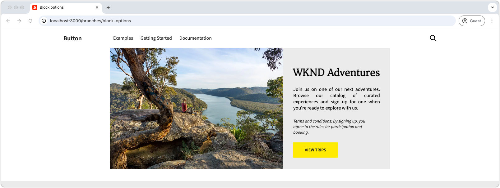

# Utveckla ett block med alternativ

Den här självstudiekursen bygger på självstudiekursen Edge Delivery Services och Universal Editor, som vägleder dig genom processen att lägga till blockalternativ i ett block. Genom att definiera blockalternativ kan du anpassa ett blocks utseende och funktion, vilket möjliggör olika variationer för olika innehållsbehov. Detta ger större flexibilitet och återanvändbarhet i webbplatsens designsystem.

{align="center"}

I den här självstudiekursen lägger du till blockalternativ i Teaser-blocket så att författarna kan välja mellan två visningsalternativ: **Standard** och **Sida vid sida**. Alternativet **Standard** visar bilden ovanför och bakom texten, medan alternativet **Sida vid sida** visar bilden och texten sida vid sida.

## Vanliga användningsområden

Vanliga användningsområden för **Blockalternativ** i **Edge Delivery Services** och **Universal Editor** omfattar, men är inte begränsade till:

1. **Layoutvarianter:** Växla enkelt mellan layouter. Exempel: vågrät kontra lodrät eller stödraster kontra lista.
2. **Formatvariationer:** Växla enkelt mellan teman eller visuella behandlingar. Till exempel ljust jämfört med mörkt läge, eller stor jämfört med liten text.
3. **Visningskontroll av innehåll:** Växla synlighet av element eller växla mellan innehållsformat (kompakt kontra detaljerat).

Dessa alternativ ger flexibilitet och effektivitet när det gäller att skapa dynamiska och anpassningsbara block.

I den här självstudiekursen visas hur layoutvariationerna använder olika skiftlägen, där Teaser-blocket kan visas i två olika layouter: **Standard** och **Sida vid sida**.

## Blockmodell

Om du vill lägga till blockalternativ i Teaser-blocket öppnar du dess JSON-fragment på `/block/teaser/_teaser.json` och lägger till ett nytt fält i modelldefinitionen. I det här fältet anges egenskapen `name` till `classes`, som är ett skyddat fält som används av AEM för att lagra blockalternativ, som tillämpas på blockets Edge Delivery Services HTML.

### Fältkonfigurationer

Flikarna nedan visar olika sätt att konfigurera blockalternativ i blockmodellen, inklusive ett val med en CSS-klass, ett val med flera CSS-klasser och flera val med flera CSS-klasser. Den här självstudien [implementerar den enklare metoden](#field-configuration-for-this-tutorial) som används i **select med en enda CSS-klass**.

>[!BEGINTABS]

>[!TAB Markera med en CSS-klass]

I den här självstudien visas hur du använder en `select`-indatatyp (listruta) för att låta författarna välja ett blockalternativ, som sedan tillämpas som en enda motsvarande CSS-klass.

{align="center"}

#### Blockmodell

Alternativet **Standard** representeras av en tom sträng (`""`), medan alternativet **Sida vid sida** använder `"side-by-side"`. Alternativets **namn** och **värde** behöver inte vara samma, men **värde** avgör vilka CSS-klasser som tillämpas på blockets HTML. Värdet för alternativet **Sida vid sida** kan till exempel vara `layout-10` i stället för `side-by-side`. Det är dock bäst att använda semantiskt meningsfulla namn för CSS-klasser för att se till att alternativvärdena är tydliga och konsekventa.

[!BADGE /blocks/teaser/_teaser.json]{type=Neutral tooltip="Filnamn på kodexemplet nedan."}

```json{highlight="4,8,9-18"}
...
"fields": [
    {
        "component": "select",
        "name": "classes",
        "value": "",
        "label": "Teaser options",
        "valueType": "string",
        "options": [
            {
                "name": "Default",
                "value": ""
            },
            {
                "name": "Side-by-side",
                "value": "side-by-side"
            }
        ]
    }
]
...
```

#### Blockera HTML

När författaren väljer ett alternativ läggs motsvarande värde till som en CSS-klass i blockets HTML:

- Om **Standard** är markerat:

  ```html
  <div class="block teaser">
      <!-- Block content here -->
  </div>
  ```

- Om **Sida vid sida** är markerat:

  ```html
  <div class="block teaser side-by-side">
      <!-- Block content here -->
  </div>
  ```

På så sätt kan olika format och villkorliga JavaScript användas beroende på vilket alternativ som har valts.


>[!TAB Markera med flera CSS-klasser]

**Den här metoden används inte i den här självstudiekursen, men visar en alternativ metod och avancerade blockalternativ.**

Med indatatypen `select` kan författare välja ett blockalternativ som kan mappas till flera CSS-klasser. För att uppnå detta anger du CSS-klasserna som blankstegsavgränsade värden.

{align="center"}

#### Blockmodell

Alternativet **Sida vid sida** kan t.ex. ha stöd för variationer där bilden visas till vänster (`side-by-side left`) eller till höger (`side-by-side right`).

[!BADGE /blocks/teaser/_teaser.json]{type=Neutral tooltip="Filnamn på kodexemplet nedan."}

```json{highlight="4,8,9-21"}
...
"fields": [
    {
        "component": "select",
        "name": "classes",
        "value": "",
        "label": "Teaser options",
        "valueType": "string",
        "options": [
            {
                "name": "Default",
                "value": ""
            },
            {
                "name": "Side-by-side with Image on left",
                "value": "side-by-side left"
            },
            {
                "name": "Side-by-side with Image on right",
                "value": "side-by-side right"
            }
        ]
    }
]
...
```

#### Blockera HTML

När författaren väljer ett alternativ används motsvarande värde som en blankstegsavgränsad uppsättning CSS-klasser i blockets HTML:

- Om **Standard** är markerat:

  ```html
  <div class="block teaser">
      <!-- Block content here -->
  </div>
  ```

- Om **Sida vid sida med bild till vänster** är markerat:

  ```html
  <div class="block teaser side-by-side left">
      <!-- Block content here -->
  </div>
  ```

- Om **Sida vid sida med bild till höger** är markerat:

  ```html
  <div class="block teaser side-by-side right">
      <!-- Block content here -->
  </div>
  ```

På så sätt kan olika format och villkorliga JavaScript användas beroende på vilket alternativ du väljer.


>[!TAB Markera flera med flera CSS-klasser]

**Den här metoden används inte i den här självstudiekursen, men visar en alternativ metod och avancerade blockalternativ.**

Indatatypen för `"component": "multiselect"` gör att författaren kan välja flera alternativ samtidigt. Detta möjliggör komplexa permutationer av blockets utseende genom att kombinera flera designalternativ.

{align="center"}

### Blockmodell

**Sida vid sida**, **Bild till vänster** och **Bild till höger** kan t.ex. ha stöd för variationer där bilden är placerad till vänster (`side-by-side left`) eller till höger (`side-by-side right`).

[!BADGE /blocks/teaser/_teaser.json]{type=Neutral tooltip="Filnamn på kodexemplet nedan."}

```json{highlight="4,6,8,10-21"}
...
"fields": [
    {
        "component": "multiselect",
        "name": "classes",
        "value": [],
        "label": "Teaser options",
        "valueType": "array",
        "options": [
            {
                "name": "Side-by-side",
                "value": "side-by-side"
            },
            {
                "name": "Image on left",
                "value": "left"
            },
            {
                "name": "Image on right",
                "value": "right"
            }
        ]
    }
]
...
```

#### Blockera HTML

När författaren väljer flera alternativ används motsvarande värden som mellanseparerade CSS-klasser i blockets HTML:

- Om **Sida vid sida** och **Bild till vänster** är markerade:

  ```html{highlight="1"}
  <div class="block teaser side-by-side left">
      <!-- Block content here -->
  </div>
  ```

- Om **Sida vid sida** och **Bild till höger** är markerade:

  ```html{highlight="1"}
  <div class="block teaser side-by-side right">
      <!-- Block content here -->
  </div>
  ```

Flervalsfunktionen ger flexibilitet, men det ger en ökad komplexitet när det gäller att hantera designpermutationer. Utan begränsningar kan motstridiga markeringar leda till varumärkesbrutna eller varumärkesanpassade upplevelser.

Till exempel:

- **Bild till vänster** eller **Bild till höger** utan att markera **Sida vid sida** tillämpar dem implicit på **Standard** som alltid anger bilden som bakgrund, vilket innebär att justeringen till vänster och höger inte är relevant.
- Att markera både **Bild till vänster** och **Bild till höger är** motsägelsefullt.
- Att välja **sida vid sida** utan **Bild till vänster** eller **Bild till höger** kan anses tvetydigt eftersom bildens position inte har angetts.

För att förhindra problem och skapa förvirring när du använder flera alternativ måste du se till att alternativen är väl planerade och att alla ändringar testas. Flerval fungerar bäst för enkla, icke-motstridiga förbättringar som&quot;stor&quot; eller&quot;högdager&quot; i stället för layoutändrade alternativ.


>[!TAB Standardalternativ]

**Den här metoden används inte i den här självstudiekursen, men visar en alternativ metod och avancerade blockalternativ.**

Blockalternativ kan anges som standard när du lägger till en ny blockinstans på en sida i Universal Editor. Detta görs genom att ange standardvärdet för egenskapen `classes` i [blockets definition](../5-new-block.md#block-definition).

#### Blockdefinition

I exemplet nedan är standardalternativet **Sida vid sida** genom att tilldela egenskapen `value` för fältet `classes` till `side-by-side`. Motsvarande blockalternativ i blockmodellen är valfria.

Du kan också definiera flera poster för samma block, vart och ett med olika namn och klass. På så sätt kan Universell redigerare visa olika blockposter, var och en förkonfigurerad med ett visst blockalternativ. Dessa visas som separata block i redigeraren, men kodbasen innehåller ett enda block som dynamiskt återges baserat på det valda alternativet.

[!BADGE /blocks/teaser/_teaser.json]{type=Neutral tooltip="Filnamn på kodexemplet nedan."}

```json{highlight="12"}
{
    "definitions": [{
      "title": "Teaser",
      "id": "teaser",
      "plugins": {
        "xwalk": {
          "page": {
            "resourceType": "core/franklin/components/block/v1/block",
            "template": {
              "name": "Teaser",
              "model": "teaser",
              "classes": "side-by-side",
              "textContent_text": "<h2>Enter a title</h2><p>...and body text here!</p>",
              "textContent_cta": "/",
              "textContent_ctaText": "Click me!"
            }
          }
        }
      }
    }],
    "models": [... from previous section ...],
    "filters": []
}
```

>[!ENDTABS]


### Fältkonfiguration för den här självstudien


I den här självstudiekursen ska vi använda metoden select med en enda CSS-klass som beskrivs ovan på den första fliken, som tillåter två separata blockalternativ: **Default** och **Sida vid sida**.

Lägg till ett enda urvalsfält för blockalternativ i modelldefinitionen i blockets JSON-fragment. I det här fältet kan författare välja mellan standardlayout och en sida vid sida-layout.

[!BADGE /blocks/teaser/_teaser.json]{type=Neutral tooltip="Filnamn på kodexemplet nedan."}

```json{highlight="7-24"}
{
    "definitions": [...],
    "models": [
        {
            "id": "teaser", 
            "fields": [
                {
                    "component": "select",
                    "name": "classes",
                    "value": "",
                    "label": "Teaser options",
                    "description": "",
                    "valueType": "string",
                    "options": [
                        {
                            "name": "Default",
                            "value": ""
                        },
                        {
                            "name": "Side-by-side",
                            "value": "side-by-side"
                        }
                    ]
                },
                {
                    "component": "reference",
                    "valueType": "string",
                    "name": "image",
                    "label": "Image",
                    "multi": false
                },
                {
                    "component": "text",
                    "valueType": "string",
                    "name": "imageAlt",
                    "label": "Image alt text",
                    "required": true
                },
                {
                    "component": "richtext",
                    "name": "textContent_text",
                    "label": "Text",
                    "valueType": "string",
                    "required": true
                },
                {
                    "component": "aem-content",
                    "name": "textContent_cta",
                    "label": "CTA",
                    "valueType": "string"
                },
                {
                    "component": "text",
                    "name": "textContent_ctaText",
                    "label": "CTA label",
                    "valueType": "string"
                }
            ]
        }
    ],
    "filters": []
}
```

## Uppdateringsblock i Universal Editor

Om du vill göra de uppdaterade blockalternativen tillgängliga i Universal Editor distribuerar du JSON-kodändringarna till GitHub, skapar en ny sida, lägger till och redigerar Teaser-blocket med alternativet **Sida vid sida** och publicerar sedan sidan för förhandsgranskning. Läs in sidan i den lokala utvecklingsmiljön för kodning när den har publicerats.

### Överför ändringar till GitHub

Om du vill att de uppdaterade blockalternativen ska vara tillgängliga i Universal Editor för att ange blockalternativ och utveckla mot den resulterande HTML, måste projektet vara länkat och ändringarna skickas till en GitHub-gren, i det här fallet grenen `block-options`.

```bash
# ~/Code/aem-wknd-eds-ue

# Lint the changes to catch any syntax errors
$ npm run lint 

$ git add .
$ git commit -m "Add Teaser block option to JSON file so it is available in Universal Editor"
$ git push origin teaser
```

### Skapa en testsida

I AEM Author skapar du en ny sida där Teaser-blocket ska läggas till för utveckling. Skapa en testsida under en `branches`-sida och ge den ett namn efter Git-grenen som du arbetar med, i det här fallet `block-options`, enligt regeln i kapitlet [Författa ett block](../6-author-block.md) i självstudiekursen [Edge Delivery Services och Universal Editor Developer](../0-overview.md).

### Författare till blocket

Redigera den nya sidan **Blockalternativ** i Universal Editor och lägg till **Teaser** -blocket. Lägg till frågeparametern `?ref=block-options` i URL:en för att läsa in sidan med kod från GitHub-grenen `block-options`.

Blockdialogrutan innehåller nu en listruta med **Teaser Options** med **Default** och **Sida vid sida**. Välj **Sida vid sida** och slutför den återstående innehållsredigeringen.

{align="center"}

Du kan också lägga till två **Teaser** -block, ett som är inställt på **Standard** och det andra på **sida vid sida**. Detta gör att du kan förhandsgranska båda alternativen sida vid sida under utvecklingen och säkerställer att implementeringen av **sida vid sida** inte påverkar alternativet **Standard**.

### Publicera för förhandsgranskning

När Teaser-blocket har lagts till på sidan [publicerar du sidan för förhandsgranskning](../6-author-block.md) med **Hantera publikationer** och AEM Authors Site Admin.

## Blockera HTML

Börja med att granska DOM-strukturen som visas i Edge Delivery Services Preview när du vill börja skapa block. DOM har förbättrats med JavaScript och är formaterad med CSS, vilket ger grunden för att bygga och anpassa blocket.

>[!BEGINTABS]

>[!TAB DOM att dekorera]

Nedan följer Teaser-blockets DOM, med blockalternativet **Sida vid sida** markerat, som är målet att dekorera med JavaScript och CSS.

```html{highlight="7"}
...
<body>
    <header/>
    <main>
        <div>
            <!-- Start block HTML -->
            <div class="teaser block side-by-side" data-block-name="teaser" data-block-status="loaded">
                <div>
                    <div>
                    <picture>
                        <source type="image/webp" srcset="./media_15ba2b455e29aca38c1ca653d24c40acaec8a008f.jpeg?width=2000&amp;format=webply&amp;optimize=medium" media="(min-width: 600px)">
                        <source type="image/webp" srcset="./media_15ba2b455e29aca38c1ca653d24c40acaec8a008f.jpeg?width=750&amp;format=webply&amp;optimize=medium">
                        <source type="image/jpeg" srcset="./media_15ba2b455e29aca38c1ca653d24c40acaec8a008f.jpeg?width=2000&amp;format=jpeg&amp;optimize=medium" media="(min-width: 600px)">
                        
                    </picture>
                    </div>
                </div>
                <div>
                    <div>
                    <h2 id="wknd-adventures">WKND Adventures</h2>
                    <p>Join us on one of our next adventures. Browse our list of curated experiences and sign up for one when you're ready to explore with us.</p>
                    <p>Terms and conditions: By signing up, you agree to the rules for participation and booking.</p>
                    <p class="button-container"><a href="/" title="View trips" class="button">View trips</a></p>
                    </div>
                </div>
            </div>     
            <!-- End block HTML -->
        </div>
    </main>
    <footer/>
</body>
...
```

>[!TAB Hitta DOM]

Om du vill hitta det DOM som ska dekoreras öppnar du sidan med blocket i den lokala utvecklingsmiljön, markerar blocket med hjälp av webbläsarens utvecklingsverktyg och inspekterar DOM. På så sätt kan du identifiera de relevanta elementen som ska dekoreras.

{align="center"}

>[!ENDTABS]

## Blockera CSS

Redigera `blocks/teaser/teaser.css` om du vill lägga till specifika CSS-format för alternativet **Sida vid sida**. Den här filen innehåller blockets standard-CSS.

Om du vill ändra format för alternativet **Sida vid sida** lägger du till en ny omfattad CSS-regel i filen `teaser.css` som anger målgruppsblocken som konfigurerats med klassen `side-by-side` som mål.

```css
.block.teaser.side-by-side { ... }
```

Du kan också använda CSS-kapsling för en mer kortfattad version:

```css
.block.teaser {
    ... Default teaser block styles ...

    &.side-by-side {
        ... Side-by-side teaser block styles ...
    }
}
```

Lägg till nödvändiga CSS-egenskaper i regeln `&.side-by-side` för att formatera blocket när klassen `side-by-side` används.

Ett vanligt tillvägagångssätt är att återställa standardformat genom att använda `all: initial` på delade väljare och sedan lägga till de format som krävs för varianten `side-by-side`. Om de flesta format delas mellan alternativen kan det vara enklare att åsidosätta specifika egenskaper. Om flera väljare behöver ändras och du återställer alla format och endast använder de som behövs kan koden bli tydligare och lättare att underhålla.
[!BADGE /blocks/teaser/teaser.css]{type=Neutral tooltip="Filnamn på kodexemplet nedan."}

```css
/* /blocks/teaser/teaser.css */

/* Scope each selector in the block with `.block.teaser` to avoid accidental conflicts outside the block */
.block.teaser {
    animation: teaser-fade-in 1s;
    position: relative;
    width: 1600px;
    max-width: 100vw;
    left: 50%; 
    transform: translateX(-50%);
    height: 500px;
    overflow: hidden; 


    /* The teaser image */
    .image-wrapper {
        position: absolute;
        z-index: -1;
        inset: 0;
        box-sizing: border-box;
        overflow: hidden; 

        .image {
            object-fit: cover;
            object-position: center;
            width: 100%;
            height: 100%;
            transform: scale(1); 
            transition: transform 0.6s ease-in-out;

            .zoom {
                transform: scale(1.1);
            }            
        }
    }

    /* The teaser text content */
    .content {
        position: absolute;
        bottom: 0;
        left: 50%;
        transform: translateX(-50%);
        background: var(--background-color);
        padding: 1.5rem 1.5rem 1rem;
        width: 80vw;
        max-width: 1200px;
  
        .title {
            font-size: var(--heading-font-size-xl);
            margin: 0;
        }

        .title::after {
            border-bottom: 0;
        }

        p {
            font-size: var(--body-font-size-s);
            margin-bottom: 1rem;
            animation: teaser-fade-in .6s;
        }

        p.terms-and-conditions {
            font-size: var(--body-font-size-xs);
            color: var(--secondary-color);
            padding: .5rem 1rem;
            font-style: italic;
            border: solid var(--light-color);
            border-width: 0 0 0 10px;
        }

        /* Add underlines to links in the text */
        a:hover {
            text-decoration: underline;
        }

        /* Add specific spacing to buttons. These button CSS classes are automatically added by Edge Delivery Services. */
        .button-container {
            margin: 0;
            padding: 0;        

            .button {   
                background-color: var(--primary-color);
                border-radius: 0;
                color: var(--dark-color);
                font-size: var(--body-font-size-xs);
                font-weight: bold;
                padding: 1em 2.5em;
                margin: 0;
                text-transform: uppercase;
            }
        }
    }

    /**
    *  Add styling for the side-by-side variant 
    **/

    /* This evaluates to .block.teaser.side-by-side */
    &.side-by-side {    
        /* Since this default teaser option doesn't have a style (such as `.default`), we use `all: initial` to reset styles rather than overriding individual styles. */
        all: initial;
        display: flex;
        margin: auto;
        max-width: 900px;

        .image-wrapper {
            all: initial;
            flex: 2;
            overflow: hidden;                 
            
            * {
                height: 100%;
            }        

            .image {
                object-fit: cover;
                object-position: center;
                width: 100%;
                height: 100%;
                transform: scale(1); 
                transition: transform 0.6s ease-in-out;                

                &.zoom {
                    /* This option has a different zoom level than the default */
                    transform: scale(1.5);
                }
            }
        }

        .content {
            all: initial;
            flex: 1;
            background-color: var(--light-color);
            padding: 3.5em 2em 2em;
            font-size: var(--body-font-size-s);
            font-family: var(--body-font-family);
            text-align: justify;
            text-justify: newspaper;
            hyphens: auto;

            p.terms-and-conditions {
                border: solid var(--text-color);
                border-width: 0;
                padding-left: 0;
                text-align: left;
            }
        }

        /* Media query for mobile devices */
        @media (width <= 900px) {
            flex-direction: column; /* Stack elements vertically on mobile */
        }
    }
}

/** Animations 
    Scope the @keyframes to the block (teaser) to avoid accidental conflicts outside the block

    Global @keyframes can defines in styles/styles.css and used in this file.
**/
@keyframes teaser-fade-in {
    from {
        opacity: 0;
    }

    to {
        opacity: 1;
    }
}
```


## Blockera JavaScript

Det är enkelt att identifiera de aktiva alternativen för blocket genom att kontrollera de klasser som tillämpas på blockelementet. I det här exemplet måste vi justera var `.image-wrapper`-formaten används beroende på det aktiva alternativet.

Funktionen `getOptions` returnerar en array med klasser som tillämpas på blocket, med undantag för `block` och `teaser` (eftersom alla block har klassen `block` och alla Teaser-block har klassen `teaser`). Eventuella återstående klasser i arrayen visar de aktiva alternativen. Om arrayen är tom används standardalternativet.

```javascript
function getOptions(block) {
  // Get the block's classes, excluding 'block' and 'teaser'; anything remaining is a block option.
  return [...block.classList].filter((c) => !['block', 'teaser'].includes(c));
}
```

Den här alternativlistan kan användas för att villkorligt utföra anpassad logik i blockets JavaScript:

```javascript
if (getOptions(block).includes('side-by-side')) {
  /* For side-by-side teaser, add the image-wrapper to a higher-level div to support CSS */
  block.querySelector(':scope > div:first-child').classList.add('image-wrapper');
} else if (!getOptions(block)) {
  /* For the default option, add the image-wrapper to the picture element to support CSS */
  block.querySelector('picture').classList.add('image-wrapper');
}
```

Den fullständiga uppdaterade JavaScript-filen för teaserblocket med både standardalternativen och sidalternativen är följande:

[!BADGE /blocks/teaser/teaser.js]{type=Neutral tooltip="Filnamn på kodexemplet nedan."}

```javascript
/* /blocks/teaser/teaser.js */

/**
 * Block options are applied as classes to the block's DOM element
 * alongside the `block` and `<block-name>` classes.
 *
 * @param {HTMLElement} block represents the block's DOM element/tree
 */
function getOptions(block) {
  // Get the block's classes, excluding 'block' and 'teaser'.
  return [...block.classList].filter((c) => !['block', 'teaser'].includes(c));
}

/**
 * Adds a zoom effect to the image using event listeners.
 *
 * When the CTA button is hovered over, the image zooms in.
 *
 * @param {HTMLElement} block represents the block's DOM tree
 */
function addEventListeners(block) {
  block.querySelector('.button').addEventListener('mouseover', () => {
    block.querySelector('.image').classList.add('zoom');
  });

  block.querySelector('.button').addEventListener('mouseout', () => {
    block.querySelector('.image').classList.remove('zoom');
  });
}

/**
 * Entry point to the block's JavaScript.
 * Must be exported as default and accept a block's DOM element.
 * This function is called by the project's style.js, passing the block's element.
 *
 * @param {HTMLElement} block represents the block's DOM element/tree
 */
export default function decorate(block) {
  /* Common treatments for all options */
  block.querySelector(':scope > div:last-child').classList.add('content');
  block.querySelector('h1,h2,h3,h4,h5,h6').classList.add('title');
  block.querySelector('img').classList.add('image');

  // Process each paragraph and mark it as text or terms-and-conditions
  block.querySelectorAll('p').forEach((p) => {
    const innerHTML = p.innerHTML?.trim();
    if (innerHTML?.startsWith('Terms and conditions:')) {
      p.classList.add('terms-and-conditions');
    }
  });

  /* Conditional treatments for specific options */
  if (getOptions(block).includes('side-by-side')) {
    /* For side-by-side teaser, add the image-wrapper to a higher-level div to support CSS */
    block.querySelector(':scope > div:first-child').classList.add('image-wrapper');
  } else if (!getOptions(block)) {
    /* For the default option, add the image-wrapper to the picture element to support CSS */
    block.querySelector('picture').classList.add('image-wrapper');
  }

  addEventListeners(block);
}
```

## Förhandsgranskning av utveckling

När CSS och JavaScript läggs till läses ändringarna in i AEM CLI:s lokala utvecklingsmiljö, vilket gör att du snabbt och enkelt kan se hur koden påverkar blocket. Håll muspekaren över CTA och kontrollera att suddgummits bild zoomar in och ut.



## Begränsa koden

[Lint](../3-local-development-environment.md#linting)-kodändringar görs ofta för att hålla koden ren och konsekvent. Regelbunden linting hjälper till att fånga upp problem tidigt och minskar den totala utvecklingstiden. Kom ihåg att du inte kan sammanfoga ditt utvecklingsarbete i grenen `main` förrän alla lintingproblem har lösts.

```bash
# ~/Code/aem-wknd-eds-ue

$ npm run lint
```

## Förhandsgranska i Universal Editor

Om du vill visa ändringar i AEM Universal Editor lägger du till, bekräftar och överför dem till Git-databasgrenen som används av den universella redigeraren. Detta säkerställer att blockimplementeringen inte stör redigeringsupplevelsen.

```bash
# ~/Code/aem-wknd-eds-ue

$ git add .
$ git commit -m "CSS and JavaScript implementation for Teaser block option Side-by-side"
# JSON files are compiled automatically and added to the commit via a Husky pre-commit hook
$ git push origin block-options
```

Ändringarna visas nu i Universal Editor när frågeparametern `?ref=block-options` används.

{align="center"}


## Grattis!

Nu har du utforskat blockalternativ i Edge Delivery Services och Universal Editor, som ger dig verktyg för att anpassa och effektivisera redigering av innehåll med större flexibilitet. Börja använda dessa alternativ i dina projekt för att förbättra effektiviteten och bevara enhetligheten.

Mer metodtips och avancerade tekniker finns i [dokumentationen för den universella redigeraren](https://experienceleague.adobe.com/en/docs/experience-manager-cloud-service/content/edge-delivery/wysiwyg-authoring/create-block#block-options).
