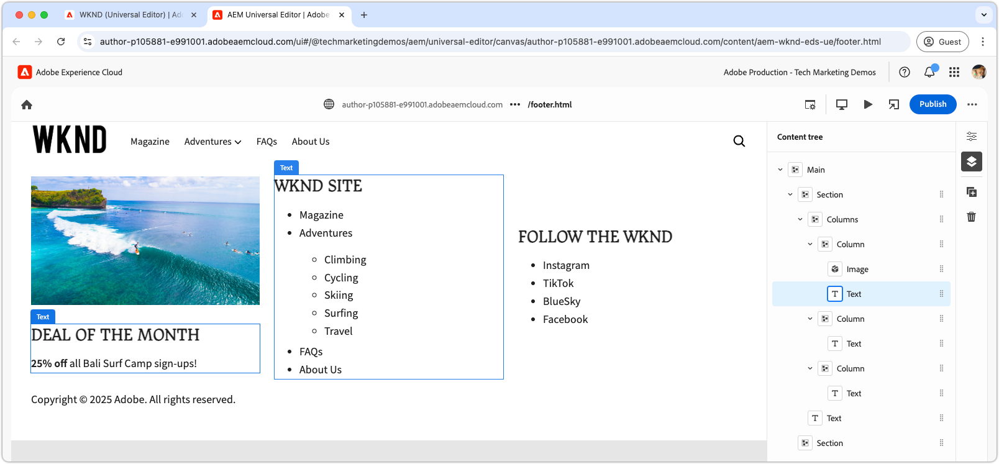

# Utveckla ett sidhuvud och en sidfot

{align="center"}

Sidhuvuden och sidfötter har en unik roll i Edge Delivery Services (EDS) eftersom de är bundna direkt till elementen `<header>` och `<footer>` i HTML. Till skillnad från vanligt sidinnehåll hanteras de separat och kan uppdateras separat utan att hela sidcachen behöver rensas. När implementeringen av dem finns i kodprojektet som block under `blocks/header` och `blocks/footer` kan författare redigera sitt innehåll via dedikerade AEM-sidor som kan innehålla valfri kombination av block.

## Huvudblock

{align="center"}

Rubriken är ett specialblock som är bundet till elementet `<header>` i Edge Delivery Services HTML.
Elementet `<header>` levereras tomt och fylls i via XHR (AJAX) till en separat AEM-sida.
Detta gör att sidhuvudet kan hanteras oberoende av sidinnehållet och uppdateras utan att alla sidor behöver tömmas helt.

Rubrikblocket ansvarar för att begära det AEM-sidfragment som innehåller rubrikinnehållet och återge det i elementet `<header>`.

[!BADGE /blocks/header/header.js]{type=Neutral tooltip="Filnamn på kodexemplet nedan."}

```javascript
import { getMetadata } from '../../scripts/aem.js';
import { loadFragment } from '../fragment/fragment.js';

...

export default async function decorate(block) {
  // load nav as fragment

  // Get the path to the AEM page fragment that defines the header content from the <meta name="nav"> tag. This is set via the site's Metadata file.
  const navMeta = getMetadata('nav');

  // If the navMeta is not defined, use the default path `/nav`.
  const navPath = navMeta ? new URL(navMeta, window.location).pathname : '/nav';

  // Make an XHR (AJAX) call to request the AEM page fragment and serialize it to a HTML DOM tree.
  const fragment = await loadFragment(navPath);
  
  // Add the content from the fragment HTML to the block and decorate it as needed
  ...
}
```

Funktionen `loadFragment()` gör en XHR-begäran (AJAX) till `${navPath}.plain.html` som returnerar en EDS HTML-återgivning av AEM-sidans HTML som finns i sidans `<main>` -tagg, bearbetar innehållet med eventuella block som den innehåller och returnerar det uppdaterade DOM-trädet.

## Skriv sidhuvudsidan

Innan du utvecklar rubrikblocket måste du först redigera innehållet i Universal Editor för att få något att utveckla mot.

Huvudinnehållet finns på en dedikerad AEM-sida med namnet `nav`.

{align="center"}

Så här skapar du sidhuvudet:

1. Öppna sidan `nav` i Universal Editor
1. Ersätt standardknappen med ett **bildblock** som innehåller WKND-logotypen
1. Uppdatera navigeringsmenyn i **textblocket** med:
   - Lägga till önskade navigeringslänkar
   - Skapa undernavigeringsobjekt där det behövs
   - Anger alla länkar till startsidan (`/`) för tillfället

{align="center"}

### Publicera för förhandsgranskning

Med sidhuvudssidan uppdaterad [publicerar du sidan för förhandsgranskning](../6-author-block.md).

Eftersom rubrikinnehållet finns på en egen sida (sidan `nav`) måste du publicera den sidan specifikt för att rubrikändringarna ska börja gälla. Om du publicerar andra sidor som använder sidhuvudet uppdateras inte sidhuvudsinnehållet på Edge Delivery Services.

## Blockera HTML

Börja med att granska DOM-strukturen som visas i Edge Delivery Services Preview när du vill börja skapa block. DOM har förbättrats med JavaScript och är formaterad med CSS, vilket ger grunden för att bygga och anpassa blocket.

Eftersom rubriken har lästs in som ett fragment måste vi granska den HTML som returneras av XHR-begäran efter att den har injicerats i DOM och dekorerats via `loadFragment()`. Detta kan du göra genom att inspektera DOM i webbläsarens utvecklingsverktyg.


>[!BEGINTABS]

>[!TAB DOM att dekorera]

Följande är rubriksidans HTML när den har lästs in med `header.js` och matats in i DOM:

```html
<header class="header-wrapper">
  <div class="header block" data-block-name="header" data-block-status="loaded">
    <div class="nav-wrapper">
      <nav id="nav" aria-expanded="true">
        <div class="nav-hamburger">
          <button type="button" aria-controls="nav" aria-label="Close navigation">
            <span class="nav-hamburger-icon"></span>
          </button>
        </div>
        <div class="section nav-brand" data-section-status="loaded" style="">
          <div class="default-content-wrapper">
            <p class="">
              <a href="#" title="Button" class="">Button</a>
            </p>
          </div>
        </div>
        <div class="section nav-sections" data-section-status="loaded" style="">
          <div class="default-content-wrapper">
            <ul>
              <li aria-expanded="false">Examples</li>
              <li aria-expanded="false">Getting Started</li>
              <li aria-expanded="false">Documentation</li>
            </ul>
          </div>
        </div>
        <div class="section nav-tools" data-section-status="loaded" style="">
          <div class="default-content-wrapper">
            <p>
              <span class="icon icon-search">
                
              </span>
            </p>
          </div>
        </div>
      </nav>
    </div>
  </div>
</header>
```

>[!TAB Hitta DOM]

Om du vill söka efter och inspektera sidans `<header>`-element i webbläsarens utvecklarverktyg.

{align="center"}

>[!ENDTABS]


## Blockera JavaScript

Filen `/blocks/header/header.js` från [AEM-mallen XWalk &#x200B;](https://github.com/adobe-rnd/aem-boilerplate-xwalk) innehåller JavaScript för navigering, inklusive listrutor och en responsiv mobilvy.

Skriptet `header.js` är ofta mycket anpassat för att matcha en webbplats design, men det är viktigt att behålla de första raderna i `decorate()` som hämtar och bearbetar sidhuvudsfragmentet.

[!BADGE /blocks/header/header.js]{type=Neutral tooltip="Filnamn på kodexemplet nedan."}

```javascript
export default async function decorate(block) {
  // load nav as fragment
  const navMeta = getMetadata('nav');
  const navPath = navMeta ? new URL(navMeta, window.location).pathname : '/nav';
  const fragment = await loadFragment(navPath);
  ...
```

Den återstående koden kan ändras för att passa projektets behov.

Beroende på rubrikkraven kan mallkoden justeras eller tas bort. I den här självstudiekursen ska vi använda den angivna koden och förbättra den genom att lägga till en hyperlänk runt den första skapade bilden som länkar den till webbplatsens hemsida.

Mallens kod bearbetar sidhuvudsfragmentet, förutsatt att det består av tre avsnitt i följande ordning:

1. **Varumärkessektion** - Innehåller logotypen och är formaterad med klassen `.nav-brand`.
2. **Avsnitt** - Definierar platsens huvudmeny och är formaterad med `.nav-sections`.
3. **Verktygsavsnittet** - Innehåller element som sökning, inloggning/utloggning och profil, formaterade med `.nav-tools`.

För att hyperlänka logotypbilden till startsidan uppdaterar vi blocket JavaScript enligt följande:

>[!BEGINTABS]

>[!TAB Uppdaterad JavaScript]

Den uppdaterade koden som omsluter logotypbilden med en länk till webbplatsens hemsida (`/`) visas nedan:

[!BADGE /blocks/header/header.js]{type=Neutral tooltip="Filnamn på kodexemplet nedan."}

```javascript
export default async function decorate(block) {

  ...
  const navBrand = nav.querySelector('.nav-brand');
  
  // WKND: Turn the picture (image) into a linked site logo
  const logo = navBrand.querySelector('picture');
  
  if (logo) {
    // Replace the first section's contents with the authored image wrapped with a link to '/' 
    navBrand.innerHTML = `<a href="/" aria-label="Home" title="Home" class="home">${logo.outerHTML}</a>`;
    // Make sure the logo is not lazy loaded as it's above the fold and can affect page load speed
    navBrand.querySelector('img').settAttribute('loading', 'eager');
  }

  const navSections = nav.querySelector('.nav-sections');
  if (navSections) {
    // WKND: Remove Edge Delivery Services button containers and buttons from the nav sections links
    navSections.querySelectorAll('.button-container, .button').forEach((button) => {
      button.classList = '';
    });

    ...
  }
  ...
}
```

>[!TAB Ursprunglig JavaScript]

Nedan visas originalet `header.js` som genererats från mallen:

[!BADGE /blocks/header/header.js]{type=Neutral tooltip="Filnamn på kodexemplet nedan."}

```javascript
export default async function decorate(block) {
  ...
  const navBrand = nav.querySelector('.nav-brand');
  const brandLink = navBrand.querySelector('.button');
  if (brandLink) {
    brandLink.className = '';
    brandLink.closest('.button-container').className = '';
  }

  const navSections = nav.querySelector('.nav-sections');
  if (navSections) {
    navSections.querySelectorAll(':scope .default-content-wrapper > ul > li').forEach((navSection) => {
      if (navSection.querySelector('ul')) navSection.classList.add('nav-drop');
      navSection.addEventListener('click', () => {
        if (isDesktop.matches) {
          const expanded = navSection.getAttribute('aria-expanded') === 'true';
          toggleAllNavSections(navSections);
          navSection.setAttribute('aria-expanded', expanded ? 'false' : 'true');
        }
      });
    });
  }
  ...
}
```

>[!ENDTABS]


## Blockera CSS

Uppdatera `/blocks/header/header.css` så att den formateras enligt WKND:s varumärke.

Vi kommer att lägga till anpassad CSS längst ned i `header.css` för att göra självstudieändringarna enklare att se och förstå. Dessa format kan integreras direkt i mallens CSS-regler, men om du håller dem åtskilda blir det lättare att illustrera vad som har ändrats.

Eftersom vi lägger till våra nya regler efter den ursprungliga uppsättningen, omsluter vi dem med en `header .header.block nav` CSS-väljare för att säkerställa att de har företräde framför mallreglerna.

[!BADGE /blocks/header/header.css]{type=Neutral tooltip="Filnamn på kodexemplet nedan."}

```css
/* /blocks/header/header.css */

... Existing CSS generated by the template ...

/* Add the following CSS to the end of the header.css */

/** 
* WKND customizations to the header 
* 
* These overrides can be incorporated into the provided CSS,
* however they are included discretely in thus tutorial for clarity and ease of addition.
* 
* Because these are added discretely
* - They are added to the bottom to override previous styles.
* - They are wrapped in a header .header.block nav selector to ensure they have more specificity than the provided CSS.
* 
**/

header .header.block nav {
  /* Set the height of the logo image.
     Chrome natively sets the width based on the images aspect ratio */
  .nav-brand img {
    height: calc(var(--nav-height) * .75);
    width: auto;
    margin-top: 5px;
  }
  
  .nav-sections {
    /* Update menu items display properties */
    a {
      text-transform: uppercase;
      background-color: transparent;
      color: var(--text-color);
      font-weight: 500;
      font-size: var(--body-font-size-s);
    
      &:hover {
        background-color: auto;
      }
    }

    /* Adjust some spacing and positioning of the dropdown nav */
    .nav-drop {
      &::after {
        transform: translateY(-50%) rotate(135deg);
      }
      
      &[aria-expanded='true']::after {
        transform: translateY(50%) rotate(-45deg);
      }

      & > ul {
        top: 2rem;
        left: -1rem;      
       }
    }
  }
```

## Förhandsgranskning av utveckling

I takt med att CSS och JavaScript utvecklas laddar AEM CLI:s lokala utvecklingsmiljö upp ändringarna på nytt, vilket gör att man snabbt och enkelt kan se hur koden påverkar blocket. Håll muspekaren över CTA och kontrollera att suddgummits bild zoomar in och ut.

{align="center"}

## Begränsa koden

[Lint](../3-local-development-environment.md#linting)-kodändringar görs ofta för att hålla koden ren och konsekvent. Regelbunden linting hjälper till att fånga upp problem tidigt och minskar den totala utvecklingstiden. Kom ihåg att du inte kan sammanfoga ditt utvecklingsarbete i grenen `main` förrän alla lintingproblem har lösts.

```bash
# ~/Code/aem-wknd-eds-ue

$ npm run lint
```

## Förhandsgranska i Universal Editor

Om du vill visa ändringar i AEM Universal Editor lägger du till, bekräftar och överför dem till Git-databasgrenen som används av den universella redigeraren. Detta säkerställer att blockimplementeringen inte stör redigeringsupplevelsen.

```bash
# ~/Code/aem-wknd-eds-ue

$ git add .
$ git commit -m "CSS and JavaScript implementation for Header block"
# JSON files are compiled automatically and added to the commit via a Husky pre-commit hook
$ git push origin header-and-footer
```

Ändringarna visas nu i Universal Editor när frågeparametern `?ref=header-and-footer` används.

{align="center"}

## Sidfot

Precis som sidhuvudet skapas sidfotsinnehållet på en dedikerad AEM-sida, i det här fallet sidfotssidan (`footer`). Sidfoten följer samma mönster som när den läses in som ett fragment och dekoreras med CSS och JavaScript.

>[!BEGINTABS]

>[!TAB Sidfot]

Sidfoten ska implementeras med en layout med tre kolumner som innehåller:

- En vänsterkolumn med en befordran (bild och text)
- En mittenkolumn med navigeringslänkar
- En högerkolumn med länkar för sociala medier
- En rad längst ned som sträcker sig över alla tre kolumnerna med copyrightinformation

{align="center"}

>[!TAB Sidfotsinnehåll]

Använd kolumnblock på sidfotssidan för att skapa effekten med tre kolumner.

| Kolumn 1 | Kolumn 2 | Kolumn 3 |
| ---------|----------------|---------------|
| Bild | Rubrik 3 | Rubrik 3 |
| Text | Länklista | Länklista |

{align="center"}

>[!TAB Sidfotskod]

CSS nedan formaterar sidfotsblocket med en layout med tre kolumner, konsekvent avstånd och typografi. Vid sidfotsimplementeringen används bara den JavaScript som finns i mallen.

[!BADGE /blocks/footer/footer.css]{type=Neutral tooltip="Filnamn på kodexemplet nedan."}

```css
/* /blocks/footer/footer.css */

footer {
  background-color: var(--light-color);

  .block.footer {
    border-top: solid 1px var(--dark-color);
    font-size: var(--body-font-size-s);

    a { 
      all: unset;
      
      &:hover {
        text-decoration: underline;
        cursor: pointer;
      }
    }

    img {
      width: 100%;
      height: 100%;
      object-fit: cover;
      border: solid 1px white;
    }

    p {
      margin: 0;
    }

    ul {
      list-style: none;
      padding: 0;
      margin: 0;

      li {
        padding-left: .5rem;
      }
    }

    & > div {
      margin: auto;
      max-width: 1200px;
    }

    .columns > div {
      gap: 5rem;
      align-items: flex-start;

      & > div:first-child {
        flex: 2;
      }
    }

    .default-content-wrapper {
      padding-top: 2rem;
      margin-top: 2rem;
      font-style: italic;
      text-align: right;
    }
  }
}

@media (width >= 900px) {
  footer .block.footer > div {
    padding: 40px 32px 24px;
  }
}
```


>[!ENDTABS]

## Grattis!

Nu har du utforskat hur sidhuvuden och sidfötter hanteras och utvecklas i Edge Delivery Services och Universal Editor. Du har lärt dig hur de är:

- Skapat på dedikerade AEM-sidor som skiljer sig från huvudinnehållet
- Inläst asynkront som fragment för att aktivera oberoende uppdateringar
- Dekorerat med JavaScript och CSS för att skapa responsiva navigeringsupplevelser
- Integrerat smidigt med den universella redigeraren för enkel innehållshantering

Det här mönstret är ett flexibelt och enkelt sätt att implementera webbplatsomfattande navigeringskomponenter.

Mer metodtips och avancerade tekniker finns i [dokumentationen för den universella redigeraren](https://experienceleague.adobe.com/sv/docs/experience-manager-cloud-service/content/edge-delivery/wysiwyg-authoring/create-block#block-options).
