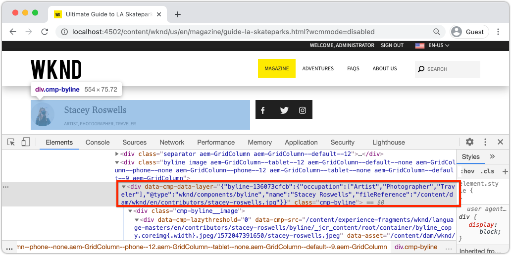
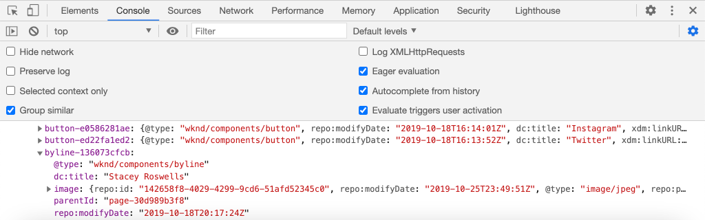

# Anpassa Adobe-klientdatalagret med AEM {#customize-data-layer}

Lär dig hur du anpassar datalagret för klienten i Adobe med innehåll från anpassade AEM. Lär dig hur du använder API:er från [AEM Core Components to extend](https://experienceleague.adobe.com/docs/experience-manager-core-components/using/developing/data-layer/extending.html) och anpassa datalagret.

## Vad du ska bygga



I den här självstudiekursen ska vi utforska olika alternativ för att utöka datalagret för klienten i Adobe genom att uppdatera WKND [Byline-komponent](https://experienceleague.adobe.com/docs/experience-manager-learn/getting-started-wknd-tutorial-develop/project-archetype/custom-component.html). The _Byline_ är en **anpassad komponent** och lektioner som du lär dig i den här självstudiekursen kan användas i andra anpassade komponenter.

### Mål {#objective}

1. Mata in komponentdata i datalagret genom att utöka en Sling-modell och komponent-HTML
1. Använd Core Component Data Layer-verktyg för att minska arbetsinsatsen
1. Använd Core Component-dataattribut för att knyta till befintliga datalagerhändelser

## Förutsättningar {#prerequisites}

A **lokal utvecklingsmiljö** är nödvändigt för att slutföra den här självstudien. Skärmbilder och video hämtas med AEM as a Cloud Service SDK som körs på en macOS. Kommandon och kod är oberoende av det lokala operativsystemet om inget annat anges.

**Är du inte AEM as a Cloud Service?** Kolla in [följa guiden för att konfigurera en lokal utvecklingsmiljö med AEM as a Cloud Service SDK](https://experienceleague.adobe.com/docs/experience-manager-learn/cloud-service/local-development-environment-set-up/overview.html).

**Har du inte använt AEM 6.5 tidigare?** Kolla in [följa guiden för att konfigurera en lokal utvecklingsmiljö](https://experienceleague.adobe.com/docs/experience-manager-learn/foundation/development/set-up-a-local-aem-development-environment.html).

## Hämta och distribuera WKND Reference-webbplatsen {#set-up-wknd-site}

Den här självstudien utökar Byline-komponenten på WKND-referensplatsen. Klona och installera WKND-kodbasen i din lokala miljö.

1. Starta en lokal snabbstart **författare** instans av AEM som körs vid [http://localhost:4502](http://localhost:4502).
1. Öppna ett terminalfönster och klona WKND-kodbasen med Git:

   ```shell
   $ git clone git@github.com:adobe/aem-guides-wknd.git
   ```

1. Distribuera WKND-kodbasen till en lokal instans av AEM:

   ```shell
   $ cd aem-guides-wknd
   $ mvn clean install -PautoInstallSinglePackage
   ```

   >[!NOTE]
   >
   > För AEM 6.5 och senaste Service Pack lägger du till `classic` profil till kommandot Maven:
   >
   > `mvn clean install -PautoInstallSinglePackage -Pclassic`

1. Öppna ett nytt webbläsarfönster och logga in på AEM. Öppna en **Magazine** sida som: [http://localhost:4502/content/wknd/us/en/magazine/guide-la-skateparks.html](http://localhost:4502/content/wknd/us/en/magazine/guide-la-skateparks.html).

   

   Du bör se ett exempel på den Byline-komponent som har lagts till på sidan som en del av ett Experience Fragment. Du kan visa Experience Fragment på [http://localhost:4502/editor.html/content/experience-fragments/wknd/language-masters/en/contributors/stacey-roswells/byline.html](http://localhost:4502/editor.html/content/experience-fragments/wknd/language-masters/en/contributors/stacey-roswells/byline.html)
1. Öppna utvecklingsverktygen och ange följande kommando i **Konsol**:

   ```js
   window.adobeDataLayer.getState();
   ```

   Om du vill se det aktuella läget för datalagret på en AEM plats kontrollerar du svaret. Du bör se information om sidan och enskilda komponenter.

   

   Observera att komponenten Byline inte finns med i datalagret.

## Uppdatera modellen Byline Sling {#sling-model}

Om du vill mata in data om komponenten i datalagret uppdaterar vi först komponentens Sling Model. Uppdatera sedan Bylines Java™-gränssnitt och Sling Model-implementering till en ny metod `getData()`. Den här metoden innehåller de egenskaper som ska injiceras i datalagret.

1. Öppna `aem-guides-wknd` -projektet i den utvecklingsmiljö du vill. Navigera till `core` -modul.
1. Öppna filen `Byline.java` på `core/src/main/java/com/adobe/aem/guides/wknd/core/models/Byline.java`.

   

1. Lägg till nedanstående metod i gränssnittet:

   ```java
   public interface Byline {
       ...
       /***
        * Return data about the Byline Component to populate the data layer
        * @return String
        */
       String getData();
   }
   ```

1. Öppna filen `BylineImpl.java` på `core/src/main/java/com/adobe/aem/guides/wknd/core/models/impl/BylineImpl.java`. Det är genomförandet av `Byline` och implementeras som en Sling-modell.

1. Lägg till följande importsatser i början av filen:

   ```java
   import java.util.HashMap;
   import java.util.Map;
   import org.apache.sling.api.resource.Resource;
   import com.fasterxml.jackson.core.JsonProcessingException;
   import com.fasterxml.jackson.databind.ObjectMapper;
   import com.adobe.cq.wcm.core.components.util.ComponentUtils;
   ```

   The `fasterxml.jackson` API:er används för att serialisera data som ska visas som JSON. The `ComponentUtils` AEM kärnkomponenter används för att kontrollera om datalagret är aktiverat.

1. Lägg till den oimplementerade metoden `getData()` till `BylineImple.java`:

   ```java
   public class BylineImpl implements Byline {
       ...
       @Override
       public String getData() {
           Resource bylineResource = this.request.getResource();
           // Use ComponentUtils to verify if the DataLayer is enabled
           if (ComponentUtils.isDataLayerEnabled(bylineResource)) {
   
               //Create a map of properties we want to expose
               Map<String, Object> bylineProperties = new HashMap<String,Object>();
               bylineProperties.put("@type", bylineResource.getResourceType());
               bylineProperties.put("name", this.getName());
               bylineProperties.put("occupation", this.getOccupations());
               bylineProperties.put("fileReference", image.getFileReference());
   
               //Use AEM Core Component utils to get a unique identifier for the Byline component (in case multiple are on the page)
               String bylineComponentID = ComponentUtils.getId(bylineResource, this.currentPage, this.componentContext);
   
               // Return the bylineProperties as a JSON String with a key of the bylineResource's ID
               try {
                   return String.format("{\"%s\":%s}",
                       bylineComponentID,
                       // Use the ObjectMapper to serialize the bylineProperties to a JSON string
                       new ObjectMapper().writeValueAsString(bylineProperties));
               } catch (JsonProcessingException e) {
   
                   LOGGER.error("Unable to generate dataLayer JSON string", e);
               }
   
           }
           // return null if the Data Layer is not enabled
           return null;
       }
   }
   ```

   I ovanstående metod finns en ny `HashMap` används för att hämta de egenskaper som ska visas som JSON. Observera att befintliga metoder som `getName()` och `getOccupations()` används. The `@type` representerar komponentens unika resurstyp, så att klienten enkelt kan identifiera händelser och/eller utlösare baserat på komponenttypen.

   The `ObjectMapper` används för att serialisera egenskaperna och returnera en JSON-sträng. Denna JSON-sträng kan sedan infogas i datalagret.

1. Öppna ett terminalfönster. Bygg och driftsätt endast `core` för att använda dina Maven-kunskaper:

   ```shell
   $ cd aem-guides-wknd/core
   $ mvn clean install -PautoInstallBundle
   ```

## Uppdatera Byline-HTML {#htl}

Uppdatera sedan `Byline` [HTL](https://experienceleague.adobe.com/docs/experience-manager-htl/content/specification.html?lang=en). HTML (HTML Template Language) är den mall som används för att återge komponentens HTML.

Ett särskilt dataattribut `data-cmp-data-layer` på varje AEM används för att visa sitt datalager. JavaScript från AEM Core Components söker efter det här dataattributet. Värdet för det här dataattributet fylls i med JSON-strängen som returneras av Byline Sling-modellens `getData()` och injiceras i Adobe Client Data-lagret.

1. Öppna `aem-guides-wknd` projektet i utvecklingsmiljön. Navigera till `ui.apps` -modul.
1. Öppna filen `byline.html` på `ui.apps/src/main/content/jcr_root/apps/wknd/components/byline/byline.html`.

   

1. Uppdatera `byline.html` som innehåller `data-cmp-data-layer` attribute:

   ```diff
     <div data-sly-use.byline="com.adobe.aem.guides.wknd.core.models.Byline"
       data-sly-use.placeholderTemplate="core/wcm/components/commons/v1/templates.html"
       data-sly-test.hasContent="${!byline.empty}"
   +   data-cmp-data-layer="${byline.data}"
       class="cmp-byline">
       ...
   ```

   Värdet för `data-cmp-data-layer` har angetts till `"${byline.data}"` där `byline` är Sling Model som uppdaterades tidigare. `.data` är standardnoteringen för anrop av Java™ Getter-metoden i HTML av `getData()` som genomförts i föregående övning.

1. Öppna ett terminalfönster. Bygg och driftsätt endast `ui.apps` för att använda dina Maven-kunskaper:

   ```shell
   $ cd aem-guides-wknd/ui.apps
   $ mvn clean install -PautoInstallPackage
   ```

1. Återgå till webbläsaren och öppna sidan igen med en Byline-komponent: [http://localhost:4502/content/wknd/us/en/magazine/guide-la-skateparks.html](http://localhost:4502/content/wknd/us/en/magazine/guide-la-skateparks.html).

1. Öppna utvecklingsverktygen och kontrollera HTML-källan för sidan för att se om det finns en Byline-komponent:

   

   Du borde se att `data-cmp-data-layer` har fyllts i med JSON-strängen från Sling-modellen.

1. Öppna webbläsarens utvecklarverktyg och skriv följande kommando i **Konsol**:

   ```js
   window.adobeDataLayer.getState();
   ```

1. Navigera under svaret under `component` för att hitta instansen av `byline` har lagts till i datalagret:

   

   Du bör se ett inlägg som följande:

   ```json
   byline-136073cfcb:
       @type: "wknd/components/byline"
       fileReference: "/content/dam/wknd/en/contributors/stacey-roswells.jpg"
       name: "Stacey Roswells"
       occupation: (3) ["Artist", "Photographer", "Traveler"]
       parentId: "page-30d989b3f8"
   ```

   Observera att de egenskaper som visas är samma som läggs till i `HashMap` i Sling Model.

## Lägg till en klickningshändelse {#click-event}

Adobe-klientdatalagret är händelsestyrt och en av de vanligaste händelserna som utlöser en åtgärd är `cmp:click` -händelse. AEM Core-komponenterna gör det här enkelt att registrera komponenten med hjälp av dataelementet: `data-cmp-clickable`.

Klickbara element är vanligtvis en CTA-knapp eller en navigeringslänk. Tyvärr har inte komponenten Byline någon av dessa men vi måste registrera den ändå eftersom det kan vara vanligt för andra anpassade komponenter.

1. Öppna `ui.apps` i din IDE
1. Öppna filen `byline.html` på `ui.apps/src/main/content/jcr_root/apps/wknd/components/byline/byline.html`.

1. Uppdatera `byline.html` som innehåller `data-cmp-clickable` på Bylines **name** element:

   ```diff
     <h2 class="cmp-byline__name" 
   +    data-cmp-clickable="${byline.data ? true : false}">
        ${byline.name}
     </h2>
   ```

1. Öppna en ny terminal. Bygg och driftsätt endast `ui.apps` för att använda dina Maven-kunskaper:

   ```shell
   $ cd aem-guides-wknd/ui.apps
   $ mvn clean install -PautoInstallPackage
   ```

1. Gå tillbaka till webbläsaren och öppna sidan igen med komponenten Byline tillagd: [http://localhost:4502/content/wknd/us/en/magazine/guide-la-skateparks.html](http://localhost:4502/content/wknd/us/en/magazine/guide-la-skateparks.html).

   För att testa vår händelse lägger vi till JavaScript manuellt med hjälp av utvecklarkonsolen. Se [Använda Adobe-klientdatalagret med AEM kärnkomponenter](data-layer-overview.md) om du vill se en video om hur du gör detta.

1. Öppna webbläsarens utvecklarverktyg och ange följande metod i dialogrutan **Konsol**:

   ```javascript
   function bylineClickHandler(event) {
       var dataObject = window.adobeDataLayer.getState(event.eventInfo.path);
       if (dataObject != null && dataObject['@type'] === 'wknd/components/byline') {
           console.log("Byline Clicked!");
           console.log("Byline name: " + dataObject['name']);
       }
   }
   ```

   Den här enkla metoden bör hantera klickningen på namnet på komponenten Byline.

1. Ange följande metod i dialogrutan **Konsol**:

   ```javascript
   window.adobeDataLayer.push(function (dl) {
        dl.addEventListener("cmp:click", bylineClickHandler);
   });
   ```

   Ovanstående metod överför en händelseavlyssnare till datalagret för att avlyssna `cmp:click` och anropar `bylineClickHandler`.

   >[!CAUTION]
   >
   > Det är viktigt **not** om du vill uppdatera webbläsaren under övningen, annars försvinner konsolens JavaScript.

1. I webbläsaren med **Konsol** öppna klickar du på författarens namn i Byline-komponenten:

   

   Du bör se konsolmeddelandet `Byline Clicked!` och namnet på Byline.

   The `cmp:click` -händelsen är den enklaste att koppla in sig i. För mer komplexa komponenter och för att spåra andra beteenden är det möjligt att lägga till anpassad JavaScript för att lägga till och registrera nya händelser. Ett bra exempel är Carousel-komponenten som utlöser en `cmp:show` händelse när en bildruta växlas. Se [källkod för mer information](https://github.com/adobe/aem-core-wcm-components/blob/main/content/src/content/jcr_root/apps/core/wcm/components/carousel/v1/carousel/clientlibs/site/js/carousel.js).

## Använda verktyget DataLayerBuilder {#data-layer-builder}

När Sling Model var [uppdaterad](#sling-model) tidigare i kapitlet valde vi att skapa JSON-strängen med en `HashMap` och ange varje egenskap manuellt. Den här metoden fungerar bra för små engångskomponenter, men för komponenter som utökar AEM Core Components kan det resultera i mycket extra kod.

En verktygsklass, `DataLayerBuilder`, finns för att utföra större delen av grovjobbet. Detta gör att implementeringar kan utöka bara de egenskaper de vill ha. Vi uppdaterar Sling-modellen så att den använder `DataLayerBuilder`.

1. Återgå till utvecklingsmiljön och navigera till `core` -modul.
1. Öppna filen `Byline.java` på `core/src/main/java/com/adobe/aem/guides/wknd/core/models/Byline.java`.
1. Ändra `getData()` metod för att returnera en typ av `ComponentData`

   ```java
   import com.adobe.cq.wcm.core.components.models.datalayer.ComponentData;
   ...
   public interface Byline {
       ...
       /***
        * Return data about the Byline Component to populate the data layer
        * @return ComponentData
        */
       ComponentData getData();
   }
   ```

   `ComponentData` är ett objekt som tillhandahålls av AEM kärnkomponenter. Det resulterar i en JSON-sträng, precis som i det föregående exemplet, men utför även en hel del extraarbete.

1. Öppna filen `BylineImpl.java` på `core/src/main/java/com/adobe/aem/guides/wknd/core/models/impl/BylineImpl.java`.

1. Lägg till följande importsatser:

   ```java
   import com.adobe.cq.wcm.core.components.models.datalayer.ComponentData;
   import com.adobe.cq.wcm.core.components.models.datalayer.builder.DataLayerBuilder;
   ```

1. Ersätt `getData()` metod med följande:

   ```java
   @Override
   public ComponentData getData() {
       Resource bylineResource = this.request.getResource();
       // Use ComponentUtils to verify if the DataLayer is enabled
       if (ComponentUtils.isDataLayerEnabled(bylineResource)) {
   
           return DataLayerBuilder.extending(getImage().getData()).asImageComponent()
               .withTitle(this::getName)
               .build();
   
       }
       // return null if the Data Layer is not enabled
       return null;
   }
   ```

   Komponenten Byline återanvänder delar av Image Core Component för att visa en bild som representerar författaren. I ovanstående utdrag visas [DataLayerBuilder](https://javadoc.io/doc/com.adobe.cq/core.wcm.components.core/latest/com/adobe/cq/wcm/core/components/models/datalayer/builder/ComponentDataBuilder.html) används för att utöka datalagret i `Image` -komponenten. JSON-objektet fylls i automatiskt med alla data om bilden som används. Den utför även en del rutinfunktioner som att ställa in `@type` och komponentens unika identifierare. Observera att metoden är liten!

   Den enda egenskapen som utökade `withTitle` som ersätts med värdet för `getName()`.

1. Öppna ett terminalfönster. Bygg och driftsätt endast `core` för att använda dina Maven-kunskaper:

   ```shell
   $ cd aem-guides-wknd/core
   $ mvn clean install -PautoInstallBundle
   ```

1. Återgå till utvecklingsmiljön och öppna `byline.html` fil under `ui.apps`
1. Uppdatera den HTML som ska användas `byline.data.json` för att fylla `data-cmp-data-layer` attribute:

   ```diff
     <div data-sly-use.byline="com.adobe.aem.guides.wknd.core.models.Byline"
       data-sly-use.placeholderTemplate="core/wcm/components/commons/v1/templates.html"
       data-sly-test.hasContent="${!byline.empty}"
   -   data-cmp-data-layer="${byline.data}"
   +   data-cmp-data-layer="${byline.data.json}"
   ```

   Kom ihåg att vi nu returnerar ett objekt av typen `ComponentData`. Det här objektet innehåller en get-metod `getJson()` och detta används för att fylla i `data-cmp-data-layer` -attribut.

1. Öppna ett terminalfönster. Bygg och driftsätt endast `ui.apps` för att använda dina Maven-kunskaper:

   ```shell
   $ cd aem-guides-wknd/ui.apps
   $ mvn clean install -PautoInstallPackage
   ```

1. Gå tillbaka till webbläsaren och öppna sidan igen med komponenten Byline tillagd: [http://localhost:4502/content/wknd/us/en/magazine/guide-la-skateparks.html](http://localhost:4502/content/wknd/us/en/magazine/guide-la-skateparks.html).
1. Öppna webbläsarens utvecklarverktyg och skriv följande kommando i **Konsol**:

   ```js
   window.adobeDataLayer.getState();
   ```

1. Navigera under svaret under `component` för att hitta instansen av `byline` komponent:

   

   Du bör se ett inlägg som följande:

   ```json
   byline-136073cfcb:
       @type: "wknd/components/byline"
       dc:title: "Stacey Roswells"
       image:
           @type: "image/jpeg"
           repo:id: "142658f8-4029-4299-9cd6-51afd52345c0"
           repo:modifyDate: "2019-10-25T23:49:51Z"
           repo:path: "/content/dam/wknd/en/contributors/stacey-roswells.jpg"
           xdm:tags: []
       parentId: "page-30d989b3f8"
       repo:modifyDate: "2019-10-18T20:17:24Z"
   ```

   Observera att det nu finns en `image` objekt inuti `byline` komponentpost. Här finns mycket mer information om resursen i DAM. Observera även att `@type` och det unika ID:t (i det här fallet `byline-136073cfcb`) har fyllts i automatiskt och `repo:modifyDate` som anger när komponenten ändrades.

## Ytterligare exempel {#additional-examples}

1. Ett annat exempel på hur du utökar datalagret kan visas genom att undersöka `ImageList` i WKND-kodbasen:
   * `ImageList.java` - Java i `core` -modul.
   * `ImageListImpl.java` - Sling Model i `core` -modul.
   * `image-list.html` - HTML-mall i `ui.apps` -modul.

   >[!NOTE]
   >
   > Det är lite svårare att ta med anpassade egenskaper som `occupation` när du använder [DataLayerBuilder](https://javadoc.io/doc/com.adobe.cq/core.wcm.components.core/latest/com/adobe/cq/wcm/core/components/models/datalayer/builder/ComponentDataBuilder.html). Men om du utökar en Core-komponent som innehåller en bild eller sida sparar verktyget mycket tid.

   >[!NOTE]
   >
   > Om du skapar ett avancerat datalager för objekt som återanvänds under en implementering bör du extrahera datalagrets element till deras egna datalagerspecifika Java™-objekt. Commerce Core Components har till exempel lagt till gränssnitt för `ProductData` och `CategoryData` eftersom dessa kan användas i många komponenter i en Commerce-implementering. Granska [koden i aem-cif-core-components repo](https://github.com/adobe/aem-core-cif-components/tree/master/bundles/core/src/main/java/com/adobe/cq/commerce/core/components/datalayer) för mer information.

## Grattis! {#congratulations}

Du har utforskat några sätt att utöka och anpassa datalagret för klienten i Adobe med AEM komponenter!

## Ytterligare resurser {#additional-resources}

* [Dokumentation för Adobe-klientdatalager](https://github.com/adobe/adobe-client-data-layer/wiki)
* [Datalagerintegrering med kärnkomponenterna](https://github.com/adobe/aem-core-wcm-components/blob/main/DATA_LAYER_INTEGRATION.md)
* [Använda Adobe Client Data Layer och Core Components Documentation](https://experienceleague.adobe.com/docs/experience-manager-core-components/using/developing/data-layer/overview.html)
