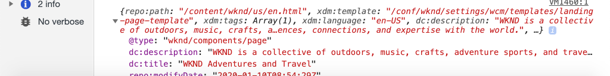

# Använda Adobe-klientdatalagret med AEM kärnkomponenter {#overview}

Adobe-klientdatalagret innehåller en standardmetod för att samla in och lagra data om en besökares upplevelse på en webbsida och sedan göra det enkelt att komma åt dessa data. Adobe Client Data Layer är plattformsoberoende, men är helt integrerad i de centrala komponenterna för användning med AEM.

>[!VIDEO](https://video.tv.adobe.com/v/41195?quality=12&learn=on)

>[!NOTE]
>
> Vill du aktivera Adobe-klientdatalagret på AEM? [Se instruktionerna här](https://experienceleague.adobe.com/docs/experience-manager-core-components/using/developing/data-layer/overview.html?lang=sv-SE#installation-activation).

## Utforska datalagret

Du kan få en uppfattning om de inbyggda funktionerna i Adobe Client Data Layer genom att bara använda utvecklarverktygen i din webbläsare och den aktiva [WKND-referenswebbplatsen](https://wknd.site/us/en.html).

>[!NOTE]
>
> Skärmbilder nedan tagna från Chrome webbläsare.

1. Navigera till [https://wknd.site/us/en.html](https://wknd.site/us/en.html)
1. Öppna dina utvecklarverktyg och ange följande kommando i **konsolen**:

   ```js
   window.adobeDataLayer.getState();
   ```

   Om du vill se det aktuella läget för datalagret på en AEM plats kontrollerar du svaret. Du bör se information om sidan och enskilda komponenter.

   

1. Skicka ett dataobjekt till datalagret genom att ange följande i konsolen:

   ```js
   window.adobeDataLayer.push({
       "component": {
           "training-data": {
               "title": "Learn More",
               "link": "learn-more.html"
           }
       }
   });
   ```

1. Kör kommandot `adobeDataLayer.getState()` igen och hitta posten för `training-data`.
1. Lägg sedan till en path-parameter som returnerar bara ett specifikt läge för en komponent:

   ```js
   window.adobeDataLayer.getState('component.training-data');
   ```

   

## Arbeta med händelser

Det är bäst att utlösa en anpassad kod som baseras på en händelse från datalagret. Sedan kan du utforska registrering och avlyssning av olika händelser.

1. Ange följande hjälpmetod i konsolen:

   ```js
   function getDataObjectHelper(event, filter) {
       if (event.hasOwnProperty("eventInfo") && event.eventInfo.hasOwnProperty("path")) {
           var dataObject = window.adobeDataLayer.getState(event.eventInfo.path);
           if (dataObject != null) {
               for (var property in filter) {
                   if (!dataObject.hasOwnProperty(property) || (filter[property] !== null && filter[property] !== dataObject[property])) {
                       return;
                   }
                   return dataObject;
               }
           }
       }
       return;
   }
   ```

   Ovanstående kod inspekterar objektet `event` och använder metoden `adobeDataLayer.getState` för att hämta det aktuella läget för objektet som utlöste händelsen. Hjälpmetoden undersöker sedan `filter` och bara om den aktuella `dataObject` uppfyller filtervillkoren som returneras.

   >[!CAUTION]
   >
   > Det är viktigt **inte** att uppdatera webbläsaren under övningen, annars försvinner konsolen JavaScript.

1. Ange sedan en händelsehanterare som anropas när en **Teaser** -komponent visas i en **Carousel** .

   ```js
   function teaserShownHandler(event) {
       var dataObject = getDataObjectHelper(event, {"@type": "wknd/components/carousel/item"});
       if(dataObject != null) {
           console.log("Teaser Shown: " + dataObject['dc:title']);
           console.log(dataObject);
       }
   }
   ```

   Funktionen `teaserShownHandler` anropar funktionen `getDataObjectHelper` och skickar ett filter av `wknd/components/carousel/item` som `@type` för att filtrera bort händelser som utlösts av andra komponenter.

1. Därefter skickar du en händelseavlyssnare till datalagret för att avlyssna händelsen `cmp:show`.

   ```js
   window.adobeDataLayer.push(function (dl) {
        dl.addEventListener("cmp:show", teaserShownHandler);
   });
   ```

   Händelsen `cmp:show` aktiveras av många olika komponenter, som när en ny bildruta visas i **Carousel** eller när en ny flik väljs i komponenten **Tab**.

1. På sidan växlar du på karusellbildrutorna och följer konsolsatserna:

   

1. Om du vill sluta lyssna efter händelsen `cmp:show` tar du bort händelseavlyssnaren från datalagret

   ```js
   window.adobeDataLayer = window.adobeDataLayer || [];
   window.adobeDataLayer.push(function(dl) {
       dl.removeEventListener("cmp:show", teaserShownHandler);
   });
   ```

1. Gå tillbaka till sidan och växla karusellbilderna. Observera att inga fler programsatser loggas och att ingen lyssnar på händelsen.

1. Skapa sedan en händelsehanterare som anropas när händelsen som visas på sidan utlöses:

   ```js
   function pageShownHandler(event) {
       var dataObject = getDataObjectHelper(event, {"@type": "wknd/components/page"});
       if(dataObject != null) {
           console.log("Page Shown: " + dataObject['dc:title']);
           console.log(dataObject);
       }
   }
   ```

   Observera att resurstypen `wknd/components/page` används för att filtrera händelsen.

1. Därefter skickar du en händelseavlyssnare till datalagret för att avlyssna händelsen `cmp:show` och anropar `pageShownHandler`.

   ```js
   window.adobeDataLayer = window.adobeDataLayer || [];
   window.adobeDataLayer.push(function (dl) {
        dl.addEventListener("cmp:show", pageShownHandler);
   });
   ```

1. Du bör omedelbart se en konsolprogramsats som utlösts med siddata:

   

   `cmp:show`-händelsen för sidan aktiveras för varje sida som läses in överst på sidan. Du kan fråga varför händelsehanteraren utlöstes när sidan redan har lästs in?

   En av de unika funktionerna i Adobe Client Data Layer är att du kan registrera händelseavlyssnare **före** eller **efter att** datalagret har initierats, vilket hjälper till att undvika konkurrensvillkoren.

   Datalagret underhåller en kömatris med alla händelser som har inträffat i sekvens. Datalagret kommer som standard att utlösa händelseåteranrop för händelser som har inträffat i **förbi** och händelser i **future**. Det går att filtrera händelser från tidigare eller framtida händelser. [Mer information finns i dokumentationen ](https://github.com/adobe/adobe-client-data-layer/wiki#addeventlistener).


## Nästa steg

Det finns två alternativ för att fortsätta lära sig: först och främst kan du kolla in [insamlade siddata och skicka dem till Adobe Analytics](../analytics/collect-data-analytics.md) som demonstrerar hur Adobe Client Data-lagret används. Det andra alternativet är att lära dig hur du [anpassar Adobe-klientdatalagret med AEM komponenter](./data-layer-customize.md)


## Ytterligare resurser {#additional-resources}

* [Adobe-datalagerdokumentation](https://github.com/adobe/adobe-client-data-layer/wiki)
* [Använda Adobe-klientdatalagret och dokumentationen för kärnkomponenter](https://experienceleague.adobe.com/docs/experience-manager-core-components/using/developing/data-layer/overview.html?lang=sv-SE)
